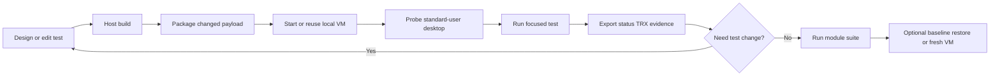

# Local VM UI testing

Run PowerToys `.Next` UI tests in a persistent, interactive Windows VM while keeping product and test
execution off the host. Use this skill as the execution complement to
[ui-tests-migration](../ui-tests-migration/SKILL.md). Restore a known stopped-volume snapshot or
create a fresh named volume when clean-profile behavior must be validated.

## When to use this skill

Use it when asked to:

- Create or migrate UI tests and iterate repeatedly without reprovisioning Windows each run.
- Validate Explorer, hotkey, WebView2, shell-extension, foreground, or composed-visual behavior in a
  real interactive desktop.
- Run tests as a true standard user while retaining a separate administrator control channel.
- Reuse unchanged PowerToys, winappcli, and .NET payloads and refresh only changed archives.
- Keep a reproducible local VM baseline with optional .NET 10, WebView2, diagnostics, or `msvsmon`.
- Collect durable `status.json`, TRX, transcripts, logs, screenshots, and failure attachments.
- Compare revisions in one stable VM before confirming the result in a fresh environment.

Do not treat a persistent VM as proof of clean-profile behavior. Caches, registrations, settings, and
first-run state survive between runs. Reset or recreate the VM when those are the behavior under test.

## Relationship to other UI-test skills

| Skill | Owns |
|---|---|
| `ui-tests-migration` | Test design, project scaffolding, framework APIs, assertions, lifecycle, and CI stability. |
| `ui-tests-local-vm` | Fast persistent-VM setup, deployment, interactive execution, evidence export, and iteration. |

Do not modify stabilized tests merely to make the local VM green. First prove that the suite executes,
produces assertion-bearing TRX, and has a useful success rate. Classify environment-specific failures
separately unless the task explicitly asks for stabilization.

## Required reads

Read only what the task needs:

1. [references/setup.md](references/setup.md) - Docker Desktop/WSL/KVM prerequisites, VM scaffolding,
   OEM provisioning, credentials, standard-user desktop, and health checks.
2. [references/agentic-loop.md](references/agentic-loop.md) - payload contract, controller usage,
   focused-to-suite iteration, evidence, verdicts, and reset strategy.
3. [references/customization.md](references/customization.md) - persistent image customization,
   .NET 10, WebView2, `msvsmon`, ports, and golden-baseline guidance.
4. [references/troubleshooting.md](references/troubleshooting.md) - KVM, WinRM, interactive session,
   UNC, scheduled-task, focus, timeout, and export failures.
5. [ui-tests-migration](../ui-tests-migration/SKILL.md) - required whenever test code or framework
   behavior is being created, migrated, or stabilized.

## Default agentic cycle



Create and maintain this task list:

```markdown
- [ ] 1. Read ui-tests-migration guidance for the target test surface
- [ ] 2. Scaffold or verify the local VM - references/setup.md
- [ ] 3. Build product and test projects on the host to exit code 0
- [ ] 4. Package a lean exchange and verify archive hashes
- [ ] 5. Run the controller with -PlanOnly and inspect its request/plan
- [ ] 6. Probe the non-admin interactive desktop before test execution
- [ ] 7. Run one focused test and parse status.json plus TRX
- [ ] 8. Diagnose the first controlling failure without weakening assertions
- [ ] 9. Rebuild and rerun with -ReuseStagedPayload
- [ ] 10. Widen to the module suite and report pass rate/root-cause groups
- [ ] 11. Restore a known baseline or recreate the VM for clean-profile confirmation when required
```

## Quick start

Scaffold the VM directory outside the repository:

```pwsh
pwsh .github\skills\ui-tests-local-vm\scripts\Initialize-LocalVm.ps1 `
  -DestinationRoot X:\PowerToysUiTestVm
```

Follow [references/setup.md](references/setup.md) to create the untracked `.env`, boot the VM, and
save the administrator credential with Windows DPAPI. Then stage the archives described in
[references/agentic-loop.md](references/agentic-loop.md) and run:

```pwsh
pwsh .github\skills\ui-tests-local-vm\scripts\Invoke-LocalVmUiTest.ps1 `
  -VmRoot X:\PowerToysUiTestVm `
  -ExchangeRoot X:\PowerToysUiTestVm\shared\PowerToysUiTests\MyModule `
  -TestExecutable MyModule.UITests.Next.exe `
  -Filter 'Name=MyModule.FocusedTest' `
  -Platform x64Win11 `
  -BuildLabel (git rev-parse HEAD) `
  -SuiteTimeout 15m `
  -TimeoutMinutes 25 `
  -ReuseStagedPayload
```

The controller starts the VM if needed, verifies the interactive standard-user token and desktop,
dispatches the shared guest runner through a limited interactive scheduled task, streams progress,
waits for parseable `status.json`, summarizes TRX, and leaves the persistent VM running by default.

## Non-negotiable rules

- Build on the host; run PowerToys and tests only in the VM when host execution is prohibited.
- Keep VM files and writable exchange folders outside the repository.
- Bind management, RDP, viewer, and debugger ports to `127.0.0.1` unless remote access is intentional.
- Use HTTPS WinRM and a DPAPI-protected credential file. Never put credentials in prompts, scripts,
  request JSON, source control, or command-line arguments.
- Run UI tests in an already logged-on standard-user desktop, never in session 0 or as `SYSTEM`.
- Keep a separate administrator account only for VM control and scheduled-task registration.
- Verify user, token integrity, Explorer presence, session ID, display size, and UNC access before tests.
- Use UNC paths across Explorer restarts; mapped drive letters are session-scoped conveniences.
- Run product/tests from guest-local storage, not from the SMB exchange.
- Reuse payloads by per-component hashes; refresh only changed tests/product/tools.
- Preserve assertions and visual thresholds. Classify VM-specific failures from evidence.
- Always parse TRX. A process exit code alone cannot distinguish assertions, zero tests, timeout, or
  infrastructure failure.
- Keep the VM after normal runs for iteration. Stop it explicitly when idle; delete its volume only
  for an intentional baseline reset.
- Final clean-profile claims require a restored known baseline or a recreated VM volume.

## Verdicts

| Verdict | Meaning |
|---|---|
| `PASS` | Selected tests executed and passed. |
| `FAIL` | Tests executed and assertion-bearing TRX contains failures. |
| `BLOCKED` | VM, KVM, WinRM, desktop, deployment, filter, or prerequisite prevented execution. |
| `ENVIRONMENT` | Tests executed, but evidence proves a VM/display/profile mismatch rather than product behavior. |

A partial pass rate is still proof that the agentic cycle executes when the task is to validate the
loop itself. Report the exact numerator/denominator and classify failure groups; do not alter tests
unless stabilization was requested.
