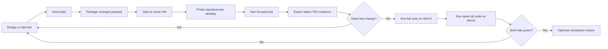

# Local VM UI testing

Run PowerToys `.Next` UI tests in a persistent, interactive Windows VM while keeping product and test
execution off the host. Use this skill as the execution complement to
[ui-tests-migration](../ui-tests-migration/SKILL.md). Restore the baseline checkpoint or recreate the
guest when clean-profile behavior must be validated.

The guest is a Hyper-V virtual machine. Nothing runs nested, so the same scaffold works on x64 and on
Windows on ARM, where nested virtualization is unavailable to any Linux-hosted emulator.

A module is done when the **full** suite is green on Windows 10 **and** on Windows 11, in two
separate VMs. Run Windows 10 Enterprise LTSC 2021 first because it gives the fastest feedback, then
run the same unfiltered suite on Windows 11. Differences in the shell, compositor, theming, and
timing break tests that contain nothing Windows 11-specific, and those are exactly the failures
worth catching locally instead of in CI. On a Windows on ARM host, Windows 11 ARM64 is the only
practical guest; run it with `-Platform ARM64` and get the Windows 10 half from an x64 host.

Start guests with the default resource profile: 4 vCPUs and 8 GB RAM. Get the target suite fully
green before lowering resources with the `Constrained` profile (1 vCPU and 4 GB RAM).

## How the host reaches the guest

| Concern | Mechanism |
|---|---|
| Control channel | PowerShell Direct over VMBus. No listener, port, certificate, or firewall rule in the guest. |
| Bulk payload | `Copy-VMFile` over the Guest Service Interface, ~82 MB/s. The session copy is a fallback and stalls on archives near a gigabyte. |
| Exchange | Guest-local `C:\PowerToysUiTestExchange\<name>`, mirrored by the controller. The host never shares a folder with the guest. |
| Host privilege | Hyper-V access: an elevated shell, or an account in the local **Hyper-V Administrators** group. Creating a guest additionally requires real elevation. |
| Console | `scripts/Get-VmConsoleImage.ps1` renders the framebuffer to PNG, so an agent can read boot and desktop state without VMConnect. |

## When to use this skill

Use it when asked to:

- Create or migrate UI tests and iterate repeatedly without reprovisioning Windows each run.
- Validate Explorer, hotkey, WebView2, shell-extension, foreground, or composed-visual behavior in a
  real interactive desktop.
- Run tests as a true standard user while retaining a separate administrator control channel.
- Reuse unchanged PowerToys, winappcli, and .NET payloads and refresh only changed archives.
- Keep a reproducible local VM baseline with optional .NET 10, WebView2, diagnostics, or `msvsmon`.
- Collect durable `status.json`, TRX, transcripts, logs, screenshots, and failure attachments.
- Compare revisions in one stable VM before confirming the result from a restored checkpoint.

Do not treat a persistent VM as proof of clean-profile behavior. Caches, registrations, settings, and
first-run state survive between runs. Restore the baseline checkpoint or recreate the VM when those
are the behavior under test.

## Relationship to other UI-test skills

| Skill | Owns |
|---|---|
| `ui-tests-migration` | Test design, project scaffolding, framework APIs, assertions, lifecycle, and CI stability. |
| `ui-tests-local-vm` | Fast persistent-VM setup, deployment, interactive execution, evidence export, and iteration. |

Do not modify stabilized tests merely to make the local VM green. First prove that the suite executes,
produces assertion-bearing TRX, and has a useful success rate. Classify environment-specific failures
separately unless the task explicitly asks for stabilization.

## Guest OS policy

- Two guests, two full suites. Windows 10 Enterprise LTSC 2021 (build 19044/21H2, newer than the
  Windows 10 20H2 baseline) and Windows 11. Both must be fully green before a module is done.
  LTSC is not available through Fido; `-Source Fido -Windows 10` automates Microsoft's official
  mobile-user-agent ISO page and is the practical public default. The public ISO/MCT images are too
  old for .NET 10 CET, so Setup Dynamic Update must bring Win10 to 1904x.5007+ before the baseline.
  Use licensed Microsoft subscription media for LTSC when available, and always record the edition,
  ISO hash, and installed full build ([references/setup.md §3](references/setup.md#3-get-windows-media)).
- Windows 10 runs first: it is the faster loop and surfaces most defects. Windows 11 then runs the
  **same** suite, unfiltered - not only the tests that look Windows 11-specific. A test with no
  Windows 11 content can still fail there, which is the whole reason for the second pass.
- Narrow filters belong to iteration and diagnosis. They are never the evidence for the Windows 11
  pass.
- Give each OS its own VM name, `vm.config.psd1`, VHDX, checkpoints, and exchange. Never upgrade or
  repurpose the Windows 10 guest into the Windows 11 guest; the two baselines must stay independent.
- Surfaces that exist only on Windows 11, such as the tier-1 Explorer context menu, need no special
  handling: the full Windows 11 run already covers them.
- On a Windows on ARM host, use a Windows 11 ARM64 guest with `-Platform ARM64`. Hyper-V does not
  emulate a foreign architecture, so that host cannot supply the Windows 10 x64 pass - run it on an
  x64 host and report both.
- A Windows 11 host requirement does not make Windows 11 the first guest target.
- `-Platform` is not cosmetic: it flows to the guest as the `platform` environment variable, names
  visual baselines, and marks the run as pipeline-like. Use only `x64Win10`, `x64Win11`, or `ARM64`.

## Required reads

Read only what the task needs:

1. [references/setup.md](references/setup.md) - host requirements, scaffolding, media acquisition,
   unattended guest creation, credentials, standard-user desktop, and checkpoint baselines.
2. [references/agentic-loop.md](references/agentic-loop.md) - payload contract, controller usage,
   focused-to-suite iteration, evidence, verdicts, and reset strategy.
3. [references/customization.md](references/customization.md) - persistent image customization,
   .NET 10, WebView2, `msvsmon`, resource profiles, and golden-baseline guidance.
4. [references/troubleshooting.md](references/troubleshooting.md) - guest creation, PowerShell Direct,
   interactive session, scheduled-task, focus, timeout, and export failures.
5. [references/shell-extensions-and-signing.md](references/shell-extensions-and-signing.md) - **read
   for any shell-extension module** (context menu, preview/thumbnail handler). Why unsigned CI PR
   builds cannot register a sparse MSIX (0% on CI), classic (registry-COM, signing-free) vs modern
   (sparse-MSIX) surfaces, Debug vs Release/`NDEBUG` gating, runtime detection, and reproducing CI's
   classic scenario on a local signed VM.
6. [ui-tests-migration](../ui-tests-migration/SKILL.md) - required whenever test code or framework
   behavior is being created, migrated, or stabilized.

## Default agentic cycle



Create and maintain this task list:

```markdown
- [ ] 0. Verify host setup FIRST: `Initialize-LocalVmHost.ps1 -VmRoot <root> -CheckOnly`. If it reports
        IsReady=false, STOP and ask the user to run the elevated command it prints - Hyper-V group
        membership, the DPAPI credential, and guest creation all need a human. Never autopilot past it
- [ ] 1. Read ui-tests-migration guidance for the target test surface
- [ ] 1a. Read the target module's dev docs — `doc/devdocs/modules/<module>.md` (search `doc/devdocs/`,
        including `common/`, if the exact file is missing) — for development-cycle gotchas such as
        Release/`NDEBUG` registration gating, signed sparse-MSIX context menus, and Explorer restarts,
        so a module's registration/deployment requirements do not surface as opaque test failures.
        For shell-extension modules also read references/shell-extensions-and-signing.md.
- [ ] 2. Scaffold or verify the local VM - references/setup.md
- [ ] 3. Build product and test projects on the host to exit code 0
- [ ] 4. Package a lean exchange and verify archive hashes
- [ ] 5. Run the controller with -PlanOnly and inspect its request/plan
- [ ] 6. Probe the non-admin interactive desktop before test execution
- [ ] 7. Run one focused test synchronously; keep the agent turn attached, read the controller
  result's `.Failed` array (non-passed tests + first error line) instead of re-parsing TRX, and
  use `scripts/Invoke-GuestScript.ps1` for guest-state inspection
- [ ] 8. Diagnose the first controlling failure without weakening assertions
- [ ] 9. Rebuild and rerun with -ReuseStagedPayload
- [ ] 10. Widen to the full module suite on Windows 10 and report pass rate/root-cause groups
- [ ] 11. Run the same full suite in the Windows 11 VM; both must be green before the module is done
- [ ] 12. Restore the baseline checkpoint for clean-profile confirmation when required
```

## Quick start

Host setup is a one-time, **human-only** step: Hyper-V group membership, the DPAPI guest credential,
and guest creation all need elevation or a password. Check it before anything else - this needs no
elevation and changes nothing:

```pwsh
pwsh .github\skills\ui-tests-local-vm\scripts\Initialize-LocalVmHost.ps1 -VmRoot X:\PowerToysUiTestVm -CheckOnly
```

If it reports `IsReady=false`, stop and ask the user to run the elevated command it prints (see
[references/setup.md §0](references/setup.md#0-human-only-host-setup-one-command)). Otherwise scaffold
the VM directory outside the repository:

```pwsh
pwsh .github\skills\ui-tests-local-vm\scripts\Initialize-LocalVm.ps1 `
  -DestinationRoot X:\PowerToysUiTestVm
```

The scaffold and its `shared` exchange can live on any volume, including a Dev Drive. Only the VHDX
and VM configuration paths, set separately in `vm.config.psd1`, should point at NTFS.

Follow [references/setup.md](references/setup.md) to write the untracked `vm.config.psd1`, save the
administrator credential with Windows DPAPI, obtain install media, and create the guest with
`New-UiTestVm.ps1`. Then stage the archives described in
[references/agentic-loop.md](references/agentic-loop.md) and run:

```pwsh
pwsh .github\skills\ui-tests-local-vm\scripts\Invoke-LocalVmUiTest.ps1 `
  -VmName PowerToysUiTest-Win10 `
  -VmRoot X:\PowerToysUiTestVm `
  -ExchangeRoot X:\PowerToysUiTestVm\shared\PowerToysUiTests\MyModule `
  -TestExecutable MyModule.UITests.Next.exe `
  -Filter 'Name=MyModule.FocusedTest' `
  -Platform x64Win10 `
  -BuildLabel (git rev-parse HEAD) `
  -SuiteTimeout 15m `
  -TimeoutMinutes 25 `
  -ReuseStagedPayload
```

The controller starts the VM if needed, requests automatic host sleep prevention, verifies the
interactive standard-user desktop, dispatches the guest runner, and waits synchronously for matching
`status.json`. It reports whether sleep prevention succeeded, fails early if the guest task never
starts or exits without status, summarizes TRX, and leaves the persistent VM running by default.

## Non-negotiable rules

- Complete host setup before anything else and **never autopilot around it**. Hyper-V group
  membership, the DPAPI guest credential, and guest creation are human-only: two need elevation that
  no tool call can approve, one needs a password that must never reach a model.
  `Initialize-LocalVmHost.ps1` performs all three; agents run it `-CheckOnly`, and on
  `IsReady=false` report `BLOCKED`, print the elevated command it emits, and wait. Do not ask for a
  password, do not substitute a weaker channel, do not proceed on a partial setup.
  `Invoke-LocalVmUiTest.ps1` enforces the same check.
- Keep the guest's VHDX and VM configuration on NTFS. On this project's host, keeping them on a Dev
  Drive wedged the VM management service twice - `vmms` at 0% CPU, even `Get-VM` hanging, host reboot
  to recover - and moving to NTFS fixed it. This is an observation on one host, not a property of
  ReFS: Hyper-V on plain ReFS is supported, so `-AllowReFsVolume` overrides the default refusal. The
  scaffold and the exchange are unaffected and run fine on a Dev Drive.
- Build on the host; run PowerToys and tests only in the VM when host execution is prohibited.
- Invoke every focused, full-suite, and constrained controller run synchronously. Keep the active
  agent turn attached until the controller returns matching status/TRX evidence; never background
  the controller or end the turn while it runs.
- Finish on two green full suites: Windows 10 and Windows 11, in separate VMs. Windows 10 runs first
  for speed; Windows 11 runs the same unfiltered suite, never a Win11-only subset. Narrow filters are
  for iteration, not for sign-off. On a Windows on ARM host the ARM64 Windows 11 guest covers the
  Windows 11 half and the Windows 10 half needs an x64 host.
- Establish a fully green correctness baseline with the default (4 vCPU / 8 GB) resources before
  running the same tests under `Constrained` (1 vCPU / 4 GB) resources.
- Keep VM files and writable exchange folders outside the repository.
- Keep the guest's default inbound network posture. The control channel does not need connectivity,
  so do not enable remoting, open ports, or attach the guest to a routable network for test dispatch.
- Use a DPAPI-protected credential file. Never put credentials in prompts, scripts, request JSON,
  unattend files kept after install, source control, or command-line arguments.
- Run UI tests in an already logged-on standard-user desktop, never in session 0 or as `SYSTEM`.
- Keep a separate administrator account only for VM control and scheduled-task registration.
- Verify user, token integrity, Explorer presence, session ID, and display size before tests.
- Run product/tests from guest-local storage under `C:\PowerToysUiTestRun`.
- Use PowerShell 7 for interactive probe/test scheduled tasks. PowerShell Direct and OEM bootstrap
  remain PS5.1-compatible by design; do not enable a remoting endpoint merely to use PS7.
- Reuse payloads by per-component hashes; refresh only changed tests/product/tools.
- Preserve assertions and visual thresholds. Classify VM-specific failures from evidence.
- Always parse TRX and require `total > 0` plus `executed == total`. A process exit code alone cannot
  distinguish assertions, skipped/inconclusive tests, zero tests, timeout, or infrastructure failure.
- Keep the VM after normal runs for iteration. Stop it explicitly when idle; delete its VHDX only for
  an intentional baseline reset.
- The controller requests automatic host sleep prevention and reports `HostSleepPrevented`; failure
  is a warning. It cannot override manual sleep, lid-close policy, reboot, shutdown, or power loss.
- Final clean-profile claims require a restored baseline checkpoint or a recreated guest. Restore with
  `Reset-LocalVm.ps1 -Restore`.
