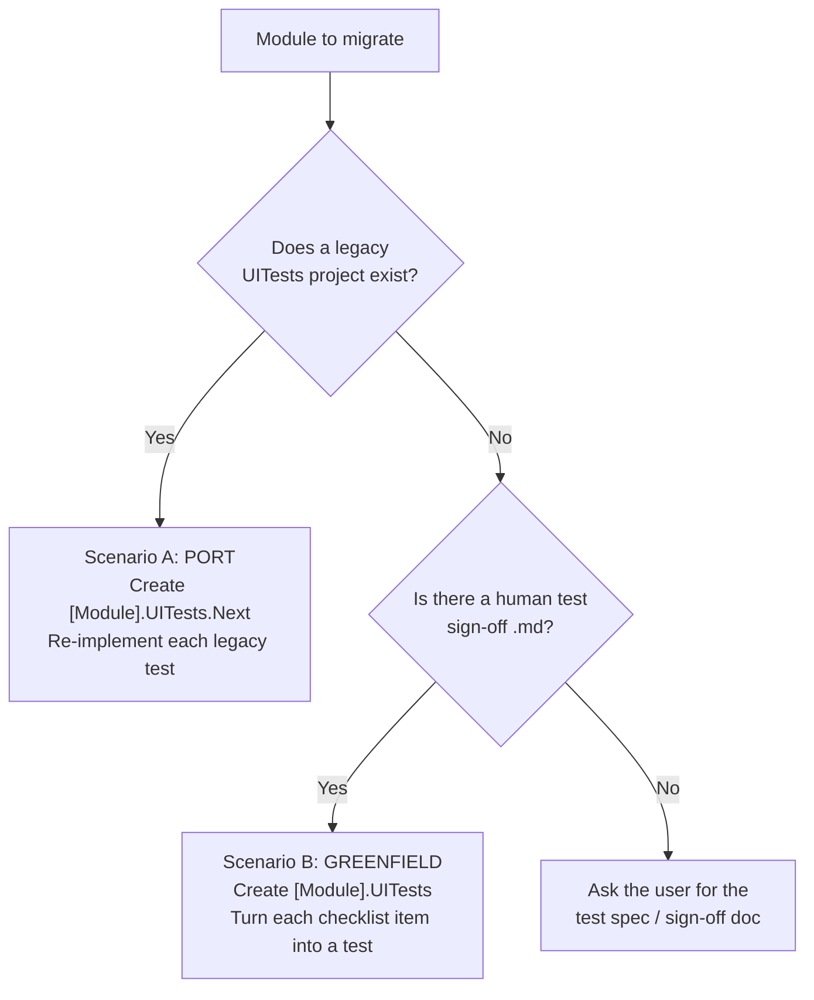

# PowerToys UI-Tests Migration (legacy → `.Next`)

Convert a PowerToys module's UI tests from the legacy **WinAppDriver / Selenium / Appium** harness
(`Microsoft.PowerToys.UITest`, in `src/common/UITestAutomation/`) to the new **winappcli** harness
(`Microsoft.PowerToys.UITest.Next`, in `src/common/UITestAutomation.Next/`).

The new harness shells out to `winapp.exe` and parses its JSON — **no WinAppDriver server on :4723,
no Selenium/Appium NuGet packages, no `WindowsElement`/`WindowsDriver`.** The public *shape*
(`UITestBase`, `Session`, `Find<T>`, `By`, element wrappers like `ToggleSwitch`) is deliberately
similar, so most of the work is mechanical API mapping plus reworking a few patterns that don't
translate one-to-one (XPath selectors, stateful elements, instance mouse/keyboard helpers).

## When to use this skill

Use this skill when the task is to:

- **Port** a module's existing legacy UI tests to `.Next` (e.g. "migrate the ScreenRuler UI tests to
  the new framework", "convert FancyZones.UITests to winappcli").
- **Create a new** `[Module].UITests.Next` project that re-implements the legacy tests with the new
  harness, leaving the old project in place.
- **Stand up brand-new** `.Next` UI tests for a module that has **no** UI tests at all, by reading the
  module's human test **sign-off markdown** (e.g. `ColorPickerUITest.md`) and turning each manual
  checklist item into an automated test.

This skill is the *how*: the framework differences, the API mapping, the project scaffolding, the
naming rules, the recurring PowerToys test recipes, and the build/validate loop. The *what* (which
module, which tests) comes from the calling prompt.

> **Reference implementation — read these working examples before porting anything.** They are
> the ground truth for "what good looks like" with each harness:
> - **New (`.Next`)**: [ColorPickerEndToEndTests.cs](../../../src/modules/colorPicker/ColorPicker.UITests/ColorPickerEndToEndTests.cs)
>   — full end-to-end scenario (navigate Settings → toggle module → read shortcut → fire hotkey →
>   read overlay → click-capture → inspect editor), driven entirely through `winappcli`.
> - **Legacy**: [TestSpacing.cs](../../../src/modules/MeasureTool/Tests/ScreenRuler.UITests/TestSpacing.cs)
>   + [TestHelper.cs](../../../src/modules/MeasureTool/Tests/ScreenRuler.UITests/TestHelper.cs)
>   — a `UITestBase` subclass plus a static helper that navigates, toggles, reads the shortcut, fires
>   the hotkey, and validates the clipboard.
> - **Worked Scenario-A port (validated 5/5, where the legacy suite scored 0/5 locally)**: the
>   ScreenRuler suite ported from the legacy project above lives in
>   [ScreenRuler.UITests.Next/TestHelper.cs](../../../src/modules/MeasureTool/Tests/ScreenRuler.UITests.Next/TestHelper.cs)
>   + 5 test classes. It is the canonical port reference — cross-window toolbar discovery via
>   `Session.FromProcess`, a DPI-aware `app.manifest`, cursor centering, and patient hotkey
>   activation are all there because real runs needed them (see
>   [references/patterns-and-pitfalls.md](references/patterns-and-pitfalls.md)).

## Required reads (in order)

1. **This `SKILL.md`** — the decision tree (which scenario), the naming rules, the high-level
   workflow, and the build/validate loop.
2. **[references/framework-differences.md](references/framework-differences.md)** — the conceptual
   deltas you MUST internalize before writing code: winappcli engine, stateless elements, selector
   grammar (no XPath/CssSelector), session scopes (window vs process), lifecycle/hygiene/module
   pre-enablement, multi-window discovery, and what the new harness does NOT (yet) provide.
3. **[references/api-mapping.md](references/api-mapping.md)** — the line-by-line cheat sheet:
   namespaces, `By`, `Element` actions/properties, `Session`, `UITestBase`, the static
   Keyboard/Mouse/Clipboard helpers, and the element-wrapper catalog. Keep this open while editing.
4. **[references/project-setup.md](references/project-setup.md)** — csproj scaffold, naming/placement
   rules, `.slnx` registration, and how to build & run a `.Next` project. Uses the
   [templates/](templates/) starter files.
5. **[references/porting-workflow.md](references/porting-workflow.md)** — the two end-to-end
   playbooks: **A)** port existing legacy tests, and **B)** author tests from a human sign-off
   markdown when none exist.
6. **[references/patterns-and-pitfalls.md](references/patterns-and-pitfalls.md)** — adaptable recipes
   for the recurring PowerToys patterns (toggle a module + verify its process, read the activation
   shortcut from a `ShortcutControl`, fire a global hotkey reliably, inspect the clipboard, discover
   overlay/editor windows) and the gotchas that bite during migration.
7. **[references/ci-stability.md](references/ci-stability.md)** — the CI-stability capstone: the
   Win32-window vs UIA-element mental model, five design principles that keep a port green on a slow
   CI agent (authoritative-signal retries over fixed sleeps, invoke-vs-physical-click, screen-capture
   cold-start, toggle-state guards, on-screen/DPI/clean-profile hygiene), and a **pre-flight
   checklist** to apply BEFORE the first CI push so the first run *validates* instead of *discovers*.
   Read this to spend one CI iteration instead of six.

## Pick your scenario



| Scenario | Trigger | New project name | Source of test cases |
|---|---|---|---|
| **A — Port** | A legacy `[Module].UITests` (or similar) project already exists and references `UITestAutomation.csproj` | **`[Module].UITests.Next`** — keep the `.Next` suffix so it lives **alongside** the legacy project | The existing legacy test methods (1:1 re-implementation) |
| **B — Greenfield** | The module has **no** UI tests at all | **`[Module].UITests`** — **drop** the `.Next` suffix; there's nothing to live alongside | The module's human sign-off markdown (manual checklist), e.g. `ColorPickerUITest.md` |

Place the new project under **`src/modules/[Module]/Tests/[Module].UITests.Next/`** (or
`…/Tests/[Module].UITests/` for Scenario B). If the module already keeps tests in a different
`Tests/` layout, match the module's existing convention rather than forcing this one — see
[references/project-setup.md](references/project-setup.md).

> **Keep it abstract.** Every PowerToys module is unique and the legacy tests were written by
> different people in different styles. Treat the recipes in this skill as *adaptable patterns*, not
> a rigid script. Re-create the **intent and assertions** of each test; do not mechanically translate
> brittle, harness-specific scaffolding (Selenium `Actions`, XPath walks, manual driver attaches) when
> the new harness has a cleaner idiom.

## High-level workflow

Create a TODO list and work top-to-bottom. Each step links to the reference that drives it.

```markdown
- [ ] 1. Identify the module + scenario (A port / B greenfield) — this SKILL.md "Pick your scenario"
- [ ] 2. Read the two reference examples (ColorPicker .Next + ScreenRuler legacy) end-to-end
- [ ] 3. Inventory the source:
        • Scenario A → list every [TestMethod] + shared helper in the legacy project
        • Scenario B → read the module's sign-off .md; list each manual checklist item
        — references/porting-workflow.md
- [ ] 4. Internalize the deltas — references/framework-differences.md
- [ ] 5. Scaffold the new project (csproj from template, name per the table, register in .slnx)
        — references/project-setup.md
- [ ] 6. Re-implement tests, mapping each API as you go — references/api-mapping.md
        + recipes from references/patterns-and-pitfalls.md
- [ ] 7. Apply the CI-stability checklist BEFORE building — references/ci-stability.md
        (authoritative-signal retries not fixed sleeps, navigation via UIA invoke, Win32 window/overlay
        detection, screen-capture cold-start handling, DPI manifest, single-module enable, first-run
        suppression)
- [ ] 8. Build the new project to exit code 0 — this SKILL.md "Build & validate"
- [ ] 9. (If a live desktop is available) run the tests; otherwise report that they build and are
        ready to run, and summarize coverage vs. the source
```

## Build & validate

The `.Next` harness needs `winapp.exe` only at **run** time, not build time — the project has zero
managed dependency on the engine. So you can always compile-verify a migration even on an agent with
no winappcli installed.

```pwsh
# 0. FIRST build of a brand-new project: restore so the assets file exists, otherwise the build
#    fails with NETSDK1004 "Assets file ... project.assets.json not found".
dotnet restore src\modules\<Module>\Tests\<Module>.UITests.Next\<Module>.UITests.Next.csproj -p:Platform=x64
#    (Equivalently, run tools\build\build-essentials.cmd once at the start of the session.)

# 1. Build just the new test project (fast inner loop). Prefer the repo build script.
tools\build\build.cmd -Path src\modules\<Module>\Tests\<Module>.UITests.Next -Platform x64 -Configuration Debug
#    Exit code 0 = success; non-zero = failure. On failure read the errors log next to the project:
#    build.<Configuration>.<Platform>.errors.log

# 2. Run (needs a live desktop). A .Next project is a Microsoft.Testing.Platform Exe — run the
#    produced exe directly with a TRX report; filter to one test/category for a tight loop.
$exe = "<repo>\x64\Debug\tests\<Module>.UITests.Next\net10.0-windows10.0.26100.0\<Module>.UITests.Next.exe"
& $exe --filter "TestCategory=<Cat>" --report-trx --report-trx-filename run.trx --results-directory <dir>
#    --filter accepts "TestCategory=X" or "FullyQualifiedName~Y"; omit it to run everything.
#    Exit 0 = all passed. Parse the .trx for per-test outcomes + failure messages.
```

- **Design for CI stability up-front — [references/ci-stability.md](references/ci-stability.md).**
  Before the first push, walk its pre-flight checklist (authoritative-signal retries instead of fixed
  sleeps, navigation via UIA invoke, Win32 window/overlay detection, screen-capture cold-start
  handling, DPI manifest, single-module enable, first-run suppression). Most "passes local, fails CI"
  loops come from skipping one of these; applying them proactively is how you spend one CI iteration
  instead of six.
- **Run it in a loop: write → build → run → diagnose → repeat.** UI tests surface environment-real
  failures (DPI scaling, cursor position, hotkey-arming races) that only a live run reveals. Start
  with one deterministic test (e.g. the activation/toggle test), get it green, then widen.
- **First, run the *legacy* suite once for a baseline — and run it ELEVATED.** The legacy harness
  launches PowerToys via `ProcessStartInfo { Verb = "runas" }` (elevated), so a **non-elevated** test
  host can't complete the launch and **every test fails at startup with a misleading `Win32Exception`
  cascade** — a false 0/N that looks like "the tests are broken" but is purely the run method. (That's
  why VS Test Explorer passes them: VS runs as admin.) Run from an **elevated** terminal: start
  `WinAppDriver.exe` on `127.0.0.1:4723`, then run the built DLL with `vstest.console.exe` (see
  [references/porting-workflow.md](references/porting-workflow.md) §A0 for the `-Verb RunAs` recipe).
  A measurement failure on a scaled (non-100%) display is usually a pre-existing DPI issue (Pitfall
  12), not something the port must reproduce — the ScreenRuler legacy suite scores **4/5** elevated
  here (Bounds fails at 150% scale) while the `.Next` port scores **5/5**. `.Next` tests themselves
  need **no** elevation (the new harness launches the runner non-elevated).
- **Always** build to exit code 0 before declaring the migration done. Fix every compile error — do
  not leave `// TODO: port this` stubs that break the build.
- Running the tests requires a **live interactive desktop** plus `winapp.exe`
  (`winget install Microsoft.winappcli`, or set `WINAPP_CLI_PATH`). The whole PowerToys runner is
  launched by the harness (`PowerToys.exe --open-settings`) — you should see the Settings window
  appear. If the environment has no desktop (headless agent), state that the project **builds clean
  and is ready to run**, and list which source tests/checklist items each new `[TestMethod]` covers.
- New `.csproj` files under `src/` MUST `<Import Project="$(RepoRoot)src\Common.Dotnet.CsWinRT.props" />`
  right after `<Project Sdk=...>` (CI audits this). The template already does.

## What NOT to do

- **Do NOT delete or edit the legacy `[Module].UITests` project** in Scenario A. The `.Next` project
  lives alongside it; removing the old one is a separate, explicit decision for the maintainers.
- **Do NOT touch product code.** This is a test-only migration. If a test needs a UIA hook that
  doesn't exist (e.g. an `AutomationId` or a hidden automation-peer TextBlock), flag it for the user
  rather than silently editing the module. (The ColorPicker example's `ColorHexAutomationPeer` hook
  is a documented, pre-existing exception — see its class remarks.)
- **Do NOT port the legacy plumbing literally.** No Selenium `Actions`, no `WindowsDriver`/`WindowsElement`,
  no `By.XPath`/`By.CssSelector`, no `:4723`. Map them to the winappcli idioms in
  [references/api-mapping.md](references/api-mapping.md).
- **Do NOT add a `ProjectReference` to `UITestAutomation.csproj`** (the legacy harness) — reference
  **`UITestAutomation.Next.csproj`** only.
- **Do NOT invent assertions** for a vague sign-off item. If a checklist line has no observable
  pass/fail signal, implement what you can and leave a clearly-marked `TestContext.WriteLine` note
  (or skip with an explanation) rather than asserting on something you can't actually read.
- **Do NOT introduce new third-party NuGet dependencies.** The `.Next` harness is intentionally
  dependency-free (MSTest only). Use the Win32-based helpers it already ships.

## What is NICE to do

- **Improve the new UT Test framework if you see such opportunity**. The new framework works only with a few modules and may lack something other requires. If you see the old test uses something that we don't have in a new framework and it's handy, don't hesiate to port it to a new one. Or you may see the test uses a bunch of extra helpers ouside of test framework, which also may be a signal.