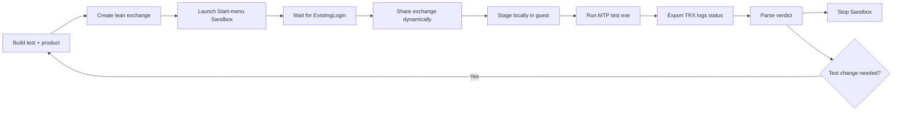

# Windows Sandbox UI testing

Run PowerToys `.Next` UI tests in a disposable, interactive Windows desktop and return durable
results to the host. Treat Sandbox as the **default live validation environment** when creating,
migrating, or stabilizing a UI-test project. A local desktop run remains useful for a fast focused
check; Sandbox proves clean-profile behavior and closes the build -> deploy -> execute -> diagnose loop.

This skill complements [ui-tests-migration](../ui-tests-migration/SKILL.md): that skill designs and
implements tests; this skill packages and executes them in a clean desktop.

## When to use this skill

Use it when asked to:

- Create or migrate PowerToys UI tests and validate them end to end.
- Run a `.UITests.Next` executable without disturbing the host PowerToys profile.
- Reproduce CI-only, first-run, Explorer, hotkey, foreground, WebView2, or lifecycle failures.
- Compare a stabilized test/build against an earlier commit with identical environment inputs.
- Automate Sandbox launch, deployment, progress, TRX/log collection, and teardown.
- Diagnose a black Sandbox window, lost connection, missing interactive login, stuck renderer, or
  unexpectedly long module suite.

Do not use Sandbox as proof of fixed-resolution visual parity. Sandbox window size is not
configurable; functional/UIA tests are authoritative, while visual failures must be classified
against the actual display, DPI, theme, renderer, and capture dimensions.

> **Visual scope:** Sandbox is authoritative for functional/UIA behavior, not fixed-resolution pixel
> sign-off. Its guest resolution can vary because the Sandbox window size is not configurable.

## Required reads

Read only what the task needs:

1. [references/setup.md](references/setup.md) - OS requirements, enabling the feature, CLI/AppID
   discovery, and prerequisite checks.
2. [references/agentic-loop.md](references/agentic-loop.md) - payload contract, build/package/run
   workflow, result schema, revision comparison, and cleanup.
3. [references/troubleshooting.md](references/troubleshooting.md) - connection loss, mapped-folder
   races, WebView2, timeouts, visuals, stale processes, and evidence collection.
4. [ui-tests-migration](../ui-tests-migration/SKILL.md) - test design, framework APIs, project
   scaffolding, and CI-stability rules when code changes are part of the task.

## Default agentic scenario

For every new or migrated `.Next` UI-test project, offer and prefer this validation sequence after a
successful focused build:



Do not stop at "builds cleanly" when this machine supports Sandbox and the user asked for test
creation, migration, stabilization, or an agentic loop. Start with one deterministic test, fix the
controlling failure, then run the module suite with a bounded timeout.

## Workflow

Create and maintain a task list for this sequence:

```markdown
- [ ] 1. Check/enable Windows Sandbox - references/setup.md
- [ ] 2. Build the product and test project to exit code 0
- [ ] 3. Create a lean exchange and request manifest - references/agentic-loop.md
- [ ] 4. Verify the filter locally with `--list-tests --filter ...`
- [ ] 5. Stage product, tests, winappcli, private .NET runtime, and optional WebView2 installer
- [ ] 6. Launch the Start-menu Sandbox and wait for its interactive login
- [ ] 7. Share the exchange, run the guest template, and stream progress
- [ ] 8. Parse status.json and TRX; classify product/test/environment failures
- [ ] 9. Stop the exact Sandbox and verify zero leftover guests/remote sessions
- [ ] 10. Repeat focused run, then widen to the full module suite
```

Use [scripts/Invoke-SandboxUiTest.ps1](scripts/Invoke-SandboxUiTest.ps1) as the deterministic host
controller and copy [templates/run-ui-tests.ps1](templates/run-ui-tests.ps1) into the exchange as
`run-ui-tests.ps1`. Start from [templates/request.json](templates/request.json) for the request
manifest.

```pwsh
pwsh .github\skills\windows-sandbox-ui-tests\scripts\Invoke-SandboxUiTest.ps1 `
  -ExchangeRoot C:\Temp\PowerToysSandbox\MyModule `
  -TestExecutable MyModule.UITests.Next.exe `
  -Filter 'TestCategory=MyModule' `
  -Platform x64Win11 `
  -BuildLabel (git rev-parse HEAD) `
  -CleanupProcess PowerToys.MyModule.UI `
  -InstallWebView2
```

The exchange must contain the archives named in the request. The controller creates the run-specific
request, launches the desktop, attaches the exchange, waits for `status.json`, prints a TRX summary,
and stops the Sandbox in `finally`.

## Non-negotiable execution rules

- Build before running. Do not diagnose stale binaries as test failures.
- Use one Sandbox at a time. Refuse overlap and own the launched environment by ID.
- Launch through the registered Start-menu AppID
  `Microsoft.Windows.Containers.Sandbox`, then use `wsb share`/`wsb exec` after login. This avoids
  intermittent pre-login failures seen when mapped folders are supplied during launch.
- Keep the mapped exchange lean: archives, scripts, requests, and results only. Extract product and
  tests to guest-local storage before execution.
- Run UI tests as `ExistingLogin`, never `System`; UIA, foreground input, Explorer, and rendering need
  the interactive `WDAGUtilityAccount` session.
- Use one writable mapped root and run-specific result folders. Retry transient sharing violations
  when reading/writing progress JSON.
- Use bounded, independently adjustable timeouts at both layers: MTP suite timeout in the guest and
  a larger host controller deadline that includes startup and staging. Defaults (`2h` guest,
  `150` host minutes) accommodate broad project runs; tighten both for focused/module runs and relax
  them further when the selected suite is known to run longer.
- Install WebView2 before tests that host WebView/Monaco content. Prefer the signed repository
  bootstrapper; do not map an installed 800+ MB runtime tree.
- Preserve valid visual baselines and thresholds. Report the Sandbox display and similarity; do not
  "fix" environment-specific pixels by weakening assertions.
- Always collect TRX, transcript, status, failure artifacts, and build label before teardown.
- Always stop the exact Sandbox in `finally`, even on launch, timeout, or test failure.

## Verdicts

Report these separately:

| Verdict | Meaning |
|---|---|
| `PASS` | Test executed and its assertions passed. |
| `FAIL` | Test executed and an assertion/product behavior failed. |
| `BLOCKED` | Guest, prerequisite, deployment, or interactive desktop prevented execution. |
| `ENVIRONMENT` | Test executed, but evidence proves an environment mismatch such as display-specific visual capture. |

Never count a pre-login connection failure or zero-test filter as a product failure. Never count a
visual mismatch as a passing functional test without preserving and reporting the visual failure.
MTP exit code 8 with zero tests is `BLOCKED`; a nonzero exit with assertion-bearing TRX results is
`FAIL`. Inspect TRX and the guest transcript instead of classifying from the exit code alone.