# PowerToys Out Of Box Experience Proposal and Code

##### Developers: [Furaha Damién](https://github.com/furahadamien), [Letitia Kwan](https://github.com/letitiakwan), [Jessica Lim](https://github.com/JessicaLim8)
##### Program Manager : [Eunice Choi](https://github.com/eunicechoi98)
##### Designer : [Rafael Flora](https://github.com/rahfyehl)

## Overview
A team of Microsoft Garage interns have created a proposal for the out-of-box experience after the first time install of the PowerToys app, and a proposal for the UI experience of updates.

## 1. Notification Toasts

### Rationale:
Notify users when they installed **PowerToys** or if a new update has been applied to **PowerToys**. Clicking on the notifications will trigger the appropriate OOBE experience - either a *First Install* popup & walkthrough or a *New Update* popup.

### Design:
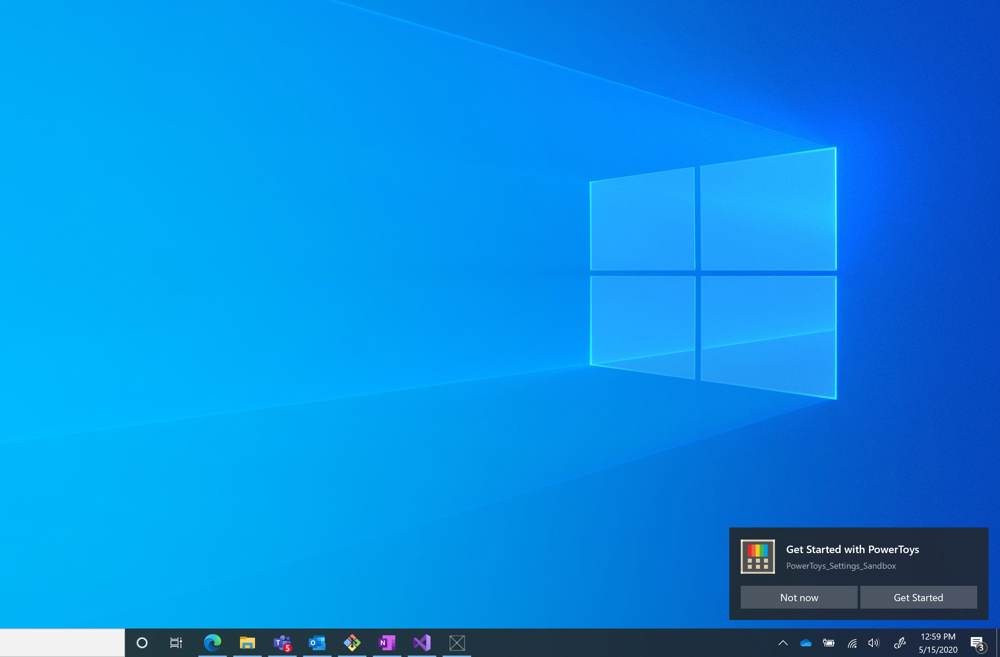

#### Overall Structural design
- Toasts are a notification service located in [Services/NotificationServices.cs](https://github.com/microsoft/PowerToys/blob/interns/dev-oobe/POC-OOBE/OOBE-Sandbox/PowerToys%20Settings%20Sandbox/Services/NotificationService.cs)
- When notifications are clicked, they activate OnActivated located in [App.xaml.css](https://github.com/microsoft/PowerToys/blob/interns/dev-oobe/POC-OOBE/OOBE-Sandbox/PowerToys%20Settings%20Sandbox/App.xaml.cs) On activated will redirect to the MainPage with a parameter
- Navigation to the MainPage will cause the appropriate OOOBE experience to appear (see [Views/MainPage.xaml.cs](https://github.com/microsoft/PowerToys/blob/interns/dev-oobe/POC-OOBE/OOBE-Sandbox/PowerToys%20Settings%20Sandbox/Views/MainPage.xaml.cs)
- SandBox notifications function was included in [App.xaml.css](https://github.com/microsoft/PowerToys/blob/interns/dev-oobe/POC-OOBE/OOBE-Sandbox/PowerToys%20Settings%20Sandbox/App.xaml.cs) to fake the process, but the notifications should be triggered in the apporpriate locations in powertoys 

#### Toast Design
The toasts are all designed to notify the users about **PowerToys** when they do not have the app open. Three seperate toasts were designed using the same base structure. Every toast includes a message, a button to launch the app, and a button to dismiss the notification
1. Geting Started with Powertoys: displayed on install
   - Redirects to the New Install popup (see section 2)

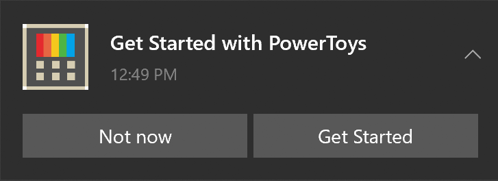

2. New PowerToys Update: displayed on new update
   - Redirects to the New update popup (see section 6)

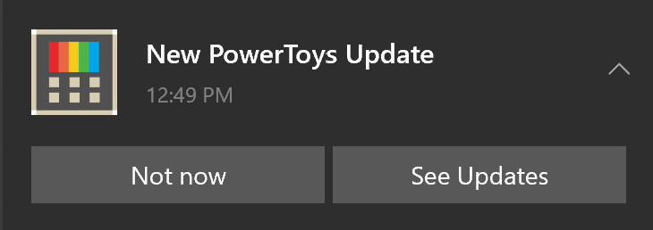

3. New PowerToys Update Available: displayed to users who do not have autoupdate on (toast was created but does not direct anywhere)

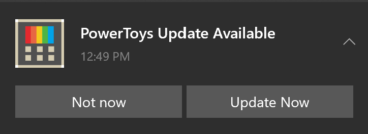

### How to implement:
#### Implement toast notifications
1. Remove the sandboxNotifications function in [App.xaml.css](https://github.com/microsoft/PowerToys/blob/interns/dev-oobe/POC-OOBE/OOBE-Sandbox/PowerToys%20Settings%20Sandbox/App.xaml.cs) 
2. Include the correct NotificationService call whenever the app is updated or first installed
`NotificationService.AppInstalledToast()` or `NotificationService.AppUpdatedToast()` or `NotificationService.AppNeedsUpdateToast`
3. Ensure the onNaviated to function from [Views/MainPage.xaml.cs](https://github.com/microsoft/PowerToys/blob/interns/dev-oobe/POC-OOBE/OOBE-Sandbox/PowerToys%20Settings%20Sandbox/Views/MainPage.xaml.cs) is included in the mainPage

### Considerations
- Toasts were used due to the simplicity of adding Windows Toasts to a UWP app
  - Pros: benefit of being built into the normal notifications
  - Cons: will not be seen by users on "Do not disturb", will not show the direct location on the sys tray
- SystemInformation from the UWP Community toolkit was used to recognize flags for first install and first open since update
  - Statements can be replaced with flags already within the powertoys app
  - ApplicationData LocalSettings can also be used
  `var localSettings = ApplicationData.Current.LocalSettings;` using the local settings, `localSettings.Values[IsFirstRun]` and `localSettings.Values[currentVersion]` can be accessed to determine the apps current state. This usage will also allow you to override the local settings
- Toasts are all deleted onlaunch using `ToastNotificationManager.History.Clear()`
  - This can be removed so that notifications are not removed
  - Group tags can also be used to remove the notifications of a certain type (i.e. install) when the appropriate popup is shown by adding ToastNotificationManager.History.RemoveGroup("groupname") to the onNavigate function in MainPage.xaml.cs
  - Group tags can be seen in NotificationServices under toast.group

## 2. Welcome Screen

#### Rationale:
PowerToys v17 has a silent launch after first time installation and update. As evidenced in issue [#1285](https://github.com/microsoft/PowerToys/issues/1285), users are left wondering if anything happened at all. The aim of this new feature is to allow users a chance to appreate the install/update of PowerToys while at the same time giving them a chance to explore what PowerToys has to offer if they so wish to. 

#### Design:
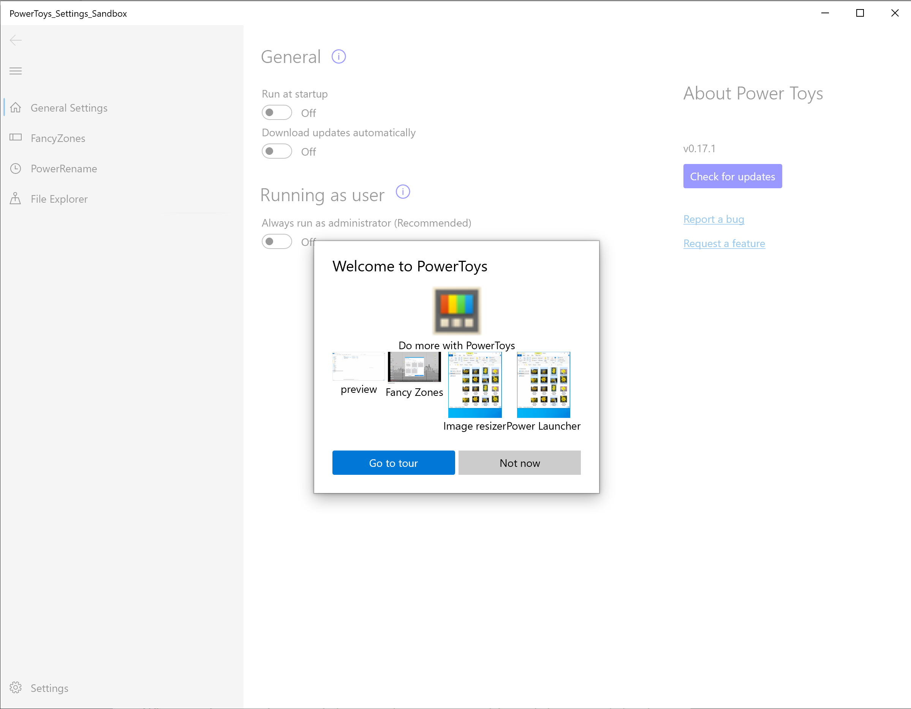
*Welcome window*


#### Code:
The frontend and the backend for this window are in [onLaunchContentDialog.xaml](https://github.com/microsoft/PowerToys/blob/interns/dev-oobe/POC-OOBE/OOBE-Sandbox/PowerToys%20Settings%20Sandbox/Views/onLaunchContentDialog.xaml) and [onLaunchContentDialog.xaml.cs](https://github.com/microsoft/PowerToys/blob/interns/dev-oobe/POC-OOBE/OOBE-Sandbox/PowerToys%20Settings%20Sandbox/Views/onLaunchContentDialog.xaml.cs) respectively. It is later called in the [MainPage.xaml.cs](https://github.com/microsoft/PowerToys/blob/interns/dev-oobe/POC-OOBE/OOBE-Sandbox/PowerToys%20Settings%20Sandbox/Views/MainPage.xaml.cs) as below:

The following Grid would exist as each tool's Grid element on their repective settings page. Add styling as necessary. Check out '/PowerToys Settings Sanbox/Views/FancyZonesPage.xaml' to see it in action:

```
 private async void powerOnLaunchDialog()
        {
            onLaunchContentDialog dialog = new onLaunchContentDialog();
            dialog.PrimaryButtonClick += Dialog_PrimaryButtonClick;
            await dialog.ShowAsync();
        }

        private void Dialog_PrimaryButtonClick(ContentDialog sender, ContentDialogButtonClickEventArgs args)
        {
            OpenFirstGeneralSettingsTip();
        }
```

#### Considerations:
The aim of the feature is to introduce PowerToys to the user while at the same time not getting in their way. To achieve this we decided to use a [contentDialog](https://docs.microsoft.com/en-us/uwp/api/Windows.UI.Xaml.Controls.ContentDialog?view=winrt-19041). This allows the user to either explore PowerToys features as soon as they install/update the application or do the exploration at a later time. For users who chose the latter, The window privides animated gifs that give a glimpse of what PowerToys has to offer. Using a contentDialog also allows us to fire a toast notifcation at a later time.

## 3. Teaching Tips

#### Rationale:
For medium to low confidence PowerToys users, some terminology such as "Run as user" may be unclear as to what benefit it would pose. We propose putting an "i" icons next to settings that may need explanation. 

#### Design:
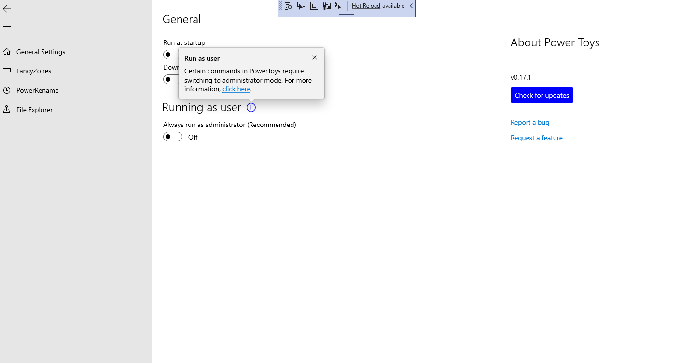
*Run as user teaching tip - the first tip that pops up if user clicks "Get Started" from the Welcome Screen, or when user clicks on the 'i' icon*


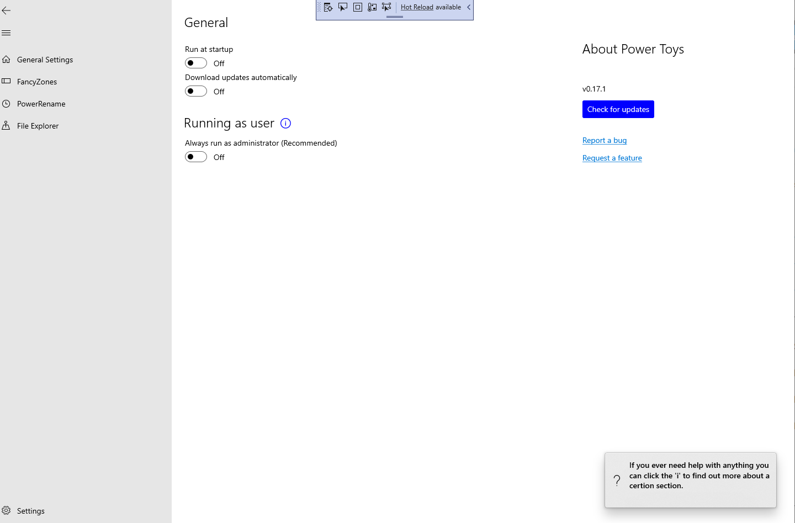
*Last teaching tip*

#### Code:

We used the [Teaching Tip](https://docs.microsoft.com/en-us/windows/uwp/design/controls-and-patterns/dialogs-and-flyouts/teaching-tip) component from the Windows UI Library. The frontend and the backend for the teaching tips are in [MainPage.xaml](https://github.com/microsoft/PowerToys/blob/interns/dev-oobe/POC-OOBE/OOBE-Sandbox/PowerToys%20Settings%20Sandbox/Views/MainPage.xaml) and [MainPage.xaml.cs](https://github.com/microsoft/PowerToys/blob/interns/dev-oobe/POC-OOBE/OOBE-Sandbox/PowerToys%20Settings%20Sandbox/Views/MainPage.xaml.cs) respectively. Add styling as necessary in the following code segments:

*"Run as User" tip:*

MainPage.xaml:
```
<StackPanel Orientation="Horizontal">
                    <TextBlock x:Name="RunAsUserTitle"/>
                    <FontIcon x:Name="RunAsUserTitleIcon" FontFamily="Segoe MDL2 Assets" Glyph="&#xE946;" PointerPressed="{x:Bind OpenRunAsUserTip}"/>
                    <muxc:TeachingTip x:Name="RunAsUserTip"
                                      Target="{x:Bind RunAsUserTitleIcon"
                                      Title="Run as user"
                                      PreferredPlacement="Top"
                                      CloseButtonClick="{x:Bind OpenFinalGeneralSettingsTip}">
                        <TextBlock TextWrapping="Wrap">Certain commands in PowerToys require switching to administrator mode. For more information, <Hyperlink NavigateUri="https://github.com/microsoft/PowerToys/blob/master/doc/devdocs/run-as-admin-detection.md">click here</Hyperlink>.</TextBlock>
                </muxc:TeachingTip>
</StackPanel>
```

MainPage.xaml.cs:
```
private void OpenRunAsUserTip()
{
    RunAsUserTip.IsOpen = true;
}
```
```
private void OpenFinalGeneralSettingsTip()
{
    RunAsUserTip.IsOpen = false;
    FinalGeneralSettingsTip.IsOpen = true;
}
```


*Final teaching tip*

Very similar to the "Run as User" tip. Enable light dismiss mode. 

```
<muxc:TeachingTip x:Name="FinalGeneralSettingsTip"
    Title="If you ever need help with anything you can click the 'i' to find out more about a certion section."
    IsLightDismissEnabled="True"
    PreferredPlacement="BottomRight">

    <muxc:TeachingTip.IconSource>
        <muxc:SymbolIconSource Symbol="Help" />
    </muxc:TeachingTip.IconSource>
</muxc:TeachingTip>
```

#### Considerations:
- Edit teaching tip content as necessary


## 4. Adaptive Sizing Layout Change

#### Rationale: 
When the General Settings window is minimized, the "About Feature" section goes to the bottom of Settings - harder to find when there are lots of settings. We propose moving the "About Feature" section to the top of the Settings when minimized.

#### Design:

Extended window UI:
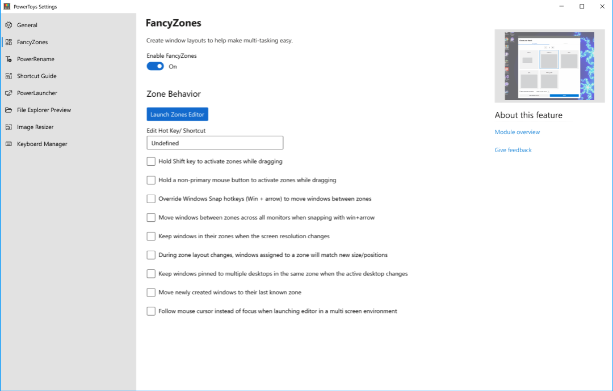

Smaller window UI:
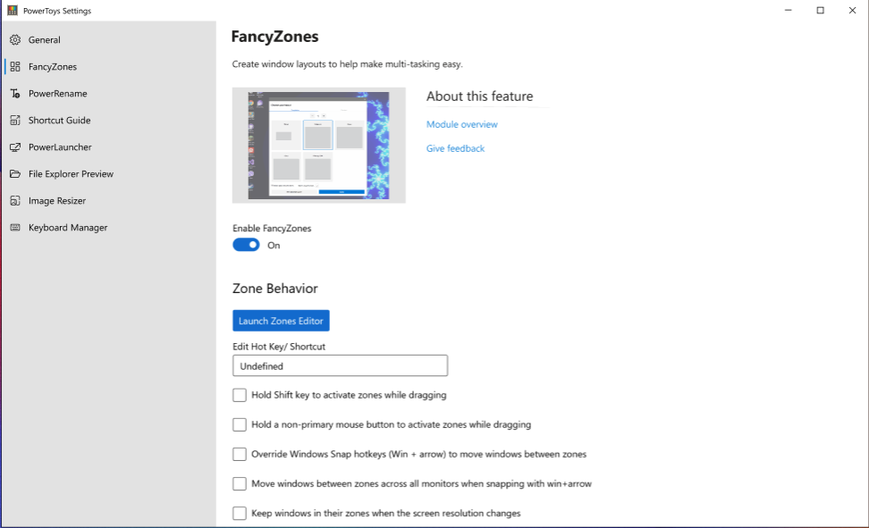


#### Code:

The following Grid would exist as each tool's Grid element on their repective settings page. Add styling as necessary:

[FancyZonesPage.xaml](https://github.com/microsoft/PowerToys/blob/interns/dev-oobe/POC-OOBE/OOBE-Sandbox/PowerToys%20Settings%20Sandbox/Views/FancyZonesPage.xaml)

```
   <Grid>

        <VisualStateManager.VisualStateGroups>
            <VisualStateGroup x:Name="LayoutVisualStates">
                <VisualState x:Name="WideLayout">
                    <VisualState.StateTriggers>
                        <AdaptiveTrigger MinWindowWidth="{INSERT WIDE LAYOUT WINDOW WIDTH HERE}" />
                    </VisualState.StateTriggers>
                    <VisualState.Setters>
                        <Setter Target="SidePanel.(Grid.Column)" Value="1" />
                        <Setter Target="SidePanel.(Grid.Row)" Value="1" />
                        <Setter Target="ToolSettingsTitle.(Grid.Row)" Value="0" />
                        <Setter Target="ToolSettingsView.(Grid.Row)" Value="1" />
                    </VisualState.Setters>
                </VisualState>
                <VisualState x:Name="SmallLayout">
                    <VisualState.StateTriggers>
                        <AdaptiveTrigger MinWindowWidth="{INSERT MIN LAYOUT WINDOW WIDTH HERE}" />
                    </VisualState.StateTriggers>
                    <VisualState.Setters>
                        <Setter Target="SidePanel.(Grid.Column)" Value="0" />
                        <Setter Target="SidePanel.(Grid.Row)" Value="1" />
                        <Setter Target="SidePanel.(Orientation)" Value="Horizontal" />
                        <Setter Target="ToolSettingsView.(Grid.Row)" Value="2" />
                    </VisualState.Setters>
                </VisualState>
            </VisualStateGroup>
        </VisualStateManager.VisualStateGroups>


        <Grid.ColumnDefinitions>
            <ColumnDefinition Width="*"/>
            <ColumnDefinition Width="Auto"/>
        </Grid.ColumnDefinitions>
        <Grid.RowDefinitions>
            <RowDefinition Height="Auto"/>
            <RowDefinition Height="Auto" />
            <RowDefinition Height="Auto" />
        </Grid.RowDefinitions>


        <StackPanel x:Name="ToolSettingsTitle" Orientation="Vertical" >
                { INSERT TITLE AND DESCRIPTION HERE }
        </StackPanel>

        <StackPanel x:Name="SidePanel" Grid.Column="1" Orientation="Vertical" HorizontalAlignment="Left">
            <Image Source="{INSERT GIF OR IMAGE OF TOOL HERE}">
            <StackPanel x:Name="SidePanelText" Grid.Column="1" Orientation="Vertical" HorizontalAlignment="Left">
                { INSERT SIDE PANEL TEXT HERE }
            </StackPanel>
        </StackPanel>

        <StackPanel  x:Name="ToolSettingsView" Orientation="Vertical">
            { INSERT TOOL SETTINGS HERE }
        </StackPanel>
    </Grid>
```

[FancyZonesPage.xaml.cs](https://github.com/microsoft/PowerToys/blob/interns/dev-oobe/POC-OOBE/OOBE-Sandbox/PowerToys%20Settings%20Sandbox/Views/FancyZonesPage.xaml.cs)

```
 private async void powerOnLaunchDialog()
        {
            onLaunchContentDialog dialog = new onLaunchContentDialog();
            dialog.PrimaryButtonClick += Dialog_PrimaryButtonClick;
            await dialog.ShowAsync();
        }

        private void Dialog_PrimaryButtonClick(ContentDialog sender, ContentDialogButtonClickEventArgs args)
        {
            OpenFirstGeneralSettingsTip();
        }
```

## 5. Hover

On hover of the module overview link of each tool's setting page, a preview of its GitHub documentation will appear.

#### Rationale:
Highlighting information on "About Tool" page to give further transparency to outbound links. A preview of the tools' easy-to-follow documentation with visual images on Github can engourage users to explore the tool further. 

#### Design:

Proposed design:
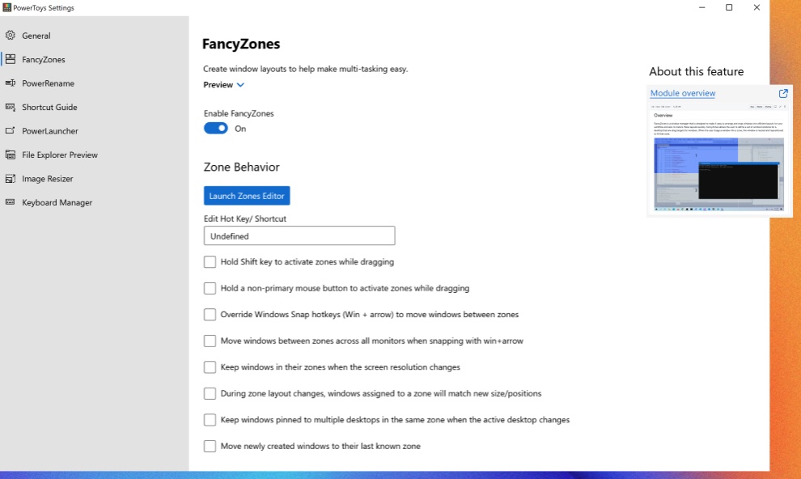


Implemented design:
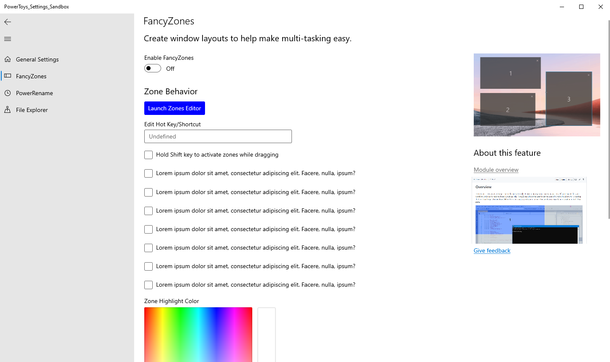

#### Code:
We used the [Image](https://docs.microsoft.com/en-us/uwp/api/Windows.UI.Xaml.Controls.Image?view=winrt-19041) component from the XAML Controls Gallery. We hooked up the Image to show based on the onPointerEntered and onPointeredExited of the Module Overview Link.

The Image component and the corresponding event handling are in [FancyZonesPage.xaml](https://github.com/microsoft/PowerToys/blob/interns/dev-oobe/POC-OOBE/OOBE-Sandbox/PowerToys%20Settings%20Sandbox/Views/FancyZonesPage.xaml) and [FancyZonesPage.xaml.cs](https://github.com/microsoft/PowerToys/blob/interns/dev-oobe/POC-OOBE/OOBE-Sandbox/PowerToys%20Settings%20Sandbox/Views/FancyZonesPage.xaml.cs) respectively. Add styling as necessary in the following code segments:


FancyZonesPage.xaml
```
    <Image x:Name="ModuleOverViewImage" 
           Width="275" 
           Margin="18,0,0,0" 
           Visibility="Collapsed" 
           Source="/Assets/GitHub_Documentation_Preview.png"/>
```

FancyZonesPage.xaml.cs
```
private void ToggleModuleOverviewTip(object sender, PointerRoutedEventArgs e)
{
    if (ModuleOverViewImage.Visibility.Equals((Visibility) 1))
        {
            ModuleOverViewImage.Visibility = 0;
        }
        else
        {
            ModuleOverViewImage.Visibility = (Visibility) 1;
        }
}
```

#### Considerations:
- This feature needs more refactoring to look like the design. Current implementation with Image Visibility can be refined.
- First exploration with TeachingTip was unsuccesful - cannot remove close button. Light dismiss mode that removes the teaching tip close button did not work with the onPointerEntered and onPointerExited hyperlink events.
- Exploration with the Flyout component was not the best, however more time could make a Flyout on hover work better.

## 6. Update Content Dialog

#### Rationale: 
Make it clearer to users what features were updated so they are more inclined to explore and be aware of new features.

#### Design:
Proposed design:
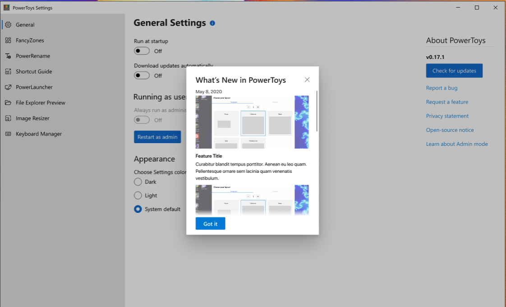

#### Code:
We used the [ContentDialog](https://docs.microsoft.com/en-us/uwp/api/Windows.UI.Xaml.Controls.ContentDialog?view=winrt-19041) component from the Windows UI Library.

The Update dialog component code is in [UpdateContentDialog.xaml](https://github.com/microsoft/PowerToys/blob/interns/dev-oobe/POC-OOBE/OOBE-Sandbox/PowerToys%20Settings%20Sandbox/Views/UpdateContentDialog.xaml). Add styling as necessary in the following code segments:

UpdateContentDialog.xaml
```
<ContentDialog
    x:Class="PowerToys_Settings_Sandbox.Views.UpdateContentDialog"
    xmlns="http://schemas.microsoft.com/winfx/2006/xaml/presentation"
    xmlns:x="http://schemas.microsoft.com/winfx/2006/xaml"
    xmlns:local="using:PowerToys_Settings_Sandbox.Views"
    xmlns:d="http://schemas.microsoft.com/expression/blend/2008"
    xmlns:mc="http://schemas.openxmlformats.org/markup-compatibility/2006"
    mc:Ignorable="d"
    Title="What's New in PowerToys"
    PrimaryButtonText="Got it"
    Height="600"
    >
    <ScrollViewer>
         {INSERT GRIDVIEW OR OTHER COMPONENT HERE}
    </ScrollViewer>
</ContentDialog>
```
