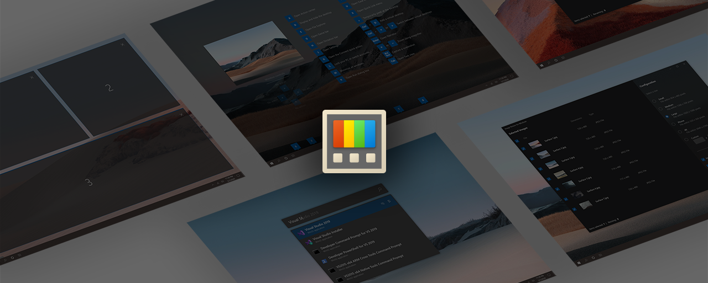

# Microsoft PowerToys



[How to use PowerToys][usingPowerToys-docs-link] | [Downloads & Release notes][github-release-link] | [Contributing to PowerToys](#contributing) | [What's Happening](#whats-happening) | [Roadmap](#powertoys-roadmap)

## About

Microsoft PowerToys is a set of utilities for power users to tune and streamline their Windows experience for greater productivity. For more info on [PowerToys overviews and how to use the utilities][usingPowerToys-docs-link], or any other tools and resources for [Windows development environments](https://learn.microsoft.com/windows/dev-environment/overview), head over to [learn.microsoft.com][usingPowerToys-docs-link]!

|              | Current utilities: |              |
|--------------|--------------------|--------------|
| [Advanced Paste](https://aka.ms/PowerToysOverview_AdvancedPaste) | [Always on Top](https://aka.ms/PowerToysOverview_AoT) | [PowerToys Awake](https://aka.ms/PowerToysOverview_Awake) |
| [Color Picker](https://aka.ms/PowerToysOverview_ColorPicker) | [Command Not Found](https://aka.ms/PowerToysOverview_CmdNotFound) | [Command Palette](https://aka.ms/PowerToysOverview_CmdPal) |
| [Crop And Lock](https://aka.ms/PowerToysOverview_CropAndLock) | [Environment Variables](https://aka.ms/PowerToysOverview_EnvironmentVariables) | [FancyZones](https://aka.ms/PowerToysOverview_FancyZones) |
| [File Explorer Add-ons](https://aka.ms/PowerToysOverview_FileExplorerAddOns) | [File Locksmith](https://aka.ms/PowerToysOverview_FileLocksmith) | [Hosts File Editor](https://aka.ms/PowerToysOverview_HostsFileEditor) |
| [Image Resizer](https://aka.ms/PowerToysOverview_ImageResizer) | [Keyboard Manager](https://aka.ms/PowerToysOverview_KeyboardManager) | [Mouse utilities](https://aka.ms/PowerToysOverview_MouseUtilities) |
| [Mouse Without Borders](https://aka.ms/PowerToysOverview_MouseWithoutBorders) | [New+](https://aka.ms/PowerToysOverview_NewPlus) | [Paste as Plain Text](https://aka.ms/PowerToysOverview_PastePlain) |
| [Peek](https://aka.ms/PowerToysOverview_Peek) | [PowerRename](https://aka.ms/PowerToysOverview_PowerRename) | [PowerToys Run](https://aka.ms/PowerToysOverview_PowerToysRun) |
| [Quick Accent](https://aka.ms/PowerToysOverview_QuickAccent) | [Registry Preview](https://aka.ms/PowerToysOverview_RegistryPreview) | [Screen Ruler](https://aka.ms/PowerToysOverview_ScreenRuler) |
| [Shortcut Guide](https://aka.ms/PowerToysOverview_ShortcutGuide) | [Text Extractor](https://aka.ms/PowerToysOverview_TextExtractor) | [Workspaces](https://aka.ms/PowerToysOverview_Workspaces) |
| [ZoomIt](https://aka.ms/PowerToysOverview_ZoomIt) |

## Installing and running Microsoft PowerToys

### Requirements

- Windows 11 or Windows 10 version 2004 (code name 20H1 / build number 19041) or newer.
- x64 or ARM64 processor
- Our installer will install the following items:
   - [Microsoft Edge WebView2 Runtime](https://go.microsoft.com/fwlink/p/?LinkId=2124703) bootstrapper. This will install the latest version.

### Via GitHub with EXE [Recommended]

Go to the [Microsoft PowerToys GitHub releases page][github-release-link] and click on `Assets` at the bottom to show the files available in the release. Please use the appropriate PowerToys installer that matches your machine's architecture and install scope. For most, it is `x64` and per-user.

<!-- items that need to be updated release to release -->
[github-next-release-work]: https://github.com/microsoft/PowerToys/issues?q=is%3Aissue+milestone%3A%22PowerToys+0.91%22
[github-current-release-work]: https://github.com/microsoft/PowerToys/issues?q=is%3Aissue+milestone%3A%22PowerToys+0.90%22
[ptUserX64]: https://github.com/microsoft/PowerToys/releases/download/v0.90.0/PowerToysUserSetup-0.90.0-x64.exe 
[ptUserArm64]: https://github.com/microsoft/PowerToys/releases/download/v0.90.0/PowerToysUserSetup-0.90.0-arm64.exe 
[ptMachineX64]: https://github.com/microsoft/PowerToys/releases/download/v0.90.0/PowerToysSetup-0.90.0-x64.exe 
[ptMachineArm64]: https://github.com/microsoft/PowerToys/releases/download/v0.90.0/PowerToysSetup-0.90.0-arm64.exe
 
|  Description   | Filename | sha256 hash |
|----------------|----------|-------------|
| Per user - x64       | [PowerToysUserSetup-0.90.0-x64.exe][ptUserX64] | 2A6036F5B2D454084E55816C306E1E57EF1D14C916691CBDA42B469797605CE0 |
| Per user - ARM64     | [PowerToysUserSetup-0.90.0-arm64.exe][ptUserArm64] | AB2E4DC87A9D764BE897C5170E2890E174C89CA912A1916FA3AE1E427536EA4A |
| Machine wide - x64   | [PowerToysSetup-0.90.0-x64.exe][ptMachineX64] | 12801C44F43D0CC61E90DF1EFDC40E4F3C88341E0199D5B20791042D9B173DCF |
| Machine wide - ARM64 | [PowerToysSetup-0.90.0-arm64.exe][ptMachineArm64] | 2998007C8FCD7BD2770767C6502AAA2CC75B85EC30DE62986EC7005EB0014EDB |

This is our preferred method.

### Via Microsoft Store

Install from the [Microsoft Store's PowerToys page][microsoft-store-link]. You must be using the [new Microsoft Store](https://blogs.windows.com/windowsExperience/2021/06/24/building-a-new-open-microsoft-store-on-windows-11/) which is available for both Windows 11 and Windows 10.

### Via WinGet
Download PowerToys from [WinGet][winget-link]. Updating PowerToys via winget will respect current PowerToys installation scope. To install PowerToys, run the following command from the command line / PowerShell:

#### User scope installer [default]
```powershell
winget install Microsoft.PowerToys -s winget
```

#### Machine-wide scope installer

```powershell
winget install --scope machine Microsoft.PowerToys -s winget
```

### Other install methods

There are [community driven install methods](./doc/unofficialInstallMethods.md) such as Chocolatey and Scoop. If these are your preferred install solutions, you can find the install instructions there.

## Third-Party Run Plugins

There is a collection of [third-party plugins](./doc/thirdPartyRunPlugins.md) created by the community that aren't distributed with PowerToys.

## Contributing

This project welcomes contributions of all types.  Besides  coding features / bug fixes,  other ways to assist include spec writing, design, documentation, and finding bugs. We are excited to work with the power user community to build a set of tools for helping you get the most out of Windows.

We ask that **before you start work on a feature that you would like to contribute**, please read our [Contributor's Guide](CONTRIBUTING.md). We would be happy to work with you to figure out the best approach, provide guidance and mentorship throughout feature development, and help avoid any wasted or duplicate effort.

Most contributions require you to agree to a [Contributor License Agreement (CLA)][oss-CLA] declaring that you grant us the rights to use your contribution and that you have permission to do so.

For guidance on developing for PowerToys, please read the [developer docs](/doc/devdocs) for a detailed breakdown. This includes how to setup your computer to compile.

## What's Happening

### PowerToys Roadmap

Our [prioritized roadmap][roadmap] of features and utilities that the core team is focusing on.

### 0.90 - March 2025 Update

In this release, we focused on new features, stability, and automation.

**✨Highlights**


 - New module: Command Palette ("CmdPal") - Created as the evolution of PowerToys Run with extensibility at the forefront, Command Palette is a quick launcher with a richer display and additional capabilities without sacrificing performance, allowing you to start anything with the shortcut **Win+Alt+Space**! Thanks [@zadjii-msft](https://github.com/zadjii-msft), [@niels9001](https://github.com/niels9001), [@joadoumie](https://github.com/joadoumie),  [@plante-msft](https://github.com/plante-msft), [@ethanfangg](https://github.com/ethanfangg) and [@krschau](https://github.com/krschau)!
 - Enhanced the Color Picker by switching from WPF UI to .NET WPF, resulting in improved themes and visual consistency across different modes. Thanks [@mantaionut](https://github.com/mantaionut)! Thanks [@Jay-o-Way](https://github.com/Jay-o-Way) and [@niels9001](https://github.com/niels9001) for helping with the review!
 - Added the ability to delete files directly from Peek, enhancing file management efficiency. Thanks [@daverayment](https://github.com/daverayment) and thanks [@htcfreek](https://github.com/htcfreek) for the review!
 - Added support for variables in template filenames, enabling dynamic elements like date components and environment variables for enhanced customization in New+. Thanks [@cgaarden](https://github.com/cgaarden)!

### Color Picker

 - Replaced WPF UI with .NET WPF for the Color Picker, enhancing compatibility and improving theme support. Thanks [@mantaionut](https://github.com/mantaionut)! Thanks [@Jay-o-Way](https://github.com/Jay-o-Way) and [@niels9001](https://github.com/niels9001) for helping with the review!

### Command Palette

- Introduced the Windows Command Palette ("CmdPal"), the next iteration of PowerToys Run, designed with extensibility at its core. CmdPal includes features such as searching for installed apps, shell commands, files and WinGet package installation. This module aims to provide a more powerful and flexible launcher experience. Thanks [@zadjii-msft](https://github.com/zadjii-msft), [@niels9001](https://github.com/niels9001), [@joadoumie](https://github.com/joadoumie), [@plante-msft](https://github.com/plante-msft), and the whole team!

### FancyZones

 - Fixed a bug where deleting a layout resulted in incorrect data being written to the JSON file.
 - Fixed a bug where layout hotkeys were displayed incorrectly, ensuring the hotkey list does not include invalid entries.
 - Fixed an issue where the "None" option was missing in the editor layout.

### Image Resizer

 - Fixed warnings in ImageResizer regarding the use of variables "shellItem" and "itemName" without being initialized.

### Mouse Without Borders

 - Enhanced the logger to properly track the file path for easier debugging.
 - Refactored the "Common" class into distinct individual classes to enhance maintainability, and updated all references and unit tests to reflect these changes. Thanks [@mikeclayton](https://github.com/mikeclayton) for this!

### New+

 - Added support for variables in template filenames, including date/time components, parent folder name, and environment variables. Thanks [@cgaarden](https://github.com/cgaarden)!

### Peek

 - Added the ability to delete the file currently being previewed in Peek, including navigation updates and handling for deleted items. Thanks [@daverayment](https://github.com/daverayment) and thanks [@htcfreek](https://github.com/htcfreek) for your help reviewing this!

### PowerToys Run

 - Fixed an issue where duplicated applications were shown by ensuring the shell link helper opens .ink files non-exclusively and correctly retrieves the "FullPath". Thanks [@htcfreek](https://github.com/htcfreek) and [@davidegiacometti](https://github.com/davidegiacometti) for review!
 - Fixed an issue where applying round corners on Windows 11 build 22000 caused crashes.
 - Async the OnRename method to unblock the thread. Thanks [@davidegiacometti](https://github.com/davidegiacometti) for review!
 - Added support for using `sq` instead of `^2` in the Unit Converter. Thanks [@PesBandi](https://github.com/PesBandi)!

### Settings

 - Disabled the spell check feature in the text boxes of plugin settings for PowerToys Run. Thanks [@htcfreek](https://github.com/htcfreek)!
 - Fixed an issue where InfoBars for release notes errors were not displayed properly, and added a retry button. Thanks [@davidegiacometti](https://github.com/davidegiacometti)!

### Workspaces

 - Fixed an issue where some minimized packaged apps (e.g., Microsoft ToDo, Settings) were not snapshotted.

### Documentation

 - Added the FirefoxBookmark plugin to the list of Third-Party plugins for PowerToys Run. Thanks [@8LWXpg](https://github.com/8LWXpg)!
 - Added the SVGL third-party plugin to PowerToys Run, enabling users to search, browse, and copy SVG logos. Thanks [@SameerJS6](https://github.com/SameerJS6)!
 - Added Monaco usage for the Registry Preview.

### Development

 - Updated WinGet configuration file location and extension. Thanks [@mdanish-kh](https://github.com/mdanish-kh)!
 - Removed the Markdown file bypass to ensure CI runs for commits that only update Markdown files.
 - Fixed an issue where the default generated file path exceeded the length limit of 260 characters for EnvironmentVariablesUILib.csproj, causing build failures.
 - Upgraded WindowsAppSDK to 1.6.250205002 and CsWinRT to 2.2.0. Thanks [@htcfreek](https://github.com/htcfreek) for review!
 - Upgraded XamlStyler to 3.2501.8 and dotnet-consolidate to 4.2.0. Thanks [@davidegiacometti](https://github.com/davidegiacometti)!
 - Updated .NET Packages from 9.0.2 to 9.0.3.
 - Optimized the UI Test Automation Framework and added UI test cases for the Hosts File Editor module.
 - Added fuzz testing for RegistryPreview.
 - Added new UI tests for the FancyZones editor, including tests for creating, duplicating, editing, and deleting layouts.
 - Added telemetry code to measure the module editor open time and evaluate the benefits of applying AOT.


 
### What is being planned for version 0.91

For [v0.91][github-next-release-work], we'll work on the items below:

 - New module: File Actions Menu
 - New UI Automation tests
 - Working on installer upgrades
 - Upgrading Keyboard Manager's editor UI
 - Stability / bug fixes

## PowerToys Community

The PowerToys team is extremely grateful to have the [support of an amazing active community][community-link]. The work you do is incredibly important. PowerToys wouldn’t be nearly what it is today without your help filing bugs, updating documentation, guiding the design, or writing features. We want to say thank you and take time to recognize your work.  Month by month, you directly help make PowerToys a better piece of software.

## Code of Conduct

This project has adopted the [Microsoft Open Source Code of Conduct][oss-conduct-code].

## Privacy Statement

The application logs basic diagnostic data (telemetry). For more information on privacy and what we collect, see our [PowerToys Data and Privacy documentation](https://aka.ms/powertoys-data-and-privacy-documentation).

[oss-CLA]: https://cla.opensource.microsoft.com
[oss-conduct-code]: CODE_OF_CONDUCT.md
[community-link]: COMMUNITY.md
[github-release-link]: https://aka.ms/installPowerToys
[microsoft-store-link]: https://aka.ms/getPowertoys
[winget-link]: https://github.com/microsoft/winget-cli#installing-the-client
[roadmap]: https://github.com/microsoft/PowerToys/wiki/Roadmap
[privacy-link]: http://go.microsoft.com/fwlink/?LinkId=521839
[loc-bug]: https://github.com/microsoft/PowerToys/issues/new?assignees=&labels=&template=translation_issue.md&title=
[usingPowerToys-docs-link]: https://aka.ms/powertoys-docs
