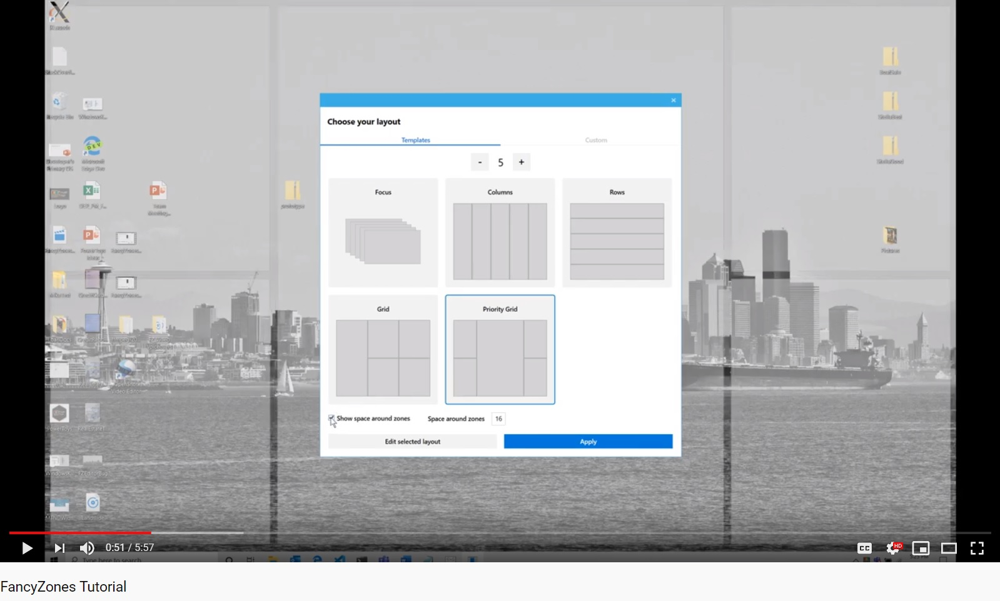
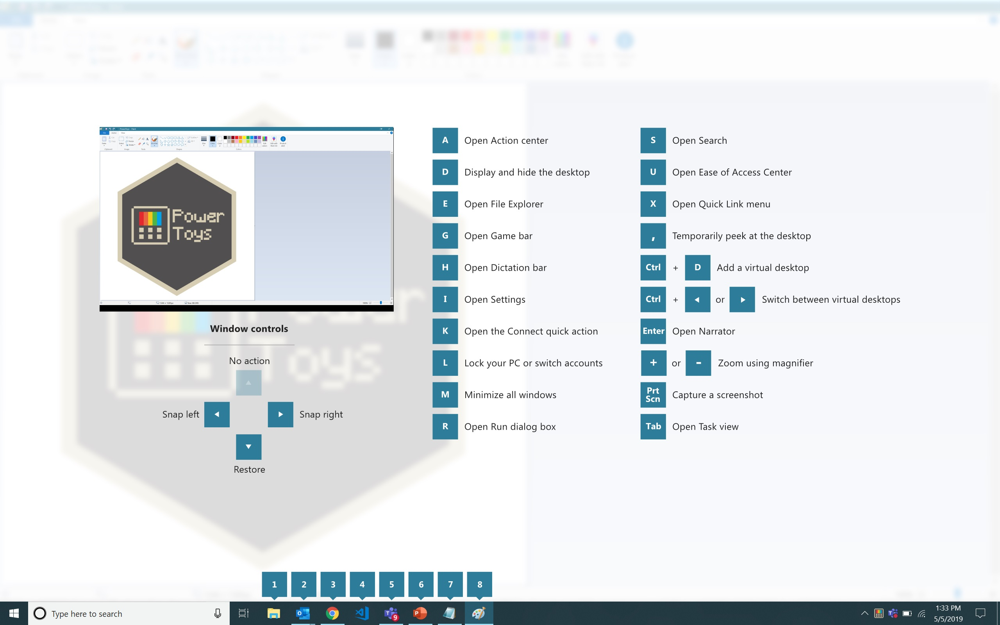

# Overview

PowerToys is a set of utilities for power users to tune and streamline their Windows experience for greater productivity.  

Inspired by the [Windows 95 era PowerToys project](https://en.wikipedia.org/wiki/Microsoft_PowerToys), this reboot provides power users with ways to squeeze more efficiency out of the Windows 10 shell and customize it for individual workflows.  A great overview of the Windows 95 PowerToys can be found [here](https://socket3.wordpress.com/2016/10/22/using-windows-95-powertoys/).


## Installation

_(Note: in order to run PowerToys, you'll need to be running at least Windows build 17134 or higher.  Also, PowerToys does not currently support Windows ARM machines)_

### Github

The first preview of these utilities can be installed from [here](https://github.com/Microsoft/powertoys/releases).

### Chocolatey (Unofficial)

Download and upgrade PowerToys from [Chocolatey](https://chocolatey.org).

To install PowerToys, run the following command from the command line or from PowerShell:
```powershell
choco install powertoys
```

To upgrade PowerToys, run the following command from the command line or from PowerShell:
```powershell
choco upgrade powertoys
```

If you have any issues when installing/upgrading the package please go to the [package page](https://chocolatey.org/packages/powertoys) and follow the [Chocolatey triage process](https://chocolatey.org/docs/package-triage-process)

### Build Status

[](https://dev.azure.com/ms/PowerToys/_build?definitionId=35096)

# What's Happening

## October Update
A big thanks to everyone who has downloaded and started using the first PowerToys preview.  There's been over 150K downloads so far.  An even bigger thanks to everyone who has provided feedback and suggestions in the issues.  The community engagement has been really awesome to see.  

The team has been hard at working fixing bugs, addressing issues and implementing feature suggestions.  If you've downloaded the code and built the latest on your machine recently you've seen many of these improvements (dark mode!).  We're hoping to have a new official build out shortly with all these improvements and will also be signed by Microsoft.  A new utility is also coming soon: Chris Davis is working to integrate his [SmartRename tool](https://github.com/chrdavis/SmartRename) into PowerToys!


1. [FancyZones](/src/modules/fancyzones/) - FancyZones is a window manager that makes it easy to create complex window layouts and quickly position windows into those layouts.  The FancyZones backlog can be found [here](https://github.com/Microsoft/PowerToys/tree/master/doc/planning/FancyZonesBacklog.md)


FancyZones Video Tutorial
[](https://www.youtube.com/watch?v=rTtGzZYAXgY)

2. [Windows key shortcut guide](/src/modules/shortcut_guide) - The shortcut guide appears when a user holds the Windows key down for more than one second and shows the available shortcuts for the current state of the desktop.  The shortcut guide backlog can be found [here](https://github.com/Microsoft/PowerToys/tree/master/doc/planning/ShortcutGuideBacklog.md)



Additional utilities in the pipeline are:

* Maximize to new desktop widget - The MTND widget shows a pop-up button when a user hovers over the maximize / restore button on any window.  Clicking it creates a new desktop, sends the app to that desktop and maximizes the app on the new desktop.
* [Process terminate tool](https://github.com/indierawk2k2/PowerToys-1/blob/master/specs/Terminate%20Spec.md)
* [Animated gif screen recorder](https://github.com/indierawk2k2/PowerToys-1/blob/master/specs/GIF%20Maker%20Spec.md)

# Backlog

The full backlog of utilities can be found [here](https://github.com/Microsoft/PowerToys/tree/master/doc/planning/PowerToysBacklog.md)

# Where to download PowerToys

  The latest release of PowerToys can be downloaded from https://github.com/microsoft/PowerToys/releases <br />
  Click on `Assets` to show the files available in the release and then click on `PowerToysSetup.msi` to download the PowerToys installer. <br />
  PDB symbols for the release are available in a separate zip file `PDB symbols.zip`.

# Developer Guidance

## Build Prerequisites
 * Windows 10 1803 (build 10.0.17134.0) or above to build and run PowerToys.
 * Visual Studio 2019 Community edition or higher, with the 'Desktop Development with C++' component and the Windows 10 SDK version 10.0.18362.0 or higher.
 
## Building the Code
 * Open `powertoys.sln` in Visual Studio, in the `Solutions Configuration` drop-down menu select `Release` or `Debug`, from the `Build` menu choose `Build Solution`.
 * The PowerToys binaries will be in your repo under `x64\Release`.
 * If you want to copy the `PowerToys.exe` binary to a different location, you'll also need to copy the `modules` and the `svgs` folders.

## Prerequisites to Build the Installer
 * Install the [WiX Toolset Visual Studio 2019 Extension](https://marketplace.visualstudio.com/items?itemName=RobMensching.WiXToolset).
 * Install the [WiX Toolset build tools](https://wixtoolset.org/releases/).
 
## Building the .msi Installer
  * From the `installer` folder open `PowerToysSetup.sln` in Visual Studio, in the `Solutions Configuration` drop-down menu select `Release` or `Debug`, from the `Build` menu choose `Build Solution`.
  * The resulting `PowerToysSetup.msi` installer will be available in the `installer\PowerToysSetup\x64\Release\` folder.

## Debugging
  The following configuration issue only applies if the user is a member of the Administrators group.
  
  Some PowerToys modules require being run with the highest permission level if the current user is a member of the Administrators group. The highest permission level is required to be able to perform some actions when an elevated application (e.g. Task Manager) is in the foreground or is the target of an action. Without elevated privileges some PowerToys modules will still work but with some limitations:
 - the `FancyZones` module will be not be able to move an elevated window to a zone.
 - the `Shortcut Guide` module will not appear if the foreground window belongs to an elevated application.
 
 To run and debug PowerToys from Visual Studio when the user is a member of the Administrators group, Visual Studio has to be started with elevated privileges. If you want to avoid running Visual Studio with elevated privileges and don't mind the limitations described above, you can do the following: open the `runner` project properties and navigate to the `Linker -> Manifest File` settings, edit the `UAC Execution Level` property and change it from `highestAvailable (/level='highestAvailable')` to `asInvoker (/level='asInvoker')`, save the changes.
 
## How to create new PowerToys

See the instructions on [how to install the PowerToys Module project template](tools/project_template). <br />
Specifications for the [PowerToys settings API](doc/specs/PowerToys-settings.md).

## Coding Guidance

Please review these brief docs below relating to our coding standards etc.

> 👉 If you find something missing from these docs, feel free to contribute to any of our documentation files anywhere in the repository (or make some new ones\!)

This is a work in progress as we learn what we'll need to provide people in order to be effective contributors to our project.
- [Coding Style](doc/coding/style.md)
- [Code Organization](doc/coding/organization.md)

# Contributing
This project welcomes contributions and suggestions and we are excited to work with the power user community to build a set of tools for helping you get the most out of Windows.

We ask that **before you start work on a feature that you would like to contribute**, please read our [Contributor's Guide](contributing.md). We will be happy to work with you to figure out the best approach, provide guidance and mentorship throughout feature development, and help avoid any wasted or duplicate effort.

> ⚠ **Note**: PowerToys is still a nascent project and the team is actively working out of this repository.  We will be periodically re-structuring the code to make it easier to comprehend, navigate, build, test, and contribute to, so **DO expect significant changes to code layout on a regular basis**.

> ⚠ **License Info**: Most contributions require you to agree to a Contributor License Agreement (CLA) declaring that you have the right to, and actually do, grant us the rights to use your contribution. For details, visit https://cla.microsoft.com.

When you submit a pull request, a CLA-bot will automatically determine whether you need to provide
a CLA and decorate the PR appropriately (e.g., label, comment). Simply follow the instructions
provided by the bot. You will only need to do this once across all repos using our CLA.

# Code of Conduct

This project has adopted the [Microsoft Open Source Code of Conduct][conduct-code]. <br />
For more information see the [Code of Conduct FAQ][conduct-FAQ] or contact [opencode@microsoft.com][conduct-email] with any additional questions or comments.

[conduct-code]: https://opensource.microsoft.com/codeofconduct/ 
[conduct-FAQ]: https://opensource.microsoft.com/codeofconduct/faq/
[conduct-email]: mailto:opencode@microsoft.com
