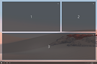
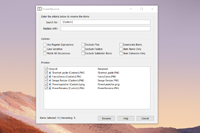
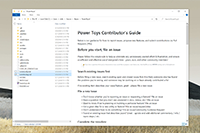
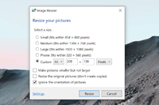
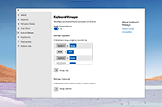
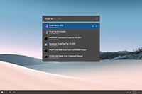

# Overview


Microsoft PowerToys is a set of utilities for power users to tune and streamline their Windows experience for greater productivity. Inspired by the [Windows 95 era PowerToys project](https://en.wikipedia.org/wiki/Microsoft_PowerToys), this reboot provides power users with ways to squeeze more efficiency out of the Windows 10 shell and customize it for individual workflows.  A great overview of the Windows 95 PowerToys can be found [here](https://socket3.wordpress.com/2016/10/22/using-windows-95-powertoys/).

[What's Happening](#whats-happening)   |   [Downloading & Release notes][github-release-link]   |   [Contributing to PowerToys](#contributing) | [Known issues](#known-issues)

## Build status

[](https://dev.azure.com/ms/PowerToys/_build?definitionId=219)

## Current PowerToy Utilities

### FancyZones

[](/src/modules/fancyzones/) [FancyZones](/src/modules/fancyzones/) is a window manager that makes it easy to create complex window layouts and quickly position windows into those layouts.
<br>
<br>
<br>
<br>
<br>

### Shortcut Guide

[](/src/modules/shortcut_guide)  [Windows key shortcut guide](/src/modules/shortcut_guide) appears when a user holds the Windows key down for more than one second and shows the available shortcuts for the current state of the desktop.
<br>
<br>
<br>
<br>
<br>

### PowerRename

[](/src/modules/powerrename) [PowerRename](/src/modules/powerrename) is a Windows Shell Extension for advanced bulk renaming using search and replace or regular expressions. PowerRename allows simple search and replace or more advanced regular expression matching. While you type in the search and replace input fields, the preview area will show what the items will be renamed to. PowerRename then calls into the Windows Explorer file operations engine to perform the rename. This has the benefit of allowing the rename operation to be undone after PowerRename exits. This code is based on [Chris Davis's SmartRename](https://github.com/chrdavis/SmartRename).
<br>
<br>

### File Explorer (Preview Panes)

[](/src/modules/previewpane) [File Explorer](/src/modules/previewpane) add-ons right now are just limited to Preview Pane additions for File Explorer. Preview Pane is an existing feature in the File Explorer.  To enable it, you just click the View tab in the ribbon and then click "Preview Pane".

PowerToys will now enable two types of files to be previewed: Markdown (.md) & SVG (.svg)
<br>
<br>

### Image Resizer

[](/src/modules/imageresizer) [Image Resizer](/src/modules/imageresizer) is a Windows Shell Extension for quickly resizing images.  With a simple right click from File Explorer, resize one or many images instantly. This code is based on [Brice Lambson's Image Resizer](https://github.com/bricelam/ImageResizer).
<br>
<br>
<br>
<br>

### Keyboard Manager

[](src/modules/keyboardmanager/) [Keyboard Manager](src/modules/keyboardmanager/) allows you to customize the keyboard to be more productive by remapping keys and creating your own keyboard shortcuts. This PowerToy requires Windows 10 1903 (build 18362) or later.
<br>
<br>
<br>
<br>
<br>

### PowerToys Run

[](src/modules/launcher/) [PowerToys Run](src/modules/launcher/) is a new toy in PowerToys that can help you search and launch your app instantly with a simple alt-space and start typing! It is open source and modular for additional plugins.  Window Walker is now inside too! This PowerToy requires Windows 10 1903 (build 18362) or later.
<br>
<br>
<br>
<br>

## Installing and running Microsoft PowerToys

**Requirements**
- Windows 10 1803 (build 17134) or later.
- Have [.NET Core 3.1 Desktop Runtime](https://dotnet.microsoft.com/download/dotnet-core/thank-you/runtime-desktop-3.1.4-windows-x64-installer). The installer will prompt this but we want to directly make people aware.

### Via Github with MSI [Recommended]

Install from the [Microsoft PowerToys GitHub releases page][github-release-link]. Click on `Assets` to show the files available in the release and then click on `PowerToysSetup-0.18.2-x64.msi` to download the PowerToys installer.

**Note:** After installing, you will have to start PowerToys for the first time.  We will improve install experience this moving forward but due to a possible install dependency, we can't start after install currently.

This is our preferred method.

### Via WinGet (Preview)
Download PowerToys from [WinGet](https://github.com/microsoft/winget-cli/releases). To install PowerToys, run the following command from the command line / PowerShell:

```powershell
WinGet install powertoys
```

### Other install methods

#### Via Chocolatey (Unofficial)

Download and upgrade PowerToys from [Chocolatey](https://chocolatey.org). If you have any issues when installing/upgrading the package please go to the [package page](https://chocolatey.org/packages/powertoys) and follow the [Chocolatey triage process](https://chocolatey.org/docs/package-triage-process)

To install PowerToys, run the following command from the command line / PowerShell:

```powershell
choco install powertoys
```

To upgrade PowerToys, run the following command from the command line / PowerShell:

```powershell
choco upgrade powertoys
```

### Known issues

- [#2012 - Uninstalling with old control panel fails](https://github.com/microsoft/PowerToys/issues/2012): Please use the modern settings to uninstall. `Windows 10 Settings -> Apps -> Apps & features`
- [#3384 - PowerToys Settings window is empty](https://github.com/microsoft/PowerToys/issues/3384): Workaround appears to be run as admin.  We are proactively looking into this as a hotfix.

### Processor support

We currently support the matrix below.

| x64 | x86 | ARM |
|:---:|:---:|:---:|
| [Supported][github-release-link] | [Issue #602](https://github.com/microsoft/PowerToys/issues/602) | [Issue #490](https://github.com/microsoft/PowerToys/issues/490) |

## What's Happening

### May 2020 Update

Our goals for 0.18 release cycle was three big items, PowerToys Run, Keyboard manager, and migrating to the new settings system.  This is also the first time we'll test out the auto-updating system.

Feedback is critical. We know there are areas for improvement on PT Run. We would love feedback so we can improve. We also would love to know if you want us to be more aggressive on auto-upgrading.

- We shipped [v0.18][github-release-link]!
- New Utilities
   - PowerToys Run, our new application launcher (use alt-space to activate)
   - Keyboard manager, a quick easy way to remap your keyboard
- Fixed [#243](https://github.com/microsoft/PowerToys/issues/243)'s setting issue
- Improved performance on FancyZones [#1264](https://github.com/microsoft/PowerToys/issues/1264)
- Lots of bug fixes!

For [0.19](https://github.com/microsoft/PowerToys/issues?q=is%3Aopen+is%3Aissue+project%3Amicrosoft%2FPowerToys%2F4), we are proactively working on:

- Enable PT Run to be mapped to Win-Keys
- Stability / tech debt fixes
- Performance improvements with FancyZones
- A testing utility for FancyZones to be sure we can test different window configurations.

### Version 1.0 plan

Our plan for all the [goals and utilities for v1.0 detailed over here in the wiki][v1].

## Developer Guidance

Please read the [developer docs](/doc/devdocs) for a detailed breakdown.

## Contributing

This project welcomes contributions of all types. Help spec'ing, design, documentation, finding bugs are ways everyone can help on top of coding features / bug fixes. We are excited to work with the power user community to build a set of tools for helping you get the most out of Windows.

We ask that **before you start work on a feature that you would like to contribute**, please read our [Contributor's Guide](contributing.md). We will be happy to work with you to figure out the best approach, provide guidance and mentorship throughout feature development, and help avoid any wasted or duplicate effort.

### ⚠ State of code ⚠

PowerToys is still a very fluidic project and the team is actively working out of this repository.  We will be periodically re-structuring/refactoring the code to make it easier to comprehend, navigate, build, test, and contribute to, so **DO expect significant changes to code layout on a regular basis**.

### License Info

 Most contributions require you to agree to a [Contributor License Agreement (CLA)][oss-CLA] declaring that you have the right to, and actually do, grant us the rights to use your contribution.

## Code of Conduct

This project has adopted the [Microsoft Open Source Code of Conduct][oss-conduct-code].

## Privacy Statement

The application logs basic telemetry. Our Telemetry Data page (Coming Soon) has the trends from the telemetry. Please read the [Microsoft privacy statement][privacyLink] for more information.

[oss-CLA]: https://cla.opensource.microsoft.com
[oss-conduct-code]: CODE_OF_CONDUCT.md
[github-release-link]: https://github.com/microsoft/PowerToys/releases/
[v1]: https://github.com/microsoft/PowerToys/wiki/Version-1.0-Strategy
[privacyLink]: http://go.microsoft.com/fwlink/?LinkId=521839
