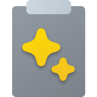
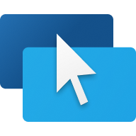
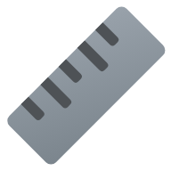
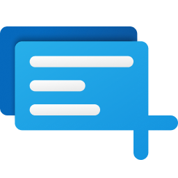

<p align="center">
    <picture>
      <source media="(prefers-color-scheme: light)" srcset="./doc/images/readme/pt-hero.light.png" />
      
  </picture>
</p>
<h1 align="center">
  <span>Microsoft PowerToys</span>
</h1>
<p align="center">
  <span align="center">Microsoft PowerToys is a collection of utilities that help you customize Windows and streamline everyday tasks.</span>
</p>
<h3 align="center">
  <a href="#-installation">Installation</a>
  <span> · </span>
  <a href="https://aka.ms/powertoys-docs">Documentation</a>
  <span> · </span>
  <a href="https://aka.ms/powertoys-releaseblog">Blog</a>
  <span> · </span>
  <a href="#-whats-new">Release notes</a>
</h3>
<br/><br/>

## 🔨 Utilities

PowerToys includes over 25 utilities to help you customize and optimize your Windows experience:

|   |   |   |
|---|---|---|
| [ Advanced Paste](https://aka.ms/PowerToysOverview_AdvancedPaste) | [ Always on Top](https://aka.ms/PowerToysOverview_AoT) | [ Awake](https://aka.ms/PowerToysOverview_Awake) |
| [ Color Picker](https://aka.ms/PowerToysOverview_ColorPicker) | [ Command Not Found](https://aka.ms/PowerToysOverview_CmdNotFound) | [ Command Palette](https://aka.ms/PowerToysOverview_CmdPal) |
| [ Crop And Lock](https://aka.ms/PowerToysOverview_CropAndLock) | [ Environment Variables](https://aka.ms/PowerToysOverview_EnvironmentVariables) | [ FancyZones](https://aka.ms/PowerToysOverview_FancyZones) |
| [ File Explorer Add-ons](https://aka.ms/PowerToysOverview_FileExplorerAddOns) | [ File Locksmith](https://aka.ms/PowerToysOverview_FileLocksmith) | [ Hosts File Editor](https://aka.ms/PowerToysOverview_HostsFileEditor) |
| [ Image Resizer](https://aka.ms/PowerToysOverview_ImageResizer) | [ Keyboard Manager](https://aka.ms/PowerToysOverview_KeyboardManager) | [ Light Switch](https://aka.ms/PowerToysOverview_LightSwitch) |
| [ Mouse Utilities](https://aka.ms/PowerToysOverview_MouseUtilities) | [ Mouse Without Borders](https://aka.ms/PowerToysOverview_MouseWithoutBorders) | [ New+](https://aka.ms/PowerToysOverview_NewPlus) |
| [ Peek](https://aka.ms/PowerToysOverview_Peek) | [ PowerRename](https://aka.ms/PowerToysOverview_PowerRename) | [ PowerToys Run](https://aka.ms/PowerToysOverview_PowerToysRun) |
| [ Quick Accent](https://aka.ms/PowerToysOverview_QuickAccent) | [ Registry Preview](https://aka.ms/PowerToysOverview_RegistryPreview) | [ Screen Ruler](https://aka.ms/PowerToysOverview_ScreenRuler) |
| [ Shortcut Guide](https://aka.ms/PowerToysOverview_ShortcutGuide) | [ Text Extractor](https://aka.ms/PowerToysOverview_TextExtractor) | [ Workspaces](https://aka.ms/PowerToysOverview_Workspaces) |
| [ ZoomIt](https://aka.ms/PowerToysOverview_ZoomIt) |   |   |


## 📋 Installation

For detailed installation instructions and system requirements, visit the [installation docs](https://learn.microsoft.com/windows/powertoys/install). 

But to get started quickly, choose one of the installation methods below:
<br/><br/>
<details open>
<summary><strong>Download .exe from GitHub</strong></summary>
<br/>
Go to the [PowerToys GitHub releases][github-release-link], click Assets to reveal the downloads, and choose the installer that matches your architecture and install scope. For most devices, that's the x64 per-user installer.

<!-- items that need to be updated release to release -->
[github-next-release-work]: https://github.com/microsoft/PowerToys/issues?q=is%3Aissue+milestone%3A%22PowerToys+0.97%22
[github-current-release-work]: https://github.com/microsoft/PowerToys/issues?q=is%3Aissue+milestone%3A%22PowerToys+0.96%22
[ptUserX64]: https://github.com/microsoft/PowerToys/releases/download/v0.96.1/PowerToysUserSetup-0.96.1-x64.exe 
[ptUserArm64]: https://github.com/microsoft/PowerToys/releases/download/v0.96.1/PowerToysUserSetup-0.96.1-arm64.exe 
[ptMachineX64]: https://github.com/microsoft/PowerToys/releases/download/v0.96.1/PowerToysSetup-0.96.1-x64.exe 
[ptMachineArm64]: https://github.com/microsoft/PowerToys/releases/download/v0.96.1/PowerToysSetup-0.96.1-arm64.exe
 
|  Description   | Filename |
|----------------|----------|
| Per user - x64       | [PowerToysUserSetup-0.96.1-x64.exe][ptUserX64] |
| Per user - ARM64     | [PowerToysUserSetup-0.96.1-arm64.exe][ptUserArm64] |
| Machine wide - x64   | [PowerToysSetup-0.96.1-x64.exe][ptMachineX64] |
| Machine wide - ARM64 | [PowerToysSetup-0.96.1-arm64.exe][ptMachineArm64] |

</details>

<details>
<summary><strong>Microsoft Store</strong></summary>
<br/>
You can easily install PowerToys from the Microsoft Store:
<p>
  <a style="text-decoration:none" href="https://aka.ms/getPowertoys">
    <picture>
      <source media="(prefers-color-scheme: light)" srcset="doc/images/readme/StoreBadge-dark.png" width="148" />
      
  </picture></a>
</p>
</details>

<details>
<summary><strong>WinGet</strong></summary>
<br/>
Download PowerToys from [WinGet][winget-link]. Updating PowerToys via winget will respect the current PowerToys installation scope. To install PowerToys, run the following command from the command line / PowerShell:

*User scope installer [default]*
```powershell
winget install Microsoft.PowerToys -s winget
```

*Machine-wide scope installer*
```powershell
winget install --scope machine Microsoft.PowerToys -s winget
```
</details>

<details>
<summary><strong>Other methods</strong></summary>
<br/>
There are [community driven install methods](./doc/unofficialInstallMethods.md) such as Chocolatey and Scoop. If these are your preferred install solutions, you can find the install instructions there.
</details>

## ✨ What's new
**Version 0.96 (November 2025)**

For an in-depth look at the latest changes, visit the [Windows Command Line blog](https://aka.ms/powertoys-releaseblog).

**✨ Highlights**
 - Advanced Paste now supports multiple online and on-device AI model providers: Azure OpenAI, OpenAI, Google Gemini, Mistral, Foundry Local and Ollama.
 - Command Palette received extensive improvements including file search filters, better clipboard history metadata, context-menu styling, and dozens of bug fixes and enhancements.
 - PowerRename can now extract and use photo metadata (EXIF, XMP) in renaming patterns like `%Camera`, `%Lens`, and `%ExposureTime`.

### Advanced Paste
 - Advanced Paste now lets you connect to multiple AI providers instead of being limited to a single OpenAI provider. See [Advanced Paste documentation](https://learn.microsoft.com/windows/powertoys/advanced-paste) for usage.

### Awake
 - The Awake countdown timer now stays accurate over long periods. Thanks [@daverayment](https://github.com/daverayment)!
 - Fixed Awake context menu positioning. The fix removed the conversion of the mouse cursor from screen to client-window coordinates, instead using the raw screen coordinates returned by GetCursorPos; the context menu now appears at the correct screen position. Thanks [@lzandman](https://github.com/lzandman)!

### Command Palette
 - The search field in context menus now matches the look of the Command Palette, with a smoke backdrop and improved padding.
 - Fallback items such as math calculations or the Run command now appear in results more quickly. Thanks [@jiripolasek](https://github.com/jiripolasek)!
 - Ensured the command bar updates correctly after navigating to another page and commands are displayed correctly. Thanks [@jiripolasek](https://github.com/jiripolasek)!
 - The Command Palette settings page has been reorganized. Activation-key options are grouped under an expander and extension settings are framed for improved readability.
 - When you modify a command, its alias, hotkey, and tags now update in the top-level list, keeping the displayed information in sync. Thanks [@jiripolasek](https://github.com/jiripolasek)!
 - Press `Ctrl + ,` to open Command Palette settings from anywhere. Thanks [@jiripolasek](https://github.com/jiripolasek)!
 - You can use `Page Up` and `Page Down` to navigate the list while focus is in the search box. Thanks [@samrueby](https://github.com/samrueby)!
 - Fixed an issue where the search box could disappear when navigating pages. Thanks [@jiripolasek](https://github.com/jiripolasek)!
 - Ensured search text is selected when *Go home when activated* and *Highlight search on activate* are both enabled. Thanks [@jiripolasek](https://github.com/jiripolasek)!
 - Fixed an issue where Command Palette window occasionally appeared on the taskbar under certain Windows settings. Thanks [@jiripolasek](https://github.com/jiripolasek)!
 - Ensured that labels and icons of list items and menu items update when they change. Thanks [@jiripolasek](https://github.com/jiripolasek)!
 - Fixed visibility of list filters when navigating to a content page. Thanks [@DevLGuilherme](https://github.com/DevLGuilherme)!
 - Added search to the extension list and a link to extensions on the Microsoft Store. Thanks [@jiripolasek](https://github.com/jiripolasek)!
 - Added options to open the Command Palette window at its last position or re-center it.
 - The Command Palette now remembers its window size after restarting.
 - Added a global error handler that logs fatal errors and provides feedback when unexpected failures force Command Palette to close. Thanks [@jiripolasek](https://github.com/jiripolasek)!
 - Fixed forms and extension settings not showing on some machines due to a missing VC++ runtime.
 - Restored ranking of fallback commands for built-in extensions (Sleep, Shutdown, Windows settings, Web search, etc.). Thanks [@jiripolasek](https://github.com/jiripolasek).
 - Improved and unified labels and texts across the application!
 - Maintainance: Resolved numerous build warnings in Command Palette projects; no user-visible impact. Thanks [@jiripolasek](https://github.com/jiripolasek)!
 - Maintainance: Fixed a logging issue so exception messages are properly recorded instead of placeholder text, improving troubleshooting. Thanks [@jiripolasek](https://github.com/jiripolasek)!

### Command Palette Extensions
 - Bookmarks: Added hints about bookmark placeholders to the Add/Edit Bookmark form. — Thanks [@jiripolasek](https://github.com/jiripolasek)!
 - Bookmarks: Improved migration of bookmarks from older versions and fixed an issue where aliases or keyboard shortcuts could be lost after restart. Thanks [@jiripolasek](https://github.com/jiripolasek)!
 - Clipboard history: Items shown in Command Palette’s clipboard history now include helpful metadata. For example, image items show dimensions, text files show names and sizes, web links include page titles, and text entries display word counts. Thanks [@jiripolasek](https://github.com/jiripolasek)!
 - File search: Added filter buttons to show *all items*, *files only*, or *folders only*. Selecting a filter adds `kind:folders` or `kind:not folders` to narrow results.
 - System commands: Replaced the `:red_circle:` placeholder with an actual red-circle emoji so the correct icon appears in the UI. Thanks [@samrueby](https://github.com/samrueby)!
 - WinGet: Search performance feels more responsive because typed input is now processed via a task queue rather than complex cancellation tokens!
 - Window Walker: UWP apps no longer show a "not responding" label when suspended. Thanks [@jiripolasek](https://github.com/jiripolasek)!
 - Window Walker: Now displays the actual icon of each window rather than using the process icon, improving recognition of PWAs and Python GUIs. Thanks [@Lee-WonJun](https://github.com/Lee-WonJun)!
- Windows Terminal profiles: Fixed a rare crash in the Windows Terminal extension when the `LOCALAPPDATA` environment variable was missing. The path is now retrieved via a reliable API. Thanks [@jiripolasek](https://github.com/jiripolasek)!

### Find My Mouse
 - Activating Find My Mouse no longer makes the cursor change to the busy (hourglass) icon or steals focus from your active application.

### Hosts File Editor
 - Added customizable backup settings allowing users to configure backup frequency, location, and auto-deletion policies. Thanks [@davidegiacometti](https://github.com/davidegiacometti)!

### Image Resizer
 - Fixed settings consistency during batch resize operations by capturing settings once before processing. Thanks [@daverayment](https://github.com/daverayment)!

### Light Switch
- Introduced new UI to allow users to manually enter their latitude and longitude in Sunrise to Sunset mode.
- Refactored service with cleaner state management for stability.
- Removed logs from every tick, only logging key events to largely reduce log size.

### Mouse Pointer Crosshairs
 - Enabled switching between Mouse Pointer Crosshairs and Gliding Cursor modes. Thanks [@mikehall-ms](https://github.com/mikehall-ms)!

### Mouse Without Borders
 - Added horizontal scrolling support. Thanks [@MasonBergstrom](https://github.com/MasonBergstrom)!

### Peek
- Fixed media files remaining locked after preview window closes. Thanks [@daverayment](https://github.com/daverayment)!
- Added a command-line interface for file previewing. See the [Peek documentation](https://learn.microsoft.com/windows/powertoys/peek) for usage. Thanks [@prochan2](https://github.com/prochan2)!

### PowerRename
- PowerRename no longer crashes due to a missing resources file.
- Added photo metadata extraction support using EXIF and XMP for pattern-based renaming with camera info, GPS coordinates, and date taken. See [PowerRename Documentation](https://learn.microsoft.com/en-us/windows/powertoys/powerrename).

### PowerToys Run
 - Added retry logic with exponential backoff to handle DWM composition errors during theme changes. Thanks [@jiripolasek](https://github.com/jiripolasek)!
 - Updated OneNote icons to reflect new Microsoft 365 design. Thanks [@trevorNgo](https://github.com/trevorNgo)!

 ### Quick Accent
 - Added diameter symbol (⌀) for Shift+O in Special Characters mode, thanks to [@anselumjuju](https://github.com/anselumjuju)!

### Zoomit
 - Smoothed out zoom-animation in ZoomIt by coalescing mouse-move and timer events, thanks to [@foxmsft](https://github.com/foxmsft)!
 - Enabled GIF support for ZoomIt, thanks to [@MarioHewardt](https://github.com/MarioHewardt)!
 - Fixed spelling mistakes, and refactored some literal strings to string constants, thanks to [@lzandman](https://github.com/lzandman)!
 - Fixed inaccurate "actual size" screenshots in ZoomIt and resolves a GDI handle leak, improving capture fidelity and long-session stability. thanks to [@daverayment](https://github.com/daverayment)!

### Settings
- Fixed title bar overlapping issue at smaller window sizes.
- Refined shortcut control visual design with improved consistency and spacing.
- Added dashboard utilities sorting by name or status.
- Made update notification InfoBar in flyout clickable for direct navigation to update page.
- Expanded installation instructions by default in README.
- Improved accessibility for shortcut conflict button with static resource-based automation properties.
- Added ScrollViewer to Command Palette page in PowerToys Settings. Thanks [@jiripolasek](https://github.com/jiripolasek)!
- Fixed module list glitches and Sort Status checkmark issue. Thanks [@daverayment](https://github.com/daverayment)!

### Development
- Fixed accessibility by associating controls with labels for screen readers.
- Added accessible name to Shortcut Conflicts button for screen readers.
- Excluded TitleBars from tab navigation across multiple utilities. Thanks [@jiripolasek](https://github.com/jiripolasek)!
- Migrated build infrastructure from Windows Server 2019 to Server 2022 with improved failure logging and predictable NuGet package paths.
- Configured build agents to use larger P: drive for release builds to address disk space constraints.
- Enhanced DSC v3 support by organizing resource manifests in a dedicated subfolder with PATH configuration.
- Reduced installer bundle size by 6-7MB through centralized Hybrid CRT configuration across all C++ projects.
- Updated .NET packages to version 9.0.10 for security fixes. Thanks [@snickler](https://github.com/snickler)!
- Fixed spell check dictionary entries for consistency.
- Restored accidentally deleted NuGet configuration file for Command Palette extensions.
- Fixed package identity build by updating AppxManifest entry points to use PowerShell Core.
- Optimized CI pipeline by replacing file copy operations with hard links and moves, reducing build time and disk usage by 10-15GB.
- Updated Copilot guidance and PR prompt workflow.
- Included high-volume bugs in issue template header. Thanks [@daverayment](https://github.com/daverayment)!
- Fixed incorrect HRESULT logging for inner exceptions. Thanks [@jiripolasek](https://github.com/jiripolasek)!
- Introduced shared sparse package identity for PowerToys Win32 components to enable access to Windows platform APIs.
- Consolidated installer builds to produce both machine and user installers simultaneously, reducing build time and complexity.
- Migrated exclusively to WiX v5 installer infrastructure, removing legacy WiX v3 support.
- Temporarily removed PowerToys installer path from PATH environment variable to prevent application crashes.
- Added complete OCR UI test coverage with automated tests for activation, settings, language selection, and text extraction.
- Fixed test input for drive path normalization in bookmark resolver unit tests.
- Fixed Peek UI tests by restoring Ctrl+Space activation shortcut for test scenarios.
- Hided apps in PowerToys.SpareApps package from Start Menu. Thanks [@jiripolasek](https://github.com/jiripolasek)!

## 🛣️ Roadmap 
We are planning some nice new features and improvements for the next releases – a revamped Keyboard Manager UI, custom endpoint and local model support for Advanced Paste, Command Palette improvements and a brand-new Shortcut Guide experience! Stay tuned for [v0.96][github-next-release-work]!

## ❤️ PowerToys Community 
The PowerToys team is extremely grateful to have the [support of an amazing active community][community-link]. The work you do is incredibly important. PowerToys wouldn't be nearly what it is today without your help filing bugs, updating documentation, guiding the design, or writing features. We want to say thank you and take time to recognize your work. Your contributions and feedback improve PowerToys month after month!

## Contributing 
This project welcomes contributions of all types. Besides coding features / bug fixes, other ways to assist include spec writing, design, documentation, and finding bugs. We are excited to work with the power user community to build a set of tools for helping you get the most out of Windows. We ask that **before you start work on a feature that you would like to contribute**, please read our [Contributor's Guide](CONTRIBUTING.md). We would be happy to work with you to figure out the best approach, provide guidance and mentorship throughout feature development, and help avoid any wasted or duplicate effort. Most contributions require you to agree to a [Contributor License Agreement (CLA)][oss-CLA] declaring that you grant us the rights to use your contribution and that you have permission to do so. For guidance on developing for PowerToys, please read the [developer docs](./doc/devdocs) for a detailed breakdown. This includes how to setup your computer to compile. 

## Code of Conduct 
This project has adopted the [Microsoft Open Source Code of Conduct][oss-conduct-code]. 

## Privacy Statement 
The application logs basic diagnostic data (telemetry). For more privacy information and what we collect, see our [PowerToys Data and Privacy documentation](https://aka.ms/powertoys-data-and-privacy-documentation). 

[oss-CLA]: https://cla.opensource.microsoft.com 
[oss-conduct-code]: CODE_OF_CONDUCT.md 
[community-link]: COMMUNITY.md 
[github-release-link]: https://aka.ms/installPowerToys 
[microsoft-store-link]: https://aka.ms/getPowertoys 
[winget-link]: https://github.com/microsoft/winget-cli#installing-the-client 
[roadmap]: https://github.com/microsoft/PowerToys/wiki/Roadmap
[privacy-link]: http://go.microsoft.com/fwlink/?LinkId=521839 
[loc-bug]: https://github.com/microsoft/PowerToys/issues/new?assignees=&labels=&template=translation_issue.md&title= 
[usingPowerToys-docs-link]: https://aka.ms/powertoys-docs
