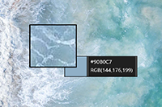
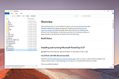
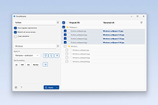
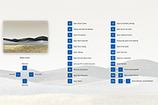
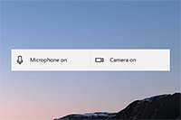

# Overview


Microsoft PowerToys is a set of utilities for power users to tune and streamline their Windows experience for greater productivity. Inspired by the [Windows 95 era PowerToys project](https://en.wikipedia.org/wiki/Microsoft_PowerToys), this reboot provides power users with ways to squeeze more efficiency out of the Windows 10 shell and customize it for individual workflows.  A great overview of the Windows 95 PowerToys can be found [here](https://socket3.wordpress.com/2016/10/22/using-windows-95-powertoys/).

[What's Happening](#whats-happening)   |   [Downloading & Release notes][github-release-link]   |   [Contributing to PowerToys](#contributing) | [Known issues](#known-issues)

## Build status

| Branch | Status x64 |
|---|---|
| Master | [](https://dev.azure.com/ms/PowerToys/_build/latest?definitionId=219&branchName=master) |
| Stable | [](https://dev.azure.com/ms/PowerToys/_build/latest?definitionId=219&branchName=stable) |
| Installer | [](https://github-private.visualstudio.com/microsoft/_build/latest?definitionId=61&branchName=master) | 

## Current PowerToy Utilities

### Color Picker

[](https://aka.ms/PowerToysOverview_ColorPicker) [ColorPicker](https://aka.ms/PowerToysOverview_ColorPicker) is a simple and quick system-wide color picker with <kbd>Win</kbd>+<kbd>Shift</kbd>+<kbd>C</kbd>. Color Picker allows to pick colors from any currently running application and automatically copies the HEX or RGB values to your clipboard. This code is based on [Martin Chrzan's Color Picker](https://github.com/martinchrzan/ColorPicker).
<br/>
<br/>
<br/>

### FancyZones

[](https://aka.ms/PowerToysOverview_FancyZones) [FancyZones](https://aka.ms/PowerToysOverview_FancyZones) is a window manager that makes it easy to create complex window layouts and quickly position windows into those layouts.
<br/>
<br/>
<br/>
<br/>
<br/>

### File Explorer Add-ons

[](https://aka.ms/PowerToysOverview_FileExplorerAddOns) [File Explorer](https://aka.ms/PowerToysOverview_FileExplorerAddOns) add-ons will enable SVG icon rendering and Preview Pane additions for File Explorer. 

Preview Pane is an existing feature in the File Explorer.  To enable it, you just click the View tab in the ribbon and then click "Preview Pane". PowerToys will now enable two types of files to be previewed: Markdown (.md) & SVG (.svg)
<br/>
<br/>

### Image Resizer

[](https://aka.ms/PowerToysOverview_ImageResizer) [Image Resizer](https://aka.ms/PowerToysOverview_ImageResizer) is a Windows Shell Extension for quickly resizing images.  With a simple right click from File Explorer, resize one or many images instantly. This code is based on [Brice Lambson's Image Resizer](https://github.com/bricelam/ImageResizer).
<br/>
<br/>
<br/>
<br/>

### Keyboard Manager

[](https://aka.ms/PowerToysOverview_KeyboardManager) [Keyboard Manager](https://aka.ms/PowerToysOverview_KeyboardManager) allows you to customize the keyboard to be more productive by remapping keys and creating your own keyboard shortcuts. This PowerToy requires Windows 10 1903 (build 18362) or later.
<br/>
<br/>
<br/>
<br/>

### PowerRename

[](https://aka.ms/PowerToysOverview_PowerRename) [PowerRename](https://aka.ms/PowerToysOverview_PowerRename) is a Windows Shell Extension for advanced bulk renaming using search and replace or regular expressions. PowerRename allows simple search and replace or more advanced regular expression matching. While you type in the search and replace input fields, the preview area will show what the items will be renamed to. PowerRename then calls into the Windows Explorer file operations engine to perform the rename. This has the benefit of allowing the rename operation to be undone after PowerRename exits. This code is based on [Chris Davis's SmartRename](https://github.com/chrdavis/SmartRename).
<br/>

### PowerToys Run

[](https://aka.ms/PowerToysOverview_PowerToysRun) [PowerToys Run](https://aka.ms/PowerToysOverview_PowerToysRun) is a new toy in PowerToys that can help you search and launch your app instantly with a simple <kbd>Alt</kbd>+<kbd>Space</kbd> and start typing! It is open source and modular for additional plugins.  Window Walker is now inside too! This PowerToy requires Windows 10 1903 (build 18362) or later.
<br/>
<br/>
<br/>

### Shortcut Guide

[](https://aka.ms/PowerToysOverview_ShortcutGuide)  [Windows key shortcut guide](https://aka.ms/PowerToysOverview_ShortcutGuide) appears when a user holds the Windows key down for more than one second and shows the available shortcuts for the current state of the desktop.
<br/>
<br/>
<br/>
<br/>

### Video Conference Mute (Experiential)

[](https://aka.ms/PowerToysOverview_VideoConference)  [Video Conference Mute](https://aka.ms/PowerToysOverview_VideoConference) is a quick and easy way to do an global "mute" of both your microphone and webcam via <kbd>Win</kbd>+<kbd>N</kbd>. Just set your webcam in the target application to the PowerToys VideoConference camera.

**Note:** This is only included in the [pre-release version of PowerToys installer][github-prerelease-link]. This PowerToy requires Windows 10 1903 (build 18362) or later.
<br/>
<br/>
<br/>

## Installing and running Microsoft PowerToys

#### Requirements
- Windows 10 1803 (build 17134) or later.
- Have [.NET Core 3.1 Desktop Runtime](https://dotnet.microsoft.com/download/dotnet-core/thank-you/runtime-desktop-3.1.4-windows-x64-installer). The installer should handle this but we want to directly make people aware.

#### 0.18 users for updating via notifications

- We adjusted how upgrading works in 0.20.  In 0.19 we accounted for this upcoming change but if you are going from 0.18 to 0.21, please directly use the installer file.

### Via GitHub with EXE [Recommended]

Install from the [Microsoft PowerToys GitHub releases page][github-release-link]. Click on `Assets` to show the files available in the release and then click on `PowerToysSetup-0.21.1-x64.exe` to download the PowerToys installer.

This is our preferred method.

### Via WinGet (Preview)
Download PowerToys from [WinGet](https://github.com/microsoft/winget-cli/releases). To install PowerToys, run the following command from the command line / PowerShell:

```powershell
WinGet install powertoys
```

### Other install methods

There are [community driven install methods](./doc/unofficalInstallMethods.md) such as Chocolatey and Scoop.  If these are your perferred install solutions, this will have the install instructions.

### Known issues

- Color Picker at times won't work when PT is running elevated - [#5348](https://github.com/microsoft/PowerToys/issues/5348).  We are currently working on a fix now for this.

### Processor support

We currently support the matrix below.

| x64 | x86 | ARM |
|:---:|:---:|:---:|
| [Supported][github-release-link] | [Issue #602](https://github.com/microsoft/PowerToys/issues/602) | [Issue #490](https://github.com/microsoft/PowerToys/issues/490) |

## What's Happening

### August 2020 Update

Our goals for 0.21 release cycle was to focus on stability, localization and quality of life improvements for both the development team and our end users. 

One of the longer term goal items we have made progress on is the Out of Box experience / initial onboarding experience (OOBE) improvements.[@Niels9001](https://github.com/niels9001/) created a [wicked awesome proof of concept of what the OOBE experience could be](https://github.com/microsoft/PowerToys/issues/1285#issuecomment-679268558).  We are pretty stoked about this since it handles one an important item, critical shortcut default adjustments.

#### Highlights from August

- We shipped [v0.21][github-release-link]!
- [Video conference muting first public release][vidConfOverview]

**PT Run:**
- Removed need for space in action keywords.  This means you now can type `>ipconfig`
- Icon caches fixed and now has colored icons
- Improved font rendering via ClearType (Shout out to [@AnuthaDev](https://github.com/AnuthaDev) doing the heavy lifting here)
- Result speed improvements
- URLs are supported 
- Fixed bugs including calculating bugs

**FancyZone:**
- <kbd>Win</kbd>+<kbd>Arrow key</kbd> is directional based on zone rect
- Fixed bugs

**Runner:**
- Fixed toast notifications running elevated from non-admin account

**Shortcut Guide:**
- Improved vkey catching which will fix some use cases of it not showing up

**SVG in File Explorer:**
- Embedded image tags will now render in Explorer

**Color Picker:**
- Fixed bug where it would launch via false positive keystrokes

**Accessibility:**
- Settings, PT Run and KBM undergoing improvements

**Localization:**
- Pipeline is now setup and will be doing a full E2E pass on all utilities shortly.

**Dev quality of life improvements:**
- Continued warning count reduction. This release ~80 removed
- StyleCop enabled E2E
- FxCop starting to be added in E2E

#### New experiential PowerToys utility - Video conference muting:

**Note:** This is only included in the [pre-release version of PowerToys installer][github-prerelease-link]. This PowerToy requires Windows 10 1903 (build 18362) or later.

Back in the June timeframe, we started prototyping an idea. With COVID-19, we're all multi-tasking and trying to make the best of everything and being able to quickly mute while on a conference call is critical regardless of where you are on your computer and what application has focus.

The utility will mute not just your audio but your video as well with a single keystroke.  You can do audio, video both.  We knew this would impact our roadmap and goals but felt extremely strong that this is the right decision. We're all multi-tasking and trying to make the best of everything and being able to quickly mute while on a conference call is critical regardless of where you are on your computer.

We know we have some issues and we have a [master tracking issue - #6246](https://github.com/microsoft/PowerToys/issues/6246). We know a certain laptops currently the video forwarding does not work and are proactively working on fixing this.

To use:

- Set your camera to the PowerToys Video driver in the target application
- <kbd>Win</kbd>+<kbd>N</kbd> to toggle both Audio and Video at the same time
- <kbd>Win</kbd>+<kbd>Shift</kbd>+<kbd>O</kbd> to toggle video
- <kbd>Win</kbd>+<kbd>Shift</kbd>+<kbd>A</kbd> to toggle microphone

For a more information, head over to the [Video conference mute overview][vidConfOverview]

### What is being planned for 0.23

For [0.23](https://github.com/microsoft/PowerToys/issues?q=is%3Aopen+is%3Aissue+project%3Amicrosoft%2FPowerToys%2F12), we are proactively working on:

- Stability
- Localization
- Improve interactions with elevated windows and keeping most of the PT utilities non-elevated so we still have a 'shell' like experience
- OOBE work

### PowerToys roadmap

Our [prioritized roadmap][roadmap] of features and utilites that the core team is focusing on..

## Developer Guidance

Please read the [developer docs](/doc/devdocs) for a detailed breakdown.

## Contributing

This project welcomes contributions of all types. Help spec'ing, design, documentation, finding bugs are ways everyone can help on top of coding features / bug fixes. We are excited to work with the power user community to build a set of tools for helping you get the most out of Windows.

We ask that **before you start work on a feature that you would like to contribute**, please read our [Contributor's Guide](contributing.md). We will be happy to work with you to figure out the best approach, provide guidance and mentorship throughout feature development, and help avoid any wasted or duplicate effort.

### ⚠ State of code ⚠

PowerToys is still a very fluidic project and the team is actively working out of this repository.  We will be periodically re-structuring/refactoring the code to make it easier to comprehend, navigate, build, test, and contribute to, so **DO expect significant changes to code layout on a regular basis**.

### License Info

 Most contributions require you to agree to a [Contributor License Agreement (CLA)][oss-CLA] declaring that you have the right to, and actually do, grant us the rights to use your contribution.

## Code of Conduct

This project has adopted the [Microsoft Open Source Code of Conduct][oss-conduct-code].

## Privacy Statement

The application logs basic telemetry. Our Telemetry Data page (Coming Soon) has the trends from the telemetry. Please read the [Microsoft privacy statement][privacyLink] for more information.

[oss-CLA]: https://cla.opensource.microsoft.com
[oss-conduct-code]: CODE_OF_CONDUCT.md
[github-release-link]: https://github.com/microsoft/PowerToys/releases/
[github-prerelease-link]: https://github.com/microsoft/PowerToys/releases/tag/v0.22.0-Experimental
[roadmap]: https://github.com/microsoft/PowerToys/wiki/Roadmap
[privacyLink]: http://go.microsoft.com/fwlink/?LinkId=521839
[vidConfOverview]: https://aka.ms/PowerToysOverview_VideoConference
