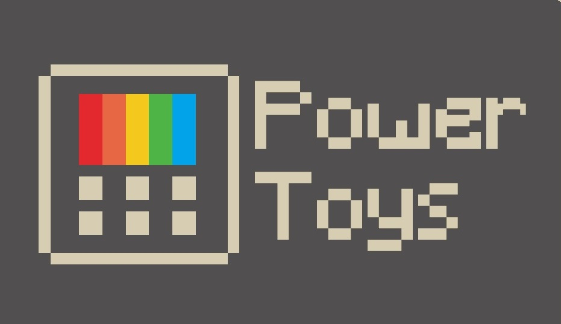
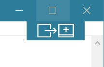

# Overview

PowerToys is a set of utilities for power users to tune and streamline their Windows expereince for greater productivity.  

The first preview of these utilities and corresponding source code will be released Summer 2019.

# What's Happening

The first two utilities we're working on are:

1. Maximize to new desktop widget - The MTND widget shows a pop-up button when a user hovers over the maximize / restore button on any window.  Clicking it creates a new desktop, sends the app to that desktop and maximizes the app on the new desktop.

2. Windows key shortcut guide - The shortcut guide appears when a user holds the Windows key down for more than one second and shows the available shortcuts for the current state of the desktop.

# Backlog

Here's the current set of utilities we're considering.  Please use issues and +1's to guide the project to suugest new ideas and help us prioritize th list below.

1. Full window manager including specific layouts for docking and undocking laptops
2. Keyboard shortcut manager
3. Win+R replacement
4. Better alt+tab including browser tab integration and search for running apps
5. Battery tracker
6. Batch file re-namer
6. Quick resolution swaps in taskbar
8. Mouse events without focus
9. Cmd (or PS or Bash) from here
10. Contents menu file browsing

# Contributing

This project welcomes contributions and suggestions.  Most contributions require you to agree to a
Contributor License Agreement (CLA) declaring that you have the right to, and actually do, grant us
the rights to use your contribution. For details, visit https://cla.microsoft.com.

When you submit a pull request, a CLA-bot will automatically determine whether you need to provide
a CLA and decorate the PR appropriately (e.g., label, comment). Simply follow the instructions
provided by the bot. You will only need to do this once across all repos using our CLA.

This project has adopted the [Microsoft Open Source Code of Conduct](https://opensource.microsoft.com/codeofconduct/).
For more information see the [Code of Conduct FAQ](https://opensource.microsoft.com/codeofconduct/faq/) or
contact [opencode@microsoft.com](mailto:opencode@microsoft.com) with any additional questions or comments.
