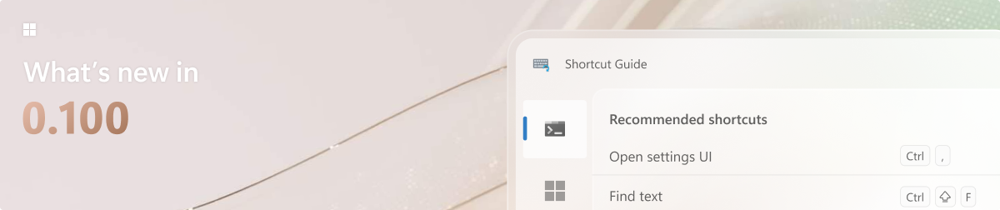

<p align="center">
    <picture>
      <source media="(prefers-color-scheme: light)" srcset="./doc/images/readme/pt-hero.light.png" />
      
  </picture>
</p>
<h1 align="center">
  <span>Microsoft PowerToys</span>
</h1>
<p align="center">
  <span align="center">Microsoft PowerToys is a collection of utilities that help you customize Windows and streamline everyday tasks.</span>
</p>
<h3 align="center">
  <a href="#-installation">Installation</a>
  <span> · </span>
  <a href="https://aka.ms/powertoys-docs">Documentation</a>
  <span> · </span>
  <a href="https://aka.ms/powertoys-releaseblog">Blog</a>
  <span> · </span>
  <a href="#-whats-new">Release notes</a>
</h3>
<br/><br/>

## 🔨 Utilities

PowerToys includes over 25 utilities to help you customize and optimize your Windows experience:

|   |   |   |
|---|---|---|
| [ Advanced Paste](https://aka.ms/PowerToysOverview_AdvancedPaste) | [ Always on Top](https://aka.ms/PowerToysOverview_AoT) | [ Awake](https://aka.ms/PowerToysOverview_Awake) |
| [ Color Picker](https://aka.ms/PowerToysOverview_ColorPicker) | [ Command Not Found](https://aka.ms/PowerToysOverview_CmdNotFound) | [ Command Palette](https://aka.ms/PowerToysOverview_CmdPal) |
| [ Crop And Lock](https://aka.ms/PowerToysOverview_CropAndLock) | [ Environment Variables](https://aka.ms/PowerToysOverview_EnvironmentVariables) | [ FancyZones](https://aka.ms/PowerToysOverview_FancyZones) |
| [ File Explorer Add-ons](https://aka.ms/PowerToysOverview_FileExplorerAddOns) | [ File Locksmith](https://aka.ms/PowerToysOverview_FileLocksmith) | [ Hosts File Editor](https://aka.ms/PowerToysOverview_HostsFileEditor) |
| [ Image Resizer](https://aka.ms/PowerToysOverview_ImageResizer) | [ Keyboard Manager](https://aka.ms/PowerToysOverview_KeyboardManager) | [ Light Switch](https://aka.ms/PowerToysOverview_LightSwitch) |
| [ Mouse Utilities](https://aka.ms/PowerToysOverview_MouseUtilities) | [ Mouse Without Borders](https://aka.ms/PowerToysOverview_MouseWithoutBorders) | [ New+](https://aka.ms/PowerToysOverview_NewPlus) |
| [ Peek](https://aka.ms/PowerToysOverview_Peek) | [ PowerRename](https://aka.ms/PowerToysOverview_PowerRename) | [ PowerToys Run](https://aka.ms/PowerToysOverview_PowerToysRun) |
| [ Quick Accent](https://aka.ms/PowerToysOverview_QuickAccent) | [ Registry Preview](https://aka.ms/PowerToysOverview_RegistryPreview) | [ Screen Ruler](https://aka.ms/PowerToysOverview_ScreenRuler) |
| [ Shortcut Guide](https://aka.ms/PowerToysOverview_ShortcutGuide) | [ Text Extractor](https://aka.ms/PowerToysOverview_TextExtractor) | [ Workspaces](https://aka.ms/PowerToysOverview_Workspaces) |
| [ ZoomIt](https://aka.ms/PowerToysOverview_ZoomIt) |   |   |


## 📋 Installation

For detailed installation instructions and system requirements, visit the [installation docs](https://learn.microsoft.com/windows/powertoys/install). 

But to get started quickly, choose one of the installation methods below:
<br/><br/>
<details open>
<summary><strong>Download .exe from GitHub</strong></summary>
<br/>
Go to the <a href="https://aka.ms/installPowerToys">PowerToys GitHub releases</a>, click Assets to reveal the downloads, and choose the installer that matches your architecture and install scope. For most devices, that's the x64 per-user installer.

<!-- items that need to be updated release to release -->
[github-next-release-work]: https://github.com/microsoft/PowerToys/issues?q=is%3Aissue+milestone%3A%22PowerToys+0.99%22
[github-current-release-work]: https://github.com/microsoft/PowerToys/issues?q=is%3Aissue+milestone%3A%22PowerToys+0.98%22
[ptUserX64]: https://github.com/microsoft/PowerToys/releases/download/v0.98.0/PowerToysUserSetup-0.98.0-x64.exe
[ptUserArm64]: https://github.com/microsoft/PowerToys/releases/download/v0.98.0/PowerToysUserSetup-0.98.0-arm64.exe 
[ptMachineX64]: https://github.com/microsoft/PowerToys/releases/download/v0.98.0/PowerToysSetup-0.98.0-x64.exe 
[ptMachineArm64]: https://github.com/microsoft/PowerToys/releases/download/v0.98.0/PowerToysSetup-0.98.0-arm64.exe
 
|  Description   | Filename |
|----------------|----------|
| Per user - x64       | [PowerToysUserSetup-0.98.0-x64.exe][ptUserX64] |
| Per user - ARM64     | [PowerToysUserSetup-0.98.0-arm64.exe][ptUserArm64] |
| Machine wide - x64   | [PowerToysSetup-0.98.0-x64.exe][ptMachineX64] |
| Machine wide - ARM64 | [PowerToysSetup-0.98.0-arm64.exe][ptMachineArm64] |

</details>

<details>
<summary><strong>Microsoft Store</strong></summary>
<br/>
You can easily install PowerToys from the Microsoft Store:
<p>
  <a style="text-decoration:none" href="https://aka.ms/getPowertoys">
    <picture>
      <source media="(prefers-color-scheme: light)" srcset="doc/images/readme/StoreBadge-dark.png" width="148" />
      
  </picture></a>
</p>
</details>

<details>
<summary><strong>WinGet</strong></summary>
<br/>
Download PowerToys from <a href="https://github.com/microsoft/winget-cli#installing-the-client">WinGet</a>. Updating PowerToys via winget will respect the current PowerToys installation scope. To install PowerToys, run the following command from the command line / PowerShell:

*User scope installer [default]*
```powershell
winget install Microsoft.PowerToys -s winget
```

*Machine-wide scope installer*
```powershell
winget install --scope machine Microsoft.PowerToys -s winget
```
</details>

<details>
<summary><strong>Other methods</strong></summary>
<br/>
There are <a href="https://learn.microsoft.com/windows/powertoys/install#community-driven-install-tools">community driven install methods</a> such as Chocolatey and Scoop. If these are your preferred install solutions, you can find the install instructions there.
</details>

## ✨ What's new?

[](https://github.com/microsoft/PowerToys/releases)

To see what's new, check out the [release notes]().

## 🛣️ Roadmap 
We are planning some nice new features and improvements for the next releases – PowerDisplay, Command Palette improvements and a brand-new Shortcut Guide experience! Stay tuned for [v0.99][github-next-release-work]!

## ❤️ PowerToys Community 
The PowerToys team is extremely grateful to have the [support of an amazing active community][community-link]. The work you do is incredibly important. PowerToys wouldn't be nearly what it is today without your help filing bugs, updating documentation, guiding the design, or writing features. We want to say thank you and take time to recognize your work. Your contributions and feedback improve PowerToys month after month!

## Contributing 
This project welcomes contributions of all types. Besides coding features / bug fixes, other ways to assist include spec writing, design, documentation, and finding bugs. We are excited to work with the power user community to build a set of tools for helping you get the most out of Windows. We ask that **before you start work on a feature that you would like to contribute**, please read our [Contributor's Guide](CONTRIBUTING.md). We would be happy to work with you to figure out the best approach, provide guidance and mentorship throughout feature development, and help avoid any wasted or duplicate effort. Most contributions require you to agree to a [Contributor License Agreement (CLA)][oss-CLA] declaring that you grant us the rights to use your contribution and that you have permission to do so. For guidance on developing for PowerToys, please read the [developer docs](./doc/devdocs) for a detailed breakdown. This includes how to setup your computer to compile. 

## Code of Conduct 
This project has adopted the [Microsoft Open Source Code of Conduct][oss-conduct-code]. 

## Privacy Statement 
The application logs basic diagnostic data (telemetry). For more privacy information and what we collect, see our [PowerToys Data and Privacy documentation](https://aka.ms/powertoys-data-and-privacy-documentation). 

[oss-CLA]: https://cla.opensource.microsoft.com 
[oss-conduct-code]: CODE_OF_CONDUCT.md 
[community-link]: COMMUNITY.md 
[github-release-link]: https://aka.ms/installPowerToys 
[microsoft-store-link]: https://aka.ms/getPowertoys 
[winget-link]: https://github.com/microsoft/winget-cli#installing-the-client 
[roadmap]: https://github.com/microsoft/PowerToys/wiki/Roadmap
[privacy-link]: http://go.microsoft.com/fwlink/?LinkId=521839 
[loc-bug]: https://github.com/microsoft/PowerToys/issues/new?assignees=&labels=&template=translation_issue.md&title= 
[usingPowerToys-docs-link]: https://aka.ms/powertoys-docs
