# Settings

## Overview

PowerToys runner provides a generic way for modules to define their settings.

Each module on startup is responsible for loading its own settings and initializing accordingly. When the user wants to edit settings, the runner will call [`get_config()`](/src/modules/interface#get_config) module method. The module must provide a JSON which includes the module name, description but also what settings options are provided. 

When settings from all modules are collected, a separate [settings editor app](/src/settings) is spawned. The editor wraps [an React app](/src/settings-web) and handles the communication with the runner.

When loaded, the React app receives the JSON generated by the runner. When user saves the settings, the editor passes the new settings values as JSON string to the runner. Runner in turn will call [`set_config()`](/src/modules/interface#set_config) for all modules with appropriate JSON. When user initiates a custom action (like the Zone Editor in FancyZones), the runner will call [`call_custom_action()`](/src/modules/interface#call_custom_action) providing the action name in a JSON.

There are C++ helper functions in [/src/common/settings_objects.h](/src/common/settings_objects.h) and [/src/common/settings_helpers.h](/src/common/settings_helpers.h). Those include classes for creating the settings options JSON and ones for parsing the incoming settings JSON.

### Module settings
The value returned by the [`get_config()`](/src/modules/interface#get_config) call should provide a JSON object with following fields:
  * `name` - The name of the PowerToy. Used on the nav panel on the left.
  * `version` - The settings version. Needs to be set to `"1.0"`.
  * `description` - Description of the PowerToy module.
  * `overview_link`, `video_link` - Optional links to the documentation and video preview of the PowerToy module.
  * `icon_key` - Name of the icon of the PowerToy. The SVGs for the icons are located in [/src/settings-web/src/svg](/src/settings-web/src/svg). They also need to be added in [/settings-web/src/setup_icons.tsx](/settings-web/src/setup_icons.tsx).
  * `properties` - Optional object that contains the definition of the settings screen.

The `properties` JSON object defines what settings controls are available to the user. Each key defines one control. The controls have some common properties:
  * The key in the `properties` which identifies the control.
  * `editor_type` - Defines the type of the control. Those are listed further.
  * `order` - Defines the order of the elements on the settings screen.

Each `editor_type` has its own set of properties.

Example module JSON (taken from Shortcut Guide):
```json
{
    "name": "Shortcut Guide",
    "version": "1.0",
    "description": "Shows a help overlay with Windows shortcuts when the Windows key is pressed.",
    "overview_link": "https://github.com/.../README.md",
    "icon_key": "pt-shortcut-guide",
    "properties": {
        "press_time": {
            "editor_type": "int_spinner",
            "order": 1,
            "display_name": "How long to press the Windows key before showing the Shortcut Guide (ms)",
            "value": 900,
            "min": 100,
            "max": 10000,
            "step": 100
        },
        "overlay_opacity": {
            "editor_type": "int_spinner",
            "order": 2,
            "display_name": "Opacity of the Shortcut Guide's overlay background (%)",
            "value": 90,
            "min": 0,
            "max": 100,
            "step": 1
        },
        "theme":{
            "editor_type": "choice_group",
            "order": 3,
            "display_name": "Choose Shortcut Guide overlay color",
            "value": "system",
            "options": [ {"key": "system", "text": "System default app mode"},
                         {"key": "light", "text": "Light"},
                         {"key": "dark", "text": "Dark"} ]
        }
    }
}
```
produces this settings screen:
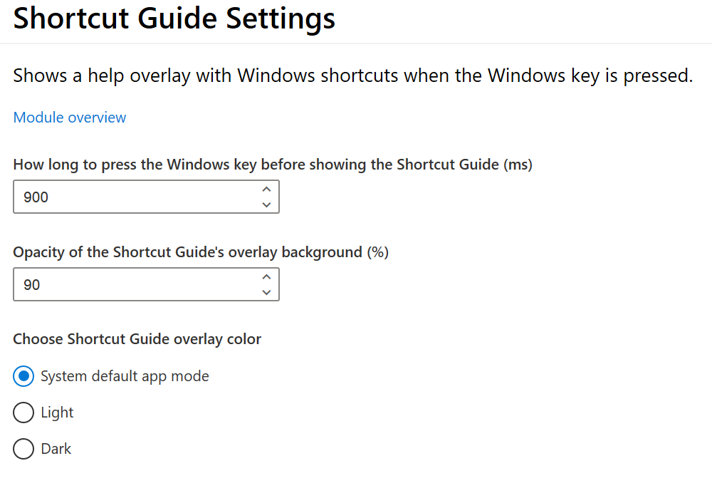

### Helper methods

PowerToys provides [a helper class](/src/common/json.h) to parse and generate JSON strings.

In [`settings_helpers.h`](/src/common/settings_helpers.h) there are two helper functions: `load_module_settings(powertoy_name)` and `save_general_settings(settings)` for loading and saving the module configuration.

In [`settings_objects.h`](/src/common/settings_objects.h) there are some helper classes:
  * `Settings` - for generating JSON with module settings definition.
  * `PowerToyValues` - for parsing JSON with settings - either loaded from file or from the settings editor.
  * `CustomActionObject` and `HotkeyObject` - for parsing custom actions and hotkey input specific JSON.

### General settings
General settings control the PowerToys runner and decide which modules are enabled and which are not. The general settings screen is special - while modules provide the definition of the settings controls, the available settings on the general screen are hardcoded.

General settings has following properties:
  * `enabled` - Enabled/disabled status of each PowerToy.
  * `startup` - Should PowerToys start at user logon.
  * `theme` - Settings editor theme - `light`, `dark` or `system`.
  * `system_theme` - Current Windows theme - `light` or `dark`.
  * `powertoys_version` - The version of the PowerToys.

This JSON:
```json
{
    "enabled": {
        "FancyZones": true,
        "PowerRename": true,
        "Shortcut Guide": true
    },
    "startup": true,
    "theme": "light",
    "system_theme": "dark",
    "powertoys_version": "0.14.2.0"
}
```
Produces this general settings screen:

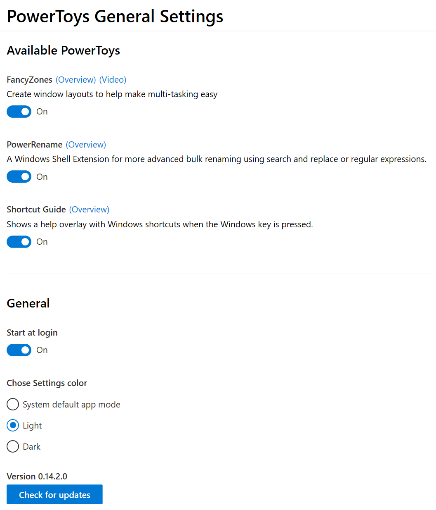

## Putting it all together
The runner combines general settings and each module settings into a single JSON that is passed to the settings editor. Example combined settings look like this:

```json
{
    "general": {
        "enabled": {
            "FancyZones": true,
            "PowerRename": true,
            "Shortcut Guide": true
        },
        "startup": true,
        "theme": "light",
        "system_theme": "dark",
        "powertoys_version": "0.14.2.0"
    },
    "powertoys": {
        "FancyZones": { ... }, 
        "PowerRename": { ... },
        "Shortcut Guide":{
            "name": "Shortcut Guide",
            "version": "1.0",
            "description": "Shows a help overlay with Windows shortcuts when the Windows key is pressed.",
            "overview_link": "https://github.com/.../README.md",
            "icon_key": "pt-shortcut-guide",
            "properties": { ... }
        }
    }
}
```

## C++ helpers
While you can generate and parse JSON yourself there are helper methods provided.

### Loading settings
When a PowerToy module is created, it should load its configuration. This can be done by calling
```c++
json::JsonObject PTSettingsHelper::load_module_settings(std::wstring_view powertoy_name);
```
declared in [`settings_helpers.h`](/src/common/settings_helpers.h). The function will return an `json::JsonObject` object containing the module settings. 

Another option is using [`PowerToySettings::PowerToyValues`](/src/common/settings_objects.h#L67) class. A static method
```c++
PowerToyValues PowerToyValues::load_from_settings_file(std::wstring_view powertoy_name);
```
will load and parse the settings. You can also use
```c++
PowerToyValues PowerToyValues::from_json_string(std::wstring_view json);
```
to parse JSON string - for example when implementing [`set_config()`](/src/modules/interface#set_config). The returned `PowerToyValues` object has helper methods that return `std::optional` with values, for example:
```c++
auto settings = PowerToyValues::load_from_settings_file(L"some_powertoy");
std::optional<std::wstring> str_prop = settings.get_string_value(L"some_string_property");
auto int_prop = settings.get_int_value(L"some_int_property");
```

### Generating settings screen
The [`PowerToySettings::Settings`](/src/common/settings_objects.h) can be used to generate settings:
```c++
// Need to get strings from the resource file.
extern "C" IMAGE_DOS_HEADER __ImageBase;

auto hinstance = reinterpret_cast<HINSTANCE>(&__ImageBase);
PowerToysSettings::Settings settings(hinstance, L"example_powertoy");
settings.set_description(L"Example powertoy.");
settings.set_overview_link(L"https://example.com");
settings.set_icon_key(L"pt-example");
settings.add_string(L"string_val", L"Example string label", L"example value");
settings.add_int_spinner(L"int_val", L"Example int label", 0, 0, 100, 10);
``` 
You can then use `std::wstring serialize()` or `bool serialize_to_buffer(wchar_t* buffer, int* uffer_size)` methods to generate output JSON string.

### Saving settings
Use 
```c++
void PTSettingsHelper::save_module_settings(std::wstring_view powertoy_name, json::JsonObject& settings);
```
declared in [`settings_helpers.h`](/src/common/settings_helpers.h).

## Module settings elements

### Bool toggle
```c++
add_bool_toogle(name, description, value) 
```
A simple on-off toggle. Parameters:
  * `name` - Key for the element in the JSON.
  * `description` - String or resource ID of the text displayed to the user.
  * `value` - Initial state of the toggle (`true` - on, `false` - off).

This C++:
```c++
settings.add_bool_toogle(L"bool_name", L"description", true);
```
produces this settings element:

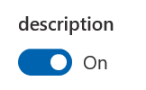

and this generated JSON:
```json
{
    "properties": {
        "bool_name": {
            "editor_type": "bool_toggle",
            "order": autoincremented_number,
            "display_name": "description",
            "value": true
        }
    }
}
```

The toggle value is stored as bool:
```c++
std::optional<bool> bool_value = settings.get_bool_value(L"bool_name");
```

### Int Spinner
```c++
add_int_spinner(name, description, value, min, max, step)
```
Numeric input with dials to increment and decrement the value. Parameters:
  * `name` - Key for element in the JSON.
  * `description` - String or resource ID of the text displayed to the user.
  * `value` - Initial control value.
  * `min`, `max` - Minimum and maximum values for the input. User cannot use dials to move beyond those values, if a value out of range is inserted using the keyboard, it will get clamped to the allowed range.
  * `step` - How much the dials change the value.

This C++:
```c++
settings.add_int_spinner(L"int_spinner_name", L"description", 50, -100, 100, 10);
```
produces this settings element:

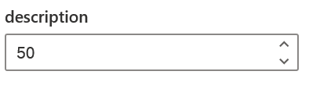

and this generated JSON:
```json
{
    "properties": {
        "int_spinner_name": {
            "editor_type": "int_spinner",
            "order": autoincremented_number,
            "display_name": "description",
            "value": 50,
            "min": -100,
            "max": 100,
            "step": 10
        }
    }
}
```

The spinner value is stored as int:
```c++
std::optional<int> int_value = settings.get_int_value(L"int_spinner_name");
```

### String
```c++
add_string(name, description, value) 
```
Single line text input. Parameters:
  * `name` - Key for element in the JSON.
  * `description` - String or resource ID of the text displayed to the user.
  * `value` - Default value for the input.

This C++:
```c++
settings.add_string(L"string_name", L"description", L"value");
```
produces this settings element:

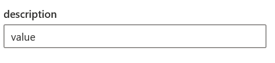

and this generated JSON:
```json
{
    "properties": {
        "string_name": {
            "editor_type": "string_text",
            "order": autoincremented_number,
            "display_name": "description",
            "value": "value"
        }
    }
}
```

The input value is stored as `std::wstring`:
```c++
std::optional<std::wstring> string_value = settings.get_string_value(L"string_name");
```

### Multiline string
```c++
add_multiline_string(name, description, value)
```
Multiline text input. Parameters:
  * `name` - Key for element in the JSON.
  * `description` - String or resource ID of the text displayed to the user.
  * `value` - Default value for the input. Can have multiple lines.

This C++:
```c++
settings.add_multiline_string(L"multiline_name", L"description", L"multiline1\nmultiline2");
```
produces this settings element:

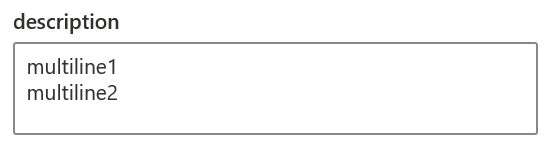

and this generated JSON:
```json
{
    "properties": {
        "multiline_name": {
            "editor_type": "string_text",
            "multiline": true,
            "order": autoincremented_number,
            "display_name": "description",
            "value": "multiline1\nmultiline2"
        }
    }
}
```

The input value is stored as string:
```c++
std::optional<std::wstring> value = settings.get_string_value(L"multiline_name");
```

### Color picker
```c++
add_color_picker(name, description, value)
```

Allows user to pick a color. Parameters:
  * `name` - Key for element in the JSON.
  * `description` - String or resource ID of the text displayed to the user.
  * `value` - Initial color, as a string in `"#RRGGBB"` format.

This C++:
```c++
settings.add_color_picker(L"colorpicker_name", L"description", L"#102040");
```
produces this settings element:

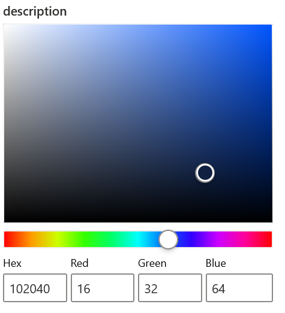

and this generated JSON:
```json
{
    "properties": {
        "colorpicker_name": {
            "editor_type": "color_picker",
            "order": autoincremented_number,
            "display_name": "description",
            "value": "#102040"
        }
    }
}
```

The color picker value is stored as `std::wstring`:
```c++
std::optional<std::wstring> value = settings.get_string_value(L"colorpicker_name");
```

### Hotkey
```c++
settings.add_hotkey(name, description, hotkey)
```
Input for capturing hotkeys. Parameters:
  * `name` - Key for element in the JSON.
  * `description` - String or resource ID of the text displayed to the user.
  * `hotkey` - Instance of `PowerToysSettings::HotkeyObject` class.

You can create `PowerToysSettings::HotkeyObject` object either by using helper `from_settings` static method or by providing JSON object to `from_json` static method:

The `PowerToysSettings::HotkeyObject::from_settings` take following parameters:
  * `win_pressed` - Is the WinKey pressed.
  * `ctrl_pressed` - Is the Ctrl key pressed.
  * `alt_pressed` - Is the Alt key pressed.
  * `shift_pressed` - Is the Shift key pressed.
  * `vk_code` - The [virtual key-code](https://docs.microsoft.com/en-us/windows/win32/inputdev/virtual-key-codes) of the key.

The displayed key is deduced from the `vk_code` using the users keyboard layout and language settings.

Similar parameters can be passed using the `from_json` static method:
```c++
json::JsonObject json;
json.SetNamedValue(L"win", json::value(win_pressed)); 
json.SetNamedValue(L"ctrl", json::value(ctrl_pressed));
json.SetNamedValue(L"alt", json::value(alt_pressed));
json.SetNamedValue(L"shift", json::value(shift_pressed));
json.SetNamedValue(L"code", json::value(vk_code));
json.SetNamedValue(L"key", json::value(L"string with key name"));
auto hotkey = PowerToysSettings::HotkeyObject::from_json(json);
```

  
This C++:
```c++
settings.add_hotkey(L"hotkey_name",
                    L"description",
                    PowerToysSettings::HotkeyObject::from_settings(true, true, true, true, VK_F5));
```
produces this settings element:

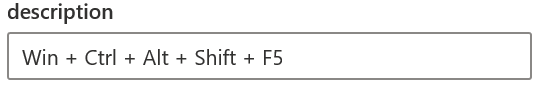

and this generated JSON (`114` is the value of `VK_F5`):
```json
{
    "properties": {
        "hotkey_name": {
            "editor_type": "hotkey",
            "order": autoincremented_number,
            "display_name": "description",
            "value": {
                "win": true,
                "ctrl": true,
                "alt": true,
                "shift": true,
                "code": 114,
                "key": "F5"
            }
        }
    }
}
```

The hotkey value is returned as JSON, with the same format as `from_json` method uses. You can use `HotkeyObject` class to parse this JSON, since it offers some helper methods. A typical example of registering a hotkey:
```c++
std::optional<json::JsonObject> value = settings.get_json_value(L"hotkey_name");
if (value) {
    auto hotkey = PowerToysSettings::HotkeyObject::from_json(*value);
    RegisterHotKey(hwnd, 1, hotkey.get_modifiers(), hotkey.get_code());
}
```

### Choice group
```c++
add_choice_group(name, description, value, vector<pair<wstring, wstring>> keys_and_texts)
add_choice_group(name, description, value, vector<pair<wstring, UINT>> keys_and_texts)
```

A radio buttons group. Parameters:
  * `name` - Key for element in the JSON.
  * `description` - String or resource ID of the text displayed to the user.
  * `value` - Key selected by default.
  * `keys_and_text` - Vector of radio buttons definitions: key and the displayed label. The texts can either be strings or resource IDs.

This C++:
```c++
settings.add_choice_group(L"choice_group_name", L"description", L"val1", { { L"val1", L"value-1" },
                                                                           { L"val2", L"value-2" },
                                                                           { L"val3", L"value-3" } });
```
produces this settings element:

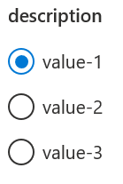

and this generated JSON:
```json
{
    "properties": {
        "choice_group_name": {
            "editor_type": "choice_group",
            "order": autoincremented_number,
            "display_name": "description",
            "value": "val1",
            "options": [ {"key": "val1", "text": "value-1"},
                         {"key": "val2", "text": "value-2"},
                         {"key": "val3", "text": "value-3"} ]
            }
        }
    }
}
```

The chosen button value is stored as a string with the key of the button selected by the user:
```c++
std::optional<std::wstring> value = settings.get_string_value(L"choice_group_name");
```

### Dropdown
```c++
add_dropdown(name, description, value, vector<pair<wstring, wstring>> keys_and_texts)
add_dropdown(name, description, value, vector<pair<wstring, UINT>> keys_and_texts)
```

A dropdown. Parameters:
  * `name` - Key for element in the JSON.
  * `description` - String or resource ID of the text displayed to the user.
  * `value` - Key selected by default.
  * `keys_and_text` - Vector of the options definitions: key and the displayed label. The texts can either be strings or resource IDs.

This C++:
```c++
settings.add_dropdown(L"dropdown_name", L"description", L"val2", { { L"val1", L"value-1" },
                                                                   { L"val2", L"value-2" },
                                                                   { L"val3", L"value-3" } });
```
produces this settings element:

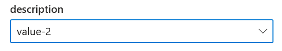
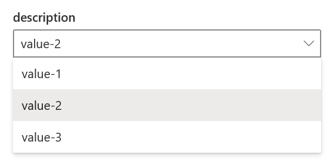

and this generated JSON:
```json
{
    "properties": {
        "dropdown_name": {
            "editor_type": "dropdown",
            "order": autoincremented_number,
            "display_name": "description",
            "value": "val1",
            "options": [ {"key": "val1", "text": "value-1"},
                         {"key": "val2", "text": "value-2"},
                         {"key": "val3", "text": "value-3"} ]
            }
        }
    }
}
```

The chosen value is stored as a string with the key of the option selected by the user:
```c++
std::optional<std::wstring> value = settings.get_string_value(L"dropdown_name");
```
### Custom action

```c++
add_custom_action(name, description, button_text, ext_description)
```

Adds a button with a description. Parameters:
  * `name` - Key for element in the JSON.
  * `description` - String or resource ID of the text displayed to the user.
  * `button_text` - String or resource ID for the button label.
  * `ext_description` - String or resource ID for the extended description.

This C++:
```c++
settings.add_custom_action(L"custom_action_name", L"description", L"button_text", L"ext_description");
```
produces this settings element:

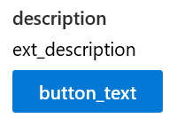

and this generated JSON:
```json
{
    "properties": {
        "custom_action_name": {
            "editor_type": "custom_action",
            "order": autoincremented_number,
            "display_name": "description",
            "button_text": "button_text",
            "value": "ext_description"
        }
    }
}
```

When the button is pressed, the `call_custom_action` method of the module will be called, with JSON containing the name of the action. In our example:
```json
{ 
    "action_name":"custom_action_name",
    "value":"ext_description"
}
```
