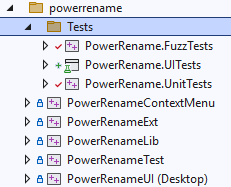

# UI tests framework

 A specialized UI test framework for PowerToys that makes it easy to write UI tests for PowerToys modules or settings. Let's start writing UI tests!

## Before running tests  

- Install Windows Application Driver v1.2.1 from https://github.com/microsoft/WinAppDriver/releases/tag/v1.2.1 to the default directory (`C:\Program Files (x86)\Windows Application Driver`)

- Enable Developer Mode in Windows settings

## Running tests

- Exit PowerToys if it's running.

- Open `PowerToys.sln` in Visual Studio and build the solution.

- Run tests in the Test Explorer (`Test > Test Explorer` or `Ctrl+E, T`).

## Running tests in pipeline

The PowerToys UI test pipeline provides flexible options for building and testing:

### Pipeline Options

- **buildSource**: Select the build type for testing:
  - `latestMainOfficialBuild`: Downloads and uses the latest official PowerToys build from main branch
  - `buildNow`: Builds PowerToys from current source code and uses it for testing
  - `specificBuildId`: Downloads a specific PowerToys build using the build ID specified in `specificBuildId` parameter

  **Default value**: `latestMainOfficialBuild`

- **specificBuildId**: When `buildSource` is set to `specificBuildId`, specify the exact PowerToys build ID to download and test against.

  **Default value**: `"xxxx"` (placeholder, enter actual build ID when using specificBuildId option)
  
  **When to use this**:
  - Testing against a specific known build for reproducibility
  - Regression testing against a particular build version
  - Validating fixes in a specific build before release
  
  **Usage**: Enter the build ID number (e.g., `12345`) to download that specific build. Only used when `buildSource` is set to `specificBuildId`.

- **uiTestModules**: Specify which UI test modules to build and run. This parameter controls both the `.csproj` projects to build and the `.dll` test assemblies to execute. Examples:
  - `['UITests-FancyZones']` - Only FancyZones UI tests
  - `['MouseUtils.UITests']` - Only MouseUtils UI tests
  - `['UITests-FancyZones', 'MouseUtils.UITests']` - Multiple specific modules
  - Leave empty to build and run all UI test modules

  **Important**: The `uiTestModules` parameter values must match both the test project names (for `.csproj` selection during build) and the test assembly names (for `.dll` execution during testing).

### Build Modes

1. **Official Build Testing** (`buildSource = latestMainOfficialBuild` or `specificBuildId`)
   - Downloads and installs official PowerToys build (latest from main or specific build ID)
   - Builds only UI test projects (all or specific based on `uiTestModules`)
   - Runs UI tests against installed PowerToys
   - Tests both machine-level and per-user installation modes automatically

2. **Current Source Build Testing** (`buildSource = buildNow`)
   - Builds entire PowerToys solution from current source code
   - Builds UI test projects (all or specific based on `uiTestModules`)
   - Runs UI tests against freshly built PowerToys
   - Uses artifacts from current pipeline build

> **Note**: All modes support the `uiTestModules` parameter to control which specific UI test modules to build and run. Both machine-level and per-user installation modes are tested automatically when using official builds.

### Pipeline Access
- Pipeline: https://microsoft.visualstudio.com/Dart/_build?definitionId=161438&_a=summary

## How to add the first UI tests for your modules
- Follow the naming convention: 
- Create a new project and add the following references to the project file. Change the OutputPath to your own module's path.
  ```
    <Project Sdk="Microsoft.NET.Sdk">
    <!-- Look at Directory.Build.props in root for common stuff as well -->
    <Import Project="..\..\..\Common.Dotnet.CsWinRT.props" />

    <PropertyGroup>
        <ProjectGuid>{4E0AE3A4-2EE0-44D7-A2D0-8769977254A0}</ProjectGuid>
        <RootNamespace>PowerToys.Hosts.UITests</RootNamespace>
        <AssemblyName>PowerToys.Hosts.UITests</AssemblyName>
        <IsPackable>false</IsPackable>
        <IsTestProject>true</IsTestProject>
        <Nullable>enable</Nullable>
        <OutputType>Library</OutputType>

        <!-- This is a UI test, so don't run as part of MSBuild -->
        <RunVSTest>false</RunVSTest>
        </PropertyGroup>
        <PropertyGroup>
        <OutputPath>$(SolutionDir)$(Platform)\$(Configuration)\tests\Hosts.UITests\</OutputPath>
        </PropertyGroup>

        <ItemGroup>
        <PackageReference Include="MSTest" />
        <ProjectReference Include="..\..\..\common\UITestAutomation\UITestAutomation.csproj" />
        </ItemGroup>
    </Project>

  ```
- Inherit your test class from UITestBase.
  >Set Scope: The default scope starts from the PowerToys settings UI. If you want to start from your own module, set the constructor as shown below:
  
  >Specify Scope:
  ```
    [TestClass]
    public class HostModuleTests : UITestBase
    {
        public HostModuleTests()
            : base(PowerToysModule.Hosts, WindowSize.Small_Vertical)
        {
        }
    }
  ```

- Then you can start performing the UI operations.

**Example**
```
[TestMethod("Hosts.Basic.EmptyViewShouldWork")]
[TestCategory("Hosts File Editor #4")]
public void TestEmptyView()
{
    this.CloseWarningDialog();
    this.RemoveAllEntries();

    // 'Add an entry' button (only show-up when list is empty) should be visible
    Assert.IsTrue(this.HasOne<HyperlinkButton>("Add an entry"), "'Add an entry' button should be visible in the empty view");

    VisualAssert.AreEqual(this.TestContext, this.Find("Entries"), "EmptyView");

    // Click 'Add an entry' from empty-view for adding Host override rule
    this.Find<HyperlinkButton>("Add an entry").Click();

    this.AddEntry("192.168.0.1", "localhost", false, false);

    // Should have one row now and not more empty view
    Assert.IsTrue(this.Has<Button>("Delete"), "Should have one row now");
    Assert.IsFalse(this.Has<HyperlinkButton>("Add an entry"), "'Add an entry' button should be invisible if not empty view");

    VisualAssert.AreEqual(this.TestContext, this.Find("Entries"), "NonEmptyView");
}
```

## Extra tools and information

 **Accessibility Tools**:
While working on tests, you may need a tool that helps you to view the element's accessibility data, e.g. for finding the button to click. For this purpose, you could use [AccessibilityInsights](https://accessibilityinsights.io/docs/windows/overview).
