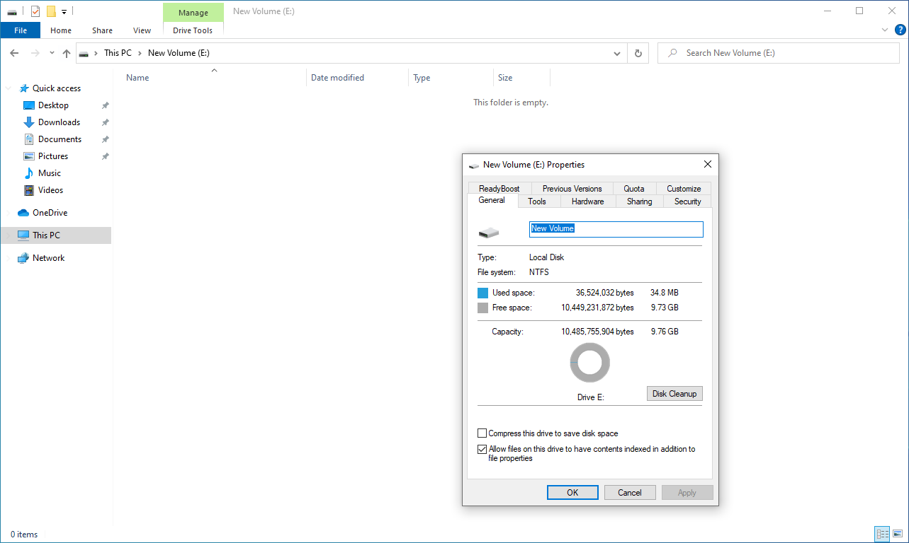
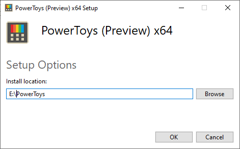
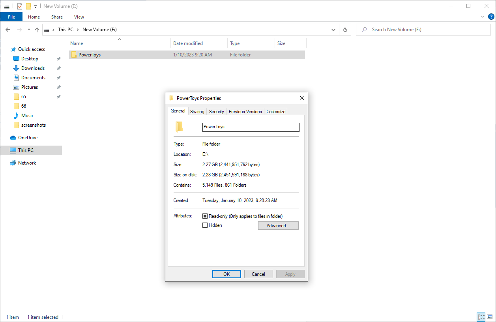
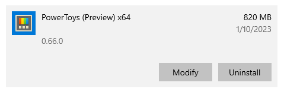
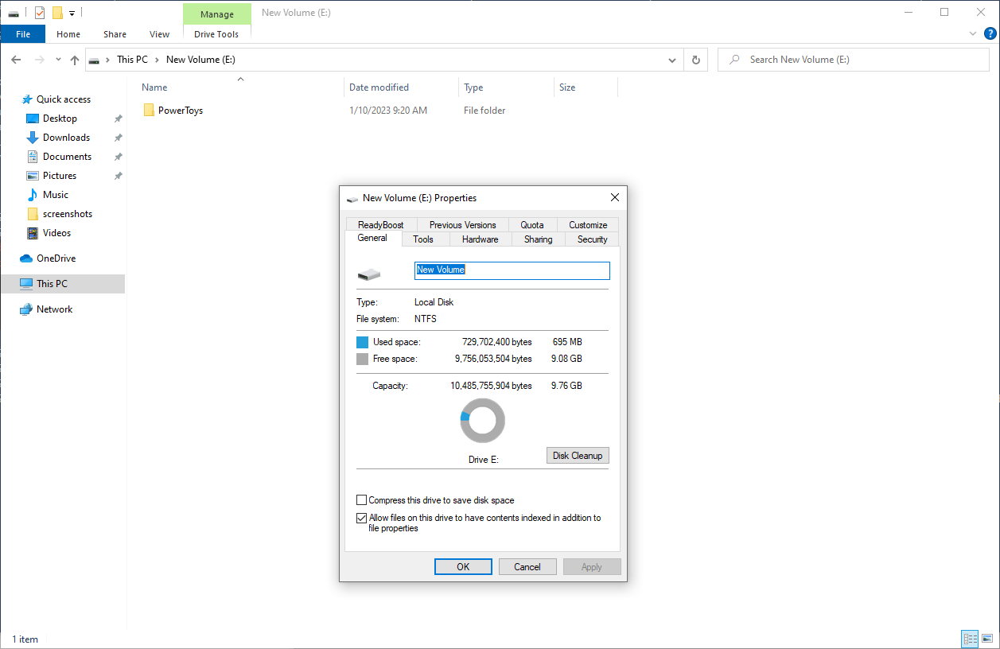
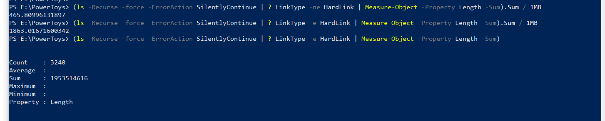

# PowerToys disk usage footprint overview

As of the v0.66 of PowerToys, core runtime dlls are being shipped self-contained as a part of PowerToys. During the installation process, hard-links are being created for every module that needs any of these shared libraries.

## Why do this work?

Our main motivations for doing are the following:

1. Be able to install PowerToys without UAC elevation
2. PowerToys has a reduced disk space when components are shared.
3. Reduce additional downloads for dependencies

## Current self-contained runtimes 

These dll's are installed in `<PowerToysInstallDir>/dll/<Item>` folder structure.

- [Windows Application SDK runtime](https://learn.microsoft.com/windows/apps/windows-app-sdk/downloads)
- [.NET Desktop Runtime 7](https://dotnet.microsoft.com/download/dotnet/7.0)
- [Microsoft Visual C++ Runtime](https://learn.microsoft.com/cpp/windows/latest-supported-vc-redist?view=msvc-170)

## So why does PowerToys have a larger footprint now?

Before the hard-link work was done, each of these runtimes had to be installed, so there were more items being installed outside just the PowerToys install directory. This space would not have been accounted.

File Explorer treats hard-links the same as "original"/regular files/directories (https://learn.microsoft.com/troubleshoot/windows-server/backup-and-storage/disk-space-problems-on-ntfs-volumes#other-ntfs-features-that-may-cause-file-allocation-confusion), not as links. This results in File Explorer reporting size of PowerToys installation directory bigger than it is (more than 2GB). 

## How much space is actually being used

As of v0.66 of PowerToys, the installed footprint is ~660MB. 

When we were prototyping and validating, here was our running table of results and why we took the route we did.

| Moment | Installer size | App size | Installation dir size | Real size | Deps downloaded and installed during PT install | Total (installer size + real size + deps downloaded and installed during PT install) |
|---|---|---|---|---|---|---|
| v0.62.0.1<br/>no deps self-contained | 125  MB | 817  MB | 529  MB | 534  MB | 418  MB | 1,077  MB |
| v0.63.0<br/>WAS and VCRedist | 83  MB | 587  MB | 567  MB | 396  MB | 394  MB | 873  MB |
| v0.63.0<br/>WAS1.2preview and VCRedist| 80  MB | 574  MB | 539  MB | 385  MB | 394  MB | 859  MB |
| Full Test<br/>WAS, VCRedist, .NET | 149  MB | 705  MB | 1,760  MB | 557  MB | 0 MB | 706  MB |

## Our process to verify current install footprint

We created a quick virtual machine.  We chose to use our fresh Windows 10 test virtual machines here.

### Empty disk details



### Install PowerToys to empty disk



### PowerToys installation directory size shown by File Explorer

As mentioned above, File Explorer shows size of PowerToys installation dir as every hard-link is a regular file for itself



### PowerToys size shown by App->Installed apps



### Disk usage with PowerToys installed

Real disk usage of PowerToys is shown by inspecting disk usage after installing PowerToys. Used space is now 695MB, comparing to ~35MB used space for empty disk gives us the size of ~660MB for PowerToys installation dir.



### PowerShell command calculating size of non-hardlinks files

Size of regular files (non-hard-links) and hard-links can also be obtained by running following PowerShell command in PowerToys installation dir:

```
Regular files:
ls -Recurse -File -force -ErrorAction SilentlyContinue | ? LinkType -ne HardLink | Measure-Object -Property Length -Sum

Hard-links
ls -Recurse -File -force -ErrorAction SilentlyContinue | ? LinkType -e HardLink | Measure-Object -Property Length -Sum
```

Running these commands for PowerToys v0.66 shows that size of regular files is way less than size of hard-links pointing to some of those regular files because PowerShell (same as File Explorer) also takes the size of hard-links as of regular files.


