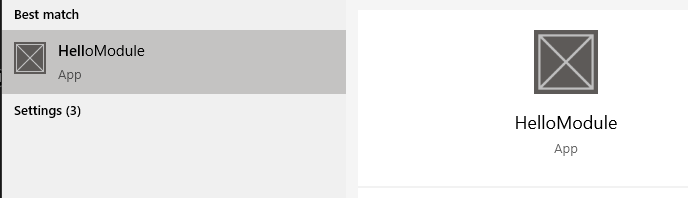
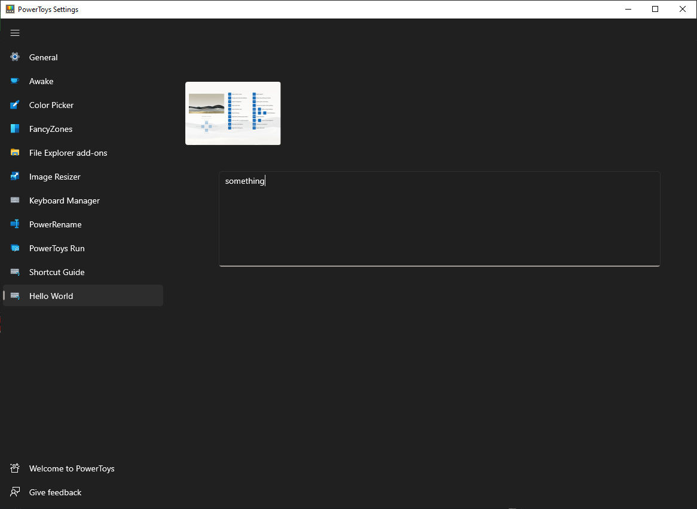
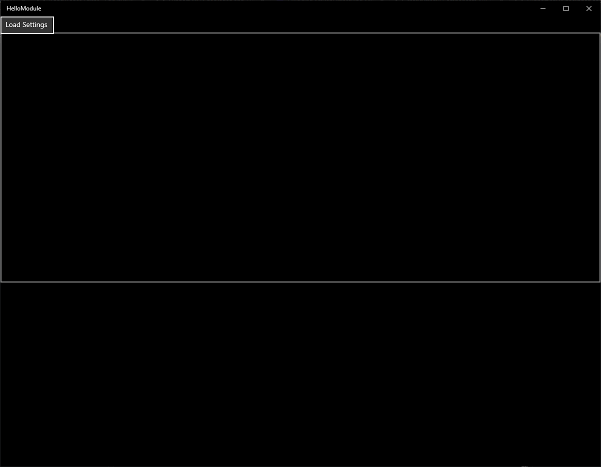
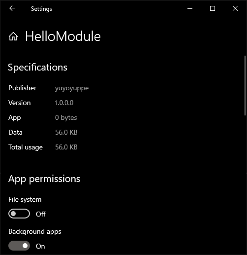
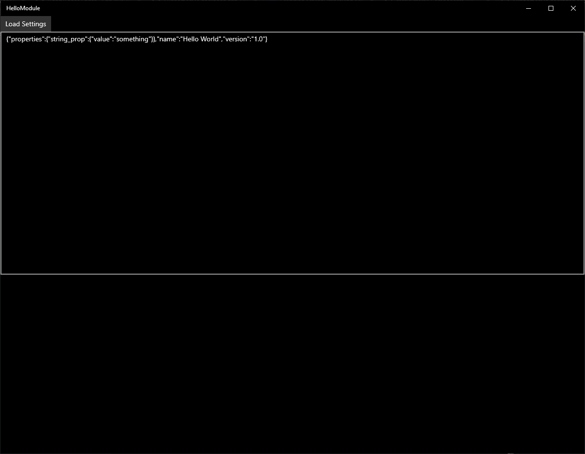

# How to integrate new MSIX module with PowerToys Settings and WiX installer
[`issue_11705_with_example` branch](https://github.com/microsoft/PowerToys/tree/issue_11705_with_example) contains HelloWorld UWP C# MSIX application which reads its module settings and is installed along PowerToys.

## Steps
- uncomment everything near "TODO: Use to activate embedded MSIX" comments
- build PowerToys solution
- deploy HelloModule module and sign it with a self-signed certificate (don't forget to put it into a trusted store)
- build PowerToysSetup solution and install it

Type HelloModule into start search and observe that it was installed:

Open PowerToys settings and change the stub setting to something:

Open HelloModule:

First time you press "Load Settings", it'll detect that it doesn't have permissions to access local file system and open its system settings window, toggle it there:

(it's a known uwp limitation, see https://stackoverflow.com/a/53533414/657390)

HelloModule will close then, restart it, press "Load Settings" and you should see that the application was able to load the setting string which was set by the settings app:

