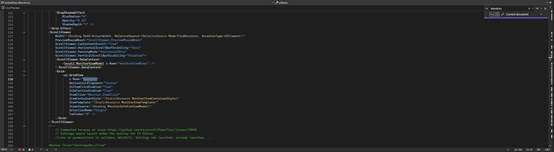
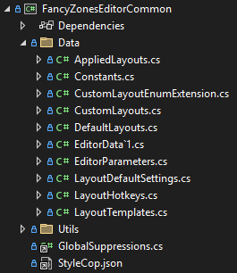

# FancyZones

[Public overview - Microsoft Learn](https://learn.microsoft.com/en-us/windows/powertoys/fancyzones)

## Quick Links

[All Issues](https://github.com/microsoft/PowerToys/issues?q=is%3Aopen%20label%3AProduct-FancyZones)<br>
[Bugs](https://github.com/microsoft/PowerToys/issues?q=is%3Aopen%20label%3AIssue-Bug%20label%3AProduct-FancyZones)<br>
[Pull Requests](https://github.com/microsoft/PowerToys/pulls?q=is%3Apr+is%3Aopen+label%3AProduct-FancyZones)

## Overview

FancyZones is a window manager utility that allows users to create custom layouts for organizing windows on their screen.

## Architecture Overview

FancyZones consists of several interconnected components:

### Directory Structure
- **src**: Contains the source code for FancyZones.
  - **Editor**: Code for the zone editor.
  - **Runner**: Code for the zone management and window snapping.
  - **Settings**: Code for managing user settings.
- **tests**: Contains unit and integration tests for FancyZones and UI test code.

### Project Structure
FancyZones is divided into several projects:

- **FancyZones**: Used for thread starting and module initialization.
- **FancyZonesLib**: Contains the main backend logic, called by FancyZones (via COM).
  - **FancyZonesData** folder: Contains classes and utilities for managing FancyZones data.
- **FancyZonesEditor**: Main UI implementation for creating and editing layouts.
- **FancyZonesEditorCommon**: Stores editor's data and provides shared functionality.
- **FancyZonesModuleInterface**: Interface layer between FancyZones and the PowerToys Runner.

### Interface Layer: FancyZonesModuleInterface
- Exposes interface between FancyZones and the Runner
- Handles communication and configuration exchange
- Contains minimal code, most logic implemented in other modules

### UI Layer: FancyZonesEditor and FancyZonesEditorCommon
- **FancyZonesEditor**: Main UI implementation with MainWindow.xaml as entry point
- **FancyZonesEditorCommon**: Provides data structures and I/O helpers for the Editor
- Acts as a visual config editor for layout configuration


### Backend Implementation: FancyZones and FancyZonesLib
- **FancyZonesLib**: Core logic implementation
  - All drag-and-drop behavior
  - Layout UI during dragging (generated in C++ via WorkArea.cpp, NewZonesOverlayWindow function)
  - Core data structures
- **FancyZones**: Wrapper around FancyZonesLib

### Data Flow
- User interactions with the Editor are saved in the Settings
- The Runner reads the Settings to apply the zones and manage window positions
- Editor sends update events, which trigger FancyZones to refresh memory data

## Key Files

### FancyZones and FancyZonesLib Projects

- **FancyZonesApp.h/cpp**:
  - **FancyZonesApp Class**: Initializes and manages the FancyZones application.
  - **Constructor**: Initializes DPI awareness, sets up event hooks, creates the FancyZones instance.
  - **Destructor**: Cleans up resources, destroys the FancyZones instance, unhooks event hooks.
  - **Run Method**: Starts the FancyZones application.
  - **InitHooks Method**: Sets up Windows event hooks to monitor system events.
  - **DisableModule Method**: Posts a quit message to the main thread.
  - **HandleWinHookEvent/HandleKeyboardHookEvent Methods**: Handle Windows event hooks.

- **Data Management Files**:
  - **AppliedLayouts.h/cpp**: Manages applied layouts for different monitors and virtual desktops.
  - **AppZoneHistory.h/cpp**: Tracks history of app zones.
  - **CustomLayouts.h/cpp**: Handles user-created layouts.
  - **DefaultLayouts.h/cpp**: Manages default layouts for different monitor configurations.
  - **LayoutHotkeys.h/cpp**: Manages hotkeys for switching layouts.
  - **LayoutTemplates.h/cpp**: Handles layout templates.

- **Core Functionality**:
  - **FancyZonesDataTypes.h**: Defines data types used throughout FancyZones.
  - **FancyZonesWindowProcessing.h/cpp**: Processes window events like moving and resizing.
  - **FancyZonesWindowProperties.h/cpp**: Manages window properties like assigned zones.
  - **JsonHelpers.h/cpp**: Utilities for JSON serialization/deserialization.
  - **Layout.h/cpp**: Defines the Layout class for zone layout management.
  - **LayoutConfigurator.h/cpp**: Configures different layout types (grid, rows, columns).
  - **Settings.h/cpp**: Manages FancyZones module settings.

### FancyZonesEditor and FancyZonesEditorCommon Projects

- **UI Components**:
  - **MainWindow.xaml/cs**: Main window of the FancyZones Editor.
  - **EditorOverlay.xaml/cs**: Overlay window for editing zones.
  - **EditorSettings.xaml/cs**: Settings window for the FancyZones Editor.
  - **LayoutPreview.xaml/cs**: Provides layout preview.
  - **ZoneSettings.xaml/cs**: Manages individual zone settings.

- **Data Components**:
  - **EditorParameters.cs**: Parameters used by the FancyZones Editor.
  - **LayoutData.cs**: Manages data for individual layouts.
  - **LayoutHotkeys.cs**: Manages hotkeys for switching layouts.
  - **LayoutTemplates.cs**: Manages layout templates.
  - **Zone.cs**: Represents an individual zone.
  - **ZoneSet.cs**: Manages sets of zones within a layout.

## Configuration Management

### Configuration Files Location
- Path: `C:\Users\[username]\AppData\Local\Microsoft\PowerToys\FancyZones`
- Files:
  - EditorParameters
  - AppliedLayouts
  - CustomLayouts
  - DefaultLayouts
  - LayoutHotkeys
  - LayoutTemplates
  - AppZoneHistory

### Configuration Handling
- No central configuration handler
- Editor: Read/write handlers in FancyZonesEditorCommon project
- FancyZones: Read/write handlers in FancyZonesLib project
- Data synchronization: Editor sends update events, FancyZones refreshes memory data

## Window Management

### Monitor Detection and DPI Scaling
- Monitor detection handled in `FancyZones::MoveSizeUpdate` function
- DPI scaling: FancyZones retrieves window position without needing mouse DPI scaling info
- Window scaling uses system interface via `WindowMouseSnap::MoveSizeEnd()` function

### Zone Tracking
- Window-to-zone tracking implemented in `FancyZones::MoveSizeUpdate` function
- Maintains history of which windows belong to which zones

## Development History

- FancyZones was originally developed as a proof of concept
- Many configuration options were added based on community feedback after initial development
- Some options were added to address specific issues:
  - Options for child windows or pop-up windows
  - Some options were removed later
  - Community feedback led to more interactions being implemented

## Admin Mode Considerations

- FancyZones can't move admin windows unless running as admin
- By default, all utilities run as admin if PowerToys is running as admin

## Development Environment Setup

### Prerequisites
- Visual Studio 2022: Required for building and debugging
- Windows 10 SDK: Ensure the latest version is installed
- PowerToys Repository: Clone from GitHub

### Setup Steps
1. Clone the Repository:
   ```
   git clone https://github.com/microsoft/PowerToys.git
   ```
2. Open `PowerToys.slnx` in Visual Studio
3. Select the Release configuration and build the solution
4. If you encounter build errors, try deleting the x64 output folder and rebuild

## Getting Started with FancyZones Development

### Step 1: Familiarize with the Feature
- Use the feature to understand its functionality
- Read the official documentation: [PowerToys FancyZones utility for Windows](https://learn.microsoft.com/en-us/windows/powertoys/fancyzones)

### Step 2: Build and Debug
- Ensure you can successfully compile and debug the module
- First-time setup may require running the Editor through PowerToys Settings UI to initialize configuration files

### Step 3: Learn through Bug Fixes
- Examine existing bugs and feature requests to understand code structure
- Use debugging to trace code execution for specific features
- Examine UI test code to understand how features are tested

## Debugging

### Setup for Debugging
1. In Visual Studio 2022, set FancyZonesEditor as the startup project
2. Set breakpoints in the code where needed
3. Click Run to start debugging

### During Active Development
- You can perform breakpoint debugging to troubleshoot issues
- Attach to running processes if needed to debug the module in context

### Common Debugging Issues
- If encountering JSON errors on first run, launch the FancyZones Editor once through PowerToys Settings UI to initialize required configuration files
- For UI-related issues, use tools like AccessibilityInsights to inspect element properties

## Deployment and Release Process

### Deployment

#### Local Testing
1. Build the solution in Visual Studio
2. Run PowerToys.exe from the output directory

#### Packaging
- Use the MSIX packaging tool to create an installer
- Ensure all dependencies are included

### Release

#### Versioning
- Follow semantic versioning for releases

#### Release Notes
- Document all changes, fixes, and new features

#### Publishing
1. Create a new release on GitHub
2. Upload the installer and release notes

## Troubleshooting

### First Run JSON Error
**Error**: "The input does not contain any JSON tokens. Expected the input to start with a valid JSON token, when isFinalBlock is true. Path: $ | LineNumber: 0 | BytePositionInLine: 0."

**Solution**: Launch the FancyZones Editor once through PowerToys Settings UI. Running the Editor directly within the project will not initialize the required configuration files.

### Known Issues
- Potential undiscovered bugs related to data updates in the Editor
- Some automated tests pass in CI but fail on specific machines
- Complex testing requirements across different monitor configurations

## FancyZones UI Testing

UI tests are implemented using [Windows Application Driver](https://github.com/microsoft/WinAppDriver).

### Before running tests

  - Install Windows Application Driver v1.2.1 from https://github.com/microsoft/WinAppDriver/releases/tag/v1.2.1. 
  - Enable Developer Mode in Windows settings

### Running tests
  
  - Exit PowerToys if it's running
  - Run WinAppDriver.exe from the installation directory. Skip this step if installed in the default directory (`C:\Program Files (x86)\Windows Application Driver`); in this case, it'll be launched automatically during tests.
  - Open `PowerToys.slnx` in Visual Studio and build the solution.
  - Run tests in the Test Explorer (`Test > Test Explorer` or `Ctrl+E, T`). 

>Note: notifications or other application windows, that are shown above the window under test, can disrupt the testing process.

### UI Test Automation

FancyZones is currently undergoing a UI Test migration process to improve automated testing coverage. You can track the progress of this migration at:

[FancyZones UI Test Migration Progress](https://github.com/microsoft/PowerToys/blob/feature/UITestAutomation/src/modules/fancyzones/UITests-FancyZonesEditor/release-test-checklist.md)

### Testing Strategy

#### Unit Tests
- Build the unit test project
- Run using the Visual Studio Test Explorer (`Test > Test Explorer` or `Ctrl+E, T`)

#### Integration Tests
- Ensure the entire FancyZones module works as expected
- Test different window layouts and snapping behaviors

### Test Framework Structure

#### UI Test Requirements
All test cases require pre-configured user data and must reset this data before each test.

**Required User Data Files**:
- EditorParameters
- AppliedLayouts
- CustomLayouts
- DefaultLayouts
- LayoutHotkeys
- LayoutTemplates
- AppZoneHistory

#### Editor Test Suite

**ApplyLayoutTest.cs**
- Verifies layout application and selection per monitor
- Tests file updates and behavior under display switching
- Validates virtual desktop changes

**CopyLayoutTests.cs**
- Tests copying various layout types
- Validates UI and file correctness

**CreateLayoutTests.cs**
- Tests layout creation and cancellation
- Focuses on file correctness validation

**CustomLayoutsTests.cs**
- Tests user-created layout operations
- Covers renaming, highlight line changes, zone count changes

**DefaultLayoutsTest.cs**
- Validates default and user layout files

**DeleteLayoutTests.cs**
- Tests layout deletion across types
- Checks both UI and file updates

**EditLayoutTests.cs**
- Tests zone operations: add/delete/move/reset/split/merge

**FirstLaunchTest.cs**
- Verifies Editor launches correctly on first run

**LayoutHotkeysTests.cs**
- Tests hotkey configuration file correctness
- Note: Actual hotkey behavior tested in FancyZones backend

**TemplateLayoutsTests.cs**
- Tests operations on built-in layouts
- Covers renaming, highlight changes, zone count changes

#### FancyZones Backend Tests

**LayoutApplyHotKeyTests.cs**
- Focuses on hotkey-related functionality
- Tests actual hotkey behavior implementation

### UI Testing Tools

While working on tests, you may need tools to view element accessibility data:
- [AccessibilityInsights](https://accessibilityinsights.io/docs/windows/overview)
- [WinAppDriver UI Recorder](https://github.com/microsoft/WinAppDriver/wiki/WinAppDriver-UI-Recorder)

>Note: Close helper tools while running tests. Overlapping windows can affect test results.
2. FancyZones might have implemented certain screen resolution limits in the code that do not support such wide screens
3. User error — it can be seen that no layout has been applied to the screen, so it's normal that the far right is not displayed, as the user hasn't used the FancyZones feature
4. From the image, it appears the user is trying to maximize a game window, but some games may not support rendering windows at such high resolutions due to internal implementation

The **optimal solution** for this bug is to first comment on the user's usage issue. Let them correctly use the FancyZones feature before making further judgments. If the issue persists after proper usage, then investigate whether it's a code issue or a problem with the game itself.

To demonstrate a debugging example, I will assume it's a code issue, specifically an issue with the Editor. Please see the following debug process.

  

Let's first locate the corresponding code. Since the error is in the Editor, we'll start by checking the FancyZonesEditor shown in the image.


However, I currently don't know where the code for this specific UI element in the Editor is located.


We now have two approaches to find the exact code location.

**First approach:**

The main XAML page is usually named `App.xaml` or `MainWindow.xaml`. Let's start by locating these two files in the FancyZones Editor. Upon reviewing their contents, we find that `App.xaml` is primarily a wrapper file and doesn't contain much UI code. Therefore, it's highly likely that the UI code is located in `MainWindow.xaml`. In the preview of `MainWindow.xaml`, we can also see a rough outline of the UI elements.

By searching for "monitor", we found that only lines 82 and 338 contain the string "monitor".

Then, upon reviewing the code, we found that the line at 82 is part of a template. The UI element we're looking for is located within the code block around line 338.

**Second approach:**

We can use the **AccessibilityInsights** tool to inspect the specific information of the corresponding UI element.


However, the current UI element does not have an AutomationId. Let's check whether its parent or child nodes have an AutomationId value. (In fact, using ClassName could also help locate it, but elements with the same ClassName might be numerous, making AutomationId a more accurate option.)

We found that the parent node "List View" has an AutomationId value. Copy this value and search for it in the code.


**Accurately located at line 338.**

Now that we've found the code for the UI element, let's look at where the size data for this UI element comes from. First, the text of this `Text` element is bound within the `MonitorItemTemplate`. The name of this `Text` element is `ResolutionText`, and it binds to a data property named `Dimensions`.


Search for code related to `Dimensions` across all projects in FancyZones.


We found that this string corresponds to a variable. However, the return value differs in Debug mode, so let's first examine the logic in Release mode.

We found that the variable `ScreenBoundsWidth` is located in the constructor of `MonitorInfoModel`.


Then, by searching for `MonitorInfoModel`, we found that this class is instantiated in the constructor of the `MonitorViewModel` class.


The width and height of the monitor, which are crucial, are also assigned at this point. Let's continue by checking where the data in `App.Overlay.Monitors` is initialized.

My idea is to examine all references to the `Monitors` variable and identify the initialization point based on those references.


Finally, by tracing the `Add` function of `Monitors`, we found the `AddMonitor()` method. This method is only called by `ParseParams()`, which confirms that the data originates from there.
 However, by examining the context around the `AddMonitor()` function, we can see that the data comes from the `editor-parameters.json` file. Next, we will continue to investigate how this file is initialized and modified.


By searching, we found that the `editor-parameters.json` file has write functions in both the Editor and FancyZones projects.


**The display information is retrieved through the following call stack:**
 `UpdateWorkAreas()` → `IdentifyMonitors()` → `GetDisplays()` → `EnumDisplayDevicesW()`.

**How was the `UpdateWorkAreas()` function identified?**
 It was discovered by searching for `EditorParameters` and noticing that when the `save` function is called on `EditorParameters`, the parameter passed is `m_workAreaConfiguration`.


**Then, by checking the initialization location of the `m_workAreaConfiguration` variable, we found that it is initialized inside `UpdateWorkAreas`.**
 With this, we have successfully identified the source of the monitor resolution data displayed in the Editor's `Monitors` section.


### Step Four：

Familiarize yourself with the module code through the current tasks at hand.

Bug：[Issues · microsoftPowerToys](https://github.com/microsoft/PowerToys/issues?q=is%3Aissue%20state%3Aopen%20type%3ABug%20label%3AProduct-FancyZones)

UITest Code：

[Task 57329836: PowerToys UI Test FancyZone UI Test Override Windows Snap-1 - Boards](https://microsoft.visualstudio.com/OS/_workitems/edit/57329836/)

[Task 57329843: PowerToys UI Test FancyZone UI Test Override Windows Snap-2 - Boards](https://microsoft.visualstudio.com/OS/_workitems/edit/57329843/)

[Task 57329845: PowerToys UI Test FancyZone UI Test Override Windows Snap-3 - Boards](https://microsoft.visualstudio.com/OS/_workitems/edit/57329845/)

[Task 56940387: PowerToys UI Test FancyZone UI Test Override Windows Snap-4 - Boards](https://microsoft.visualstudio.com/OS/_workitems/edit/56940387/)

UI Test Check List:

PowerToys/doc/releases/tests-checklist-template.md at releaseChecklist · microsoft/PowerToys](https://github.com/microsoft/PowerToys/blob/releaseChecklist/doc/releases/tests-checklist-template.md)


## Q&A

- ### First Run FancyZones error


If you encounter this situation, you need to launch the FancyZones Editor once in the powertoys settings UI:


The reason is that running the Editor directly within the project will not initialize various configuration files.

- ### How are layouts stored and loaded? Is there a central configuration handler?

There is no central configuration handler. 

Editor read/write config data handler is in FancyZonesEditorCommon project.



FancyZones cpp project read/write config data handler is in FancyZonesLib project.


However, the files write and read those are C:\Users\“xxxxxx”\AppData\Local\Microsoft\PowerToys\FancyZones

You can think of the editor as a visual config editor, which is most of its functionality. Another feature is used to set the layout for the monitor displays.

When the Editor starts, it will load the config data, and when FancyZones starts, it will also load the config data. After the Editor updates the config data, it will send a data update event, and FancyZones will refresh the current data in memory upon receiving the event.


- ### Which parts of the code are responsible for monitor detection and DPI scaling?

About monitor detection you can find "FancyZones::MoveSizeUpdate" function. 

I believe that in the case without DPI scaling, FancyZones retrieves the window's position and does not need to know what the mouse's DPI scaling is like. If you are referring to window scaling, it is called through the system interface, and you can see the detailed code in "WindowMouseSnap::MoveSizeEnd()" function.

- ### How does FancyZones track which windows belong to which zones?

In "FancyZones::MoveSizeUpdate" function.

### Extra tools and information

**Test samples**: https://github.com/microsoft/WinAppDriver/tree/master/Samples

While working on tests, you may need a tool that helps you to view the element's accessibility data, e.g. for finding the button to click. For this purpose, you could use [AccessibilityInsights](https://accessibilityinsights.io/docs/windows/overview) or [WinAppDriver UI Recorder](https://github.com/microsoft/WinAppDriver/wiki/WinAppDriver-UI-Recorder).

>Note: close helper tools while running tests. Overlapping windows can affect test results.

