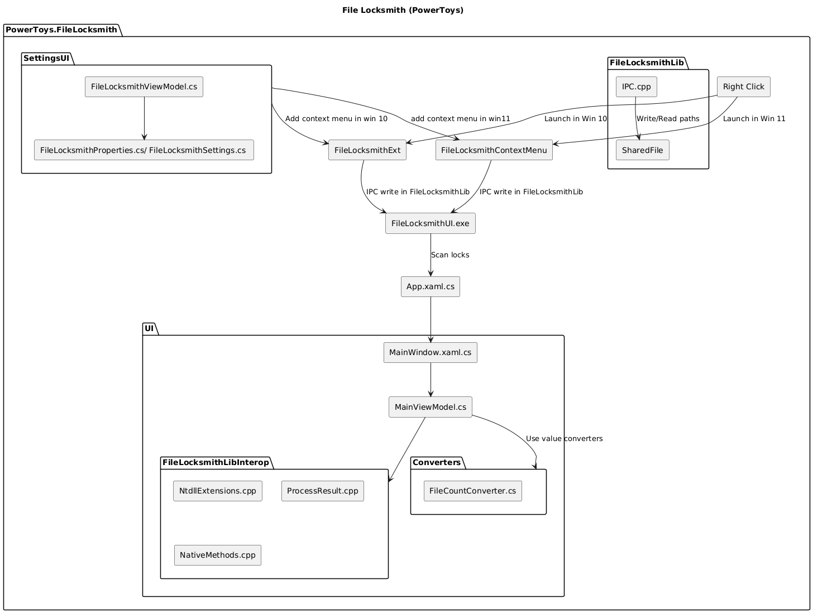
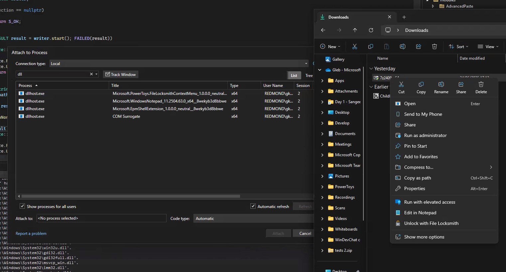

# File Locksmith

[Public overview - Microsoft Learn](https://learn.microsoft.com/en-us/windows/powertoys/file-locksmith)

## Quick Links

[All Issues](https://github.com/microsoft/PowerToys/issues?q=is%3Aopen%20label%3A%22Product-File%20Locksmith%22)<br>
[Bugs](https://github.com/microsoft/PowerToys/issues?q=is%3Aopen%20label%3A%22Product-File%20Locksmith%22%20label%3AIssue-Bug)<br>
[Pull Requests](https://github.com/microsoft/PowerToys/pulls?q=is%3Apr+is%3Aopen+label%3A%22Product-File+Locksmith%22)

## Overview

File Locksmith is a utility in PowerToys that shows which processes are locking or using a specific file. This helps users identify what's preventing them from deleting, moving, or modifying files by revealing the processes that have handles to those files.

## Architecture



File Locksmith follows a similar architecture to the ImageResizer and NewPlus modules. It consists of:

1. **Shell Extensions**:
   - `FileLocksmithExt` - COM-based shell extension for Windows 10 and below
   - `FileLocksmithContextMenu` - Shell extension for Windows 11 context menu

2. **Core Components**:
   - `FileLocksmithLib` - Handles IPC between shell extensions and UI
   - `FileLocksmithLibInterop` - Core functionality for finding processes locking files
   - `FileLocksmithUI` - WinUI 3 user interface component

3. **Settings Integration**:
   - Settings integration in the PowerToys settings application

## Implementation Details

### Shell Extensions

The module adds "Unlock with File Locksmith" to the context menu in File Explorer:

- For Windows 11, a context menu command is registered as a MSIX sparse package (compiled via appxmanifest.xml)
- For Windows 10 and below, a traditional shell extension is registered through registry keys during installation

### Process Communication Flow

1. User enables File Locksmith in PowerToys settings
2. User right-clicks on a file and selects "Unlock with File Locksmith"
3. The shell extension writes the selected file path to a temporary file (file-based IPC)
4. The shell extension launches `PowerToys.FileLocksmithUI.exe`
5. The UI reads the file path from the temporary file
6. The UI uses `FileLocksmithLibInterop` to scan for processes with handles to the file
7. Results are displayed in the UI, showing process information and allowing user action

### Core Functionality

The core functionality to find processes locking files is implemented in [FileLocksmith.cpp](/src/modules/FileLocksmith/FileLocksmithLibInterop/FileLocksmith.cpp), which:

- Uses low-level Windows APIs via `NtdllExtensions` to iterate through file handles
- Examines all running processes to find handles to the specified files
- Maps process IDs to the files they're locking
- Retrieves process information such as name, user context, and file paths

### User Interface

The UI is built with WinUI 3 and uses MVVM architecture:
- View models handle process data and user interactions
- Converters transform raw data into UI-friendly formats
- The interface shows which processes are locking files, along with icons and process details

## Code Structure

### Shell Extensions
- [ClassFactory.cpp](/src/modules/FileLocksmith/FileLocksmithExt/ClassFactory.cpp): COM class factory that creates instances of shell extension objects
- [ExplorerCommand.cpp](/src/modules/FileLocksmith/FileLocksmithExt/ExplorerCommand.cpp): Implements Windows Explorer context menu command for Windows 10 and below
- [PowerToysModule.cpp](/src/modules/FileLocksmith/FileLocksmithExt/PowerToysModule.cpp): PowerToys module interface implementation with settings management
- [dllmain.cpp](/src/modules/FileLocksmith/FileLocksmithExt/dllmain.cpp): DLL entry point for Windows 10 shell extension
- [dllmain.cpp](/src/modules/FileLocksmith/FileLocksmithContextMenu/dllmain.cpp): Windows 11 context menu integration through MSIX package

### Core Libraries
- [IPC.cpp](/src/modules/FileLocksmith/FileLocksmithLib/IPC.cpp): File-based inter-process communication between shell extensions and UI
- [Settings.cpp](/src/modules/FileLocksmith/FileLocksmithLib/Settings.cpp): Settings management for File Locksmith module
- [FileLocksmith.cpp](/src/modules/FileLocksmith/FileLocksmithLibInterop/FileLocksmith.cpp): Core process scanning implementation to find processes locking files
- [NativeMethods.cpp](/src/modules/FileLocksmith/FileLocksmithLibInterop/NativeMethods.cpp): Interop layer bridging native C++ with WinRT-based UI
- [NtdllBase.cpp](/src/modules/FileLocksmith/FileLocksmithLibInterop/NtdllBase.cpp): Interface to native Windows NT APIs
- [NtdllExtensions.cpp](/src/modules/FileLocksmith/FileLocksmithLibInterop/NtdllExtensions.cpp): Process and handle querying utilities using NtQuerySystemInformation
- [ProcessResult.cpp](/src/modules/FileLocksmith/FileLocksmithLibInterop/ProcessResult.cpp): Class for storing process information (name, PID, user, file list)

### UI Components
- [FileCountConverter.cs](/src/modules/FileLocksmith/FileLocksmithUI/Converters/FileCountConverter.cs): Converts file counts for UI display
- [FileListToDescriptionConverter.cs](/src/modules/FileLocksmith/FileLocksmithUI/Converters/FileListToDescriptionConverter.cs): Formats file lists for display
- [PidToIconConverter.cs](/src/modules/FileLocksmith/FileLocksmithUI/Converters/PidToIconConverter.cs): Extracts icons for processes
- [UserToSystemWarningVisibilityConverter.cs](/src/modules/FileLocksmith/FileLocksmithUI/Converters/UserToSystemWarningVisibilityConverter.cs): Shows warnings for system processes
- [MainWindow.xaml.cs](/src/modules/FileLocksmith/FileLocksmithUI/FileLocksmithXAML/MainWindow.xaml.cs): Main application window implementation
- [App.xaml.cs](/src/modules/FileLocksmith/FileLocksmithUI/FileLocksmithXAML/App.xaml.cs): Application entry point
- [ResourceLoaderInstance.cs](/src/modules/FileLocksmith/FileLocksmithUI/Helpers/ResourceLoaderInstance.cs): Localization resource helper
- [MainViewModel.cs](/src/modules/FileLocksmith/FileLocksmithUI/ViewModels/MainViewModel.cs): Main view model that handles loading processes asynchronously

### Settings Integration
- [FileLocksmithViewModel.cs](/src/settings-ui/Settings.UI/ViewModels/FileLocksmithViewModel.cs): ViewModel for File Locksmith in PowerToys settings
- [FileLocksmithLocalProperties.cs](/src/settings-ui/Settings.UI.Library/FileLocksmithLocalProperties.cs): Machine-level settings storage
- [FileLocksmithProperties.cs](/src/settings-ui/Settings.UI.Library/FileLocksmithProperties.cs): User-level settings storage
- [FileLocksmithSettings.cs](/src/settings-ui/Settings.UI.Library/FileLocksmithSettings.cs): Module settings definitions

## Debugging

To build and debug the File Locksmith module:

0. **Build FileLocksmith module**
   - Shutdown the existing release builds of PowerToys
   - Open the solution in Visual Studio
   - Build the entire solution
   - Build the `FileLocksmith` project

1. **Create certificate and import to Root (if you don't already have)**
   ```powershell
   New-SelfSignedCertificate -Subject "CN=Microsoft Corporation, O=Microsoft Corporation, L=Redmond, S=Washington, C=US" `
    -KeyUsage DigitalSignature `
    -Type CodeSigningCert `
    -FriendlyName "PowerToys SelfCodeSigning" `
    -CertStoreLocation "Cert:\CurrentUser\My"

   $cert = Get-ChildItem -Path Cert:\CurrentUser\My | Where-Object { $_.FriendlyName -like "*PowerToys*" }

   Export-Certificate -Cert $cert -FilePath "$env:TEMP\PowerToysCodeSigning.cer"

   # under admin Terminal:
   Import-Certificate -FilePath "$env:TEMP\PowerToysCodeSigning.cer" -CertStoreLocation Cert:\LocalMachine\Root

   # get Thumbprint
   Get-ChildItem -Path Cert:\CurrentUser\My | Where-Object { $_.FriendlyName -like "*PowerToys*" }
    ```

2. **Sign the MSIX package**
   ```
   SignTool sign /fd SHA256 /sha1 <CERTIFICATE THUMBPRINT> "C:\Users\$env:USERNAME\source\repos\PowerToys\x64\Debug\WinUI3Apps\FileLocksmithContextMenuPackage.msix"
   ```
   SignTool might be not in your PATH, so you may need to specify the full path to it, e.g., `C:\Program Files (x86)\Windows Kits\10\bin\<version>\x64\signtool.exe`.

   **commands example**:
   ```powershell
      PS C:\Users\developer> New-SelfSignedCertificate -Subject "CN=Microsoft Corporation, O=Microsoft Corporation, L=Redmond, S=Washington, C=US" `
      >>     -KeyUsage DigitalSignature `
      >>     -Type CodeSigningCert `
      >>     -FriendlyName "PowerToys SelfSigned" `
      >>     -CertStoreLocation "Cert:\CurrentUser\My"

         PSParentPath: Microsoft.PowerShell.Security\Certificate::CurrentUser\My

      Thumbprint                                Subject              EnhancedKeyUsageList
      ----------                                -------              --------------------
      1AA018C2B06B60EAFEE452ADE403306F39058FF5  CN=Microsoft Corpor… Code Signing

      PS C:\Users\developer> Get-ChildItem -Path Cert:\CurrentUser\My | Where-Object { $_.FriendlyName -like "*PowerToys*" }

         PSParentPath: Microsoft.PowerShell.Security\Certificate::CurrentUser\My

      Thumbprint                                Subject              EnhancedKeyUsageList
      ----------                                -------              --------------------
      1AA018C2B06B60EAFEE452ADE403306F39058FF5  CN=Microsoft Corpor… Code Signing

      PS C:\Users\developer> & "C:\Program Files (x86)\Windows Kits\10\bin\10.0.26100.0\x64\signtool.exe" sign /fd SHA256 /sha1 1AA018C2B06B60EAFEE452ADE403306F39058FF5 "%REPO_PATH%\PowerToys\x64\Debug\WinUI3Apps\FileLocksmithContextMenuPackage.msix"
      Done Adding Additional Store
      Successfully signed: C:\Users\developer\Develop\GitHub\PowerToys\x64\Debug\WinUI3Apps\FileLocksmithContextMenuPackage.msix
   ```

3. **Remove old version**
   ```powershell
   Get-AppxPackage -Name Microsoft.PowerToys.FileLocksmithContextMenu*
   Remove-AppxPackage Microsoft.PowerToys.FileLocksmithContextMenu_1.0.0.0_neutral__8wekyb3d8bbwe
   ```

4. **Install new signed MSIX**
   ```powershell
   Add-AppxPackage -Path "%REPO_PATH%\PowerToys\x64\Debug\WinUI3Apps\FileLocksmithContextMenuPackage.msix" -ExternalLocation "%REPO_PATH%\PowerToys\x64\Debug\WinUI3Apps"
   ```

5. **Restart Explorer**
   - Go to Task Manager and restart explorer.exe

6. **Debug Process**
   - Set the breakpoint in [dllmain.cpp](/src/modules/FileLocksmith/FileLocksmithContextMenu/dllmain.cpp#L116)
   - Open the **Attach to Process** dialog in Visual Studio
   - Right-click a file in File Explorer
   - Attach the debugger to `dllhost.exe` with **FileLocksmith** Title to debug the shell extension
   
   - Right-click (fast) a file again and select *"Unlock with File Locksmith"*
   - Attach the debugger to `PowerToys.FileLocksmithUI.exe` to debug the UI

7. **Alternative Debugging Method**
   - You can set the `FileLocksmithUI` as startup project directly in Visual Studio, which will launch the UI without needing to go through the shell extension. This is useful for debugging the UI logic without the shell extension overhead.

## Known Issues

There is an open PR to change the IPC mechanism from file-based to pipe-based, but it has blockers:
- When restarting as admin, the context menu extension doesn't show
- The "Unlock with File Locksmith" option doesn't work when launched as admin

## Settings Integration

File Locksmith integrates with the PowerToys settings through:
- [FileLocksmithViewModel.cs](/src/settings-ui/Settings.UI/ViewModels/FileLocksmithViewModel.cs)
- [FileLocksmithLocalProperties.cs](/src/settings-ui/Settings.UI.Library/FileLocksmithLocalProperties.cs)
- [FileLocksmithProperties.cs](/src/settings-ui/Settings.UI.Library/FileLocksmithProperties.cs)
- [FileLocksmithSettings.cs](/src/settings-ui/Settings.UI.Library/FileLocksmithSettings.cs)
