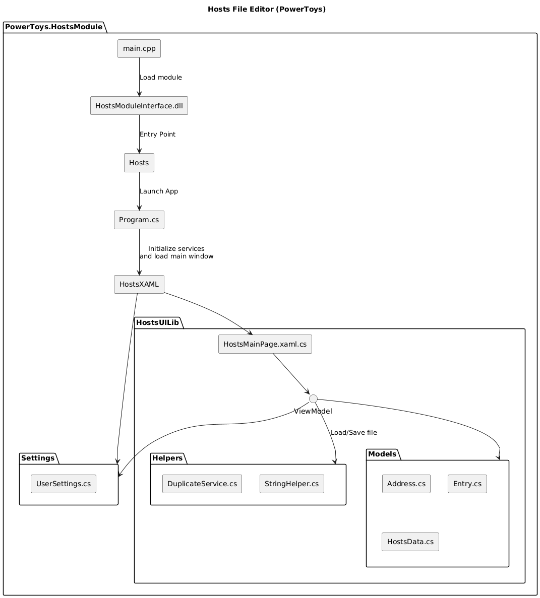

# Hosts File Editor

[Public overview - Microsoft Learn](https://learn.microsoft.com/en-us/windows/powertoys/hosts-file-editor)

## Quick Links

[All Issues](https://github.com/microsoft/PowerToys/issues?q=is%3Aopen%20label%3A%22Product-Hosts%20File%20Editor%22) 
[Bugs](https://github.com/microsoft/PowerToys/issues?q=is%3Aopen%20label%3A%22Product-Hosts%20File%20Editor%22%20label%3AIssue-Bug) 
[Pull Requests](https://github.com/microsoft/PowerToys/pulls?q=is%3Apr+is%3Aopen+label%3A%22Product-Hosts+File+Editor%22)

## Overview

The Hosts File Editor module provides a convenient way to edit the system's hosts file. The hosts file is a plain text file used by the operating system to map hostnames to IP addresses, allowing users to override DNS for specific domain names.

## Code Structure

The Hosts File Editor module is structured into three primary components:

1. **Hosts** - Entry point for the Hosts File Editor. Manages core services and settings through helper utilities.
2. **HostsModuleInterface** - Interface for integrating the Hosts module with the PowerToys system.
3. **HostsUILib** - Implements the UI layer using WinUI 3.

This structure is similar to the Environment Variables for Windows module.

## Key Components

### Main Entry Points

- **Module Entry**: [Program.cs](/src/modules/Hosts/Program.cs) → [App.xaml.cs](/src/modules/Hosts/HostsXAML/App.xaml.cs)
- **Settings UI**: 
  - Main Window: [MainWindow.xaml.cs](/src/modules/Hosts/Hosts/HostsXAML/MainWindow.xaml.cs)
  - View: [HostsMainPage.xaml](/src/modules/Hosts/HostsUILib/HostsMainPage.xaml)
  - ViewModel: [HostsMainPage.xaml.cs](/src/modules/Hosts/HostsUILib/HostsMainPage.xaml.cs)
- **Runner Integration**: [HostsModuleInterface](/src/modules/Hosts/HostsModuleInterface)

### Runner Integration

The module is loaded by the PowerToys runner from:
- [main.cpp](/src/runner/main.cpp) (Lines 183-184): Loads Hosts Module using `L"WinUI3Apps/PowerToys.HostsModuleInterface.dll"`

### Settings Management

- [HostsViewModel.cs](/src/settings-ui/Settings.UI/ViewModels/HostsViewModel.cs): Hosts UI in PowerToys settings
- [HostsProperties.cs](/src/settings-ui/Settings.UI.Library/HostsProperties.cs): In settings UI
- [HostsSettings.cs](/src/settings-ui/Settings.UI.Library/HostsSettings.cs): Wrapper with HostsProperties

### Module Components

#### HostsModuleInterface

- Defines the interface for integrating the Hosts module with the PowerToys system.

#### Hosts (Main Project)

- [Program.cs](/src/modules/Hosts/Hosts/Program.cs): Launch app
- [HostsXAML](/src/modules/Hosts/Hosts/HostsXAML): Initialize service and loads the main window
- [Host.cs](/src/modules/Hosts/Hosts/Helpers/Host.cs): Access to services register
- [NativeEventWaiter.cs](/src/modules/Hosts/Hosts/Helpers/NativeEventWaiter.cs): Gets the dispatcher queue for posting UI updates from a background thread
- [UserSettings.cs](/src/modules/Hosts/Hosts/Settings/UserSettings.cs): Manages reading, tracking, and updating user settings from settings.json

#### HostsUILib

- [HostsMainPage.xaml.cs](/src/modules/Hosts/HostsUILib/HostsMainPage.xaml.cs): Main page
- [ViewModels](/src/modules/Hosts/HostsUILib/ViewModels): Contains view models that manage state and logic
- [Models](/src/modules/Hosts/HostsUILib/Models): Models for managing host entries
  - [AddressType.cs](/src/modules/Hosts/HostsUILib/Models/AddressType.cs): Specifies whether an address is IPv4, IPv6, or Invalid
  - [Entry.cs](/src/modules/Hosts/HostsUILib/Models/Entry.cs): Represents a single hosts file entry (IP address, hostnames, comment, flags)
  - [HostsData.cs](/src/modules/Hosts/HostsUILib/Models/HostsData.cs): Converts the list of entries into a read-only collection
- [Settings](/src/modules/Hosts/HostsUILib/Settings): Settings configuration
- [Consts.cs](/src/modules/Hosts/HostsUILib/Consts.cs): Defines constants like max hosts IP length
- [Helpers](/src/modules/Hosts/HostsUILib/Helpers): Utilities for dealing with hosts IP, filter features, and file loading

## Call Flow

1. **Enable app**: runner/main.cpp → settings.ui/settings.ui.library
2. **Start app**: Program.cs → HostsXAML → HostsMainPage
3. **Load hosts data**: ViewModel → HostsData → Helpers (load and parse file)
4. **User edits**: UI bound to ViewModel updates entries
5. **Save changes**: ViewModel triggers file write through Helpers
6. **Settings management**: UserSettings.cs persists user preferences

## Key Features

| Feature | Key Function |
|---------|--------------|
| Adding a new entry | `Add(Entry entry)` |
| Filtering host file entries | `ApplyFilters()` |
| Open Hosts File | `ReadHosts()` |
| Additional Lines | `UpdateAdditionalLines(string lines)` |

## Settings

| Setting | Implementation |
|---------|---------------|
| Open as administrator | `UserSettings()` |
| Additional lines position | `UserSettings()->AdditionalLinesPosition` |
| Consider loopback addresses as duplicates | `UserSettings()->LoopbackDuplicates` |
| Encoding Setting | `UserSettings()->Encoding` |

## UI Test Automation

Hosts File Editor is currently undergoing a UI Test migration process to improve automated testing coverage. You can track the progress of this migration at:

[Hosts File Editor UI Test Migration Progress](https://github.com/microsoft/PowerToys/blob/feature/UITestAutomation/src/modules/Hosts/Hosts.UITests/Release-Test-Checklist-Migration-Progress.md)

## How to Build and Debug

1. Build PowerToys Project in debug mode
2. Set Hosts as the startup project
3. Launch Hosts File Editor in debug mode
4. Attach the debugger to PowerToys.Hosts.dll
5. Add breakpoints in the Hosts code
