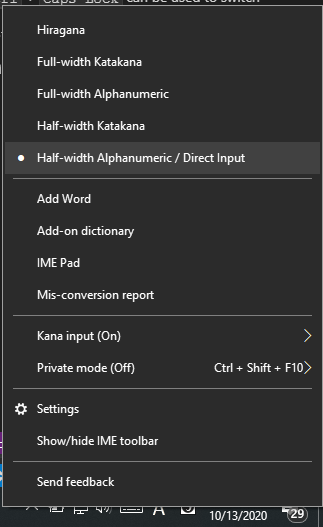

# Keyboard Manager module
This file contains the documentation for the KeyboardManager PowerToy module which is called by the runner.
## Table of Contents:
- [Keyboard Manager module](#keyboard-manager-module)
  - [Table of Contents:](#table-of-contents)
  - [Class members](#class-members)
  - [Enable/Disable](#enabledisable)
  - [Settings format](#settings-format)
  - [Loading settings](#loading-settings)
  - [Low level keyboard hook handler](#low-level-keyboard-hook-handler)
  - [HandleKeyboardHookEvent](#handlekeyboardhookevent)
  - [Custom Action to launch KBM UI](#custom-action-to-launch-kbm-ui)
  - [SendInput Special Scenarios](#sendinput-special-scenarios)
    - [Extended keys](#extended-keys)
    - [Scan code](#scan-code)
  - [Special Scenarios](#special-scenarios)
    - [Dummy key events](#dummy-key-events)
    - [Suppressing Num Lock in a keyboard hook](#suppressing-num-lock-in-a-keyboard-hook)
    - [Modifier-Caps Lock interaction on Japanese IME keyboards](#modifier-caps-lock-interaction-on-japanese-ime-keyboards)
    - [UIPI Issues (not resolved)](#uipi-issues-not-resolved)
  - [Other remapping approaches](#other-remapping-approaches)
    - [Registry approach](#registry-approach)
    - [Driver approach](#driver-approach)
  - [Telemetry](#telemetry)

## Class members
The `KeyboardManager` module has [3 main class members](https://github.com/microsoft/PowerToys/blob/b80578b1b9a4b24c9945bddac33c771204280107/src/modules/keyboardmanager/dll/dllmain.cpp#L54-L61):
- A static pointer to the current object of `KeyboardManager`. This is required for using the `KeyboardManager` object in the low level keyboard hook handler as that method must be static. This is described in more detail in [this section](#Low-level-keyboard-hook-handler).
- An object of type `Input`, which is used for all the operations that involving getting or setting keyboard states. This is wrapped in an object to allow testing the remapping methods.
- An object of type `KeyboardManagerState`. This object contains all the data related to remappings and is also used in the sense of a View Model as it used to communicate common data that is shared between the KBM UI and the backend. This class is described in more detail [here](keyboardmanagercommon.md#keyboardmanagerstate).

## Enable/Disable
On enabling KBM, the low level keyboard hook is started, and it is unhooked on disable. This is done to allow users to manually restart KBM if some other application which registers a keyboard hook was launched after PowerToys, so that it can be brought back to the highest priority hook (as the last hook to be registered receives the input first as mentioned [here](https://learn.microsoft.com/windows/win32/winmsg/about-hooks#hook-procedures)).

In addition to stopping the hook, any active KBM UI windows are also closed on disabling. This is done because the KBM UI uses the same keyboard hook for the Type button where you can type a key/shortcut, so if KBM is disabled the windows would not be completely functional.

The enable/disable code can be found [here](https://github.com/microsoft/PowerToys/blob/b80578b1b9a4b24c9945bddac33c771204280107/src/modules/keyboardmanager/dll/dllmain.cpp#L301-L322)

## Settings format
KBM uses two sets of settings files. 
- The main `settings.json` is of the following format:

        {
            "properties":
            {
                "activeConfiguration":
                {
                    "value":"default"
                },
                "keyboardConfigurations":
                {
                    "value":["default"]
                }
            },
            "name":"Keyboard Manager",
            "version":"1"
        }

    - The `activeConfiguration` attribute stores the current remapping profile, while `keyboardConfigurations` stores all the profiles that the user has. This was added to avoid any future breaking changes for the [profiles feature](https://github.com/microsoft/PowerToys/issues/1881), which would allow users to switch between remappings
- The profile format (`default.json`) is of the following format:

        {
            "remapKeys":
            {
                "inProcess":
                [
                    {
                        "originalKeys":"91",
                        "newRemapKeys":"162;70"
                    },
                    {
                        "originalKeys":"92",
                        "newRemapKeys":"162;70"
                    }
                ]
            },
            "remapShortcuts":
            {
                "global":
                [
                    {
                        "originalKeys":"164;37",
                        "newRemapKeys":"162;65"
                    },
                    {
                        "originalKeys":"162;68",
                        "newRemapKeys":"91"
                    }
                ],
                "appSpecific":
                [
                    {
                        "originalKeys":"91;162;65",
                        "newRemapKeys":"162;86",
                        "targetApp":"msedge"
                    }
                ]
            }
        }

    - `originalKeys` stores the key/shortcut which is to be pressed for the remap, and `newKeys` stores the key/shortcut which is to be executed.
    - Both contain semi-colon separated virtual key codes. For `remapKeys`, `originalKeys` must have only one key code, whereas for `remapShortcuts` it must have at least two key codes.
    - `inProcess` sub-key was added in `remapKeys` because there was a possibility of adding the registry based remapping approach (used by [SharpKeys](https://github.com/randyrants/sharpkeys)), so that would be under a separate sub-key while `inProcess` would be for keyboard hook based remaps. This was deprioritized as there weren't enough requests for it.
    - `remapShortcuts` is split into `global` and `appSpecific`, where `global` remaps would apply to all applications, whereas `appSpecific` would apply on when the `targetApp` is in focus. `targetApp` must be the process name of the app (with or without it's extension), e.g. `msedge` or `msedge.exe` for Microsoft Edge.

## Loading settings
KBM settings are loaded only on the C++ side only at start up, in the [constructor](https://github.com/microsoft/PowerToys/blob/b80578b1b9a4b24c9945bddac33c771204280107/src/modules/keyboardmanager/dll/dllmain.cpp#L67-L68). The settings file may get modified from the KBM UI on applying new remappings, but the file is not read again. The files are read from the PowerToys Settings process whenever a change is made to the file (using a FileWatcher) or whenever the KBM page is opened. The settings are updated only when the user presses the OK button from either of the Remap Keys or Remap Shortcuts windows. This is described in more detail [here](keyboardmanagerui.md#ok-and-cancel-button).

## Low level keyboard hook handler
Since the [`hook_proc`](https://github.com/microsoft/PowerToys/blob/b80578b1b9a4b24c9945bddac33c771204280107/src/modules/keyboardmanager/dll/dllmain.cpp#L330-L349) cannot be a member function in the class, this is declared `static` and a `static pointer` to the `KeyboardManager` project is used ([`keyboardmanager_object_ptr`](https://github.com/microsoft/PowerToys/blob/b80578b1b9a4b24c9945bddac33c771204280107/src/modules/keyboardmanager/dll/dllmain.cpp#L54-L55)).

As seen in the code for `hook_proc`, similar to other keyboard hooks in PowerToys it consists of a main method `HandleKeyboardHookEvent` which computes whether the key needs to be suppressed and accordingly returns 1 or calls the `CallNextHook` method.

`HandleKeyboardHookEvent` is covered in the [next section](#HandleKeyboardHookEvent). The `SetNumLockToPreviousState` code in the above snippet is required for a special scenario with keyboard input, which is covered in [this section](#Suppressing-Num-Lock-in-a-keyboard-hook).

## HandleKeyboardHookEvent
The [`HandleKeyboardHookEvent`](https://github.com/microsoft/PowerToys/blob/b80578b1b9a4b24c9945bddac33c771204280107/src/modules/keyboardmanager/dll/dllmain.cpp#L384-L458) is the method which calls the corresponding remapping methods in the required order. The following checks are executed in order:
- **`KeyboardManagerState.AreRemappingsEnabled`:** This returns false while the KBM remap tables are getting updated. If it is in this state, `HandleKeyboardHookEvent` returns `0`, i.e. the key event is not suppressed and is forwarded normally.
- **Check for `KEYBOARDMANAGER_SUPPRESS_FLAG`:** If the key event has the suppress flag, the method returns 1 to suppress the key event.
- **[`KeyboardManagerState.DetectSingleRemapKeyUIBackend`](https://github.com/microsoft/PowerToys/blob/b80578b1b9a4b24c9945bddac33c771204280107/src/modules/keyboardmanager/dll/dllmain.cpp#L399-L408):** This method is used for handling hook operations for the single key Type UI in the Remap keys window. If the Remap keys window is open, then `HandleKeyboardHookEvent` returns `0` and the key event is forwarded normally. If the left column Type button is clicked on the Remap keys window and the window is in focus, then the key event is suppressed and the UI is updated with the latest key from the recent key events. This method is described in more detail [here](keyboardmanagercommon.md#DetectSingleRemapKeyUIBackend-and-DetectShortcutUIBackend).
- **[`KeyboardManagerState.DetectShortcutUIBackend(data, true)`](https://github.com/microsoft/PowerToys/blob/b80578b1b9a4b24c9945bddac33c771204280107/src/modules/keyboardmanager/dll/dllmain.cpp#L410-L419):** This method is used for handling hook operations for the shortcut Type UI in the Remap keys window (when `isRemapKey` arg is `true`). If the Remap keys window is open, then `HandleKeyboardHookEvent` returns `0` and the key event is forwarded normally. If the right column Type button is clicked on the Remap keys window and the window is in focus, then the key event is suppressed and the UI is updated with the shortcut from the recent key events. This method is described in more detail [here](keyboardmanagercommon.md#DetectSingleRemapKeyUIBackend-and-DetectShortcutUIBackend).
- **`HandleSingleKeyRemapEvent`:** This method handles the single key remap logic. If a remapping takes place, the key event is suppressed. This method is described in more detail [here](keyboardeventhandlers.md#HandleSingleKeyRemapEvent).
- **[`KeyboardManagerState.DetectShortcutUIBackend(data, false)`](https://github.com/microsoft/PowerToys/blob/b80578b1b9a4b24c9945bddac33c771204280107/src/modules/keyboardmanager/dll/dllmain.cpp#L430-L439):** This method is used for handling hook operations for the shortcut Type UI in the Remap shortcuts window (when `isRemapKey` arg is `false`). If the Remap shortcuts window is open, then `HandleKeyboardHookEvent` returns `0` and the key event is forwarded normally. If the Type button is clicked on the Remap shortcuts window and the window is in focus, then the key event is suppressed and the UI is updated with the shortcut from the recent key events. **Since this is executed after the single key remap method, all single key remappings are applied when the user is on the Remap shortcuts window.**
- **`HandleAppSpecificShortcutRemapEvent`:** This method handles the app-specific shortcut remap logic. If a remapping takes place, the key event is suppressed. This method is described in more detail [here](keyboardeventhandlers.md#HandleAppSpecificShortcutRemapEvent). **Since this is executed after the single key remap method, single key remappings have precedence over shortcut remaps and are correspondingly reflected in shortcut remaps.**
- **`HandleOSLevelShortcutRemapEvent`:** This method handles the global shortcut remap logic. If a remapping takes place, the key event is suppressed. This method is described in more detail [here](keyboardeventhandlers.md#HandleOSLevelShortcutRemapEvent). The app-specific remap method is executed before this because if a shortcut is remapped to different keys/shortcuts for a particular app and globally, the app-specific variant should be preferred if that app is in focus. **Since this is executed after the single key remap method, single key remappings have precedence over shortcut remaps and are correspondingly reflected in shortcut remaps.**

**Note:** Single key remaps need to be executed before shortcut remaps, because otherwise there can be several logical issues. For example if a user has Ctrl remapped to X and Ctrl+A remapped to Y, we can't detect Ctrl+A because the moment Ctrl is pressed it would be remapped to X before the system ever sees Ctrl+A. This is why the design decision was made to separate Remap keys and Remap shortcuts, and all key remaps are reflected in the shortcut remaps.

## Custom Action to launch KBM UI
KBM uses the [`call_custom_action`](https://github.com/microsoft/PowerToys/blob/b80578b1b9a4b24c9945bddac33c771204280107/src/modules/keyboardmanager/dll/dllmain.cpp#L249-L280) method from the `PowertoyModuleIface` in order to launch the KBM UI when the user clicks the Remap a key or Remap a shortcut button from the KBM settings page. On clicking the button, we check if there is already any active KBM UI window, and if there is it is brought to the foreground. If not, the corresponding KBM UI window is launched on a separate detached thread. The UI is described in more detail [here](keyboardmanagerui.md).

## SendInput Special Scenarios

### Extended keys
Certain keys such as the arrow keys, <kbd>right Ctrl/Alt</kbd>, and <kbd>Del/Home/Ins</kbd>, etc need to be sent with the `KEYEVENTF_EXTENDEDKEY` flag because otherwise the NumPad versions get sent, which can cause weird behavior when NumLock is on. The code can be found [here](https://github.com/microsoft/PowerToys/blob/b80578b1b9a4b24c9945bddac33c771204280107/src/modules/keyboardmanager/common/Helpers.cpp#L190-L194) and the list of extended keys in code can be found [here](https://github.com/microsoft/PowerToys/blob/b80578b1b9a4b24c9945bddac33c771204280107/src/modules/keyboardmanager/common/Helpers.cpp#L73-L98). Docs about extended keys can be found [here](https://learn.microsoft.com/windows/win32/inputdev/about-keyboard-input#extended-key-flag). 

The weird behavior that is caused by this can be found at these issues:
- https://github.com/microsoft/PowerToys/issues/3478
- https://github.com/microsoft/PowerToys/issues/3647
- https://github.com/microsoft/PowerToys/issues/3981

### Scan code
Certain applications (such as Windows Terminal) may filter out key events which are set to scan code 0. Even though the `KEYEVENTF_SCANCODE` flag is not set, the `wScan` field is still sent, which defaults to 0. To avoid this issue we use the `MapVirtualKey` API to find the scan code from the virtual key code. Code can be found [here](https://github.com/microsoft/PowerToys/blob/b80578b1b9a4b24c9945bddac33c771204280107/src/modules/keyboardmanager/common/Helpers.cpp#L196-L198).

## Special Scenarios
Since we are using low level keyboard hooks and not actual OS level input handling certain scenarios with input require workarounds as do they not interact well with the OS input logic directly. These are covered in the sub-sections below.

### Dummy key events
To prevent the behavior that some modifiers have that occur when you press and release the modifier without pressing any key in between, we need to send a dummy key event in between the two states. Some examples of this behavior are Win key for Start Menu and Alt key to focus the menu bar. We need to send the dummy key events at any point where an unintentional modifier press/release sequence may occur. We use the undocumented `0xFF` virtual key code for this as we haven't found any side effects of using this key code yet. Initially we used only a key up message, but it has been tweaked now to send a key down followed by key up (code can be found (here)[https://github.com/microsoft/PowerToys/blob/b80578b1b9a4b24c9945bddac33c771204280107/src/modules/keyboardmanager/common/Helpers.cpp#L201-L208]), as without the key down there were [compatibility issues with some apps](https://github.com/microsoft/PowerToys/issues/7133) (like Slack).

The dummy key event is currently used in the following places (the linked code snippets contains an example scenario of why it is required):
- https://github.com/microsoft/PowerToys/blob/b80578b1b9a4b24c9945bddac33c771204280107/src/modules/keyboardmanager/dll/KeyboardEventHandlers.cpp#L251-L253
- https://github.com/microsoft/PowerToys/blob/b80578b1b9a4b24c9945bddac33c771204280107/src/modules/keyboardmanager/dll/KeyboardEventHandlers.cpp#L289-L291
- https://github.com/microsoft/PowerToys/blob/b80578b1b9a4b24c9945bddac33c771204280107/src/modules/keyboardmanager/dll/KeyboardEventHandlers.cpp#L382-L383
- https://github.com/microsoft/PowerToys/blob/b80578b1b9a4b24c9945bddac33c771204280107/src/modules/keyboardmanager/dll/KeyboardEventHandlers.cpp#L409-L410
- https://github.com/microsoft/PowerToys/blob/b80578b1b9a4b24c9945bddac33c771204280107/src/modules/keyboardmanager/dll/KeyboardEventHandlers.cpp#L509-L510

### Suppressing Num Lock in a keyboard hook
The <kbd>Num Lock</kbd> key state is updated by the OS before it is intercepted by low level hooks. This causes the issue that even if you suppress a <kbd>Num Lock</kbd> key event, <kbd>Num Lock</kbd> will still get toggled. In order to work around this, in the [`hook_proc`](https://github.com/microsoft/PowerToys/blob/b80578b1b9a4b24c9945bddac33c771204280107/src/modules/keyboardmanager/dll/dllmain.cpp#L340-L344) whenever we suppress a <kbd>Num Lock</kbd> key down event, we send an additional <kbd>Num Lock</kbd> key up followed by key down so that the <kbd>Num Lock</kbd> state is reverted to it's previous value before the suppressed event. These are sent with a `KEYBOARDMANAGER_SUPPRESS_FLAG` in the `dwExtraInfo` field, so that we suppress them at the start of the hook (see code [here](https://github.com/microsoft/PowerToys/blob/b80578b1b9a4b24c9945bddac33c771204280107/src/modules/keyboardmanager/dll/KeyboardEventHandlers.cpp#L811-L825)). Since these events will update the <kbd>Num Lock</kbd> state before the low level hooks, by suppressing them we ensure that these are not sent to any other hooks/applications and hence are only processed by the OS. 

This assumes that KBM is the last hook to be registered (since another hook-based app like AutoHotkey could remap NumLock to some other key which could mess up this logic).

### Modifier-Caps Lock interaction on Japanese IME keyboards
While using Japanese IME on Windows, shortcuts like <kbd>Shift/Alt/Ctrl</kbd> + <kbd>Caps Lock</kbd> can be used to switch IME options.

These shortcuts are detected before low level hooks, and hence cause issues while remapping <kbd>Caps Lock</kbd> to <kbd>Shift/Alt/Ctrl</kbd> or vice-versa, as there could be an intermediate state where the system detects both the keys as being pressed. This results in a state where the modifier key does not get released since the OS suppresses the key up messages before they reach the low level hooks.

In order to work around this when a key down for the modifier is being processed, we send a key up for the modifier key with the `KEYBOARDMANAGER_SUPPRESS_FLAG` in the `dwExtraInfo` field, so that we suppress them at the start of the hook, and this key event would only be processed by the OS, without getting forwarded to other hooks/apps. The approach is described in more detail at [this comment](https://github.com/microsoft/PowerToys/issues/3397#issuecomment-640136416), as discussed with the AutoHotkey team. The code for the workaround can be found [here](https://github.com/microsoft/PowerToys/blob/b80578b1b9a4b24c9945bddac33c771204280107/src/modules/keyboardmanager/dll/KeyboardEventHandlers.cpp#L827-L846). Tests for these scenarios have also been added at:
- [Tests for workaround on single key remaps](https://github.com/microsoft/PowerToys/blob/b80578b1b9a4b24c9945bddac33c771204280107/src/modules/keyboardmanager/test/SingleKeyRemappingTests.cpp#L110-L219)
- [Tests for workaround on shortcut remaps](https://github.com/microsoft/PowerToys/blob/b80578b1b9a4b24c9945bddac33c771204280107/src/modules/keyboardmanager/test/OSLevelShortcutRemappingTests.cpp#L1935-L2144)

For example, while [remapping <kbd>Ctrl</kbd> to <kbd>Caps Lock</kbd>](https://github.com/microsoft/PowerToys/blob/b80578b1b9a4b24c9945bddac33c771204280107/src/modules/keyboardmanager/dll/KeyboardEventHandlers.cpp#L59-L63), before sending the <kbd>Caps Lock</kbd> key down message and suppressing <kbd>Ctrl</kbd>, we send a suppressed <kbd>Ctrl</kbd> key up, so that the OS doesn't see <kbd>Ctrl</kbd> and <kbd>Caps Lock</kbd> pressed together at any point. For the [<kbd>Caps Lock</kbd> to <kbd>Ctrl</kbd> scenario](https://github.com/microsoft/PowerToys/blob/b80578b1b9a4b24c9945bddac33c771204280107/src/modules/keyboardmanager/dll/KeyboardEventHandlers.cpp#L104-L116), we send a suppressed C<kbd>Ctrl</kbd>trl key up message after sending <kbd>Ctrl</kbd> key down before <kbd>Caps Lock</kbd> suppressed. Similar logic is added for such scenarios in shortcut remapping.

While the above work around fixes most of the cases, there are still some scenarios where the modifier can get stuck, mentioned at this [comment](https://github.com/microsoft/PowerToys/issues/3397#issuecomment-663729278), which is why the issue is still open. This occurs if a modifier is pressed after the remap has been invoked before releasing the remapped key and it is a harder scenario to solve which requires refactoring the single key remap code.

### UIPI Issues (not resolved)
`SendInput` does not work directly with certain key codes such as Play/Pause Media, Calculator key, etc as it requires UAC privileges to be injected to the OS and accordingly play the active media app or launch the Calculator app. In order to resolve this the correct approach is that the executable which calls `SendInput` needs to have the [UIAccess flag](https://learn.microsoft.com/windows/win32/winauto/uiauto-securityoverview) set to true, which will also avoid the requirement of KBM having to run as administrator to intercept key events when an elevated window is in focus. The UIAccess flag has many constraints such as it must be a signed executable and must be located in a protected path like Program Files. Since KBM currently runs out of the runner process, it would make more sense to do this work after KBM is moved to a separate executable, and it could be enabled by a separate toggle in settings only if PowerToys is installed in Program Files. [This comment](https://github.com/microsoft/PowerToys/issues/3192#issuecomment-646323661) has more details on this approach and (this)[https://github.com/microsoft/PowerToys/issues/3255] is the tracking issue.

## Other remapping approaches
Other approaches for remapping which were deprioritized are:

### Registry approach
This method is used by [SharpKeys](https://github.com/randyrants/sharpkeys) and involves using the [Microsoft Keyboard Scancode mapper registry key](https://github.com/randyrants/sharpkeys) to remap keys based on their scan codes. This has the advantage of being applied in all scenarios and not facing any elevation or UAC issues, however the disadvantages are that for modifying the settings the process must run elevated (as it modifies HKLM registry) and it requires a reboot to get applied. Another issue which is an advantage/disadvantage for users is that the process does not need to be running, so the remaps are applied all the time, including at the password prompt on logging into the user's Windows account, which could get a user stuck if they orphaned a key in their password. This registry doesn't have any support for remapping shortcuts either, so the hook approach was prioritized over this.

### Driver approach
Using a driver approach has the benefit of not depending on precedence orders as KBM could always run before low level hooks, and it also has the benefit of differentiating between different keyboards, allowing [multi keyboard-specific remaps](https://github.com/microsoft/PowerToys/issues/1460). The disadvantages are however that any bug or crash could have system level consequences. [Interception](https://github.com/oblitum/Interception) is an open source driver that could be used for implementing this. The approach was deprioritized due to the potential side effects.

## Telemetry
Keyboard Manager emits the following telemetry events (implemented in [trace.h](https://github.com/microsoft/PowerToys/blob/main/src/modules/keyboardmanager/common/trace.h) and [trace.cpp](https://github.com/microsoft/PowerToys/blob/main/src/modules/keyboardmanager/common/trace.cpp)):
- **`KeyboardManager_EnableKeyboardManager`:** Logs a `boolean` value storing the KBM toggle state. It is logged whenever KBM is enabled or disabled (emitted [here](https://github.com/microsoft/PowerToys/blob/b80578b1b9a4b24c9945bddac33c771204280107/src/modules/keyboardmanager/dll/dllmain.cpp#L305-L316)).
- **`KeyboardManager_KeyRemapCount`:** Logs the number of key to key and key to shortcut remaps (i.e. all the remaps on the Remap a key window). This gets logged on saving new settings in the Remap a key window (emitted [here](https://github.com/microsoft/PowerToys/blob/b80578b1b9a4b24c9945bddac33c771204280107/src/modules/keyboardmanager/ui/LoadingAndSavingRemappingHelper.cpp#L159-L163)).
- **`KeyboardManager_OSLevelShortcutRemapCount`:** Logs the number of global shortcut to shortcut and shortcut to key remaps. This gets logged on saving new settings in the Remap a shortcut window (emitted [here](https://github.com/microsoft/PowerToys/blob/b80578b1b9a4b24c9945bddac33c771204280107/src/modules/keyboardmanager/ui/LoadingAndSavingRemappingHelper.cpp#L220)).
- **`KeyboardManager_AppSpecificShortcutRemapCount`:** Logs the number of app-specific shortcut to shortcut and shortcut to key remaps. This gets logged on saving new settings in the Remap a shortcut window (emitted [here](https://github.com/microsoft/PowerToys/blob/b80578b1b9a4b24c9945bddac33c771204280107/src/modules/keyboardmanager/ui/LoadingAndSavingRemappingHelper.cpp#L221)).
- **`KeyboardManager_Error`:** Logs the occurrence of an error in KBM with the name of the method, error code and the corresponding error message. This is currently used only for logging `SetWindowsHookEx` failures (emitted [here](https://github.com/microsoft/PowerToys/blob/b80578b1b9a4b24c9945bddac33c771204280107/src/modules/keyboardmanager/dll/dllmain.cpp#L364-L369)).
