# PowerDisplay Module Design Document

## Table of Contents

1. [Background](#background)
2. [Problem Statement](#problem-statement)
3. [Goals and Non-Goals](#goals-and-non-goals)
4. [Technical Terminology](#technical-terminology)
5. [Architecture Overview](#architecture-overview)
6. [Component Design](#component-design)
7. [Data Flow and Communication](#data-flow-and-communication)
8. [Sequence Diagrams](#sequence-diagrams)
9. [Data Models](#data-models)
10. [Future Considerations](#future-considerations)

---

## Background

PowerDisplay is a PowerToys module designed to provide unified control over display
settings across multiple monitors. Users often work with multiple displays (external monitors or laptop screens) and need a
convenient way to adjust display parameters such as brightness, contrast, color
temperature, volume, and input source without navigating through individual monitor
OSD menus.

The module leverages two primary technologies for monitor control:

1. **DDC/CI (Display Data Channel Command Interface)** - For external monitors
2. **WMI (Windows Management Instrumentation)** - For internal(laptop) displays

---

## Problem Statement

Users with multiple monitors face several challenges:

1. **Fragmented Control**: Each monitor requires separate OSD navigation
2. **Inconsistent Brightness**: Difficult to maintain uniform brightness across displays
3. **No Profile Support**: Cannot quickly switch display configurations for different
   scenarios (gaming, productivity, movie watching)
4. **Theme Integration Gap**: No automatic display adjustment when switching between
   light and dark themes

---

## Goals

- Provide unified control for brightness, contrast, volume, color temperature, and
  input source across all connected monitors
- Support both DDC/CI (external monitors) and WMI (laptop displays)
- Integrate with PowerToys Settings UI for configuration
- Integrate with LightSwitch module for automatic profile application on theme changes
- Support user-defined profiles for quick configuration switching
- Support global hotkey activation

---

## Technical Terminology

### DDC/CI (Display Data Channel Command Interface)

**DDC/CI** is a VESA standard (defined in the DDC specification) that allows
bidirectional communication between a computer and a display over the I2C bus
embedded in display cables.

Most monitors (external monitors) support DDC/CI, allowing applications to read and modify settings
like brightness and contrast programmatically. But unfortunately, even if a monitor supports DDC/CI, 
they may only support a limited subset of VCP codes, or have buggy implementations. PowerDisplay relies on
the monitor-reported capabilities string to determine supported features. But if your monitor's manufacturer
has a poor DDC/CI implementation, some features may not work as expected. And we can do nothing about it.

**Key Concepts:**

| Term | Description |
|------|-------------|
| **VCP (Virtual Control Panel)** | Standardized codes for monitor settings |
| **MCCS (Monitor Command Control Set)** | VESA standard defining VCP codes |
| **Capabilities String** | Monitor-reported string describing supported features |

**Common VCP Codes Used:**

| VCP Code | Name | Description |
|----------|------|-------------|
| `0x10` | Brightness | Display luminance (0-100) |
| `0x12` | Contrast | Display contrast ratio (0-100) |
| `0x14` | Select Color Preset | Color temperature presets (sRGB, 5000K, 6500K, etc.) |
| `0x60` | Input Source | Active video input (HDMI, DP, USB-C, etc.) |
| `0x62` | Volume | Speaker/headphone volume (0-100) |

**Official Documentation:**
- [VESA DDC/CI Standard](https://vesa.org/vesa-standards/)
- [MCCS (Monitor Control Command Set) Specification](https://vesa.org/vesa-standards/)

---

### WMI (Windows Management Instrumentation)

**WMI** is Microsoft's implementation of Web-Based Enterprise Management (WBEM),
providing a standardized interface for accessing management information in Windows.
For display control, WMI is primarily used for laptop internal displays that may not
support DDC/CI.

**Official Documentation:**
- [WMI Reference](https://learn.microsoft.com/en-us/windows/win32/wmisdk/wmi-reference)
- [WmiMonitorBrightness](https://learn.microsoft.com/en-us/windows/win32/wmicoreprov/wmimonitorbrightness)

---

## Architecture Overview

### High-Level Component Architecture

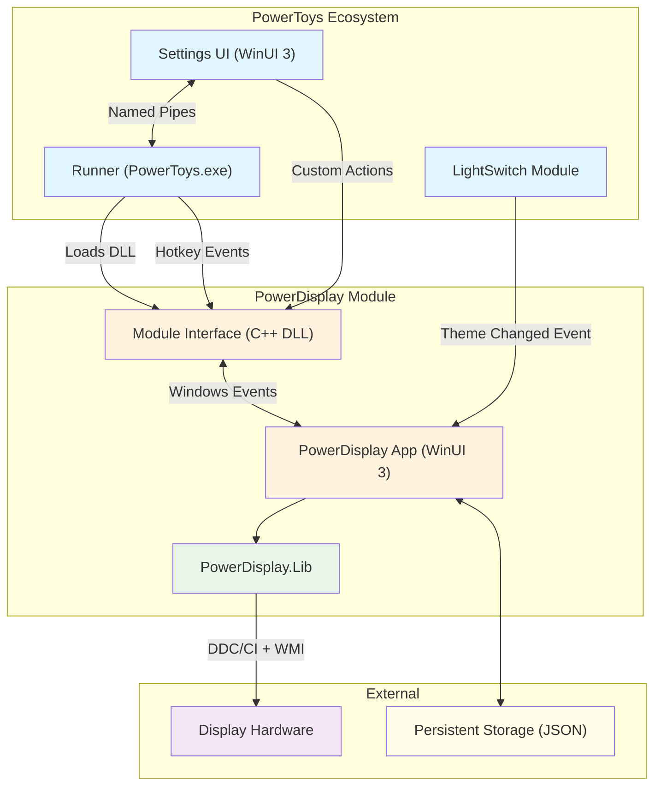
```mermaid
flowchart TB
    subgraph PowerToys["PowerToys Ecosystem"]
        Runner["Runner (PowerToys.exe)"]
        SettingsUI["Settings UI (WinUI 3)"]
        LightSwitch["LightSwitch Module"]
    end

    subgraph PowerDisplayModule["PowerDisplay Module"]
        ModuleInterface["Module Interface (C++ DLL)"]
        PowerDisplayApp["PowerDisplay App (WinUI 3)"]
        PowerDisplayLib["PowerDisplay.Lib"]
    end

    subgraph External["External"]
        Hardware["Display Hardware"]
        Storage["Persistent Storage (JSON)"]
    end

    Runner -->|"Loads DLL"| ModuleInterface
    Runner -->|"Hotkey Events"| ModuleInterface
    SettingsUI <-->|"Named Pipes"| Runner
    SettingsUI -->|"Custom Actions"| ModuleInterface

    ModuleInterface <-->|"Windows Events"| PowerDisplayApp
    LightSwitch -->|"Theme Changed Event"| PowerDisplayApp

    PowerDisplayApp --> PowerDisplayLib
    PowerDisplayLib -->|"DDC/CI + WMI"| Hardware
    PowerDisplayApp <--> Storage

    style Runner fill:#e1f5fe
    style SettingsUI fill:#e1f5fe
    style LightSwitch fill:#e1f5fe
    style ModuleInterface fill:#fff3e0
    style PowerDisplayApp fill:#fff3e0
    style PowerDisplayLib fill:#e8f5e9
    style Hardware fill:#f3e5f5
    style Storage fill:#fffde7
```

This high-level view shows the module boundaries. See [Component Design](#component-design)
for internal structure details.

---

### Project Structure

```
src/modules/powerdisplay/
├── PowerDisplay.Lib/                 # Core library (shared)
│   ├── Drivers/
│   │   ├── DDC/
│   │   │   ├── DdcCiController.cs    # DDC/CI implementation
│   │   │   ├── DdcCiNative.cs        # P/Invoke declarations
│   │   │   ├── MonitorDiscoveryHelper.cs
│   │   │   └── PhysicalMonitorHandleManager.cs
│   │   └── WMI/
│   │       └── WmiController.cs      # WMI implementation
│   ├── Interfaces/
│   │   └── IMonitorController.cs     # Controller abstraction
│   ├── Models/
│   │   ├── Monitor.cs                # Runtime monitor data
│   │   ├── MonitorOperationResult.cs # Operation result enum
│   │   ├── PowerDisplayProfile.cs    # Profile definition
│   │   ├── PowerDisplayProfiles.cs   # Profile collection
│   │   └── ProfileMonitorSetting.cs  # Per-monitor settings
│   ├── Services/
│   │   ├── LightSwitchListener.cs    # Theme change listener
│   │   ├── MonitorStateManager.cs    # State persistence (debounced)
│   │   └── ProfileService.cs         # Profile persistence
│   └── Utils/
│       ├── ColorTemperatureHelper.cs # Color temp utilities
│       ├── MccsCapabilitiesParser.cs # DDC/CI capabilities parser
│       └── VcpCapabilities.cs        # VCP capabilities model
│
├── PowerDisplay/                     # WinUI 3 application
│   ├── Assets/                       # App icons and images
│   ├── Common/
│   │   ├── Debouncer/
│   │   │   └── SimpleDebouncer.cs    # Slider input debouncing
│   │   └── Models/
│   │       └── Monitor.cs            # UI-layer monitor model
│   ├── Converters/                   # XAML value converters
│   ├── Helpers/
│   │   ├── DisplayChangeWatcher.cs   # Monitor hot-plug detection (WinRT DeviceWatcher)
│   │   ├── DisplayRotationService.cs # Display rotation control
│   │   ├── MonitorManager.cs         # Discovery orchestrator
│   │   ├── NativeMethodsHelper.cs    # Window positioning
│   │   ├── TrayIconService.cs        # System tray integration
│   │   └── WindowHelpers.cs          # Window utilities
│   ├── Strings/                      # Localization resources
│   ├── Styles/                       # Custom control styles
│   ├── ViewModels/
│   │   ├── MainViewModel.cs          # Main VM (partial class)
│   │   ├── MainViewModel.Monitors.cs # Monitor discovery methods
│   │   ├── MainViewModel.Profiles.cs # Profile management methods
│   │   ├── MainViewModel.Settings.cs # Settings persistence methods
│   │   └── MonitorViewModel.cs       # Per-monitor VM
│   └── Views/
│       ├── MainWindow.xaml           # Main UI window
│       └── MainWindow.xaml.cs
│
└── PowerDisplayModuleInterface/      # C++ DLL (module interface)
    ├── dllmain.cpp                   # PowertoyModuleIface impl
    ├── Constants.h                   # Module constants
    ├── pch.h / pch.cpp               # Precompiled headers
    └── trace.h / trace.cpp           # Telemetry tracing
```

---

## Component Design

### PowerDisplay Module Internal Structure

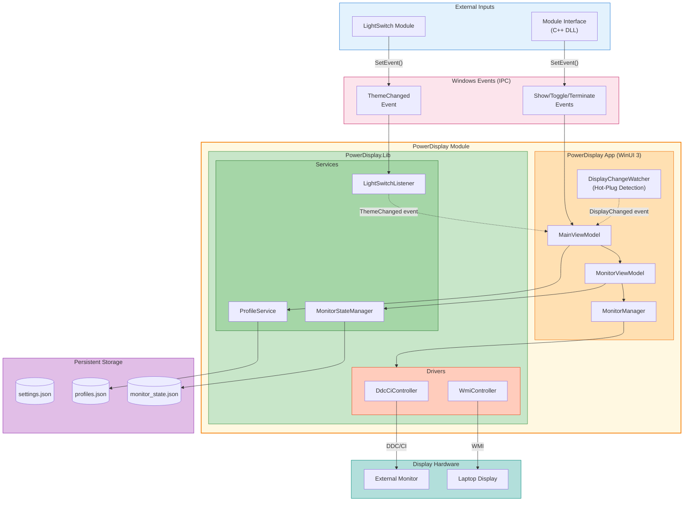
```mermaid
flowchart TB
    subgraph ExternalInputs["External Inputs"]
        ModuleInterface["Module Interface<br/>(C++ DLL)"]
        LightSwitch["LightSwitch Module"]
    end

    subgraph WindowsEvents["Windows Events (IPC)"]
        direction LR
        ShowToggleEvents["Show/Toggle/Terminate<br/>Events"]
        ThemeChangedEvent["ThemeChanged<br/>Event"]
    end

    subgraph PowerDisplayModule["PowerDisplay Module"]
        subgraph PowerDisplayApp["PowerDisplay App (WinUI 3)"]
            MainViewModel
            MonitorViewModel
            MonitorManager
            DisplayChangeWatcher["DisplayChangeWatcher<br/>(Hot-Plug Detection)"]
        end

        subgraph PowerDisplayLib["PowerDisplay.Lib"]
            subgraph Services
                LightSwitchListener
                ProfileService
                MonitorStateManager
            end
            subgraph Drivers
                DdcCiController
                WmiController
            end
        end
    end

    subgraph Storage["Persistent Storage"]
        SettingsJson[("settings.json")]
        ProfilesJson[("profiles.json")]
        MonitorStateJson[("monitor_state.json")]
    end

    subgraph Hardware["Display Hardware"]
        ExternalMonitor["External Monitor"]
        LaptopDisplay["Laptop Display"]
    end

    %% External to Windows Events
    ModuleInterface -->|"SetEvent()"| ShowToggleEvents
    LightSwitch -->|"SetEvent()"| ThemeChangedEvent

    %% Windows Events to App
    ShowToggleEvents --> MainViewModel
    ThemeChangedEvent --> LightSwitchListener

    %% App internal (MainViewModel owns LightSwitchListener)
    LightSwitchListener -.->|"ThemeChanged event"| MainViewModel
    MainViewModel --> MonitorViewModel
    MonitorViewModel --> MonitorManager
    DisplayChangeWatcher -.->|"DisplayChanged event"| MainViewModel

    %% App to Lib services
    MainViewModel --> ProfileService
    MonitorViewModel --> MonitorStateManager
    MonitorManager --> Drivers

    %% Services to Storage
    ProfileService --> ProfilesJson
    MonitorStateManager --> MonitorStateJson

    %% Drivers to Hardware
    DdcCiController -->|"DDC/CI"| ExternalMonitor
    WmiController -->|"WMI"| LaptopDisplay

    %% Styling
    style ExternalInputs fill:#e3f2fd,stroke:#1976d2
    style WindowsEvents fill:#fce4ec,stroke:#c2185b
    style PowerDisplayModule fill:#fff8e1,stroke:#f57c00,stroke-width:2px
    style PowerDisplayApp fill:#ffe0b2,stroke:#ef6c00
    style PowerDisplayLib fill:#c8e6c9,stroke:#388e3c
    style Services fill:#a5d6a7,stroke:#2e7d32
    style Drivers fill:#ffccbc,stroke:#e64a19
    style Storage fill:#e1bee7,stroke:#8e24aa
    style Hardware fill:#b2dfdb,stroke:#00897b
```

---

### DisplayChangeWatcher - Monitor Hot-Plug Detection

The `DisplayChangeWatcher` component provides automatic detection of monitor connect/disconnect events using the WinRT DeviceWatcher API.

**Key Features:**
- Uses `DisplayMonitor.GetDeviceSelector()` to watch for display device changes
- Implements 1-second debouncing to coalesce rapid connect/disconnect events
- Triggers `DisplayChanged` event to notify `MainViewModel` for monitor list refresh
- Runs continuously after initial monitor discovery completes

**Implementation Details:**
```csharp
// Device selector for display monitors
string selector = DisplayMonitor.GetDeviceSelector();
_deviceWatcher = DeviceInformation.CreateWatcher(selector);

// Events monitored
_deviceWatcher.Added += OnDeviceAdded;      // New monitor connected
_deviceWatcher.Removed += OnDeviceRemoved;  // Monitor disconnected
_deviceWatcher.Updated += OnDeviceUpdated;  // Monitor properties changed
```

**Debouncing Strategy:**
- Each device change event schedules a `DisplayChanged` event after 1 second
- Subsequent events within the debounce window cancel the previous timer
- This prevents excessive refreshes when multiple monitors change simultaneously

---

### DDC/CI and WMI Interaction Architecture

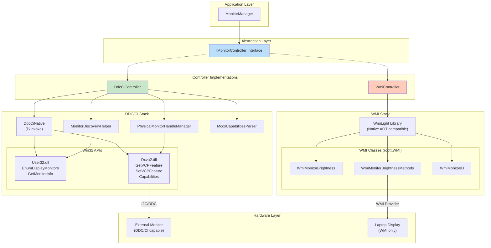
```mermaid
flowchart TB
    subgraph Application["Application Layer"]
        MM["MonitorManager"]
    end

    subgraph Abstraction["Abstraction Layer"]
        IMC["IMonitorController Interface"]
    end

    subgraph Controllers["Controller Implementations"]
        DDC["DdcCiController"]
        WMI["WmiController"]
    end

    subgraph DDCStack["DDC/CI Stack"]
        DDCNative["DdcCiNative<br/>(P/Invoke)"]
        PhysicalMonitorMgr["PhysicalMonitorHandleManager"]
        MonitorDiscovery["MonitorDiscoveryHelper"]
        CapParser["MccsCapabilitiesParser"]

        subgraph Win32["Win32 APIs"]
            User32["User32.dll<br/>EnumDisplayMonitors<br/>GetMonitorInfo"]
            Dxva2["Dxva2.dll<br/>GetVCPFeature<br/>SetVCPFeature<br/>Capabilities"]
        end
    end

    subgraph WMIStack["WMI Stack"]
        WmiLight["WmiLight Library<br/>(Native AOT compatible)"]

        subgraph WMIClasses["WMI Classes (root\\WMI)"]
            WmiMonBright["WmiMonitorBrightness"]
            WmiMonBrightMethods["WmiMonitorBrightnessMethods"]
            WmiMonID["WmiMonitorID"]
        end
    end

    subgraph Hardware["Hardware Layer"]
        ExtMon["External Monitor<br/>(DDC/CI capable)"]
        LaptopMon["Laptop Display<br/>(WMI only)"]
    end

    MM --> IMC
    IMC -.-> DDC
    IMC -.-> WMI

    DDC --> DDCNative
    DDC --> PhysicalMonitorMgr
    DDC --> MonitorDiscovery
    DDC --> CapParser

    DDCNative --> User32
    DDCNative --> Dxva2
    MonitorDiscovery --> User32
    PhysicalMonitorMgr --> Dxva2

    Dxva2 -->|"I2C/DDC"| ExtMon

    WMI --> WmiLight
    WmiLight --> WmiMonBright
    WmiLight --> WmiMonBrightMethods
    WmiLight --> WmiMonID

    WmiMonBrightMethods -->|"WMI Provider"| LaptopMon

    style IMC fill:#bbdefb
    style DDC fill:#c8e6c9
    style WMI fill:#ffccbc
```

### IMonitorController Interface Methods

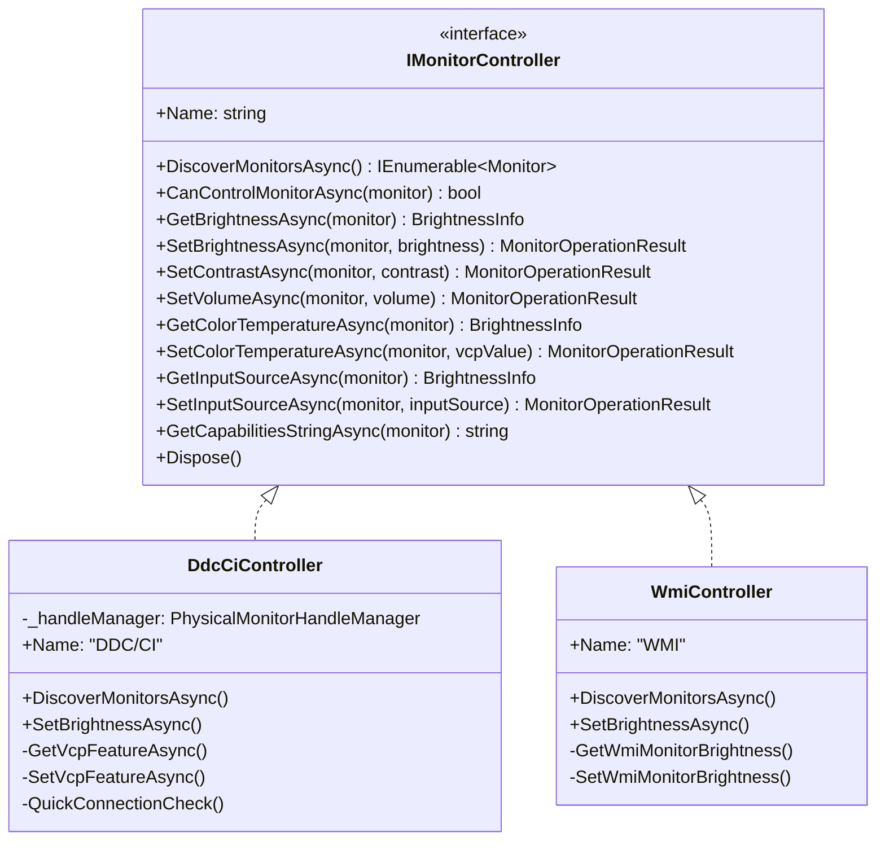
```mermaid
classDiagram
    class IMonitorController {
        <<interface>>
        +Name: string
        +DiscoverMonitorsAsync() IEnumerable~Monitor~
        +CanControlMonitorAsync(monitor) bool
        +GetBrightnessAsync(monitor) BrightnessInfo
        +SetBrightnessAsync(monitor, brightness) MonitorOperationResult
        +SetContrastAsync(monitor, contrast) MonitorOperationResult
        +SetVolumeAsync(monitor, volume) MonitorOperationResult
        +GetColorTemperatureAsync(monitor) BrightnessInfo
        +SetColorTemperatureAsync(monitor, vcpValue) MonitorOperationResult
        +GetInputSourceAsync(monitor) BrightnessInfo
        +SetInputSourceAsync(monitor, inputSource) MonitorOperationResult
        +GetCapabilitiesStringAsync(monitor) string
        +Dispose()
    }

    class DdcCiController {
        -_handleManager: PhysicalMonitorHandleManager
        +Name: "DDC/CI"
        +DiscoverMonitorsAsync()
        +SetBrightnessAsync()
        -GetVcpFeatureAsync()
        -SetVcpFeatureAsync()
        -QuickConnectionCheck()
    }

    class WmiController {
        +Name: "WMI"
        +DiscoverMonitorsAsync()
        +SetBrightnessAsync()
        -GetWmiMonitorBrightness()
        -SetWmiMonitorBrightness()
    }

    IMonitorController <|.. DdcCiController
    IMonitorController <|.. WmiController
```

---

### Settings UI and PowerDisplay Interaction Architecture

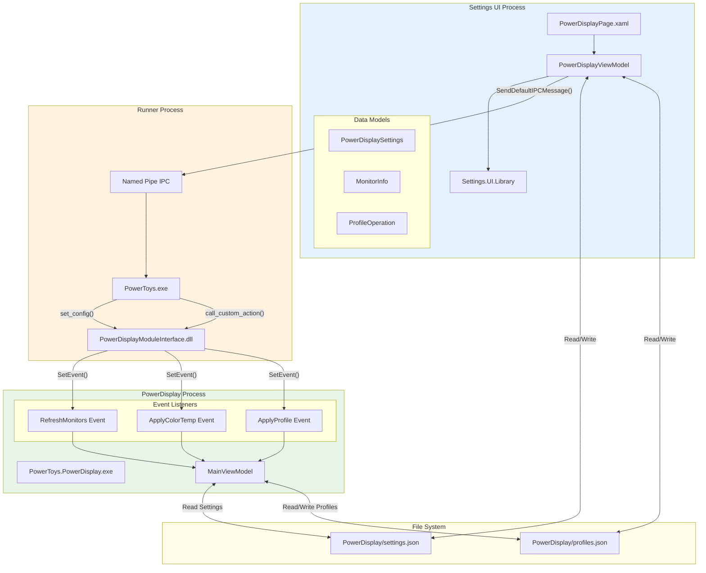
```mermaid
flowchart TB
    subgraph SettingsProcess["Settings UI Process"]
        SettingsPage["PowerDisplayPage.xaml"]
        ViewModel["PowerDisplayViewModel"]
        SettingsLib["Settings.UI.Library"]

        subgraph DataModels["Data Models"]
            PowerDisplaySettings["PowerDisplaySettings"]
            MonitorInfo["MonitorInfo"]
            ProfileOperation["ProfileOperation"]
        end
    end

    subgraph RunnerProcess["Runner Process"]
        Runner["PowerToys.exe"]
        NamedPipe["Named Pipe IPC"]
        ModuleInterface["PowerDisplayModuleInterface.dll"]
    end

    subgraph PowerDisplayProcess["PowerDisplay Process"]
        App["PowerToys.PowerDisplay.exe"]
        MainVM["MainViewModel"]

        subgraph EventListeners["Event Listeners"]
            RefreshEvent["RefreshMonitors Event"]
            ApplyColorTempEvent["ApplyColorTemp Event"]
            ApplyProfileEvent["ApplyProfile Event"]
        end
    end

    subgraph FileSystem["File System"]
        SettingsJson["PowerDisplay/settings.json"]
        ProfilesJson["PowerDisplay/profiles.json"]
    end

    %% Settings UI to Runner
    SettingsPage --> ViewModel
    ViewModel --> SettingsLib
    ViewModel -->|"SendDefaultIPCMessage()"| NamedPipe
    NamedPipe --> Runner
    Runner -->|"set_config()"| ModuleInterface
    Runner -->|"call_custom_action()"| ModuleInterface

    %% Settings persistence
    ViewModel <-->|"Read/Write"| SettingsJson
    ViewModel <-->|"Read/Write"| ProfilesJson

    %% Module Interface to PowerDisplay App
    ModuleInterface -->|"SetEvent()"| RefreshEvent
    ModuleInterface -->|"SetEvent()"| ApplyColorTempEvent
    ModuleInterface -->|"SetEvent()"| ApplyProfileEvent

    %% PowerDisplay App event handling
    RefreshEvent --> MainVM
    ApplyColorTempEvent --> MainVM
    ApplyProfileEvent --> MainVM
    MainVM <-->|"Read Settings"| SettingsJson
    MainVM <-->|"Read/Write Profiles"| ProfilesJson

    style SettingsProcess fill:#e3f2fd
    style RunnerProcess fill:#fff3e0
    style PowerDisplayProcess fill:#e8f5e9
    style FileSystem fill:#fffde7
```

### Windows Events for IPC

| Event Name | Constant | Direction | Purpose |
|------------|----------|-----------|---------|
| `Local\PowerToysPowerDisplay-ShowEvent-*` | `SHOW_POWER_DISPLAY_EVENT` | Runner → App | Show window |
| `Local\PowerToysPowerDisplay-ToggleEvent-*` | `TOGGLE_POWER_DISPLAY_EVENT` | Runner → App | Toggle visibility |
| `Local\PowerToysPowerDisplay-TerminateEvent-*` | `TERMINATE_POWER_DISPLAY_EVENT` | Runner → App | Terminate process |
| `Local\PowerToysPowerDisplay-RefreshMonitorsEvent-*` | `REFRESH_POWER_DISPLAY_MONITORS_EVENT` | Settings → App | Refresh monitor list |
| `Local\PowerToysPowerDisplay-ApplyColorTemperatureEvent-*` | `APPLY_COLOR_TEMPERATURE_POWER_DISPLAY_EVENT` | Settings → App | Apply color temp |
| `Local\PowerToysPowerDisplay-ApplyProfileEvent-*` | `APPLY_PROFILE_POWER_DISPLAY_EVENT` | Settings → App | Apply profile |
| `Local\PowerToys_LightSwitch_LightTheme` | `LightSwitchLightThemeEventName` | LightSwitch → App | Apply light mode profile |
| `Local\PowerToys_LightSwitch_DarkTheme` | `LightSwitchDarkThemeEventName` | LightSwitch → App | Apply dark mode profile |

---

### LightSwitch Profile Integration Architecture

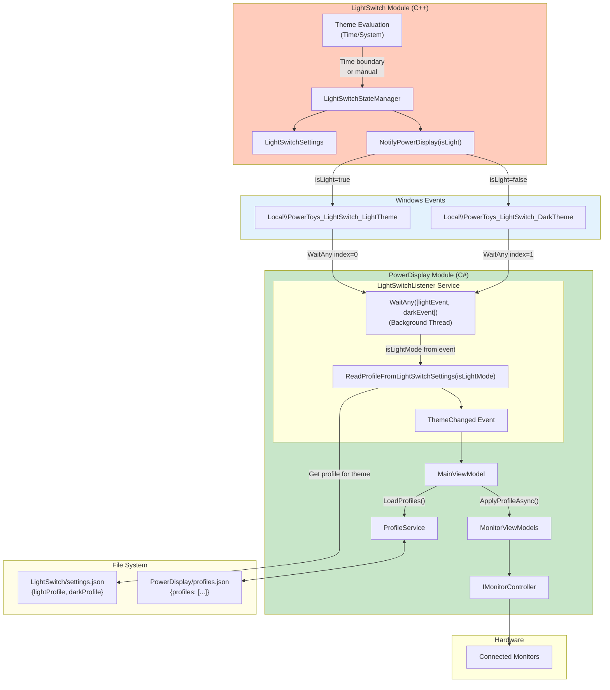
```mermaid
flowchart TB
    subgraph LightSwitchModule["LightSwitch Module (C++)"]
        StateManager["LightSwitchStateManager"]
        ThemeEval["Theme Evaluation<br/>(Time/System)"]
        LightSwitchSettings["LightSwitchSettings"]
        NotifyPD["NotifyPowerDisplay(isLight)"]
    end

    subgraph PowerDisplayModule["PowerDisplay Module (C#)"]
        subgraph Listener["LightSwitchListener Service"]
            EventWait["WaitAny([lightEvent, darkEvent])<br/>(Background Thread)"]
            ReadSettings["ReadProfileFromLightSwitchSettings(isLightMode)"]
            ThemeChangedEvent["ThemeChanged Event"]
        end

        MainViewModel["MainViewModel"]
        ProfileService["ProfileService"]
        MonitorVMs["MonitorViewModels"]
        Controllers["IMonitorController"]
    end

    subgraph WindowsEvents["Windows Events"]
        LightEvent["Local\\PowerToys_LightSwitch_LightTheme"]
        DarkEvent["Local\\PowerToys_LightSwitch_DarkTheme"]
    end

    subgraph FileSystem["File System"]
        LSSettingsJson["LightSwitch/settings.json<br/>{lightProfile, darkProfile}"]
        PDProfilesJson["PowerDisplay/profiles.json<br/>{profiles: [...]}"]
    end

    subgraph Hardware["Hardware"]
        Monitors["Connected Monitors"]
    end

    %% LightSwitch flow
    ThemeEval -->|"Time boundary<br/>or manual"| StateManager
    StateManager --> LightSwitchSettings
    StateManager --> NotifyPD
    NotifyPD -->|"isLight=true"| LightEvent
    NotifyPD -->|"isLight=false"| DarkEvent

    %% PowerDisplay flow - theme determined from event, not registry
    LightEvent -->|"WaitAny index=0"| EventWait
    DarkEvent -->|"WaitAny index=1"| EventWait
    EventWait -->|"isLightMode from event"| ReadSettings
    ReadSettings -->|"Get profile for theme"| LSSettingsJson
    ReadSettings --> ThemeChangedEvent
    ThemeChangedEvent --> MainViewModel
    MainViewModel -->|"LoadProfiles()"| ProfileService
    ProfileService <--> PDProfilesJson
    MainViewModel -->|"ApplyProfileAsync()"| MonitorVMs
    MonitorVMs --> Controllers
    Controllers --> Monitors

    style LightSwitchModule fill:#ffccbc
    style PowerDisplayModule fill:#c8e6c9
    style WindowsEvents fill:#e3f2fd
    style FileSystem fill:#fffde7
```

### LightSwitch Settings JSON Structure

```json
{
  "properties": {
    "apply_monitor_settings": { "value": true },
    "enable_light_mode_profile": { "value": true },
    "light_mode_profile": { "value": "Productivity" },
    "enable_dark_mode_profile": { "value": true },
    "dark_mode_profile": { "value": "Night Mode" }
  }
}
```

---

## Data Flow and Communication

### Monitor Discovery Flow

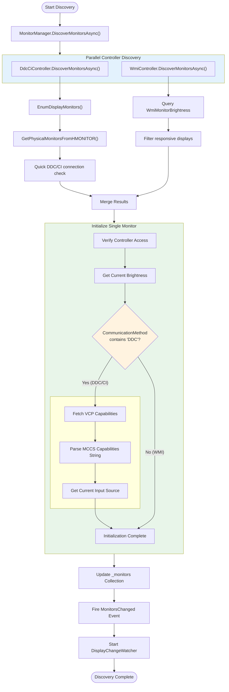
```mermaid
flowchart TB
    Start([Start Discovery]) --> Init["MonitorManager.DiscoverMonitorsAsync()"]

    Init --> ParallelDiscover["Parallel Discovery"]

    subgraph ParallelDiscover["Parallel Controller Discovery"]
        DDCDiscover["DdcCiController.DiscoverMonitorsAsync()"]
        WMIDiscover["WmiController.DiscoverMonitorsAsync()"]
    end

    DDCDiscover --> DDCEnum["EnumDisplayMonitors()"]
    DDCEnum --> DDCPhysical["GetPhysicalMonitorsFromHMONITOR()"]
    DDCPhysical --> DDCCheck["Quick DDC/CI connection check"]

    WMIDiscover --> WMIQuery["Query WmiMonitorBrightness"]
    WMIQuery --> WMIFilter["Filter responsive displays"]

    DDCCheck --> Merge["Merge Results"]
    WMIFilter --> Merge

    Merge --> InitLoop["For Each Monitor"]

    subgraph InitLoop["Initialize Single Monitor"]
        direction TB
        VerifyControl["Verify Controller Access"]
        GetBrightness["Get Current Brightness"]
        CheckType{"CommunicationMethod<br/>contains 'DDC'?"}

        subgraph DDCPath[" "]
            direction TB
            GetCaps["Fetch VCP Capabilities"]
            ParseCaps["Parse MCCS Capabilities String"]
            InitInputSource["Get Current Input Source"]
        end

        Done["Initialization Complete"]
    end

    VerifyControl --> GetBrightness
    GetBrightness --> CheckType
    CheckType -->|"Yes (DDC/CI)"| GetCaps
    GetCaps --> ParseCaps
    ParseCaps --> InitInputSource
    InitInputSource --> Done
    CheckType -->|"No (WMI)"| Done

    InitLoop --> UpdateCollection["Update _monitors Collection"]
    UpdateCollection --> FireEvent["Fire MonitorsChanged Event"]
    FireEvent --> StartWatcher["Start DisplayChangeWatcher"]
    StartWatcher --> End([Discovery Complete])

    style ParallelDiscover fill:#e3f2fd
    style InitLoop fill:#e8f5e9
    style CheckType fill:#fff3e0
```

**Note:** WMI monitors skip VCP capabilities fetching because:
1. WMI uses a different abstraction layer (`WmiMonitorBrightness` class)
2. `WmiController.GetCapabilitiesStringAsync()` returns an empty string
3. VCP codes are DDC/CI-specific and not applicable to WMI-controlled displays

---

## Sequence Diagrams

### Sequence: Modifying Monitor Settings in Settings UI

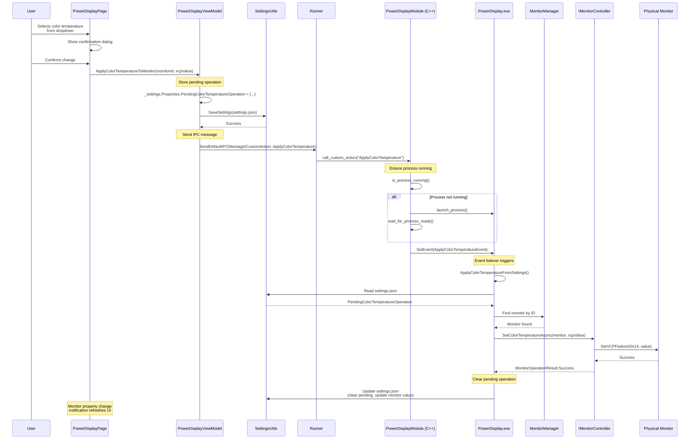
```mermaid
sequenceDiagram
    participant User
    participant SettingsPage as PowerDisplayPage
    participant ViewModel as PowerDisplayViewModel
    participant SettingsUtils
    participant Runner
    participant ModuleInterface as PowerDisplayModule (C++)
    participant PowerDisplayApp as PowerDisplay.exe
    participant MonitorManager
    participant Controller as IMonitorController
    participant Monitor as Physical Monitor

    User->>SettingsPage: Selects color temperature<br/>from dropdown
    SettingsPage->>SettingsPage: Show confirmation dialog
    User->>SettingsPage: Confirms change

    SettingsPage->>ViewModel: ApplyColorTemperatureToMonitor(monitorId, vcpValue)

    Note over ViewModel: Store pending operation
    ViewModel->>ViewModel: _settings.Properties.PendingColorTemperatureOperation = {...}
    ViewModel->>SettingsUtils: SaveSettings(settings.json)
    SettingsUtils-->>ViewModel: Success

    Note over ViewModel: Send IPC message
    ViewModel->>Runner: SendDefaultIPCMessage(CustomAction: ApplyColorTemperature)
    Runner->>ModuleInterface: call_custom_action("ApplyColorTemperature")

    Note over ModuleInterface: Ensure process running
    ModuleInterface->>ModuleInterface: is_process_running()
    alt Process not running
        ModuleInterface->>PowerDisplayApp: launch_process()
        ModuleInterface->>ModuleInterface: wait_for_process_ready()
    end

    ModuleInterface->>PowerDisplayApp: SetEvent(ApplyColorTemperatureEvent)

    Note over PowerDisplayApp: Event listener triggers
    PowerDisplayApp->>PowerDisplayApp: ApplyColorTemperatureFromSettings()
    PowerDisplayApp->>SettingsUtils: Read settings.json
    SettingsUtils-->>PowerDisplayApp: PendingColorTemperatureOperation

    PowerDisplayApp->>MonitorManager: Find monitor by ID
    MonitorManager-->>PowerDisplayApp: Monitor found

    PowerDisplayApp->>Controller: SetColorTemperatureAsync(monitor, vcpValue)
    Controller->>Monitor: SetVCPFeature(0x14, value)
    Monitor-->>Controller: Success
    Controller-->>PowerDisplayApp: MonitorOperationResult.Success

    Note over PowerDisplayApp: Clear pending operation
    PowerDisplayApp->>SettingsUtils: Update settings.json<br/>(clear pending, update monitor value)

    Note over SettingsPage: Monitor property change<br/>notification refreshes UI
```

---

### Sequence: Creating and Saving a Profile

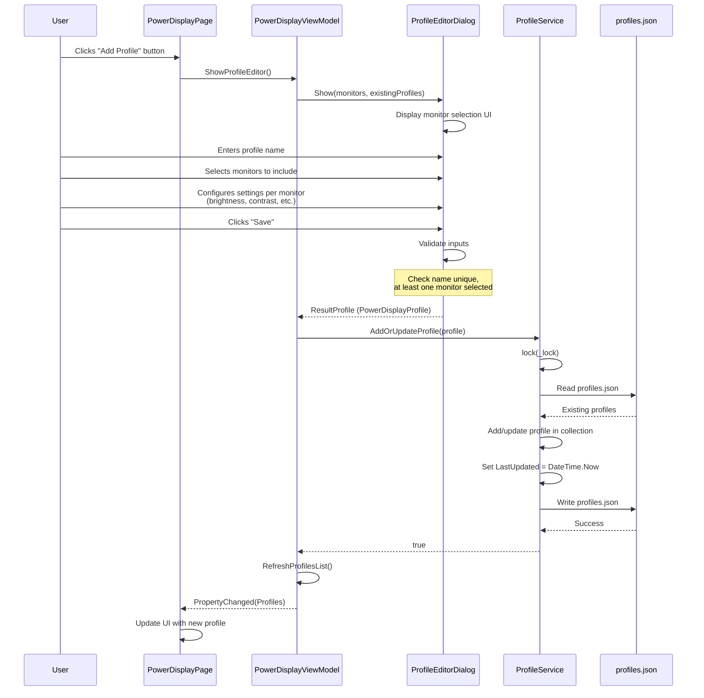
```mermaid
sequenceDiagram
    participant User
    participant SettingsPage as PowerDisplayPage
    participant ViewModel as PowerDisplayViewModel
    participant ProfileDialog as ProfileEditorDialog
    participant ProfileService
    participant FileSystem as profiles.json

    User->>SettingsPage: Clicks "Add Profile" button
    SettingsPage->>ViewModel: ShowProfileEditor()

    ViewModel->>ProfileDialog: Show(monitors, existingProfiles)
    ProfileDialog->>ProfileDialog: Display monitor selection UI

    User->>ProfileDialog: Enters profile name
    User->>ProfileDialog: Selects monitors to include
    User->>ProfileDialog: Configures settings per monitor<br/>(brightness, contrast, etc.)
    User->>ProfileDialog: Clicks "Save"

    ProfileDialog->>ProfileDialog: Validate inputs
    Note over ProfileDialog: Check name unique,<br/>at least one monitor selected

    ProfileDialog-->>ViewModel: ResultProfile (PowerDisplayProfile)

    ViewModel->>ProfileService: AddOrUpdateProfile(profile)

    ProfileService->>ProfileService: lock(_lock)
    ProfileService->>FileSystem: Read profiles.json
    FileSystem-->>ProfileService: Existing profiles
    ProfileService->>ProfileService: Add/update profile in collection
    ProfileService->>ProfileService: Set LastUpdated = DateTime.Now
    ProfileService->>FileSystem: Write profiles.json
    FileSystem-->>ProfileService: Success
    ProfileService-->>ViewModel: true

    ViewModel->>ViewModel: RefreshProfilesList()
    ViewModel-->>SettingsPage: PropertyChanged(Profiles)
    SettingsPage->>SettingsPage: Update UI with new profile
```

---

### Sequence: Applying Profile via LightSwitch Theme Change

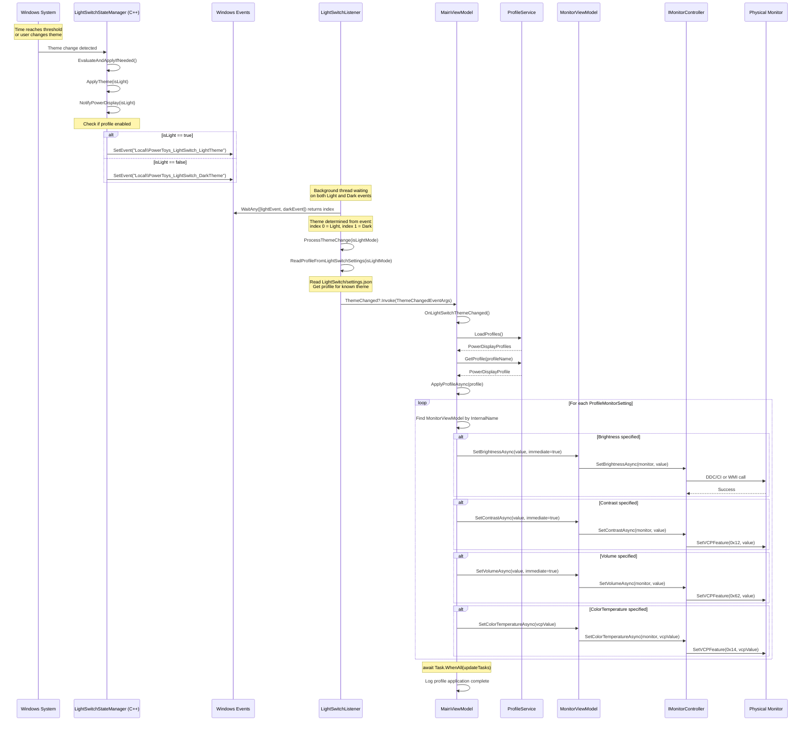
```mermaid
sequenceDiagram
    participant System as Windows System
    participant LightSwitch as LightSwitchStateManager (C++)
    participant WinEvent as Windows Events
    participant Listener as LightSwitchListener
    participant MainVM as MainViewModel
    participant ProfileService
    participant MonitorVM as MonitorViewModel
    participant Controller as IMonitorController
    participant Monitor as Physical Monitor

    Note over System: Time reaches threshold<br/>or user changes theme
    System->>LightSwitch: Theme change detected

    LightSwitch->>LightSwitch: EvaluateAndApplyIfNeeded()
    LightSwitch->>LightSwitch: ApplyTheme(isLight)

    LightSwitch->>LightSwitch: NotifyPowerDisplay(isLight)
    Note over LightSwitch: Check if profile enabled

    alt isLight == true
        LightSwitch->>WinEvent: SetEvent("Local\\PowerToys_LightSwitch_LightTheme")
    else isLight == false
        LightSwitch->>WinEvent: SetEvent("Local\\PowerToys_LightSwitch_DarkTheme")
    end

    Note over Listener: Background thread waiting<br/>on both Light and Dark events
    Listener->>WinEvent: WaitAny([lightEvent, darkEvent]) returns index

    Note over Listener: Theme determined from event:<br/>index 0 = Light, index 1 = Dark
    Listener->>Listener: ProcessThemeChange(isLightMode)
    Listener->>Listener: ReadProfileFromLightSwitchSettings(isLightMode)
    Note over Listener: Read LightSwitch/settings.json<br/>Get profile for known theme

    Listener->>MainVM: ThemeChanged?.Invoke(ThemeChangedEventArgs)

    MainVM->>MainVM: OnLightSwitchThemeChanged()
    MainVM->>ProfileService: LoadProfiles()
    ProfileService-->>MainVM: PowerDisplayProfiles

    MainVM->>ProfileService: GetProfile(profileName)
    ProfileService-->>MainVM: PowerDisplayProfile

    MainVM->>MainVM: ApplyProfileAsync(profile)

    loop For each ProfileMonitorSetting
        MainVM->>MainVM: Find MonitorViewModel by InternalName

        alt Brightness specified
            MainVM->>MonitorVM: SetBrightnessAsync(value, immediate=true)
            MonitorVM->>Controller: SetBrightnessAsync(monitor, value)
            Controller->>Monitor: DDC/CI or WMI call
            Monitor-->>Controller: Success
        end

        alt Contrast specified
            MainVM->>MonitorVM: SetContrastAsync(value, immediate=true)
            MonitorVM->>Controller: SetContrastAsync(monitor, value)
            Controller->>Monitor: SetVCPFeature(0x12, value)
        end

        alt Volume specified
            MainVM->>MonitorVM: SetVolumeAsync(value, immediate=true)
            MonitorVM->>Controller: SetVolumeAsync(monitor, value)
            Controller->>Monitor: SetVCPFeature(0x62, value)
        end

        alt ColorTemperature specified
            MainVM->>MonitorVM: SetColorTemperatureAsync(vcpValue)
            MonitorVM->>Controller: SetColorTemperatureAsync(monitor, vcpValue)
            Controller->>Monitor: SetVCPFeature(0x14, vcpValue)
        end
    end

    Note over MainVM: await Task.WhenAll(updateTasks)
    MainVM->>MainVM: Log profile application complete
```

---

### Sequence: UI Slider Adjustment (Brightness)

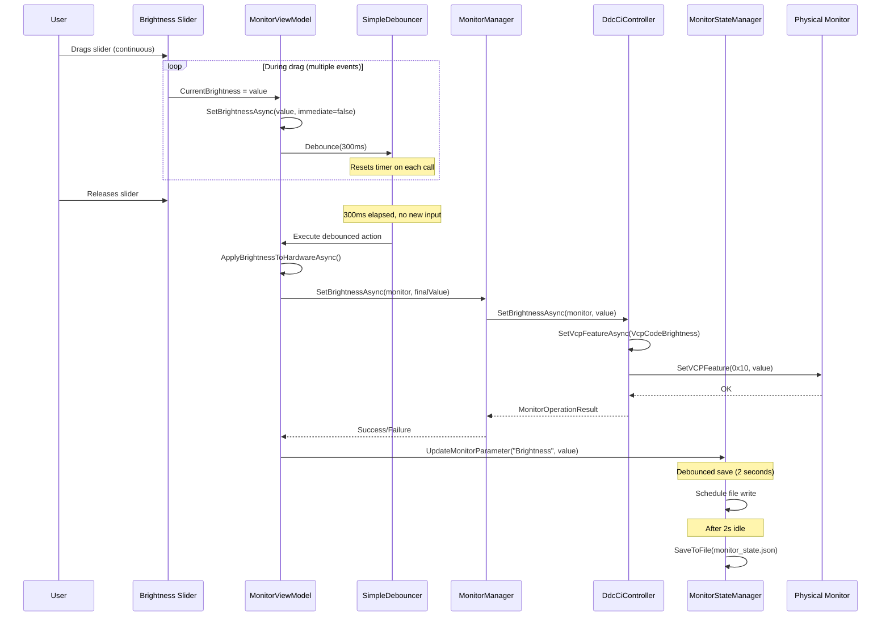
```mermaid
sequenceDiagram
    participant User
    participant Slider as Brightness Slider
    participant MonitorVM as MonitorViewModel
    participant Debouncer as SimpleDebouncer
    participant MonitorManager
    participant Controller as DdcCiController
    participant StateManager as MonitorStateManager
    participant Monitor as Physical Monitor

    User->>Slider: Drags slider (continuous)

    loop During drag (multiple events)
        Slider->>MonitorVM: CurrentBrightness = value
        MonitorVM->>MonitorVM: SetBrightnessAsync(value, immediate=false)
        MonitorVM->>Debouncer: Debounce(300ms)
        Note over Debouncer: Resets timer on each call
    end

    User->>Slider: Releases slider

    Note over Debouncer: 300ms elapsed, no new input
    Debouncer->>MonitorVM: Execute debounced action

    MonitorVM->>MonitorVM: ApplyBrightnessToHardwareAsync()
    MonitorVM->>MonitorManager: SetBrightnessAsync(monitor, finalValue)

    MonitorManager->>Controller: SetBrightnessAsync(monitor, value)

    Controller->>Controller: SetVcpFeatureAsync(VcpCodeBrightness)
    Controller->>Monitor: SetVCPFeature(0x10, value)
    Monitor-->>Controller: OK

    Controller-->>MonitorManager: MonitorOperationResult
    MonitorManager-->>MonitorVM: Success/Failure

    MonitorVM->>StateManager: UpdateMonitorParameter("Brightness", value)

    Note over StateManager: Debounced save (2 seconds)
    StateManager->>StateManager: Schedule file write

    Note over StateManager: After 2s idle
    StateManager->>StateManager: SaveToFile(monitor_state.json)
```

---

### Sequence: Module Enable/Disable Lifecycle

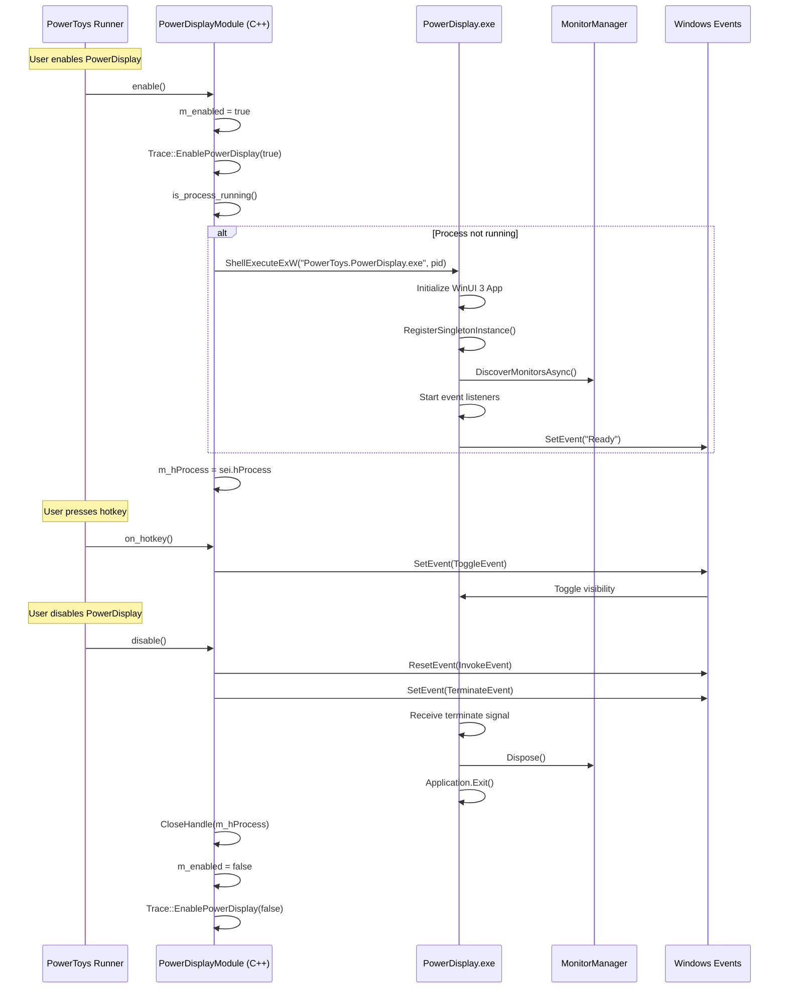
```mermaid
sequenceDiagram
    participant Runner as PowerToys Runner
    participant ModuleInterface as PowerDisplayModule (C++)
    participant PowerDisplayApp as PowerDisplay.exe
    participant MonitorManager
    participant EventHandles as Windows Events

    Note over Runner: User enables PowerDisplay
    Runner->>ModuleInterface: enable()

    ModuleInterface->>ModuleInterface: m_enabled = true
    ModuleInterface->>ModuleInterface: Trace::EnablePowerDisplay(true)

    ModuleInterface->>ModuleInterface: is_process_running()
    alt Process not running
        ModuleInterface->>PowerDisplayApp: ShellExecuteExW("PowerToys.PowerDisplay.exe", pid)
        PowerDisplayApp->>PowerDisplayApp: Initialize WinUI 3 App
        PowerDisplayApp->>PowerDisplayApp: RegisterSingletonInstance()
        PowerDisplayApp->>MonitorManager: DiscoverMonitorsAsync()
        PowerDisplayApp->>PowerDisplayApp: Start event listeners
        PowerDisplayApp->>EventHandles: SetEvent("Ready")
    end

    ModuleInterface->>ModuleInterface: m_hProcess = sei.hProcess

    Note over Runner: User presses hotkey
    Runner->>ModuleInterface: on_hotkey()
    ModuleInterface->>EventHandles: SetEvent(ToggleEvent)
    EventHandles->>PowerDisplayApp: Toggle visibility

    Note over Runner: User disables PowerDisplay
    Runner->>ModuleInterface: disable()

    ModuleInterface->>EventHandles: ResetEvent(InvokeEvent)
    ModuleInterface->>EventHandles: SetEvent(TerminateEvent)

    PowerDisplayApp->>PowerDisplayApp: Receive terminate signal
    PowerDisplayApp->>MonitorManager: Dispose()
    PowerDisplayApp->>PowerDisplayApp: Application.Exit()

    ModuleInterface->>ModuleInterface: CloseHandle(m_hProcess)
    ModuleInterface->>ModuleInterface: m_enabled = false
    ModuleInterface->>ModuleInterface: Trace::EnablePowerDisplay(false)
```

---

## Data Models

### Core Models

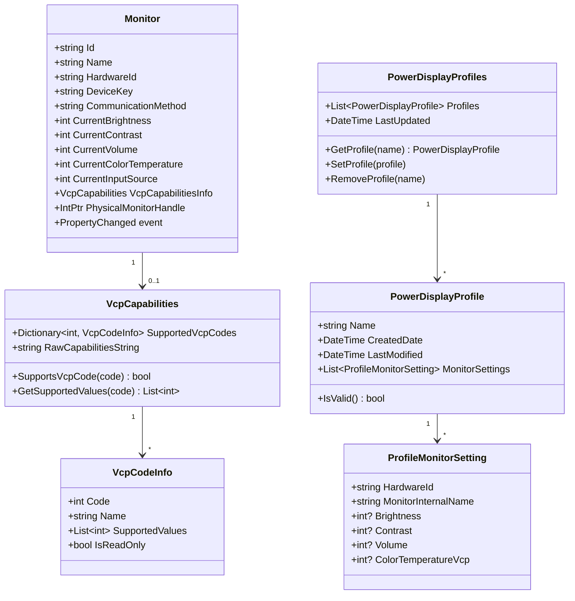
```mermaid
classDiagram
    class Monitor {
        +string Id
        +string Name
        +string HardwareId
        +string DeviceKey
        +string CommunicationMethod
        +int CurrentBrightness
        +int CurrentContrast
        +int CurrentVolume
        +int CurrentColorTemperature
        +int CurrentInputSource
        +VcpCapabilities VcpCapabilitiesInfo
        +IntPtr PhysicalMonitorHandle
        +PropertyChanged event
    }

    class VcpCapabilities {
        +Dictionary~int, VcpCodeInfo~ SupportedVcpCodes
        +string RawCapabilitiesString
        +SupportsVcpCode(code) bool
        +GetSupportedValues(code) List~int~
    }

    class VcpCodeInfo {
        +int Code
        +string Name
        +List~int~ SupportedValues
        +bool IsReadOnly
    }

    class PowerDisplayProfile {
        +string Name
        +DateTime CreatedDate
        +DateTime LastModified
        +List~ProfileMonitorSetting~ MonitorSettings
        +IsValid() bool
    }

    class ProfileMonitorSetting {
        +string HardwareId
        +string MonitorInternalName
        +int? Brightness
        +int? Contrast
        +int? Volume
        +int? ColorTemperatureVcp
    }

    class PowerDisplayProfiles {
        +List~PowerDisplayProfile~ Profiles
        +DateTime LastUpdated
        +GetProfile(name) PowerDisplayProfile
        +SetProfile(profile)
        +RemoveProfile(name)
    }

    Monitor "1" --> "0..1" VcpCapabilities
    VcpCapabilities "1" --> "*" VcpCodeInfo
    PowerDisplayProfiles "1" --> "*" PowerDisplayProfile
    PowerDisplayProfile "1" --> "*" ProfileMonitorSetting
```

### Settings Models

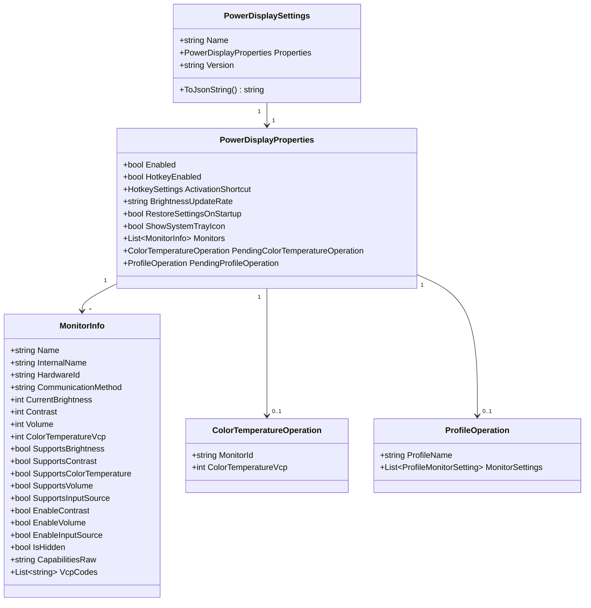
```mermaid
classDiagram
    class PowerDisplaySettings {
        +string Name
        +PowerDisplayProperties Properties
        +string Version
        +ToJsonString() string
    }

    class PowerDisplayProperties {
        +bool Enabled
        +bool HotkeyEnabled
        +HotkeySettings ActivationShortcut
        +string BrightnessUpdateRate
        +bool RestoreSettingsOnStartup
        +bool ShowSystemTrayIcon
        +List~MonitorInfo~ Monitors
        +ColorTemperatureOperation PendingColorTemperatureOperation
        +ProfileOperation PendingProfileOperation
    }

    class MonitorInfo {
        +string Name
        +string InternalName
        +string HardwareId
        +string CommunicationMethod
        +int CurrentBrightness
        +int Contrast
        +int Volume
        +int ColorTemperatureVcp
        +bool SupportsBrightness
        +bool SupportsContrast
        +bool SupportsColorTemperature
        +bool SupportsVolume
        +bool SupportsInputSource
        +bool EnableContrast
        +bool EnableVolume
        +bool EnableInputSource
        +bool IsHidden
        +string CapabilitiesRaw
        +List~string~ VcpCodes
    }

    class ColorTemperatureOperation {
        +string MonitorId
        +int ColorTemperatureVcp
    }

    class ProfileOperation {
        +string ProfileName
        +List~ProfileMonitorSetting~ MonitorSettings
    }

    PowerDisplaySettings "1" --> "1" PowerDisplayProperties
    PowerDisplayProperties "1" --> "*" MonitorInfo
    PowerDisplayProperties "1" --> "0..1" ColorTemperatureOperation
    PowerDisplayProperties "1" --> "0..1" ProfileOperation
```

---

## Future Considerations

1. **Hardware Cursor Brightness**: Support for displays with hardware cursor brightness
2. **Multi-GPU Support**: Better handling of monitors across different GPUs
3. ~~**Monitor Hot-Plug**: Improved detection and recovery for monitor connect/disconnect~~ **Implemented** - `DisplayChangeWatcher` uses WinRT DeviceWatcher + DisplayMonitor API with 1-second debouncing
4. **Advanced Color Management**: Integration with Windows Color Management
5. **Scheduled Profiles**: Time-based automatic profile switching (beyond LightSwitch)
6. **Monitor Groups**: Ability to control multiple monitors as a single entity
7. **Remote Control**: Network-based control for multi-system setups
8. ~~**Display Rotation**: Control display orientation~~ **Implemented** - `DisplayRotationService` uses Windows ChangeDisplaySettingsEx API

---

## References

- [VESA DDC/CI Standard](https://vesa.org/vesa-standards/)
- [MCCS (Monitor Control Command Set) Specification](https://vesa.org/vesa-standards/)
- [Microsoft High-Level Monitor Configuration API](https://learn.microsoft.com/en-us/windows/win32/monitor/high-level-monitor-configuration-api)
- [WMI Reference](https://learn.microsoft.com/en-us/windows/win32/wmisdk/wmi-reference)
- [WmiMonitorBrightness Class](https://learn.microsoft.com/en-us/windows/win32/wmicoreprov/wmimonitorbrightness)
- [PowerToys Architecture Documentation](../../core/architecture.md)
