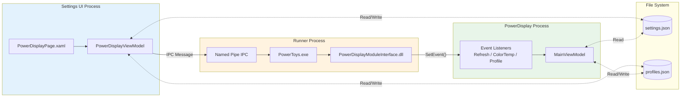
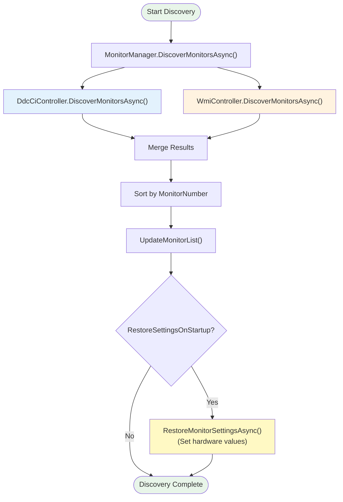
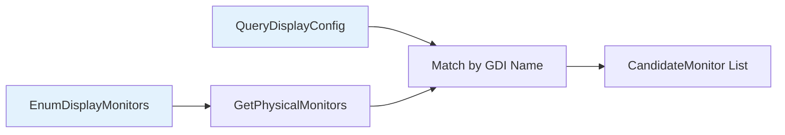
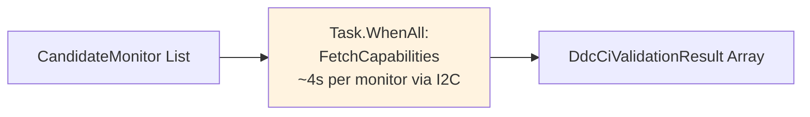
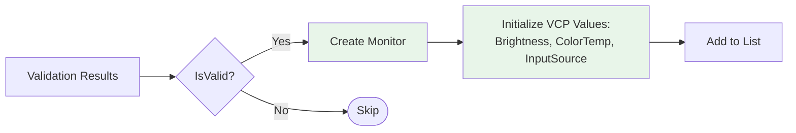
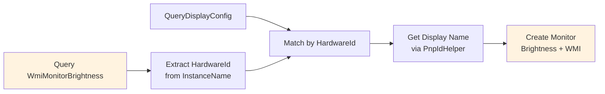

# PowerDisplay Module Design Document

## Table of Contents

1. [Background](#background)
2. [Problem Statement](#problem-statement)
3. [Goals](#goals)
4. [Technical Terminology](#technical-terminology)
   - [DDC/CI (Display Data Channel Command Interface)](#ddcci-display-data-channel-command-interface)
   - [WMI (Windows Management Instrumentation)](#wmi-windows-management-instrumentation)
5. [Architecture Overview](#architecture-overview)
   - [High-Level Component Architecture](#high-level-component-architecture)
   - [Project Structure](#project-structure)
6. [Component Design](#component-design)
   - [PowerDisplay Module Internal Structure](#powerdisplay-module-internal-structure)
   - [DisplayChangeWatcher - Monitor Hot-Plug Detection](#displaychangewatcher---monitor-hot-plug-detection)
   - [DDC/CI and WMI Interaction Architecture](#ddcci-and-wmi-interaction-architecture)
   - [IMonitorController Interface Methods](#imonitorcontroller-interface-methods)
   - [Why WmiLight Instead of System.Management](#why-wmilight-instead-of-systemmanagement)
   - [Why We Need an MCCS Capabilities String Parser](#why-we-need-an-mccs-capabilities-string-parser)
   - [Monitor Identification: Handles, IDs, and Names](#monitor-identification-handles-ids-and-names)
   - [Settings UI and PowerDisplay Interaction Architecture](#settings-ui-and-powerdisplay-interaction-architecture)
   - [Windows Events for IPC](#windows-events-for-ipc)
   - [LightSwitch Profile Integration Architecture](#lightswitch-profile-integration-architecture)
   - [LightSwitch Settings JSON Structure](#lightswitch-settings-json-structure)
7. [Data Flow and Communication](#data-flow-and-communication)
   - [Monitor Discovery Flow](#monitor-discovery-flow)
8. [Sequence Diagrams](#sequence-diagrams)
   - [Sequence: Modifying Monitor Settings in Settings UI](#sequence-modifying-monitor-settings-in-settings-ui)
   - [Sequence: Creating and Saving a Profile](#sequence-creating-and-saving-a-profile)
   - [Sequence: Applying Profile via LightSwitch Theme Change](#sequence-applying-profile-via-lightswitch-theme-change)
   - [Sequence: UI Slider Adjustment (Brightness)](#sequence-ui-slider-adjustment-brightness)
   - [Sequence: Module Enable/Disable Lifecycle](#sequence-module-enabledisable-lifecycle)
9. [Future Considerations](#future-considerations)
   - [Already Implemented](#already-implemented)
   - [Potential Future Enhancements](#potential-future-enhancements)
10. [References](#references)

---

## Background

PowerDisplay is a PowerToys module designed to provide unified control over display
settings across multiple monitors. Users often work with multiple displays (external monitors or laptop screens) and need a
convenient way to adjust display parameters such as brightness, contrast, color
temperature, volume, and input source without navigating through individual monitor
OSD menus.

The module leverages two primary technologies for monitor control:

1. **DDC/CI (Display Data Channel Command Interface)** - For external monitors
2. **WMI (Windows Management Instrumentation)** - For internal(laptop) displays

---

## Problem Statement

Users with multiple monitors face several challenges:

1. **Fragmented Control**: Each monitor requires separate OSD navigation
2. **Inconsistent Brightness**: Difficult to maintain uniform brightness across displays
3. **No Profile Support**: Cannot quickly switch display configurations for different
   scenarios (gaming, productivity, movie watching)
4. **Theme Integration Gap**: No automatic display adjustment when switching between
   light and dark themes

---

## Goals

- Provide unified control for brightness, contrast, volume, color temperature, and
  input source across all connected monitors
- Support both DDC/CI (external monitors) and WMI (laptop displays)
- Support user-defined profiles for quick configuration switching
- Integrate with LightSwitch module for automatic profile application on theme changes
- Support global hotkey activation

---

## Technical Terminology

### DDC/CI (Display Data Channel Command Interface)

**DDC/CI** is a VESA standard (defined in the DDC specification) that allows
bidirectional communication between a computer and a display over the I2C bus
embedded in display cables.

Most external monitors support DDC/CI, allowing applications to read and modify settings
like brightness and contrast programmatically. But unfortunately, some manufacturers have poor implementations of their product's driver. They may not support DDC/CI or report itself supports DDC/CI (through capabilities string) when it does not. Even if a monitor supports DDC/CI, they may only support a limited subset of VCP codes, or have buggy implementations.

And sometimes, users may connect monitor through a KVM switch or docking station that does not pass through DDC/CI commands correctly, and their docking may report it supports (hard code a capabilities string) but in reality, it does not. And will do thing when we try to send DDC/CI commands.

PowerDisplay relies on the monitor-reported capabilities string to determine supported features. But if your monitor's manufacturer has a poor DDC/CI implementation, or you are connecting through a docking station that does not properly support DDC/CI, some features may not work as expected. And we can do nothing about it.

**Key Concepts:**

| Term | Description |
|------|-------------|
| **VCP (Virtual Control Panel)** | Standardized codes for monitor settings |
| **MCCS (Monitor Command Control Set)** | VESA standard defining VCP codes |
| **Capabilities String** | Monitor-reported string describing supported features |

**Common VCP Codes Used:**

| VCP Code | Name | Description |
|----------|------|-------------|
| `0x10` | Brightness | Display luminance (0-100) |
| `0x12` | Contrast | Display contrast ratio (0-100) |
| `0x14` | Select Color Preset | Color temperature presets (sRGB, 5000K, 6500K, etc.) |
| `0x60` | Input Source | Active video input (HDMI, DP, USB-C, etc.) |
| `0x62` | Volume | Speaker/headphone volume (0-100) |

---

### WMI (Windows Management Instrumentation)

**WMI** is Microsoft's implementation of Web-Based Enterprise Management (WBEM),
providing a standardized interface for accessing management information in Windows.
For display control, WMI is primarily used for laptop internal displays that may not
support DDC/CI.

---

## Architecture Overview

### High-Level Component Architecture


This high-level view shows the module boundaries. See [Component Design](#component-design)
for internal structure details.

---

### Project Structure

```
src/modules/powerdisplay/
├── PowerDisplay.Lib/                 # Core library (shared)
│   ├── Drivers/
│   │   ├── DDC/
│   │   │   ├── DdcCiController.cs    # DDC/CI implementation
│   │   │   ├── DdcCiNative.cs        # P/Invoke declarations & QueryDisplayConfig
│   │   │   ├── MonitorDiscoveryHelper.cs
│   │   │   └── PhysicalMonitorHandleManager.cs
│   │   ├── WMI/
│   │   │   └── WmiController.cs      # WMI implementation (WmiLight library)
│   │   ├── NativeConstants.cs        # Win32 constants (VCP codes, etc.)
│   │   ├── NativeDelegates.cs        # P/Invoke delegate types
│   │   ├── NativeStructures.cs       # Win32 structures
│   │   └── PInvoke.cs                # P/Invoke declarations
│   ├── Interfaces/
│   │   ├── IMonitorController.cs     # Controller abstraction
│   │   ├── IMonitorData.cs           # Monitor data interface
│   │   └── IProfileService.cs        # Profile service interface
│   ├── Models/
│   │   ├── Monitor.cs                # Runtime monitor data
│   │   ├── MonitorCapabilities.cs    # Monitor capability flags
│   │   ├── MonitorOperationResult.cs # Operation result
│   │   ├── MonitorStateEntry.cs      # Persisted monitor state
│   │   ├── MonitorStateFile.cs       # State file schema
│   │   ├── PowerDisplayProfile.cs    # Profile definition
│   │   ├── PowerDisplayProfiles.cs   # Profile collection
│   │   ├── ProfileMonitorSetting.cs  # Per-monitor profile settings
│   │   ├── ProfileOperation.cs       # Profile operation for IPC
│   │   ├── ColorTemperatureOperation.cs  # Color temp operation for IPC
│   │   ├── ColorPresetItem.cs        # Color preset UI item
│   │   ├── VcpCapabilities.cs        # Parsed VCP capabilities
│   │   └── VcpFeatureValue.cs        # VCP feature value (current/min/max)
│   ├── Serialization/
│   │   └── ProfileSerializationContext.cs  # JSON source generation
│   ├── Services/
│   │   ├── DisplayRotationService.cs # Display rotation via ChangeDisplaySettingsEx
│   │   ├── MonitorStateManager.cs    # State persistence (debounced save) and restore on startup
│   │   └── ProfileService.cs         # Profile persistence
│   ├── Utils/
│   │   ├── ColorTemperatureHelper.cs # Color temp utilities
│   │   ├── EventHelper.cs            # Windows Event utilities
│   │   ├── MccsCapabilitiesParser.cs # DDC/CI capabilities parser
│   │   ├── MonitorFeatureHelper.cs   # Monitor feature utilities
│   │   ├── MonitorMatchingHelper.cs  # Profile-to-monitor matching
│   │   ├── MonitorValueConverter.cs  # Value conversion utilities
│   │   ├── PnpIdHelper.cs            # PnP manufacturer ID lookup
│   │   ├── ProfileHelper.cs          # Profile helper utilities
│   │   ├── SimpleDebouncer.cs        # Generic debouncer
│   │   └── VcpNames.cs               # VCP code and value name lookup
│   └── PathConstants.cs              # File path constants
│
├── PowerDisplay/                     # WinUI 3 application
│   ├── Assets/                       # App icons and images
│   ├── Configuration/
│   │   └── AppConstants.cs           # Application constants
│   ├── Helpers/
│   │   ├── DisplayChangeWatcher.cs   # Monitor hot-plug detection (WinRT DeviceWatcher)
│   │   ├── MonitorManager.cs         # Discovery orchestrator
│   │   ├── NativeEventWaiter.cs      # Windows Event waiting
│   │   ├── ResourceLoaderInstance.cs # Resource loader singleton
│   │   ├── SettingsDeepLink.cs       # Deep link to Settings UI
│   │   ├── TrayIconService.cs        # System tray integration
│   │   ├── TypePreservation.cs       # AOT type preservation
│   │   └── WindowHelper.cs           # Window utilities
│   ├── PowerDisplayXAML/
│   │   ├── App.xaml / App.xaml.cs    # Application entry point
│   │   ├── MainWindow.xaml / .cs     # Main UI window
│   │   ├── IdentifyWindow.xaml / .cs # Monitor identify overlay
│   │   └── MonitorIcon.xaml / .cs    # Monitor icon control
│   ├── Serialization/
│   │   └── JsonSourceGenerationContext.cs  # JSON source generation
│   ├── Services/
│   │   └── LightSwitchService.cs     # LightSwitch theme change handling
│   ├── Strings/                      # Localization resources (en-us)
│   ├── Telemetry/
│   │   └── Events/
│   │       └── PowerDisplayStartEvent.cs  # Telemetry event
│   ├── ViewModels/
│   │   ├── InputSourceItem.cs        # Input source dropdown item
│   │   ├── MainViewModel.cs          # Main VM (partial class)
│   │   ├── MainViewModel.Monitors.cs # Monitor discovery methods
│   │   ├── MainViewModel.Settings.cs # Settings persistence methods
│   │   └── MonitorViewModel.cs       # Per-monitor VM
│   ├── GlobalUsings.cs               # Global using directives
│   └── Program.cs                    # Application entry point
│
├── PowerDisplay.Lib.UnitTests/       # Unit tests
│   ├── MccsCapabilitiesParserTests.cs
│   └── MonitorMatchingHelperTests.cs
│
└── PowerDisplayModuleInterface/      # C++ DLL (module interface)
    ├── dllmain.cpp                   # PowertoyModuleIface impl
    ├── Constants.h                   # Module constants (event names, timeouts)
    ├── resource.h                    # Resource definitions
    ├── pch.h / pch.cpp               # Precompiled headers
    └── Trace.h / Trace.cpp           # ETW telemetry tracing
```

---

## Component Design

### PowerDisplay Module Internal Structure


---

### DisplayChangeWatcher - Monitor Hot-Plug Detection

The `DisplayChangeWatcher` component provides automatic detection of monitor connect/disconnect events using the WinRT DeviceWatcher API.

**Key Features:**
- Uses `DisplayMonitor.GetDeviceSelector()` to watch for display device changes
- Implements 1-second debouncing to coalesce rapid connect/disconnect events
- Triggers `DisplayChanged` event to notify `MainViewModel` for monitor list refresh
- Runs continuously after initial monitor discovery completes

**Implementation Details:**
```csharp
// Device selector for display monitors
string selector = DisplayMonitor.GetDeviceSelector();
_deviceWatcher = DeviceInformation.CreateWatcher(selector);

// Events monitored
_deviceWatcher.Added += OnDeviceAdded;      // New monitor connected
_deviceWatcher.Removed += OnDeviceRemoved;  // Monitor disconnected
_deviceWatcher.Updated += OnDeviceUpdated;  // Monitor properties changed
```

**Debouncing Strategy:**
- Each device change event schedules a `DisplayChanged` event after 1 second
- Subsequent events within the debounce window cancel the previous timer
- This prevents excessive refreshes when multiple monitors change simultaneously

---

### DDC/CI and WMI Interaction Architecture


### IMonitorController Interface Methods


---

### Why WmiLight Instead of System.Management

PowerDisplay uses the [WmiLight](https://github.com/MartinKuschnik/WmiLight) NuGet package
for WMI operations instead of the built-in `System.Management` namespace. This decision was
driven by several technical requirements:

#### Native AOT Compatibility

PowerDisplay is built with Native AOT (Ahead-of-Time compilation) enabled for improved startup
performance and reduced memory footprint. The standard `System.Management` namespace is **not
compatible with Native AOT** because it relies heavily on runtime reflection and COM interop
patterns that cannot be statically analyzed.

WmiLight provides Native AOT support since version 5.0.0, making it the appropriate choice for
AOT-compiled applications.

```xml
<!-- PowerDisplay.Lib.csproj -->
<PropertyGroup>
    <IsAotCompatible>true</IsAotCompatible>
</PropertyGroup>
<ItemGroup>
    <PackageReference Include="WmiLight" />
</ItemGroup>
```

#### Memory Leak Prevention

The `System.Management` implementation has a known issue where it leaks memory on each WMI
operation. While this might be acceptable for short-lived applications, PowerDisplay runs as
a long-running background process that may perform frequent WMI queries (e.g., polling
brightness levels, responding to theme changes). WmiLight addresses this memory leak issue.

#### Lightweight API

WmiLight provides a simpler, more lightweight API compared to `System.Management`:

```csharp
// WmiLight - Simple and direct
using (var connection = new WmiConnection(@"root\WMI"))
{
    var results = connection.CreateQuery("SELECT * FROM WmiMonitorBrightness");
    foreach (var obj in results)
    {
        var brightness = obj.GetPropertyValue<byte>("CurrentBrightness");
    }
}

// System.Management - More verbose
using (var searcher = new ManagementObjectSearcher(@"root\WMI", "SELECT * FROM WmiMonitorBrightness"))
{
    foreach (ManagementObject obj in searcher.Get())
    {
        var brightness = (byte)obj["CurrentBrightness"];
    }
}
```

#### Comparison Summary

| Aspect | System.Management | WmiLight |
|--------|-------------------|----------|
| **Native AOT Support** | ❌ Not supported | ✅ Supported (v5.0.0+) |
| **Memory Leaks** | ⚠️ Leaks on remote operations | ✅ No known leaks |
| **API Complexity** | More verbose | Simpler, lighter |
| **Long-running Services** | Not recommended | ✅ Recommended |
| **Static Linking** | ❌ Not available | ✅ Optional (`PublishWmiLightStaticallyLinked`) |

#### References

- [WmiLight GitHub Repository](https://github.com/MartinKuschnik/WmiLight)
- [WmiLight NuGet Package](https://www.nuget.org/packages/WmiLight)

---

### Why We Need an MCCS Capabilities String Parser

DDC/CI monitors report their supported features via a **capabilities string** - a structured
text format defined by the VESA MCCS (Monitor Control Command Set) standard. This string
tells PowerDisplay which VCP codes the monitor supports and what values are valid for each.

#### Example Capabilities String

```
(prot(monitor)type(lcd)model(PD3220U)cmds(01 02 03 07)vcp(10 12 14(04 05 06) 60(11 12 0F))mccs_ver(2.2))
```

This string encodes:
- **Protocol**: monitor
- **Type**: LCD display
- **Model**: PD3220U
- **Supported commands**: 0x01, 0x02, 0x03, 0x07
- **VCP codes**: 0x10 (brightness), 0x12 (contrast), 0x14 (color preset with values 4,5,6), 0x60 (input source with values 0x11, 0x12, 0x0F)
- **MCCS version**: 2.2

#### Why Parse It?

| Use Case | How Parser Helps |
|----------|------------------|
| **Feature Detection** | Determine if monitor supports contrast, volume, color temperature, input switching |
| **Input Source Dropdown** | Extract valid input source values (e.g., HDMI-1=0x11, DP=0x0F) for UI dropdown |
| **Color Preset List** | Extract supported color presets (e.g., sRGB, 5000K, 6500K) |
| **Diagnostics** | Display raw VCP codes in Settings UI for troubleshooting |
| **PIP/PBP Support** | Parse window capabilities for Picture-in-Picture features |

#### Why Not Use Regex?

The MCCS capabilities string format has **nested parentheses** that regex cannot reliably handle:

```
vcp(10 12 14(04 05 06) 60(11 12 0F))
         ^^^^^^^^^^^^ nested values
```

A recursive descent parser properly handles:
- Nested parentheses at arbitrary depth
- Variable whitespace (some monitors use `01 02 03`, others use `010203`)
- Optional outer parentheses (some monitors omit them)
- Unknown segments (graceful skip without failing)

#### Implementation

PowerDisplay implements a **zero-allocation recursive descent parser** using `ref struct` and
`ReadOnlySpan<char>` for optimal performance during monitor discovery.

```csharp
// Usage in DdcCiController
var result = MccsCapabilitiesParser.Parse(capabilitiesString);
if (result.IsValid)
{
    monitor.VcpCapabilitiesInfo = result.Capabilities;
    // Now we know which features this monitor supports
}
```

> **Detailed Design:** See [mccsParserDesign.md](./mccsParserDesign.md) for the complete
> parser architecture, grammar definition, and implementation details.

---

### Monitor Identification: Handles, IDs, and Names

Understanding how Windows identifies monitors is critical for PowerDisplay's operation.
Different Windows APIs use different identifiers, and PowerDisplay must correlate these
to provide a unified view across DDC/CI and WMI subsystems.

#### Windows Display Subsystem Overview


#### Identifier Definitions

| Identifier | Source | Format | Example | Scope |
|------------|--------|--------|---------|-------|
| **HMONITOR** | `EnumDisplayMonitors` | `IntPtr` | `0x00010001` | Logical monitor (may represent multiple physical monitors in clone mode) |
| **GDI Device Name** | `GetMonitorInfo` / `QueryDisplayConfig` | String | `\\.\DISPLAY1` | Adapter output; multiple targets can share same GDI name in mirror mode |
| **Physical Monitor Handle** | `GetPhysicalMonitorsFromHMONITOR` | `IntPtr` | `0x00000B14` | DDC/CI communication handle; valid for `GetVCPFeature` / `SetVCPFeature` |
| **Device Path** | `QueryDisplayConfig` | String | `\\?\DISPLAY#DEL41B4#5&12a3b4c&0&UID123#{...}` | Unique per target; used as primary key in `MonitorDisplayInfo` |
| **Hardware ID** | EDID (via `QueryDisplayConfig`) | String | `DEL41B4` | Manufacturer (3-char PnP ID) + Product Code (4-char hex); identifies monitor model |
| **WMI Instance Name** | `WmiMonitorBrightness` | String | `DISPLAY\BOE0900\4&10fd3ab1&0&UID265988_0` | WMI object identifier; contains hardware ID in second segment |
| **Monitor Number** | `QueryDisplayConfig` path index | Integer | `1`, `2`, `3` | 1-based; matches Windows Settings → Display → "Identify" feature |

#### DDC/CI Monitor Discovery Flow


#### WMI Monitor Discovery Flow


#### Key Relationships

##### GDI Device Name ↔ Physical Monitors


In **mirror/clone mode**, multiple physical monitors share the same GDI device name.
QueryDisplayConfig returns multiple paths with the same `GdiDeviceName` but different
`DevicePath` values, allowing us to distinguish them.

##### DisplayPort Daisy Chain (MST - Multi-Stream Transport)

**Daisy chaining** allows multiple monitors to be connected in series through a single
DisplayPort output using MST (Multi-Stream Transport) technology. This creates unique
challenges for monitor identification.


**How Windows Handles MST:**

| Aspect | Behavior |
|--------|----------|
| **HMONITOR** | Each daisy-chained monitor gets its own HMONITOR |
| **GDI Device Name** | Each monitor gets a unique GDI name (e.g., `\\.\DISPLAY1`, `\\.\DISPLAY2`) |
| **Physical Monitor Handle** | Each monitor has its own physical handle for DDC/CI |
| **Device Path** | Unique for each monitor in the chain |
| **Hardware ID** | Different if monitors are different models; same if identical models |

**MST vs Clone Mode Comparison:**

| Property | MST Daisy Chain (Extended Desktop) | Clone/Mirror Mode |
|----------|-----------------------------------|-------------------|
| **HMONITOR** | Separate per monitor (HMONITOR_1, HMONITOR_2, ...) | Shared (single HMONITOR_1) |
| **GDI Device Name** | Unique per monitor (`\\.\DISPLAY1`, `\\.\DISPLAY2`, ...) | Shared (`\\.\DISPLAY1`) |
| **Physical Handle** | One per HMONITOR (A, B, C) | Multiple per HMONITOR (A, B) |
| **DevicePath** | Unique per monitor (unique1, unique2, ...) | Unique per monitor (unique1, unique2) |
| **Behavior** | Each monitor = independent logical display | Multiple monitors share same logical display |

**PowerDisplay Handling of MST:**

1. **Discovery**: `EnumDisplayMonitors` returns separate HMONITOR for each MST monitor
2. **Physical Handles**: `GetPhysicalMonitorsFromHMONITOR` returns one handle per HMONITOR
3. **Matching**: QueryDisplayConfig provides unique DevicePath for each MST target
4. **DDC/CI**: Each monitor in the chain can be controlled independently via its handle

**Identifying Same-Model Monitors in Daisy Chain:**

When multiple identical monitors are daisy-chained (same Hardware ID), PowerDisplay
distinguishes them using:

- **MonitorNumber**: Different path index in QueryDisplayConfig (1, 2, 3...)
- **DevicePath**: Unique system-generated path for each target
- **Monitor.Id**: Format `DDC_{HardwareId}_{MonitorNumber}` ensures uniqueness

Example with two identical Dell U2722D monitors:

| Monitor | Id | MonitorNumber |
|---------|-----|---------------|
| Monitor 1 | `DDC_DEL41B4_1` | 1 |
| Monitor 2 | `DDC_DEL41B4_2` | 2 |

##### Connection Mode Summary

| Mode | HMONITOR | GDI Device Name | Physical Handles | Use Case |
|------|----------|-----------------|------------------|----------|
| **Standard** (separate cables) | 1 per monitor | Unique per monitor | 1 per HMONITOR | Most common setup |
| **Clone/Mirror** | 1 shared | Shared | Multiple per HMONITOR | Presentation, duplication |
| **MST Daisy Chain** | 1 per monitor | Unique per monitor | 1 per HMONITOR | Reduced cable clutter |
| **USB-C/Thunderbolt Hub** | 1 per monitor | Unique per monitor | 1 per HMONITOR | Laptop docking |

**Key Insight**: From PowerDisplay's perspective, MST daisy chain and standard multi-cable
setups behave identically - each monitor appears as an independent display with unique
identifiers. Only clone/mirror mode requires special handling due to shared HMONITOR/GDI names.

##### Hardware ID Composition


The **PnP Manufacturer ID** is a 3-character code assigned by UEFI Forum.
Common laptop display manufacturers:

| PnP ID | Manufacturer |
|--------|--------------|
| `BOE` | BOE Technology |
| `LGD` | LG Display |
| `AUO` | AU Optronics |
| `CMN` | Chi Mei Innolux |
| `SDC` | Samsung Display |
| `SHP` | Sharp |
| `LEN` | Lenovo |
| `DEL` | Dell |

##### WMI Instance Name Parsing


##### Monitor Number (Windows Display Settings)

The `MonitorNumber` in PowerDisplay corresponds exactly to the number shown in:
- Windows Settings → System → Display → "Identify" button
- The number overlay that appears on each display

This is derived from the **path index** in `QueryDisplayConfig`:
- `paths[0]` → Monitor 1
- `paths[1]` → Monitor 2
- etc.

#### Display Rotation and GDI Device Name

The `ChangeDisplaySettingsEx` API requires the **GDI Device Name** to target a specific display:

```cpp
// Correct: Target specific display by GDI name
ChangeDisplaySettingsEx("\\.\DISPLAY2", &devMode, NULL, 0, NULL);

// Wrong: NULL affects primary display only
ChangeDisplaySettingsEx(NULL, &devMode, NULL, 0, NULL);
```

PowerDisplay stores `GdiDeviceName` in each `Monitor` object specifically for rotation operations.

#### Cross-Reference Summary

| PowerDisplay Property | DDC/CI Source | WMI Source |
|-----------------------|---------------|------------|
| `Monitor.Id` | `"DDC_{HardwareId}_{MonitorNumber}"` | `"WMI_{HardwareId}_{MonitorNumber}"` |
| `Monitor.Handle` | Physical Monitor Handle | N/A (uses InstanceName) |
| `Monitor.InstanceName` | N/A | WMI InstanceName |
| `Monitor.GdiDeviceName` | QueryDisplayConfig | QueryDisplayConfig |
| `Monitor.MonitorNumber` | QueryDisplayConfig path index | QueryDisplayConfig (matched by HardwareId) |
| `Monitor.Name` | EDID FriendlyName or Description | PnpIdHelper.GetBuiltInDisplayName() |

---

### Settings UI and PowerDisplay Interaction Architecture



**Data Models (in Settings.UI.Library):**

| Model | Purpose |
|-------|---------|
| `PowerDisplaySettings` | Main settings container with properties and pending operations |
| `MonitorInfo` | Per-monitor settings displayed in Settings UI |
| `ProfileOperation` | Pending profile apply operation |
| `ColorTemperatureOperation` | Pending color temperature change |

### Windows Events for IPC

Event names use fixed GUID suffixes to ensure uniqueness (defined in `shared_constants.h`).

| Constant | Direction | Purpose |
|----------|-----------|---------|
| `TOGGLE_POWER_DISPLAY_EVENT` | Runner → App | Toggle visibility |
| `TERMINATE_POWER_DISPLAY_EVENT` | Runner → App | Terminate process |
| `REFRESH_POWER_DISPLAY_MONITORS_EVENT` | Settings → App | Refresh monitor list |
| `APPLY_COLOR_TEMPERATURE_POWER_DISPLAY_EVENT` | Settings → App | Apply color temp |
| `APPLY_PROFILE_POWER_DISPLAY_EVENT` | Settings → App | Apply profile |
| `LightSwitchLightThemeEventName` | LightSwitch → App | Apply light mode profile |
| `LightSwitchDarkThemeEventName` | LightSwitch → App | Apply dark mode profile |

**Event Name Format:** `Local\PowerToysPowerDisplay-{EventType}-{GUID}`

Example: `Local\PowerToysPowerDisplay-ToggleEvent-5f1a9c3e-7d2b-4e8f-9a6c-3b5d7e9f1a2c`

---

### LightSwitch Profile Integration Architecture


### LightSwitch Settings JSON Structure

```json
{
  "properties": {
    "apply_monitor_settings": { "value": true },
    "enable_light_mode_profile": { "value": true },
    "light_mode_profile": { "value": "Productivity" },
    "enable_dark_mode_profile": { "value": true },
    "dark_mode_profile": { "value": "Night Mode" }
  }
}
```

---

## Data Flow and Communication

### Monitor Discovery Flow



> **Note:** DDC/CI and WMI discovery run in parallel via `Task.WhenAll`.
>
> **Settings Restore:** When `RestoreSettingsOnStartup` is enabled, `RestoreMonitorSettingsAsync()` is called
> after monitor discovery to restore saved brightness, contrast, color temperature, and volume values
> to the hardware. The UI remains in "scanning" state until restore completes.

#### DDC/CI Discovery (Three-Phase Approach)

**Phase 1: Collect Candidates**



**Phase 2: Fetch Capabilities (Parallel)**



**Phase 3: Create Monitors**



#### WMI Discovery



#### Key Differences

| Aspect | DDC/CI | WMI |
|--------|--------|-----|
| **Target** | External monitors | Internal laptop displays |
| **Capabilities** | Full VCP support (brightness, contrast, volume, color temp, input) | Brightness only |
| **Discovery** | Three-phase with parallel I2C fetching | Single WMI query |
| **Initialization** | Reads current values for all supported VCP codes | Brightness from query result |
| **Performance** | ~4s per monitor (I2C), parallelized | Fast (~100ms total) |

---

## Sequence Diagrams

### Sequence: Modifying Monitor Settings in Settings UI


---

### Sequence: Creating and Saving a Profile


---

### Sequence: Applying Profile via LightSwitch Theme Change

```mermaid
sequenceDiagram
    participant System as Windows System
    participant LightSwitch as LightSwitchStateManager (C++)
    participant WinEvent as Windows Events
    participant EventWaiter as NativeEventWaiter
    participant LSSvc as LightSwitchService
    participant MainVM as MainViewModel
    participant ProfileService
    participant MonitorVM as MonitorViewModel
    participant Controller as IMonitorController
    participant Monitor as Physical Monitor

    Note over System: Time reaches threshold<br/>or user changes theme
    System->>LightSwitch: Theme change detected

    LightSwitch->>LightSwitch: EvaluateAndApplyIfNeeded()
    LightSwitch->>LightSwitch: ApplyTheme(isLight)

    LightSwitch->>LightSwitch: NotifyPowerDisplay(isLight)
    Note over LightSwitch: Check if profile enabled

    alt isLight == true
        LightSwitch->>WinEvent: SetEvent("Local\\PowerToys_LightSwitch_LightTheme")
    else isLight == false
        LightSwitch->>WinEvent: SetEvent("Local\\PowerToys_LightSwitch_DarkTheme")
    end

    Note over EventWaiter: Background thread waiting<br/>on both Light and Dark events
    EventWaiter->>WinEvent: WaitAny([lightEvent, darkEvent]) returns index

    Note over EventWaiter: Theme determined from event:<br/>index 0 = Light, index 1 = Dark
    EventWaiter->>LSSvc: GetProfileForTheme(isLightMode)
    LSSvc->>LSSvc: Read LightSwitch/settings.json
    LSSvc-->>EventWaiter: profileName (or null)

    EventWaiter->>MainVM: Dispatch to UI thread with profileName

    MainVM->>ProfileService: LoadProfiles()
    ProfileService-->>MainVM: PowerDisplayProfiles

    MainVM->>MainVM: Find profile by name
    MainVM->>MainVM: ApplyProfileAsync(profile.MonitorSettings)

    loop For each ProfileMonitorSetting
        MainVM->>MainVM: Find MonitorViewModel by InternalName

        alt Brightness specified
            MainVM->>MonitorVM: SetBrightnessAsync(value, immediate=true)
            MonitorVM->>Controller: SetBrightnessAsync(monitor, value)
            Controller->>Monitor: DDC/CI or WMI call
            Monitor-->>Controller: Success
        end

        alt Contrast specified
            MainVM->>MonitorVM: SetContrastAsync(value, immediate=true)
            MonitorVM->>Controller: SetContrastAsync(monitor, value)
            Controller->>Monitor: SetVCPFeature(0x12, value)
        end

        alt Volume specified
            MainVM->>MonitorVM: SetVolumeAsync(value, immediate=true)
            MonitorVM->>Controller: SetVolumeAsync(monitor, value)
            Controller->>Monitor: SetVCPFeature(0x62, value)
        end

        alt ColorTemperature specified
            MainVM->>MonitorVM: SetColorTemperatureAsync(vcpValue)
            MonitorVM->>Controller: SetColorTemperatureAsync(monitor, vcpValue)
            Controller->>Monitor: SetVCPFeature(0x14, vcpValue)
        end

        alt Orientation specified
            MainVM->>MonitorVM: SetOrientationAsync(orientation)
            MonitorVM->>Controller: SetRotationAsync(monitor, orientation)
            Controller->>Monitor: ChangeDisplaySettingsEx
        end
    end

    Note over MainVM: await Task.WhenAll(updateTasks)
    MainVM->>MainVM: Log profile application complete
```

---

### Sequence: UI Slider Adjustment (Brightness)

```mermaid
sequenceDiagram
    participant User
    participant Slider as Brightness Slider
    participant MonitorVM as MonitorViewModel
    participant Debouncer as SimpleDebouncer
    participant MonitorManager
    participant Controller as DdcCiController
    participant StateManager as MonitorStateManager
    participant Monitor as Physical Monitor

    User->>Slider: Drags slider (continuous)

    loop During drag (multiple events)
        Slider->>MonitorVM: CurrentBrightness = value
        MonitorVM->>MonitorVM: SetBrightnessAsync(value, immediate=false)
        MonitorVM->>Debouncer: Debounce(300ms)
        Note over Debouncer: Resets timer on each call
    end

    User->>Slider: Releases slider

    Note over Debouncer: 300ms elapsed, no new input
    Debouncer->>MonitorVM: Execute debounced action

    MonitorVM->>MonitorVM: ApplyBrightnessToHardwareAsync()
    MonitorVM->>MonitorManager: SetBrightnessAsync(monitor, finalValue)

    MonitorManager->>Controller: SetBrightnessAsync(monitor, value)

    Controller->>Controller: SetVcpFeatureAsync(VcpCodeBrightness)
    Controller->>Monitor: SetVCPFeature(0x10, value)
    Monitor-->>Controller: OK

    Controller-->>MonitorManager: MonitorOperationResult
    MonitorManager-->>MonitorVM: Success/Failure

    MonitorVM->>StateManager: UpdateMonitorParameter("Brightness", value)

    Note over StateManager: Debounced save (2 seconds)
    StateManager->>StateManager: Schedule file write

    Note over StateManager: After 2s idle
    StateManager->>StateManager: SaveToFile(monitor_state.json)
```

---

### Sequence: Module Enable/Disable Lifecycle

```mermaid
sequenceDiagram
    participant Runner as PowerToys Runner
    participant ModuleInterface as PowerDisplayModule (C++)
    participant PowerDisplayApp as PowerDisplay.exe
    participant MonitorManager
    participant StateManager as MonitorStateManager
    participant EventHandles as Windows Events

    Note over Runner: User enables PowerDisplay
    Runner->>ModuleInterface: enable()

    ModuleInterface->>ModuleInterface: m_enabled = true
    ModuleInterface->>ModuleInterface: Trace::EnablePowerDisplay(true)

    ModuleInterface->>ModuleInterface: is_process_running()
    alt Process not running
        ModuleInterface->>PowerDisplayApp: ShellExecuteExW("PowerToys.PowerDisplay.exe", pid)
        PowerDisplayApp->>PowerDisplayApp: Initialize WinUI 3 App
        PowerDisplayApp->>PowerDisplayApp: RegisterSingletonInstance()
        PowerDisplayApp->>MonitorManager: DiscoverMonitorsAsync()

        alt RestoreSettingsOnStartup enabled
            PowerDisplayApp->>StateManager: GetMonitorParameters(monitorId)
            StateManager-->>PowerDisplayApp: Saved brightness, contrast, etc.
            PowerDisplayApp->>MonitorManager: SetBrightnessAsync(savedValue)
            PowerDisplayApp->>MonitorManager: SetContrastAsync(savedValue)
            Note over PowerDisplayApp: Restore all saved settings to hardware
        end

        PowerDisplayApp->>PowerDisplayApp: Start event listeners
        PowerDisplayApp->>EventHandles: SetEvent("Ready")
    end

    ModuleInterface->>ModuleInterface: m_hProcess = sei.hProcess

    Note over Runner: User presses hotkey
    Runner->>ModuleInterface: on_hotkey()
    ModuleInterface->>EventHandles: SetEvent(ToggleEvent)
    EventHandles->>PowerDisplayApp: Toggle visibility

    Note over Runner: User disables PowerDisplay
    Runner->>ModuleInterface: disable()

    ModuleInterface->>EventHandles: ResetEvent(InvokeEvent)
    ModuleInterface->>EventHandles: SetEvent(TerminateEvent)

    PowerDisplayApp->>PowerDisplayApp: Receive terminate signal
    PowerDisplayApp->>MonitorManager: Dispose()
    PowerDisplayApp->>PowerDisplayApp: Application.Exit()

    ModuleInterface->>ModuleInterface: CloseHandle(m_hProcess)
    ModuleInterface->>ModuleInterface: m_enabled = false
    ModuleInterface->>ModuleInterface: Trace::EnablePowerDisplay(false)
```

---

## Future Considerations

### Already Implemented

- **Monitor Hot-Plug**: `DisplayChangeWatcher` uses WinRT DeviceWatcher + DisplayMonitor API with 1-second debouncing
- **Display Rotation**: `DisplayRotationService` uses Windows ChangeDisplaySettingsEx API
- **LightSwitch Integration**: Automatic profile application on theme changes via `LightSwitchService`
- **Monitor Identification**: Overlay windows showing monitor numbers via `IdentifyWindow`
- **Mirror Mode Support**: Correct orientation sync for multiple monitors sharing the same GDI device name

### Potential Future Enhancements

1. **Advanced Color Management**: Integration with Windows Color Management APIs (HDR, ICC profiles)
2. **PIP/PBP Control**: Picture-in-Picture and Picture-by-Picture configuration (VcpCapabilities already parses window capabilities)
3. **Power State Control**: Monitor power on/off via VCP code 0xD6

---

## References

- [VESA DDC/CI Standard](https://vesa.org/vesa-standards/)
- [MCCS (Monitor Control Command Set) Specification](https://vesa.org/vesa-standards/)
- [Microsoft High-Level Monitor Configuration API](https://learn.microsoft.com/en-us/windows/win32/monitor/high-level-monitor-configuration-api)
- [WMI Reference](https://learn.microsoft.com/en-us/windows/win32/wmisdk/wmi-reference)
- [WmiMonitorBrightness Class](https://learn.microsoft.com/en-us/windows/win32/wmicoreprov/wmimonitorbrightness)
- [PowerToys Architecture Documentation](../../core/architecture.md)
