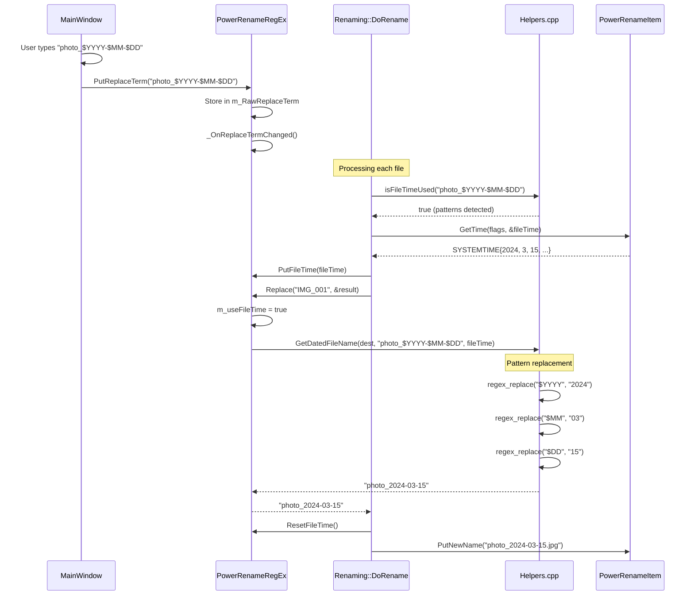
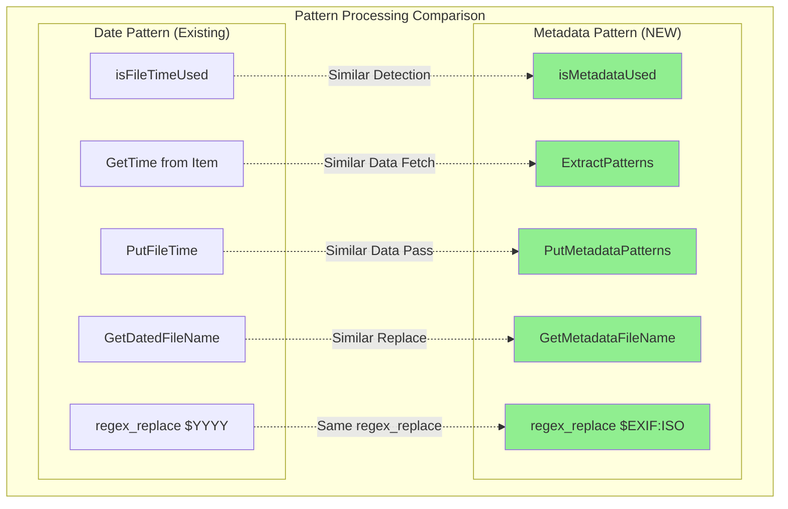
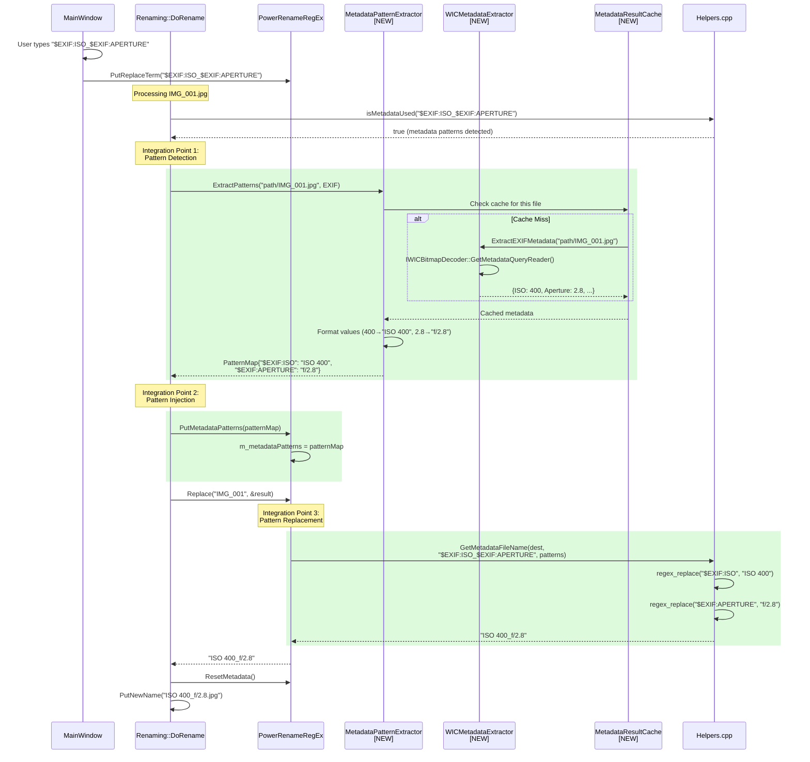
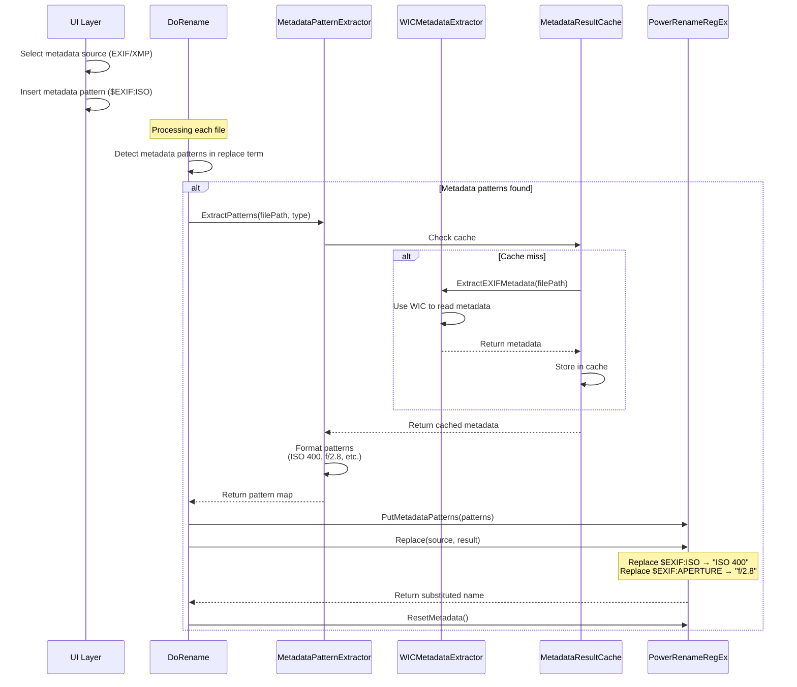

# PowerRename Metadata Replacement Feature

## Overview

The PowerRename Metadata Replacement feature extends PowerRename's capabilities to extract and use image metadata (EXIF and XMP). This feature allows users to rename files using metadata patterns such as camera model, ISO settings, date taken, GPS coordinates, and more. Which may help photographers and content creators organize their media files more effectively.

## Architecture

### High-Level Design

#### 1. Original PowerRename Pattern Replace Architecture

##### Date Pattern Replace Call Chain (Example: \$YYYY-\$MM-\$DD)



##### Core Pattern Processing Components

1. **Pattern Input & Detection**:
   - **MainWindow::SearchReplaceChanged()**: Triggered on UI text change
   - **PowerRenameRegEx::PutReplaceTerm()**: Stores replace pattern
   - **isFileTimeUsed()**: Detects date/time patterns using regex
   - **isMetadataUsed()**: Detects metadata patterns
   - **parseEnumOptions()**: Detects enumerator patterns
   - **parseRandomizerOptions()**: Detects randomizer patterns

2. **Pattern Data Acquisition**:
   - **IPowerRenameItem::GetTime()**: Retrieves file timestamps
   - **MetadataPatternExtractor::ExtractPatterns()**: Extracts metadata
   - **Enumerator/Randomizer**: Uses internal counters and generators

3. **Pattern Replacement Engine**:
   - **PowerRenameRegEx::Replace()**: Main replacement orchestrator
   - **GetDatedFileName()**: Replaces date patterns with actual values
     - Uses `regex_replace()` for each pattern ($YYYY → "2024")
     - Handles locale-specific formatting (month names, etc.)
   - **GetMetadataFileName()**: Replaces metadata patterns
   - **Enumerator/Randomizer application**: Inserts generated values

4. **Pattern Format Examples**:
   - Date: `$YYYY` (4-digit year), `$MM` (2-digit month), `$DD` (2-digit day)
   - Time: `$hh` (24-hour), `$mm` (minutes), `$ss` (seconds)
   - Metadata: `$EXIF:ISO`, `$XMP:TITLE`
   - Enumerator: `\${0:1:3}` (start:increment:padding)
   - Randomizer: `\${r:8:an}` (8 alphanumeric characters)

#### 2. Metadata Feature Integration Architecture

##### Metadata Pattern Integration in Existing Flow



##### Metadata Pattern Processing Integration Points



##### Key Integration Design Decisions

1. **Parallel Pattern Architecture**:
   - Metadata patterns follow the same flow as date patterns
   - Uses identical detection → fetch → inject → replace sequence
   - Leverages existing `regex_replace` infrastructure

2. **Minimal Code Intrusion**:
   - Only 3 integration points in existing code:
     - Detection: Added `isMetadataUsed()` check
     - Data fetch: Added metadata extraction block
     - Cleanup: Added `ResetMetadata()` call
   - No changes to core rename logic or threading model

3. **Performance Optimization**:
   - Static extractor instance (like existing pattern handlers)
   - Three-level caching prevents redundant WIC operations
   - Cache persists across entire batch operation
   - Thread-safe design for worker thread compatibility

4. **UI Integration Strategy**:
   - Metadata source selector (EXIF/XMP toggle)
   - Pattern shortcuts list (dynamic based on source)
   - Reuses existing pattern insertion mechanism

##### Metadata Data Flow



##### Key Integration Details

**1. UI Layer Integration**:
   - **MetadataSourceSelector**: ComboBox for selecting EXIF/XMP source
   - **MetadataShortcuts**: Dynamic list populated based on selected metadata type
   - **UpdateMetadataShortcuts()**: Updates pattern list when source changes
   - **UpdateMetadataSourceFlags()**: Sets PowerRenameFlags for metadata type

**2. Business Logic Integration (Renaming.cpp)**:
   - **Detection**: `isMetadataUsed()` checks for metadata patterns in replace term
   - **Extraction**: Static `MetadataPatternExtractor` instance with thread safety
   - **Cache Management**: Clears cache when metadata type changes
   - **Pattern Injection**: Calls `PutMetadataPatterns()` before `Replace()`
   - **Cleanup**: Calls `ResetMetadata()` after processing each item

**3. RegEx Layer Extension**:
   - **New Interface Methods**:
     - `PutMetadataPatterns()`: Accepts pattern map for current file
     - `ResetMetadata()`: Clears patterns after processing
     - `GetMetadataType()`: Returns active metadata source type
   - **GetMetadataFileName()**: Replaces patterns with actual values

**4. Caching Architecture**:
   - **Three-level caching**:
     1. Static extractor instance (process lifetime)
     2. MetadataResultCache (per-file results)
     3. WIC factory reuse (COM object pooling)
   - **Thread-safe design** using `std::shared_mutex` for concurrent reads
   - **Automatic cache invalidation** on metadata type change

**5. Performance Optimizations**:
   - Metadata extraction only occurs when patterns are detected
   - Cache persists across entire rename operation
   - Single static extractor instance shared across threads
   - Lazy initialization using `std::once_flag`

### Related Information

#### WIC (Windows Imaging Component)
We will use WIC to extract metadata from image files. WIC supports a wide range of image formats and provides access to EXIF and XMP metadata.

WIC Documentation: [Windows Imaging Component (WIC)](https://learn.microsoft.com/en-us/windows/win32/wic/-wic-api)

Compability: WIC is available starting from Windows 7 and the last metadata related updates were made in Windows 8. So we don't need to worry about OS compatibility.

Release Notes: [WIC Release Notes](https://learn.microsoft.com/en-us/windows/win32/wic/what-s-new-in-wic-for-windows-8-1#whats-new-for-windows-10-version-1507)

#### EXIF and XMP Standards
- EXIF Specification: [EXIF 2.2 Specification](https://www.exif.org/Exif2-2.PDF)
- XMP Specification: [XMP Specification](https://www.adobe.com/devnet/xmp.html)
- EXIF extract path: https://learn.microsoft.com/en-us/windows/win32/wic/-wic-native-image-format-metadata-queries
- XMP extract path documentations: https://developer.adobe.com/xmp/docs/XMPNamespaces/xmp/

## Core Changes

### Data Types and Structures

#### [`MetadataTypes.h`](/src/modules/powerrename/lib/MetadataTypes.h)

Defines the fundamental data structures for metadata handling:

- **`MetadataType`**: Enumeration for supported metadata formats (Currently only support EXIF and XMP)
- **`EXIFMetadata`**: Structure containing all EXIF metadata fields
- **`XMPMetadata`**: Structure containing XMP metadata fields
- **`MetadataPatterns`**: List of supported metadata patterns for renaming

```cpp
enum class MetadataType {
    EXIF,  // Camera settings, date taken, GPS
    XMP    // Dublin Core, creator tools, rights
};

struct EXIFMetadata {
    std::optional<SYSTEMTIME> dateTaken;
    std::optional<std::wstring> cameraModel;
    std::optional<int64_t> iso;
    std::optional<double> aperture;
    // ... more fields
};
```

### Key classes

#### [`WICMetadataExtractor.cpp`](/src/modules/powerrename/lib/WICMetadataExtractor.cpp)

Core implementation using Windows Imaging Component with built-in caching. This class is the key brige between WIC and PowerRename.

```cpp
class WICMetadataExtractor
    {
    public:
        bool ExtractEXIFMetadata(
            const std::wstring& filePath,
            EXIFMetadata& outMetadata);

        bool ExtractXMPMetadata(
            const std::wstring& filePath,
            XMPMetadata& outMetadata);

        void ClearCache();
    private:
        MetadataResultCache cache;
    };

```

#### [`MetadataPatternExtractor.cpp`](/src/modules/powerrename/lib/MetadataPatternExtractor.cpp)

Converts metadata into replaceable patterns for file renaming. We use this class to extract patterns from metadata and pass them to the regex engine.

```cpp
    class MetadataPatternExtractor
    {
    public:
        MetadataPatternExtractor();
        ~MetadataPatternExtractor();

        MetadataPatternMap ExtractPatterns(const std::wstring& filePath, MetadataType type);

        void ClearCache();

        static std::vector<std::wstring> GetSupportedPatterns(MetadataType type);
        static std::vector<std::wstring> GetAllPossiblePatterns();

    private:
        std::unique_ptr<class WICMetadataExtractor> extractor;
    };
```

Formatting examples:
- Aperture: `2.8` → `"f/2.8"`
- Shutter: `0.004` → `"1/250s"`
- ISO: `400` → `"ISO 400"`
- GPS: `40.7608, -73.9811` → `"40°45'39"N 73°58'52"W"`


#### [`MetadataResultCache.cpp`](/src/modules/powerrename/lib/MetadataResultCache.cpp)

Thread-safe caching layer for metadata extraction results:

```cpp
class MetadataResultCache {
public:
    bool GetOrLoadEXIF(
        const std::wstring& filePath,
        EXIFMetadata& outMetadata,
        const std::function<bool(EXIFMetadata&)>& loader);

    bool GetOrLoadXMP(
        const std::wstring& filePath,
        XMPMetadata& outMetadata,
        const std::function<bool(XMPMetadata&)>& loader);

    void ClearAll();  // Clears all cached data

private:
    std::unordered_map<std::wstring, EXIFMetadata> exifCache;
    std::unordered_map<std::wstring, XMPMetadata> xmpCache;
    mutable std::shared_mutex exifMutex;  // Reader-writer lock
    mutable std::shared_mutex xmpMutex;
};
```

## Integration with PowerRename

### UI Integration

#### MainWindow.xaml Modifications

Added metadata source selector and pattern shortcuts:

```xml
<!-- Metadata Source Selector -->
<ComboBox x:Name="comboBox_metadataSource"
          SelectionChanged="MetadataSourceComboBox_SelectionChanged">
    <ComboBoxItem x:Uid="MetadataSource_EXIF" />
    <ComboBoxItem x:Uid="MetadataSource_XMP" />
</ComboBox>

<!-- Metadata Pattern List -->
<ListView ItemsSource="{x:Bind MetadataShortcuts}"
          ItemClick="MetadataItemClick">
    <ListView.ItemTemplate>
        <DataTemplate x:DataType="local:PatternSnippet">
            <Grid>
                <TextBlock Text="{x:Bind Code}" FontFamily="Consolas"/>
                <TextBlock Text="{x:Bind Description}"/>
            </Grid>
        </DataTemplate>
    </ListView.ItemTemplate>
</ListView>
```

### Data flow Integration

#### PowerRenameInterfaces Extension

Extended `IPowerRenameRegEx` interface with metadata methods:

```cpp
interface IPowerRenameRegEx : public IUnknown {
    // Existing methods...

    // New metadata methods
    IFACEMETHOD(PutMetadataPatterns)(
        _In_ const PowerRenameLib::MetadataPatternMap& patterns) = 0;
    IFACEMETHOD(ResetMetadata)() = 0;
    IFACEMETHOD(GetMetadataType)(
        _Out_ PowerRenameLib::MetadataType* metadataType) = 0;
};
```

#### Renaming.cpp Integration

Modified `DoRename` function to handle metadata:

```cpp
bool DoRename(CComPtr<IPowerRenameRegEx>& spRenameRegEx,
              unsigned long& itemEnumIndex,
              CComPtr<IPowerRenameItem>& spItem) {

    // Check if metadata patterns are used in replace term
    PWSTR replaceTerm = nullptr;
    winrt::check_hresult(spRenameRegEx->GetReplaceTerm(&replaceTerm));
    bool useMetadata = isMetadataUsed(replaceTerm);
    CoTaskMemFree(replaceTerm);

    if (useMetadata) {
        // Get file path from item
        PWSTR filePath = nullptr;
        winrt::check_hresult(spItem->GetPath(&filePath));
        std::wstring filePathStr(filePath);
        CoTaskMemFree(filePath);

        // Get metadata type from regex interface
        PowerRenameLib::MetadataType metadataType;
        HRESULT hr = spRenameRegEx->GetMetadataType(&metadataType);
        if (FAILED(hr)) {
            metadataType = PowerRenameLib::MetadataType::EXIF; // Default
        }

        // Static extractor with thread-safe initialization
        static std::mutex s_metadataMutex;
        static std::once_flag s_metadataExtractorInitFlag;
        static std::shared_ptr<MetadataPatternExtractor> s_metadataExtractor;
        static std::optional<MetadataType> s_activeMetadataType;

        // Initialize extractor once
        std::call_once(s_metadataExtractorInitFlag, []() {
            s_metadataExtractor = std::make_shared<MetadataPatternExtractor>();
        });

        // Clear cache if metadata type changed
        {
            std::lock_guard<std::mutex> lock(s_metadataMutex);
            if (s_activeMetadataType.has_value() &&
                s_activeMetadataType.value() != metadataType) {
                s_metadataExtractor->ClearCache();
            }
            s_activeMetadataType = metadataType;
        }

        // Extract patterns and pass to regex engine
        auto patterns = s_metadataExtractor->ExtractPatterns(filePathStr, metadataType);
        winrt::check_hresult(spRenameRegEx->PutMetadataPatterns(patterns));
    }

    // ... rest of rename logic
}
```

**Key implementation details**:
- Thread-safe static initialization using `std::once_flag`
- Mutex protection for shared state modifications
- Cache management when metadata type changes
- Proper COM memory management with `CoTaskMemFree`
- Error handling with `winrt::check_hresult`

## Supported Metadata Patterns

### EXIF Patterns

| Pattern | Description | Example Output |
|---------|-------------|----------------|
| `$CAMERA_MAKE` | Camera manufacturer | Canon |
| `$CAMERA_MODEL` | Camera model | EOS 5D Mark IV |
| `$LENS` | Lens model | EF24-70mm f/2.8L II USM |
| `$ISO` | ISO sensitivity | ISO 400 |
| `$APERTURE` | F-stop value | f/2.8 |
| `$SHUTTER` | Shutter speed | 1/250s |
| `$FOCAL` | Focal length | 50mm |
| `$FLASH` | Flash status | Flash fired |
| `$WIDTH` | Image width | 6000 |
| `$HEIGHT` | Image height | 4000 |
| `$AUTHOR` | Author/Artist | John Doe |
| `$COPYRIGHT` | Copyright info | © 2024 John Doe |
| `$EXPOSURE_BIAS` | Exposure compensation | +0.5 EV |
| `$ORIENTATION` | Image orientation | 1 |
| `$COLOR_SPACE` | Color space | sRGB |
| `$DATE_TAKEN_YYYY` | Year taken | 2024 |
| `$DATE_TAKEN_YY` | Year taken (2 digits) | 24 |
| `$DATE_TAKEN_MM` | Month taken | 03 |
| `$DATE_TAKEN_DD` | Day taken | 15 |
| `$DATE_TAKEN_HH` | Hour taken | 14 |
| `$DATE_TAKEN_mm` | Minute taken | 30 |
| `$DATE_TAKEN_SS` | Second taken | 45 |
| `$LATITUDE` | GPS latitude | 40°45'39"N |
| `$LONGITUDE` | GPS longitude | 73°58'52"W |
| `$ALTITUDE` | GPS altitude | 120m |

### XMP Patterns

| Pattern | Description | Example Output |
|---------|-------------|----------------|
| `$TITLE` | Document title | Sunset at Beach |
| `$DESCRIPTION` | Description | Beautiful sunset photo |
| `$CREATOR` | Author/creator | John Doe |
| `$SUBJECT` | Keywords | landscape, sunset, beach |
| `$RIGHTS` | Copyright info | © 2024 John Doe |
| `$CREATOR_TOOL` | Software used | Adobe Photoshop |
| `$CREATE_DATE_YYYY` | Creation year | 2024 |
| `$CREATE_DATE_YY` | Creation year (2 digits) | 24 |
| `$CREATE_DATE_MM` | Creation month | 03 |
| `$CREATE_DATE_DD` | Creation day | 15 |
| `$CREATE_DATE_HH` | Creation hour | 14 |
| `$CREATE_DATE_mm` | Creation minute | 30 |
| `$CREATE_DATE_SS` | Creation second | 45 |
| `$DOCUMENT_ID` | Document ID | uuid:123... |
| `$INSTANCE_ID` | Instance ID | xmp.iid:456... |
| `$ORIGINAL_DOCUMENT_ID` | Original document ID | uuid:789... |
| `$VERSION_ID` | Version ID | 1.0 |

## Performance Optimizations

### Multi-Level Caching

1. **Static Extractor Instance**: Single instance shared across operations
2. **Built-in Result Cache**: WICMetadataExtractor includes integrated caching for parsed metadata structures per file
3. **WIC Factory Cache**: Reuses COM factory instances

### Processing Strategy

The current implementation processes files sequentially as they are renamed:
- Each file's metadata is extracted on-demand when needed
- Results are cached to avoid redundant extractions
- The cache persists across the entire rename operation

### Memory Management

- **RAII Pattern**: `PropVariantValue` wrapper for automatic cleanup
- **Move Semantics**: Avoid unnecessary copies
- **String Reserve**: Pre-allocate string capacity for replacements

## Error Handling

### Extraction Results

The system uses boolean return values for extraction operations, with detailed error information logged via `OutputDebugString` for debugging purposes. All extraction methods return `true` on success and `false` on failure.

### Error Logging

Error conditions are logged with descriptive messages:
- File not found errors
- Unsupported format or decoder creation failures
- WIC decoder errors
- Missing metadata (silently returns false without logging)

### Graceful Degradation

- Missing metadata fields return empty strings
- Extraction failures don't block rename operation
- Unsupported file formats silently skip metadata extraction

## Future Work

1. Support for additional metadata formats (IPTC, JFIF, PDF and etc.) if customer demand arises.
2. Support more patterns for current metadata types. (Currently we only support a subset of EXIF and XMP fields)


### Extensibility

The architecture supports easy extension through:

- `MetadataType` enum for new metadata sources
- Pattern namespace for new pattern definitions
- Additional extractor implementations

## New Dependencies

```xml
<AdditionalDependencies>
  windowscodecs.lib   <!-- WIC for metadata extraction -->
  propsys.lib         <!-- Property system for PROPVARIANT -->
  ole32.lib           <!-- COM support -->
</AdditionalDependencies>
```
