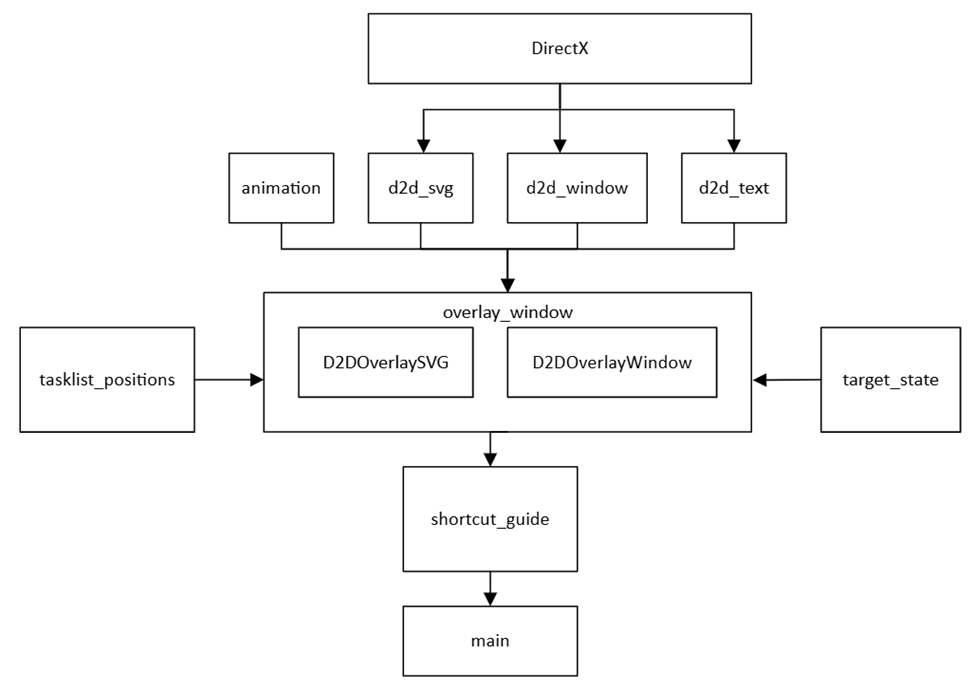

# Shortcut Guide

[Public overview - Microsoft Learn](https://learn.microsoft.com/en-us/windows/powertoys/shortcut-guide)

## Quick Links

[All Issues](https://github.com/microsoft/PowerToys/issues?q=is%3Aopen%20label%3A%22Product-Shortcut%20Guide%22) 
[Bugs](https://github.com/microsoft/PowerToys/issues?q=is%3Aopen%20label%3AIssue-Bug%20label%3A%22Product-Shortcut%20Guide%22) 
[Pull Requests](https://github.com/microsoft/PowerToys/pulls?q=is%3Apr+is%3Aopen+label%3A%22Product-Shortcut+Guide%22+)

## Overview
Shortcut Guide is a PowerToy that displays an overlay of available keyboard shortcuts when the Windows key is pressed and held. It provides a visual reference for Windows key combinations, helping users discover and utilize built-in Windows shortcuts.

## Usage
- Press and hold the Windows key to display the overlay of available shortcuts
- Press the hotkey again to dismiss the overlay
- The overlay displays Windows shortcuts with their corresponding actions

## Build and Debug Instructions

### Build
1. Open PowerToys.slnx in Visual Studio
2. Select Release or Debug in the Solutions Configuration drop-down menu
3. From the Build menu, choose Build Solution
4. The executable is named PowerToys.ShortcutGuide.exe

### Debug
1. Right-click the ShortcutGuide project and select 'Set as Startup Project'
2. Right-click the project again and select 'Debug'

## Code Structure

### Core Files

#### [`dllmain.cpp`](/src/modules/shortcut_guide/dllmain.cpp)
Contains DLL boilerplate code. Implements the PowertoyModuleIface, including enable/disable functionality and GPO policy handling. Captures hotkey events and starts the PowerToys.ShortcutGuide.exe process to display the shortcut guide window.

#### [`shortcut_guide.cpp`](/src/modules/shortcut_guide/shortcut_guide.cpp)
Contains the module interface code. It initializes the settings values and the keyboard event listener. Defines the OverlayWindow class, which manages the overall logic and event handling for the PowerToys Shortcut Guide.

#### [`overlay_window.cpp`](/src/modules/shortcut_guide/overlay_window.cpp)
Contains the code for loading the SVGs, creating and rendering of the overlay window. Manages and displays overlay windows with SVG graphics through two main classes:
- D2DOverlaySVG: Handles loading, resizing, and manipulation of SVG graphics
- D2DOverlayWindow: Manages the display and behavior of the overlay window

#### [`keyboard_state.cpp`](/src/modules/shortcut_guide/keyboard_state.cpp)
Contains helper methods for checking the current state of the keyboard.

#### [`target_state.cpp`](/src/modules/shortcut_guide/target_state.cpp)
State machine that handles the keyboard events. It's responsible for deciding when to show the overlay, when to suppress the Start menu (if the overlay is displayed long enough), etc. Handles state transitions and synchronization to ensure the overlay is shown or hidden appropriately based on user interactions.

#### [`trace.cpp`](/src/modules/shortcut_guide/trace.cpp)
Contains code for telemetry.

### Supporting Files

#### [`animation.cpp`](/src/modules/shortcut_guide/animation.cpp)
Handles the timing and interpolation of animations. Calculates the current value of an animation based on elapsed time and a specified easing function.

#### [`d2d_svg.cpp`](/src/modules/shortcut_guide/d2d_svg.cpp)
Provides functionality for loading, resizing, recoloring, rendering, and manipulating SVG images using Direct2D.

#### [`d2d_text.cpp`](/src/modules/shortcut_guide/d2d_text.cpp)
Handles creation, resizing, alignment, and rendering of text using Direct2D and DirectWrite.

#### [`d2d_window.cpp`](/src/modules/shortcut_guide/d2d_window.cpp)
Manages a window using Direct2D and Direct3D for rendering. Handles window creation, resizing, rendering, and destruction.

#### [`native_event_waiter.cpp`](/src/modules/shortcut_guide/native_event_waiter.cpp)
Waits for a named event and executes a specified action when the event is triggered. Uses a separate thread to handle event waiting and action execution.

#### [`tasklist_positions.cpp`](/src/modules/shortcut_guide/tasklist_positions.cpp)
Handles retrieving and updating the positions and information of taskbar buttons in Windows.

#### [`main.cpp`](/src/modules/shortcut_guide/main.cpp)
The entry point for the PowerToys Shortcut Guide application. Handles initialization, ensures single instance execution, manages parent process termination, creates and displays the overlay window, and runs the main event loop.

## Features and Limitations

- The overlay displays Windows shortcuts (Windows key combinations)
- The module supports localization, but only for the Windows controls on the left side of the overlay
- It's currently rated as a P3 (lower priority) module

## Future Development

A community-contributed version 2 is in development that will support:
- Application-specific shortcuts based on the active application
- Additional shortcuts beyond Windows key combinations
- PowerToys shortcuts
