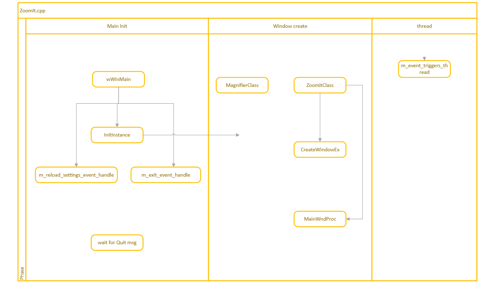
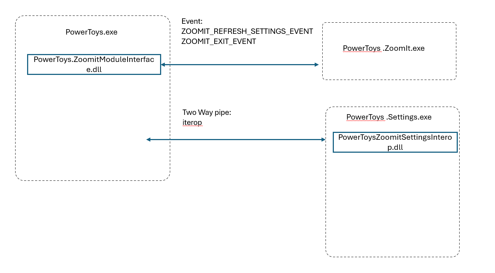

# ZoomIt Module

[Public overview - Microsoft Learn](https://learn.microsoft.com/en-us/windows/powertoys/zoomit)

## Quick Links

[All Issues](https://github.com/microsoft/PowerToys/issues?q=is%3Aopen%20label%3AProduct-ZoomIt)<br>
[Bugs](https://github.com/microsoft/PowerToys/issues?q=is%3Aopen%20label%3AProduct-ZoomIt%20label%3AIssue-Bug%20)<br>
[Pull Requests](https://github.com/microsoft/PowerToys/pulls?q=is%3Apr+is%3Aopen+label%3AProduct-ZoomIt)

## Overview

ZoomIt is a screen zoom and annotation tool originally from Microsoft's Sysinternals suite. It allows users to:

- Zoom in on specific areas of the screen
- Draw and annotate on the screen while zoomed in
- Use a timer for presentations or breaks
- Pan and move while zoomed in
- Record screen activity with audio

ZoomIt runs in the background and is activated via customizable hotkeys.

## Special Integration Considerations

Unlike other PowerToys modules, ZoomIt has some unique integration aspects:

1. **Registry-based Settings**: ZoomIt uses registry settings instead of JSON files (which is the standard for other PowerToys modules). This was required to maintain compatibility with the standalone Sysinternals version.

2. **Dual Source of Truth**: The PowerToys repository serves as the source of truth for both the PowerToys version and the standalone Sysinternals version, with build flags to differentiate between them.

3. **Settings Integration**: A special WinRT/C++ interop library was developed to bridge between PowerToys' JSON-based settings system and ZoomIt's registry-based settings.

## Technical Architecture

The ZoomIt module consists of the following components:

1. **ZoomIt Executable** (`PowerToys.ZoomIt.exe`): The main ZoomIt application that provides the zooming and annotation functionality.

2. **Module Interface** (`PowerToys.ZoomItModuleInterface.dll`): Implements the PowerToys module interface to integrate with the PowerToys runner.

3. **Settings Interop** (`ZoomItSettingsInterop`): A WinRT/C++ interop library that enables communication between PowerToys settings and ZoomIt's registry settings.



### Directory Structure

```
src/
├── modules/
│   └── ZoomIt/
│       ├── ZoomIt/             # Main ZoomIt application code
│       ├── ZoomItModuleInterface/  # PowerToys module interface implementation
│       └── ZoomItSettingsInterop/  # WinRT/C++ interop for settings
├── settings-ui/
│   └── Settings.UI/
│       ├── SettingsXAML/
│       │   └── Views/
│       │       └── ZoomItPage.xaml  # ZoomIt settings page UI
│       └── ViewModels/
│           └── ZoomItViewModel.cs   # ZoomIt settings view model
└── common/
    └── sysinternals/          # Common code from Sysinternals
```


## Settings Management

ZoomIt's settings are stored in the Windows registry instead of JSON files to maintain compatibility with the standalone version. The settings include:

- Hotkey combinations for different modes (zoom, draw, etc.)
- Drawing options (colors, line thickness, etc.)
- Font settings for text annotations
- Microphone selection for recording
- Custom file paths for demo mode and break backgrounds

The `ZoomItSettingsInterop` library handles:
1. Loading settings from registry and converting to JSON for PowerToys settings UI
2. Saving changes from the settings UI back to the registry
3. Notifying the ZoomIt application when settings change



## Integration Steps

The integration of ZoomIt into PowerToys involved these key steps:

1. **Code Migration**:
   - Moving code from the Sysinternals ZoomIt repository to `src/modules/ZoomIt/ZoomIt`
   - Adding required common libraries to `src/common/sysinternals`
   - Sanitizing code for open source (removing private APIs, undocumented details, etc.)
   - Ensuring no private APIs (validated through APIScan)
   - Removing references to undocumented implementation details, constants, and names
   - Standardizing dependencies with other PowerToys utilities

2. **Module Interface Implementation**:
   - Creating the PowerToys module interface
   - Adding process management (start/terminate)
   - Implementing event-based communication for settings updates
   - Adding named events for communication between PowerToys and ZoomIt

3. **Settings Integration**:
   - Extracting ZoomIt settings code to a shareable component
   - Creating a WinRT/C++ interop library for registry-JSON conversion
   - Implementing all settings UI controls in PowerToys settings
   - Building `ZoomItSettingsInterop` as a bridge between registry and JSON settings

4. **PowerToys Integration**:
   - Adding ZoomIt to the PowerToys runner
   - Adding GPO rules for ZoomIt
   - Implementing telemetry and logging
   - Creating OOBE (out-of-box experience) page with animated tutorial
   - Adding ZoomIt to process termination list for proper cleanup
   - Adding telemetry events documentation

5. **UI/UX Adjustments**:
   - Redirecting ZoomIt's settings UI to PowerToys settings
   - Handling hotkey conflicts with warning notifications
   - Modifying tray icon behavior
   - Removing original ZoomIt options menu entries
   - Adding Sysinternals attribution on the settings page

6. **Build System Updates**:
   - Adding ZoomIt to the PowerToys solution
   - Implementing build flags for standalone vs. PowerToys versions
   - Adding signing for new binaries
   - Fixing analyzer errors and code quality issues

## Debug Instructions
1. Build the entire PowerToys solution at least once.
2. Set `runner` as the startup project and start debugging.
3. Once the PowerToys Settings app is running and ensure ZoomIt is activated.
4. Set `ZoomIt` as the startup project in Visual Studio.
5. Press `Ctrl + Alt + P` and attach ZoomIt to the process.
6. You should now be able to set breakpoints and step through the code.

## Special Implementation Details

### Font Selection

ZoomIt requires storing font information as a binary LOGFONT structure in the registry. This required special handling:

- Creating P/Invoke declarations for Windows font APIs
- Base64 encoding the binary data for transfer through JSON
- Using native Windows dialogs for font selection

### Hotkey Management

ZoomIt registers hotkeys through the Windows RegisterHotKey API. Special handling was needed to:

- Detect and notify about hotkey conflicts
- Update hotkeys when settings change
- Support modifier keys

### Process Communication

Communication between PowerToys and ZoomIt uses:
- Command-line arguments to pass PowerToys process ID
- Named events for signaling settings changes and exit requests
- Windows messages for internal ZoomIt state management

## Implementation Challenges

Several challenges were encountered during ZoomIt integration:

1. **First-Run Behavior**:
   - Font loading crashed when no ZoomIt data existed in registry
   - Hotkeys weren't registered on first run with no existing data
   - Implemented safeguards to handle missing registry data

2. **Settings Synchronization**:
   - Modifier keys for shortcuts weren't correctly updated when settings changed
   - Implemented proper event notification for settings changes
   - Added hotkey conflict detection and warnings

3. **File Interaction**:
   - ZoomIt file pickers changed the working directory of the Settings project
   - Fixed to maintain proper directory context

4. **Drawing Issues**:
   - Color settings lacking opacity caused drawing functionality to fail
   - Removed internal state settings that weren't truly editable

5. **Dual-Build Support**:
   - Added build flags to support both PowerToys and standalone Sysinternals versions
   - Implemented different executable properties based on build target

## Source Code Management

The PowerToys repository serves as the source of truth for both PowerToys and Sysinternals standalone versions of ZoomIt. Key repositories involved:

- Utility repo: `https://dev.azure.com/sysinternals/Tools/_git/ZoomIt`
- Common library repo: `https://dev.azure.com/sysinternals/Tools/_git/Common`

The integration process can be tracked through [PR #35880](https://github.com/microsoft/PowerToys/pull/35880) which contains the complete history of changes required to properly integrate ZoomIt.
