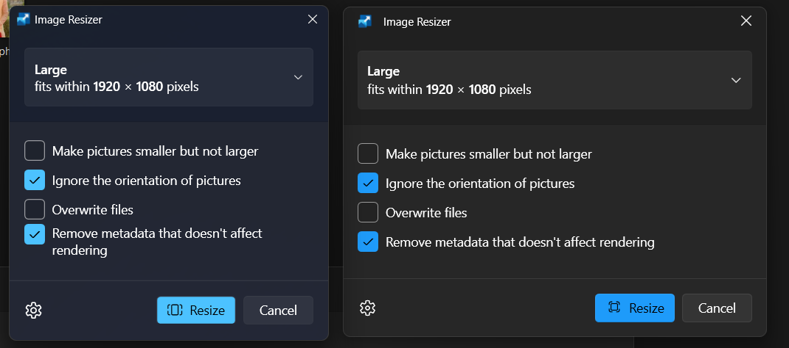
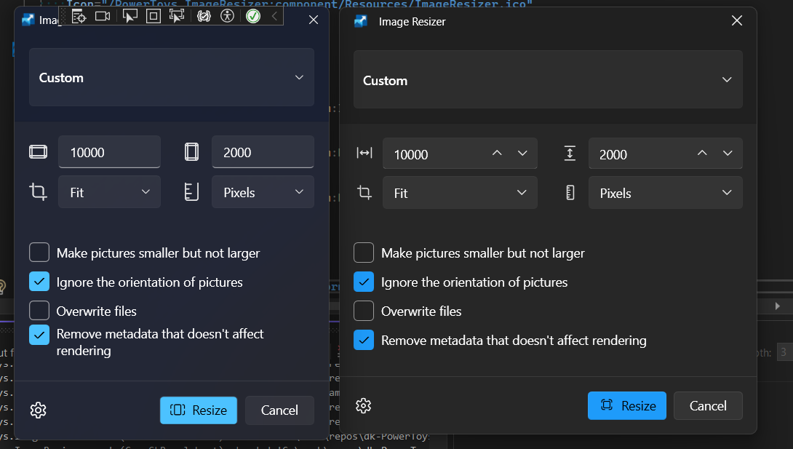

### Porting ImageResizer to use WPF Fluent ( .NET 9 )

Here is the comparision of ImageResizer before and after the port : 

#### Major Porting Steps

1. Remove WPF UI, theme dictionaries from App.xaml.
2. Add ThemeMode or WPF's Fluent theme dictionaries in App.xaml.
3. Change ui:FluentWindow -> Window in MainWindow.xaml and other windows. Remove the extra properties ( CornerRadiusPreference, ExtendsContentIntoTitleBar ).
4. Remove Wpf.Ui ThemeWatcher code from MainWindow and other window constuctors.
5. Remove ui:TitleBar element from MainWindow. Add Title to Window tag. ( Will probably need to introduce a TitleBar element and steps to create custom window chrome worker )
6. Remove ui:* elements ( like Button, TextBox) etc, which have a corresponding control in WPF.
   1. For Accent buttons, use Style="{DynamicResource DefaultAccentButtonStyle}" in the button.
7. Replace ui:* elements ( like NumberBox, SymbolIcon etc.) with something that can work for in that use case.
   1. SymbolIcon, FontIcon -> TextBlock. ( Will probably need to include symbol icon font, as not all the fonts are available by default ).
   2. NumberBox -> TextBox, but in this case, we may have to make changes in the code-behind for conversion to integer type.
8. There are certain properties that didn't use to work in WPF UI, like FontIcon and SymbolIcon size, etc. So, we will need to fix that in PowerToys code.