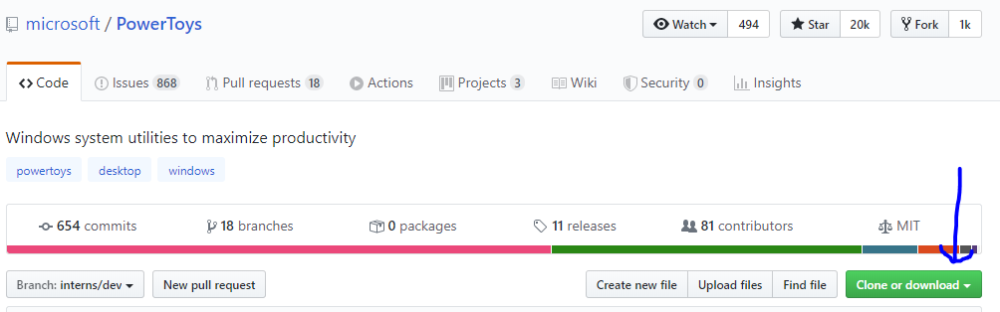

# PowerToys - My First Commit #

## Getting Setup ##

1.	You will need to install Git Bash.  ([Git tools download here](https://git-scm.com/download/win))
2.	Create a repo folder on your system.
3.	Open GitBash in that repo folder or use Visual Studio Team Explorer
4.	Clone the repo: ([PowerToys on Github](https://github.com/microsoft/PowerToys))

5.	Change to Branch ***interns/dev***
	1.	git clone https://github.com/microsoft/PowerToys.git
5.	Open the "docs/interns/MyFirstCommit.md" document

## Branches ##
In the Garage, we tend to follow a specific branching rules.  We ask that you also follow the same rules.  In an independent project we would have the following branches:

- **master** - Production branch that is typically the release version.  It is not updated until a new release is ready.  It is updated from the **staging** branch
- **staging** - internal and limited testing branch.  This branch would be used by sponsors (like Clint) and internal testers to try out the application.  This is updated somewhat frequently, might be once per week to daily as a release nears.  It is updated from the **dev** branch
- **dev** - your intern team sandbox and will update multiple times per day by all team members. For this task the **dev** branch will be **interns/dev**

All of these branches should always build and work.  There are times when **dev** may not work perfectly but **dev** should not be pulled into **staging** without adequate testing.

## Submitting Codes (Commits and Pull Requests)
For our purposes, PowerToys uses **master** as a "dev" branch and uses **stable** for it's production release branch but we are not going to touch that during this hackathon.  We have created a branch called **interns/dev** as your **dev** branch equivalent.  Assume wherever we mention **dev** branch below we mean **interns/dev**.  All the work you do over the next two weeks will be based on the i**nterns/dev** branch and should never be on the main root.

Steps to be followed when adding code to a repository:

1. Create a new branch based on the **interns/dev** branch.
	1. This branch should always be identified as yours with the naming convention **interns/users/alias/branchname** where:
		1. **interns/users** is a literal constant that will identify the branch ownership
		2. **alias** is your github alias like "markAtMicrosoft"
		3. **branchname** should reflect what you are doing.  Should be all lower case.  Should use "-" seperators.
			1. eg. interns/users/markAtMicrosoft/first-commit
2. Make sure your IDE (Visual Studio in our case) is using a local version of that branch by doing a checkout of the branch in Git Bash or Visual Studio (VS) Team Explorer.

		git checkout interns/users/markAtMicrosoft/first-commit

3. Make your changes
4. Commit your changes to the locally checkout branch
	1. You can create the new file inside or outside Visual Studio, just as long as it's in the repo path on your local system.
	2. The new file will show up as an addition in git bash or in the Visual Studio Team Explorer.  In Visual Studio Team Explorer, see the "Changes" tab.  In Git Bash, use:
	
			git commit -a -m "updating my file."
			git push

5. Push the commit(s) to the origin branch in github
6. Create a pull request (PR) for your branch into the dev branch in GitHub branches.
	1. PRs should always describe what they contain... sometimes that only needs one line
	2. If the thing you've built needs special instructions to test, include that here also

7. Wait for reviews of your PR (most PRs will require 2 reviews and a successful build)
	1. We are not doing a build today.
	2. You will need either Clint or Mark (CODEOWNERS) to review your PR and one intern (not yourself).
	3. The reviewers will check for correct syntax and coding style.  They will check that your code does what it is supposed to do.
	4. Comments in PRs should be only for things that need correcting.
	5. Comments should always be constructive including what was expected and suggestions regarding a way to fix it.
		1. eg. Consider checking for a null value here, possible null value exception.
		2. eg. Use a constant instead of a literal string here.
8. Correct anything that might need to be corrected as suggested in comments.
	1. Do this on the same branch for the PR.
	2. Commit your change
	3. Push the change to github
	4. Notice that the PR automatically updates and can be re-reviewed.
	5. *NOTE: It is OK to push back against comments if you have a solid reason.  Reviewers are not always right or don't always know all the facts.  Be clear in your explanation and be willing to discuss... You have a great tool called **Microsoft Teams** you can use for this.*
9. Once all checks have passed, you can Complete the PR and the code is merged into the **dev** branch

## Your Mission, should you choose to accept it... (you really do want to) ##
Inside the doc/interns folder in the PowerToys repo, create a new markdown file (*.md) that is named "doc/interns/alias/MyFirstCommit.md" with the *alias* folder being your github user alias.  Inside the file, put today's date.
- create a branch off **interns/dev**
- checkout that branch
- create the file
- commit it
- push it
- PR it
- Get 2 reviews
- Complete it.
- Celebrate your success

This note ***will not*** self destruct or in any way disappear after you have read it.

Please help out the other interns by helping to review their PRs.