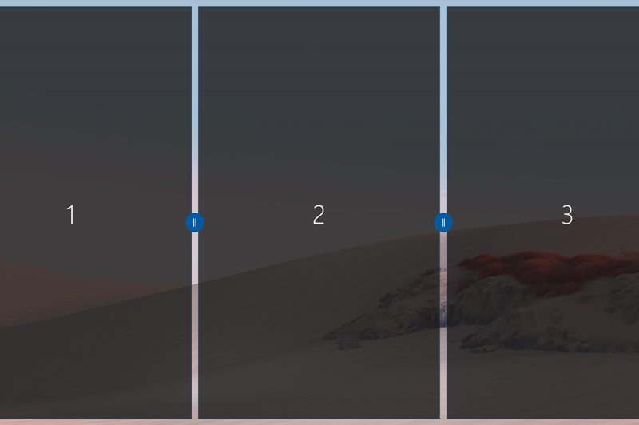
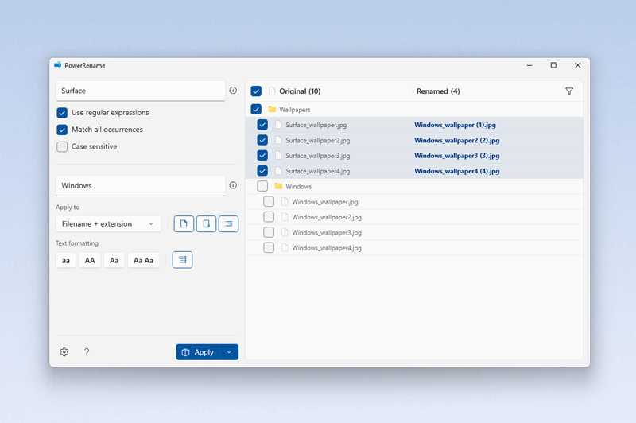
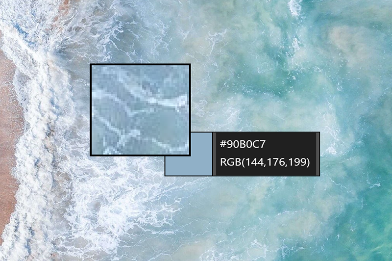
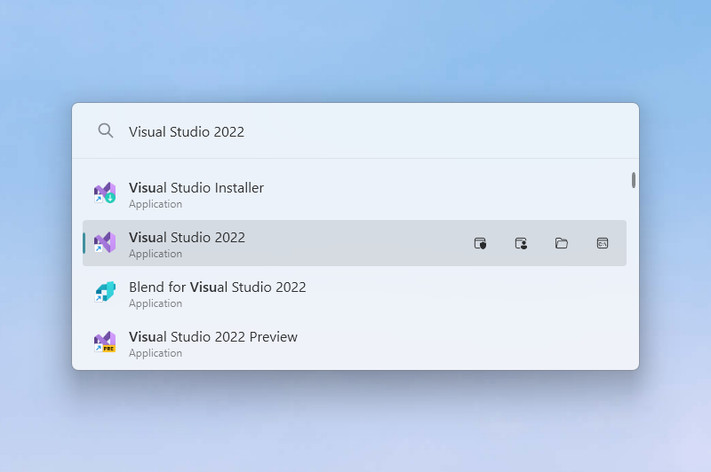
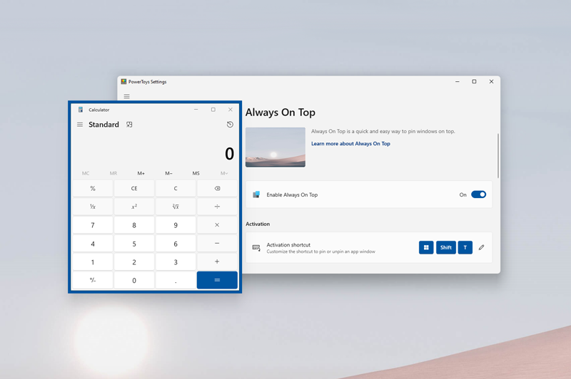

# Boost your productivity with Microsoft PowerToys

Microsoft PowerToys is a set of utilities designed to streamline your workflow and boost productivity on Windows. With tools like FancyZones, PowerRename, and Color Picker, PowerToys offers a range of features to help with your daily tasks. This guide will show real world scenarios where PowerToys can save you time and effort.

## Efficient window management with FancyZones

Imagine you're a software developer working on multiple projects simultaneously. You have numerous windows open, including your IDE, terminal, browser, and documentation. Navigating between these windows can be time consuming and disruptive to your workflow.

This is where FancyZones comes in. With this PowerToy feature, you can create custom window layouts that suit your specific needs.

For example, if you have a large monitor, you can set up a layout with your IDE on the left, browser in the center, and terminal on the right. Once your layout is set, you can easily snap windows into their designated zones, ensuring an organized and efficient workspace.

## Bulk file renaming with PowerRename

If you're a photographer who has just finished a shoot with hundreds of images, the default file names from your camera are not very descriptive and can make it difficult to find specific photos later on.

PowerRename simplifies the process of renaming multiple files at once!

You can use search and replace, including regular expressions, to quickly rename your files based on criteria like date, sequence number, or custom text. With PowerRename, batch renaming files becomes a breeze, saving you valuable time in your post processing workflow.

## Precise color selection with Color Picker

As a graphic designer, you may often need to match colors from existing images or websites. Manually inputting color values can be prone to errors and inconsistencies.

Color Picker allows you to select colors from anywhere on your screen with precision.

Simply activate the tool with a keyboard shortcut, hover over the desired color, and click to copy the color value to your clipboard. You can choose from various formats like RGB, HEX, or HSL, making it easy to integrate the selected color into your design software.

## Quick access to files, folders, and applications with PowerToys Run

As a professional, you may work with multiple directories, files, and applications across different projects. Navigating through the file explorer or start menu to locate specific items can be time consuming and disrupt your workflow.

PowerToys Run provides a quick and efficient way to access your favorite files, folders, and applications. By pressing a customizable keyboard shortcut, you can open PowerToys Run and start typing the name of what you need. As you type, PowerToys Run will display relevant results, allowing you to quickly navigate to your desired location, application, or document without ever leaving your keyboard.

## Keeping important windows always on op

Imagine you're a project manager coordinating a video conference while taking notes in a separate application. Constantly switching between the video call and your notes can be distracting and inefficient.

Always On Top allows you to keep the notes application visible on top of other windows, so you can refer to your notes while participating in the video conference without having to switch back and forth.

To use Always On Top, select the window you want to keep on top and press the keyboard shortcut. The window will remain on top, allowing you to focus on your meeting and notes simultaneously.

These scenarios are just a few of the ways Microsoft PowerToys can enhance your productivity and streamline your workflow. Whether you're a developer, photographer, designer, or business professional, PowerToys offers a versatile set of tools to optimize your daily tasks. By leveraging the power of PowerToys, you can save time, reduce errors, and focus on what matters most: your work.

Learn more here: [https://learn.microsoft.com/windows/powertoys/](https://learn.microsoft.com/windows/powertoys/)