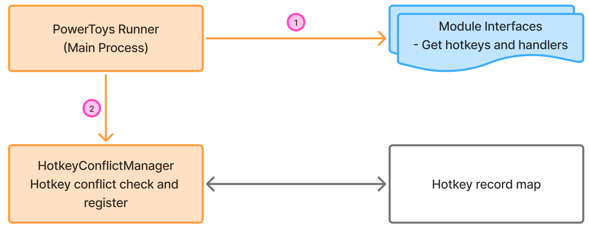
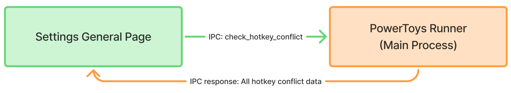

# PowerToys Feature Spec: Hotkey Conflict Detection

## Overview

PowerToys currently allows users to assign hotkeys to various modules. However, without conflict detection, users may unknowingly assign overlapping hotkeys, causing ambiguity or failure in feature activation. This spec introduces a global hotkey conflict detection system ("Hotkey Conflict Detect") that provides real-time feedback and prevents users from configuring conflicting hotkeys.

This feature aims to:
- Prevent hotkey conflicts between PowerToys modules and with system-reserved hotkeys.
- Offer immediate UI feedback to users when a conflict is detected.
- Improve reliability and user experience in hotkey customization.

---
## Requirements

### Functional Requirements

1. **Conflict Detection at Registration**
   - When a module attempts to register a hotkey, the system must check for:
     - Existing global or module-specific assignments.
     - System/global reserved hotkeys.

2. **Settings UI Integration**
   - When the user enters a new hotkey in the Settings UI:
     - An IPC request is sent to check for conflicts.
     - The UI displays a warning (icon, tooltip, details) if a conflict is found.

3. **Conflict Types**
   - In-app conflict: Two PowerToys modules/functions assigned the same hotkey.
   - System conflict: The hotkey is reserved or registered by Windows/global OS.

4. **Hotkey Uniqueness**
   - Every hotkey is tagged with a unique name and module owner, persisted in config and runtime.

### Non-functional Requirements

- The system should have minimal performance impact on startup and hotkey registration.
- Conflict detection logic must be thread-safe and robust against concurrent registration/unregistration.

---

## Proposed Design

### Key Components

#### 1. HotkeyConflictManager (C++)
- Singleton class in runner, centrally manages all hotkey registrations.
- Maintains maps for:
  - Registered hotkeys
  - System-level conflicts
  - In-app conflicts
- On add/remove, updates `hotkey_conflicts.json`.

#### 2. IPC Protocol (Runner <-> Settings UI)
- New IPC message: `check_hotkey_conflict`
- Payload: hotkey combination, module name, hotkey name, request_id.
- Response: has_conflict (bool), conflict_module, conflict_hotkey_name.

#### 3. Settings UI (C#)
- `HotkeyConflictHelper` sends IPC check requests and processes responses.
- `ShortcutControl` component displays conflict icons/tooltips.
- (Future) A conflict summary panel can list all current conflicts.

#### 4. Module Integration
- Modules must provide unique hotkey names and owner info in config.
- On startup and setting change, modules register/unregister hotkeys via the central manager.

### Data Flow

#### 1. System Initialization Workflow
<div align="center">

</div>

**PowerToys startup and hotkey conflict detection initialization:**

1. **PowerToys Runner Startup**
   - Runner process initializes and creates HotkeyConflictManager singleton instance
   - Initializes internal data structures: `m_registeredHotkeys` map and conflict tracking collections

2. **Module Registration Phase**
   - Each PowerToys module starts up and calls `RegisterHotkey()` API
   - Registration includes:
     - HotkeyConfig structure with key, modifiers, hotkeyName, ownerModuleName
     - Automatic conflict detection during registration process
   - HotkeyConflictManager updates internal registry and detects conflicts immediately

3. **Conflict Detection During Startup**
   - For each hotkey registration, the manager checks:
     - Internal `m_registeredHotkeys` map for duplicate combinations (in-app conflicts)
     - System hotkey registry via Windows API calls (system conflicts)
   - Conflicts are detected but don't block module initialization

#### 2. Module Settings Page Real-time Conflict Detection
<div align="center">

</div>

**Interactive conflict detection during user hotkey configuration:**

1. **User Input Capture**
   - User modifies hotkey in Settings UI ShortcutControl component
   - HotkeyHelper captures key combination and converts to internal format
   - Input validation occurs before sending conflict check request

2. **IPC Conflict Check Request**
   - Settings UI sends `check_hotkey_conflict` IPC message to Runner
   - Request includes:
     - Hotkey combination (key code + modifier flags)
     - Module name and hotkey identifier
     - Unique request ID for response correlation

3. **Runner-side Conflict Processing**
   - HotkeyConflictManager receives IPC request via `ReceiveJsonMessage`
   - Calls `CheckHotkeyConflict()` method to:
     - Check against currently registered hotkeys (excluding current module's assignment)
     - Validate against system-reserved combinations
   - Prepares JSON response with conflict status and details

4. **UI Response and Visual Feedback**
   - **Conflict detected:**
     - Warning icon appears in ShortcutControl
     - Tooltip displays conflict details (module name + hotkey name)
   - **No conflict:**
     - UI shows normal state

#### 3. Global Conflict Overview Dashboard
<div align="center">

</div>

**System-wide conflict management interface (Future Implementation):**

1. **Get all conflict data via IPC call**
   - Settings UI sends `check_hotkey_conflict` IPC message to Runner.
   - Runner send responsed IPC to settings which includes all the hotkey conflict data.

2. **Conflict Display Structure**
   - **In-App Conflicts Section:**
     - Shows conflicts between PowerToys modules
     - Format: "Win+Shift+V conflicts between AdvancedPaste (PasteAsPlainTextShortcut) and FancyZones (EditorHotkey)"
   
   - **System Conflicts Section:**
     - Lists PowerToys hotkeys that conflict with Windows system shortcuts
     - Shows affected module and specific hotkey function

3. **Conflict Resolution Tools**
   - Navigation links to affected module settings pages

**Actual Data Flow Implementation:**
```
Settings UI Input → IPC Request (check_hotkey_conflict) → 
HotkeyConflictManager::CheckHotkeyConflict() → 
Hotkey record map Check + System API Check → 
JSON IPC Response → UI Feedback
```

**Key Implementation Details from PR:**
- Uses singleton pattern for HotkeyConflictManager in Runner
- JSON persistence with structured conflict data (inAppConflicts/sysConflicts arrays)
- IPC communication using existing PowerToys message infrastructure
- Thread-safe design with proper locking mechanisms
- Non-blocking conflict detection to avoid startup delays
- Backwards compatibility with auto-generation of missing hotkey metadata
### Data Structures

- **HotkeyConfig**
  - key, modifiers, hotkeyName, ownerModuleName

- **IPC response JSON format example**
  ```json
  {
    "inAppConflicts": [
      {
        "hotkey": { "win": true, "ctrl": false, "shift": true, "alt": false, "key": 86 },
        "modules": [
          {"moduleName": "AdvancedPaste", "hotkeyName": "PasteAsPlainTextShortcut"},
          {"moduleName": "FancyZones", "hotkeyName": "EditorHotkey"}
        ]
      }
    ],
    "sysConflicts": [
      {
        "hotkey": { ... },
        "modules": [
          {"moduleName": "ColorPicker", "hotkeyName": "ActivationShortcut"}
        ]
      }
    ]
  }
  ```

---

## User Experience

### Settings UI

- When entering a hotkey, if a conflict is detected:
  - A warning icon is shown next to the hotkey input.
  - Tooltip shows the conflicting module and function.
  - The user failed to save the conflicting hotkey.

### (Future) Conflict Overview

- Settings `General` page will show all current conflicts from `hotkey_conflicts.json`.

---

## Rollout/Compatibility

- Backwards compatible: If hotkeyName/ownerModuleName is missing, modules auto-generate and save on first use.
- Existing user settings will be upgraded in-place.

---

## Test Plan

- Assign the same hotkey to two different modules, verify conflict is detected and shown.
- Assign a hotkey that matches a known system-reserved combination, verify system conflict is detected.
- Remove a conflicting hotkey, verify the conflict warning disappears for the remaining one.
- UI should always reflect the latest conflict status after any change.

---

## Appendix

- **Related Issues/PRs:** [PowerToys hotkey conflict detection](https://github.com/microsoft/PowerToys/pull/40457)
