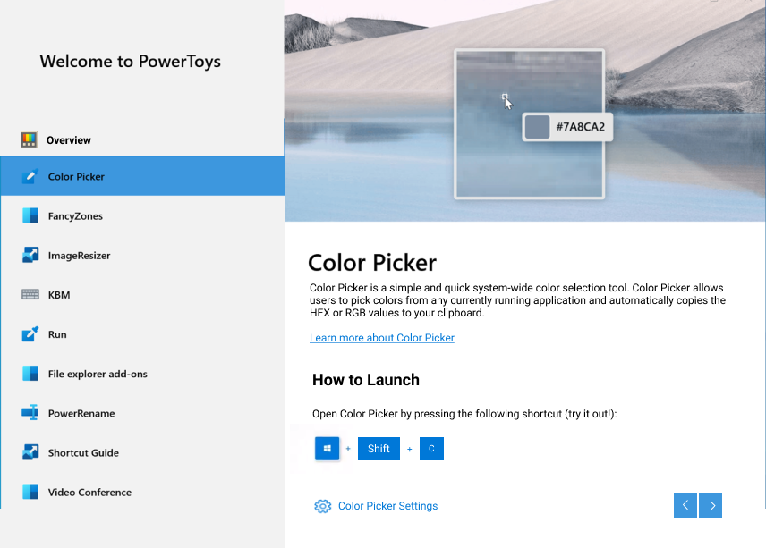
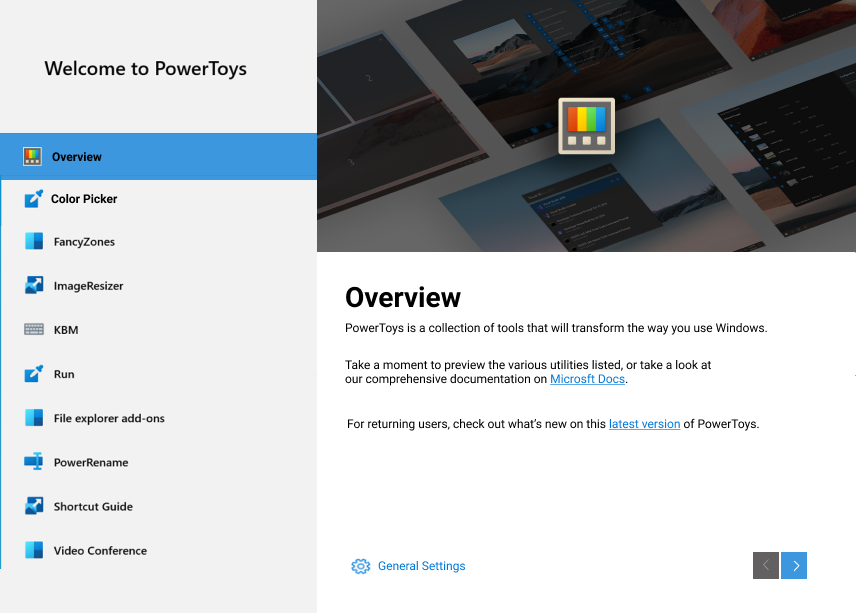

# PowerToys OOBE Dialog

- **What is it:** Post-install prompted dialog that walks new users through PowerToys basic functionalities and customizations
- **Author:** Deondre Davis
- **Spec Status:** Draft

## 1. Overview

### 1.1. Executive Summary

PowerToys suffers from the lack of a guided post-install experience. Without this, it is virtually impossible for new users to quickly get started with PowerToys due to the need to dig through documentation to understand how to use it. The proceeding document proposes the creation of a post-install prompt that introduces users to the various PowerToys and offers helpful insights and engaging customization options to users who normally would not look through the documentation.

### 1.2. Key Definition/Concept

Here we define the key acronym found throughout this document to ensure clarity:

- **OOBE:** Out of box experience – The users’ initial interactions with the product immediately after installing the product and/or launching the product for the first time.

### 1.3. Goals and Non-Goals

Goals:

- Create a guided prompt that exposes the user to a brief overview of each PowerToy, highlighting the PowerToys’ basic usage.
- Present a short-list of useful customization options that the user can select to define their experience.

Non-goals:

- Present an exhaustive list of features and options that are available in PowerToys. This OOBE prompt is only meant to provide initial exposure for which interested users should continue investigating via provided links to documentation and settings.

## 2. Definition of Success

### 2.1. Customers

The PowerToys OOBE is for new power users and developers who are looking to tune and streamline their Windows experience for greater productivity and enhanced user experience. As the PowerToys customer base tends to be particularly biased against OOBE prompts in general, we need to present the PowerToys OOBE dialog in such a way that it provides immediate value to end-users to improve the likelihood of users discovering all the PowerToys by completing the prompts.

### 2.2. Expected Impact: Customer, and Technology Outcomes

- **High Reliability:** Less than 0.1% crash rate.
- **Increased Activation:** 30% or more increase in usage in all PowerToys features.
- **High User Retention:** 25% or more active PowerToys users after 28 days.
- **High OOBE Engagement Rate** PowerToys users click through at least half of the available OOBE sections.

## 3. Requirements

  The base of this OOBE dialog was attributed by [Niels’s mock-up](https://github.com/microsoft/PowerToys/issues/1285).

### 3.1. Functional Requirements

#### 3.1.1. Functional Requirements Overview

|No. | Requirement | Pri |
| - | - | - |
|1 | The OOBE Dialog window should launch immediately after installation. | P0 |
|2 | The OOBE Dialog should consist of a collection of pages that describe the available PowerToys, organized based on the template depicted in [Figure 5.1.1.](#511-oobe-dialog-layout). | P0 |
|3 | On launch, present a Welcome/Landing page in the OOBE Dialog window as described in [Section 3.1.3.](#313-welcomeoverview-page-content)  | P1 |
|4 | Traverse the various OOBE Dialog pages via a list view options on the left-hand pane. | P0 |
|5 | At any time, the user should be able to exit the OOBE dialog by closing the window. | P0 |
|6 | Alternatively, the user should be able to exit the OOBE dialog by pressing the ESC key. | P1 |
|7 | Automatically save changes to settings as they are made in the OOBE. | P1 |
|8 | In the PowerToys settings “General” menu, add a button to re-launch the OOBE dialog under the “Check for updates” button. | P2 |
|9 | The window is resizable and the content is responsive to being resized. | P0 |
|10 | The OOBE dialog should have a preset minimum window size to ensure all content can be viewable without the need to scroll the page. | P1 |

#### 3.1.2. Page Layout

This section describes the content that should be displayed on a given page for each PowerToys utility.

| No. | Requirement | Pri |
| - | - | - |
|1 | Each page of the OOBE dialog should focus on the details and settings of a single PowerToy. | P0 |
|2 | A page should include textual information that gives an overview of its PowerToy's functionality. | P0 |
|3 | A page should have a dedicated "How to run/launch" section for explaining the shortcut or actions needed to utilize the PowerToy, emphasizing that users are encouraged to "try it out" while in the OOBE. | P0 |
|4 | A page should include a hero image/GIF that provides a visual representation of its PowerToy's core functionality. | P0 |
|5 | A page should include a link to that PowerToys overview page on Microsoft Docs. | P1 |
|6 | Include a &quot;Settings&quot; button that deep links to the PowerToy's settings page. | P1 |
|7 | Include a collapsible &quot;Pro Tips&quot; section on the page that highlights a useful, yet often undiscovered feature for its PowerToy. | P3 |

#### 3.1.3. Welcome/Overview Page Content

This section describes the content that should be displayed on the Welcome/Overview Page of the OOBE window. [Figure 5.1.2](#512-oobe-welcomeoverview-page) provides a visual of the layout.

| No. | Requirement | Pri |
| - | - | - |
|1 | A high level, textual overview of the PowerToys application. | P0 |
|2 | Link to PowerToys General Settings. | P0 |
|3 | Link to PowerToys overview on Microsoft Docs. | P0 |
|4 | Link to PowerToys releases page to showcase latest update changes. | P1 |

## 4. Measure Requirements

| No. | Requirement | Implication | Pri |
| --- | --- | --- | --- |
|1 | Date/Time of first-run | Helps to categorize usage and retention trends across various groups of new users. | P0 |
|2 | OOBE sections viewed | Used to gauge how far users progress through the OOBE dialog. Helps guide decisions on further enhancements to improve retention. | P0 |
|3 | Access to linked settings pages | Used to gauge whether users would find value in having quick settings access for particular utilities. | P1 |
|4 | PowerToys launched while OOBE window is active. | Used to track user engagement with the various PowerToys while exploring the content in the OOBE. | P1 |
|5 | Screen size | Gives crucial information for considerations related to minimal/maximum window size needed for displaying content. | P2 |

## 5. Appendix

### 5.1. Mock-ups

#### 5.1.1. OOBE Dialog Layout

#### 5.1.2. OOBE Welcome/Overview Page

