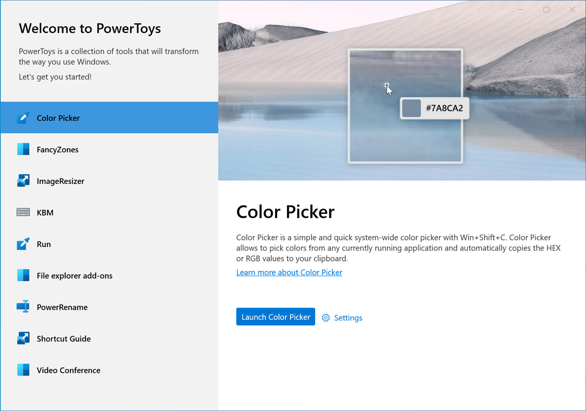

# PowerToys OOBE Dialog

- **What is it:** Post-install prompted dialog that walks new users through PowerToys basic functionalities and customizations
- **Author:** Deondre Davis
- **Spec Status:** Draft

## 1. Overview

### 1.1. Executive Summary

PowerToys suffers from the lack of a guided post-install experience. Without this, it is virtually impossible for new users to quickly get started with PowerToys due to the need to dig through documentation to understand how to use it. The proceeding document proposes the creation of a post-install prompt that introduces users to the various PowerToys and offers helpful insights and engaging customization options to users who normally would not look through the documentation.

### 1.2. Key Definition/Concept

Here we define the key acronym found throughout this document to ensure clarity:

- **OOBE:** Out of box experience – The users’ initial interactions with the product immediately after installing the product and/or launching the product for the first time.

### 1.3. Goals and Non-Goals

Goals:

- Create a guided prompt that exposes the user to a brief overview of each PowerToy, highlighting the PowerToys’ basic usage.
- Present a short-list of useful customization options that the user can select to define their experience.

Non-goals:

- Present an exhaustive list of features and options that are available in PowerToys. This OOBE prompt is only meant to provide initial exposure for which interested users should continue investigating via provided links to documentation and settings.

## 2. Definition of Success

### 2.1. Customers

The PowerToys OOBE is for new power users and developers who are looking to tune and streamline their Windows experience for greater productivity and enhanced user experience. As the PowerToys customer base tends to be particularly biased against OOBE prompts in general, we need to present the PowerToys OOBE dialog in such a way that it provides immediate value to end-users to improve the likelihood of users discovering all the PowerToys by completing the prompts.

### 2.2. Expected Impact: Customer, and Technology Outcomes

- **High Reliability:** Less than 0.1% crash rate.
- **Increased Activation:** 30% or more increase in usage in all PowerToys features.
- **High User Retention:** 25% or more active PowerToys users after 28 days.
- **High OOBE Engagement Rate** PowerToys users click through at least half of the available OOBE sections.

## 3. Requirements

  The base of this OOBE dialog was attributed by [Niels’s mock-up](https://github.com/microsoft/PowerToys/issues/1285).

### 3.1. Functional Requirements

#### 3.1.1. Functional Requirements Overview

|No. | Requirement | Pri |
| - | - | - |
|1 | The OOBE Dialog window should launch immediately after installation. | P0 |
|2 | The OOBE Dialog should consist of a collection of pages that describe the available PowerToys. | P0 |
|3 | On launch, present the Welcome/Landing page in the OOBE Dialog window based on the template described in [Figure 5.1.1.](#511-oobe-dialog-layout) | P1 |
|4 | Traverse the various OOBE Dialog pages via an list view options on the left-hand pane. | P0 |
|5 | Alternatively traverse the various OOBE Dialog pages via an on-screen next/previous buttons on each page. | P2 |
|6 | At any time, the user should be able to exit the OOBE dialog by closing the window. | P0 |
|7 | Alternatively, the user should be able to exit the OOBE dialog by pressing the ESC key. | P1 |
|8 | Automatically save changes to settings as they are made in the OOBE. | P1 |
|9 | In the PowerToys settings “General” menu, add a button to re-launch the OOBE dialog under the “Check for updates” button. | P0 |
|10 | The OOBE dialog window should be able to be enlarged to accommodate accessibility needs. | P0 |
|11 | The OOBE dialog should have a preset minimum window size to ensure all content can be viable with the need to scroll the page. | P1 |

#### 3.1.2. Page Layout

| No. | Requirement | Pri |
| - | - | - |
|1 | Each page of the OOBE dialog should focus on the details and settings of a single PowerToy. | P0 |
|2 | A page should include textual information that gives an overview of its PowerToy's basic functions. | P0 |
|3 | A page should include a hero image/GIF that provides a visual representation of its PowerToy's core functionality. | P0 |
|4 | A page should include a link to that PowerToys overview page on Microsoft Docs. | P0 |
|5 | Include a &quot;Settings&quot; button that deep links to the PowerToy's settings page. | P1 |
|6 | A page should include a short-list of relevant settings options that the user can select between to customize their experience. | P1 |
|7 | Include a &quot;Pro Tips&quot; section on the page that highlights a useful, yet often undiscovered feature for its PowerToy. | P3 |

### 3.2. Displayed Options

The proceeding subsections describe the settings we choose to display for each PowerToy and the justification for why it was included.

We target only having at most 3 options per page/PowerToy to stay concise and ensure the settings displayed are the most useful for the general user-base.

#### 3.2.1. Welcome/Landing Page

| Option | Include? | Why |
| --- | --- | --- |
| **Theme (Light/Dark/Default)** |  | This is a universal setting that users are heavily opinionated about. With this being the first option shown to users, it establishes an immediate value proposition for users to continue clicking through the dialog. |
| **Link to release notes** |  | This provides value to returning PowerToys users who may have re-installed PowerToys and would like to quickly be updated on what has changed. |
| **Run on startup** |  | By default, this is already on. For new users, this is probably not something we want to show as they might turn it off prematurely without understanding the value it provides. |
| **Always run as admin** |  | This is not a critical option for most use cases and more of a nuance that general users will not be concerned about. |

#### 3.2.2. Color Picker

| Option | Include? | Why |
| --- | --- | --- |
| **Activate Color Picker (Shortcut)** |  | This is a crucial setting for utilizing Color Picker that users should have a say on. |
| **Activation behavior** |  | This is critical for users to set up their experience the way they want. |
| **Color format for clipboard** |  | This is especially useful as it exposes the various copy options that may otherwise go overlooked. |
| **Enable Color Picker** |  | We want customers to use Color Picker first before they decide to disable it. Showing this option likely decreases the chance of that happening. |
| **Editor Color Formats** |  | This is typically an extraneous customization option for most users and would likely not be critical in a first-run experience. |

#### 3.2.3. FancyZones

| Option | Include? | Why |
| --- | --- | --- |
| **Hold Shift key to activate zones while dragging** |  | This is a crucial operation that many first-time users might overlook if they do not read the documentation as noted in [#7421](https://github.com/microsoft/PowerToys/issues/7241#issuecomment-723561408). |
| **Launch zones editor (Shortcut)** |  | This is a crucial setting for utilizing FancyZones that users should have a say on. |
| **Everything else** |  | These settings are typically extraneous customization options that most users would not find useful in a first-run experience. |

#### 3.2.4. File Explorer

| Option | Include? | Why |
| --- | --- | --- |
| **Everything** |  | This gets tricky to incorporate as it requires admin privileges. In addition, many first-run users may not find value in the available options (or even understand what the options mean). A good description/visual should suffice for this page. |

#### 3.2.5. Image Resizer

| Option | Include? | Why |
| --- | --- | --- |
| **Everything** |  | The available Image Resizer settings are not particularly valuable to first-run users exploring the OOBE. A good description/visual should provide enough clarity and exposure for this utility. |

#### 3.2.6. Keyboard Manager

| Option | Include? | Why |
| --- | --- | --- |
| **Remap keys** |  | This is a core functionality of Keyboard manager so users should be able to quickly change and test out these settings.(Deep link to window in settings menu.) |
| **Remap shortcuts** |  | This is a core functionality of Keyboard manager so users should be able to quickly change and test out these settings.(Deep link to window in settings menu.) |

#### 3.2.7. PowerRename

| Option | Include? | Why |
| --- | --- | --- |
| **Everything** |  | The available PowerRename settings are not particularly valuable to first-run users exploring the OOBE. A good description/visual should provide enough clarity and exposure for this utility. |

#### 3.2.8. PowerToys Run

| Option | Include? | Why |
| --- | --- | --- |
| **Open PowerToys Run (Shortcut)** |  | This is a crucial setting for utilizing PowerToys Run that users should have a say on. |
| **Everything else** |  | These settings are typically extraneous customization options that most users would not find useful in a first-run experience. |

#### 3.2.9. Shortcut Guide

| Option | Include? | Why |
| --- | --- | --- |
| **Opacity of background** |  | Useful option for users to set their preferences. |
| **Press duration before showing** |  | Likely not relevant for a first-time user. |

## 4. Measure Requirements

| **No.** | **Requirement** | **Implication** | **Pri** |
| --- | --- | --- | --- |
|1 | Date/Time of first-run | Helps to categorize usage and retention trends across various groups of new users. | P0 |
|2 | OOBE sections viewed | Used to gauge how far users progress through the OOBE dialog. Helps guide decisions on further enhancements to improve retention. | P0 |
|3 | Settings changed/options selected from OOBE dialog | Gives our developers quantitative data on the most highly utilized options/settings for insight into future planning and development. | P0 |
|4 | Accesses to linked documentation | Used to gauge interest in user's desire to learn more about the PowerToys described. | P1 |
|5 | Access to linked settings pages | Used to gauge whether the settings presented to users in the dialog are sufficient for user needs. | P1 |
|6 | PowerToys launched while OOBE window is active. | Used to track user engagement with the various PowerToys while exploring the content in the OOBE. | P1 |
|7 | Screen size | Gives crucial information for considerations related to minimal/maximum window size needed for displaying content. | P2 |

## 5. Appendix

### 5.1. Mock-ups

#### 5.1.1. OOBE Dialog Layout

