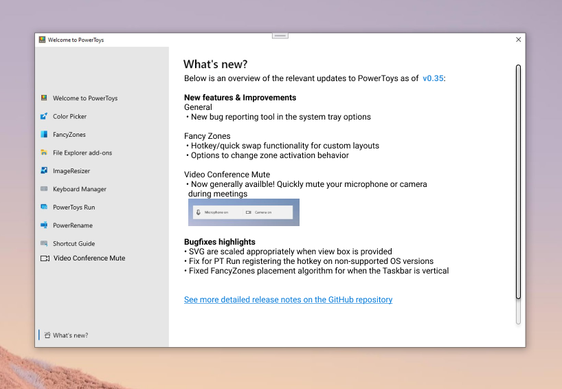

# PowerToys SCOOBE Dialog

- **What is it:**  Post-upgrade prompted dialog that walks users through the latest additions to PowerToys utilities and functionalities
- **Author:**  Deondre Davis
- **Spec Status:**  Draft

## 1. Overview

### 1.1. Executive Summary

To expand on our end-user on-boarding efforts, we seek to resolve the critical issue of informing users of new additions and improvements to PowerToys during upgrade scenarios. We currently list release notes on the main repository, in addition to affiliated information on Microsoft Docs. However, neither of these mediums are internal to the application, and thus requires users to proactively seek out information on what&#39;s been updated, or merely notice by chance what&#39;s been changed from their regular usage. As these are not ideal experiences, this document describes the inclusion of a post-upgrade &#39;SCOOBE&#39; prompt that launches the previously developed OOBE dialog loaded with new information related to upgrade improvements and additions.

### 1.2. Key-Definitions/Concepts

Here are definitions for words and acronyms found throughout this document to ensure clarity:

- **OOBE:** Out of box experience – The users&#39; initial interactions with the product immediately after installing the product and/or launching the product for the first time.
- **SCOOBE:** Second chance out of box experience - The users&#39; initial interactions with the product immediately after upgrading the product and/or launching the product for the first time after upgrading.

### 1.3. Goals and Non-Goals

Goals:

- Create a guided prompt that exposes the user to a brief overview of the new features and/or improvements included with the latest version of PowerToys.

Non-Goals:

- Present a copy-and-paste replica of the repository release notes. This information needs to be readily consumable, often requiring visual demonstrations of the new behavior and/or functionality that&#39;s either not possible or not necessary to depict on the repository release notes.

## 2. Definition of Success

**2.1. Customers**

The PowerToys SCOOBE is for existing and new power users and developers who are looking to tune and streamline their Windows experience for greater productivity and enhanced user experience. As the PowerToys customer base tends to be particularly biased against SCOOBE prompts in general, we need to present the PowerToys SCOOBE dialog in such a way that it provides immediate value to end-users to improve the likelihood of users discovering all the additions to PowerToys by making their way through the prompt.

**2.2. Expected Impact: Customer, and Technology Outcomes**

- **High Reliability** : Less than 0.1% crash rate.
- **Increased Activation** : 50% or more adoption rate of new feature/utilities among PowerToys users who already utilize associated tools.
- **High User Retention:** 25% or more active PowerToys users after 28 days of upgrade.

## 3. Requirements

The SCOOBE dialog builds off the currently implemented OOBE dialog originally drafted by [Niels&#39;s mock-up.](https://github.com/microsoft/PowerToys/issues/1285)

**3.1. Functional Requirements**

**3.1.1. Functional Requirements**  **Overview**

| **No.** | **Requirement** | **Pri** |
| --- | --- | --- |
|1. | The SCOOBE dialog should launch immediately when PowerToys runs after having been updated. | P0 |
|2. | The SCOOBE dialog should be contained inside the existing OOBE Dialog under its own &quot;What&#39;s New&quot; page of the dialog window. See figure 5.1.1. | P0 |
|3. | The content for the SCOOBE dialog should be stored externally from the PowerToys application on the PowerToys GitHub in distinct wiki pages on for each release. **\*** | P0 |
|4. | When the &quot;What&#39;s New&quot; page is opened, the content displayed should be loaded from the information contained in the relevant wiki pages discussed in 3.1.1.3 above. Assumes the user&#39;s device is connected to the internet. | P0 |
|6. | The SCOOBE dialog should display information on updates that have occurred on the version of PowerToys the user has installed/updated to. | P0 |
|7. | If PowerToys was installed for the first time, the OOBE&#39;s &quot;Welcome to PowerToys&quot; page should display first, not the SCOOBE&#39;s &quot;What&#39;s New&quot; page. See figure 5.1.2. | P0 |
|8. | The structure of the SCOOBE dialog page&#39;s content should follow the guidelines described in section 3.1.2. | P0 |
|9. | After SCOOBE is initially viewed, the user should be able to re-access the SCOOBE dialog at any time by opening the OOBE window again and selecting the &quot;What&#39;s New&quot; page. | P1 |

**\*** - By storing the content for SCOOBE externally from the application, the PowerToys team can update/adjust information without being constrained to PowerToys&#39; release cycles. This is critical in the event of errors or miscommunications that would otherwise be difficult, if not impossible, to correct if stored locally to the app and shipped with the version of PowerToys being released. The content will likely be stored in an archive maintained in the PowerToys GitHub Wiki.

**3.1.2. Page Content**

| **No.** | **Requirement** | **Pri** |
| --- | --- | --- |
|1. | The SCOOBE dialog should display the version of PowerToys the user has installed, as shown in figures 5.1.1. | P0 |
|2. | The SCOOBE dialog information should be grouped into two sections: &quot;New Features &amp; Improvements&quot; and &quot;Bug fixes Highlights&quot;. | P0 |
|3. | The &quot;New Features &amp; Improvements&quot; section should contain information related to end user functionality that has been added or updated. | P0 |
|4. | The &quot;New Features &amp; Improvements&quot; section should be subdivided by the relevant utilities updated (i.e. Color Picker, FancyZones, etc.). See figure 5.1.1 and section 5.1.3 for examples. | P1 |
|5. | The &quot;Bug fixes Highlights&quot; section should contain information related to noteworthy issues/errors that were corrected. | P0 |
|6. | If there are relevant visuals, they should be included with the information text. See figure 5.1.1. | P1 |
|8. | The SCOOBE dialog should be scrollable if needed to fit all the content. | P0 |
|10. | The bottom of the SCOOBE dialog should include a link to the PowerToys releases page for a complete list of versions and their release notes ([Releases · microsoft/PowerToys (github.com)](https://github.com/microsoft/PowerToys/releases)). | P1 |

## 4. Measure Requirements

| **No.** | **Requirement** | **Implication** | **Pri** |
| --- | --- | --- | --- |
|1. | Date/Time of first-run following upgrade | Helps to categorize usage and retention trends across users who've been exposed to SCOOBE. | P0 |
|2. | SCOOBE section viewed | Used to measure activation of the SCOOBE dialog. Should be 100% for the current version of PowerToys following SCOOBE&#39;s inclusion. | P0 |
|3. | Accesses to linked documentation | Used to gauge interest in user&#39;s desire to learn more about the PowerToys described. | P1 |
|4. | Access to linked settings pages | Used to gauge whether the settings presented to users in the dialog are sufficient for user needs. | P1 |
|5. | PowerToys launched while SCOOBE window is active | Used to track user engagement with the various PowerToys while exploring the content in the SCOOBE. | P1 |
|6. | Screen size | Gives crucial information for considerations related to minimal/maximum window size needed for displaying content. | P2 |

## 5. Appendix

### 5.1. Mock-ups

**5.1.1. SCOOBE Dialog Layout**

**5.1.2. OOBE Welcome Page**

**5.1.3. Example Textual Descriptions for Updates**

**v0.29 -> v0.31:**

- New Features &amp; Improvements
  - FancyZones
    - Dark mode for the editor
    - Certain settings (e.g. number of zones, spacing settings) can now be set on individual layouts.
  - PowerToys Run
    - Service management plugin (Start, stop, …)
    - Registry key plugin
    - System action plugin (Reboot, lock, ...)
- Bug fixes Highlights
  - Fixed OneDrive SVG Bug (#9999)
  - SVG are scaled appropriately when view box is provided (#9999)

**v0.31 -> v0.33:**

- New Features &amp; Improvements
  - General
    - Added a &#39;First time load&#39; experience. The hope is a quick, light way to learn about basic functionality
  - FancyZones
    - New options to change zone activation algorithm
  - PowerToys Run
    - Plugin Manager now is in settings. You can directly turn on / off, include items in general search, and change the action key
    - Improved support for additional window managers by abstracting out shell process calls
    - ~ will now act as the user home directory in Folder plugin
- Bug fixes Highlights
  - Fix for PT Run registering the hotkey on non-supported OS versions (#9999)

**v0.33 -> v0.35:**

- New Features &amp; Improvements
  - Color Picker
    - Esc can now be used to exit the editor
  - FancyZones
    - Added hotkeys and quick swap functionality for custom layouts! Users can now assign a hotkey in the editor and use it to quickly set a desktop&#39;s zones with Ctrl + Win + Alt + NUMBER key binding, or by pressing the hotkey while dragging a window.
  - PowerToys Run
    - Users can specify where to show the launcher window
    - New plugin added to support opening previously used Visual Studio Code workspaces, remote machines (SSH or Codespaces), and containers! When enabled, use { to query for available workspaces. Please note, this plugin is off by default.
    - Shell history now saves the raw command instead of the resolved command. A command like %appdata% would now save in the Shell history as is instead of C:\Users\YourUserName\AppData\Roaming.
- Bug fixes Highlights
  - PowerToys will start requiring Windows 10 v1903 or greater after 0.35.x release. (#9999)
  - Fixed FancyZones placement algorithm for when the Taskbar is vertical (#9999)
