# Video GIF Capture Spec

## 1. Overview

### 1.1. Executive Summary

Users are evolving to need to share more than just static images of their desktop. Given this fact, there becomes a need for a light-weight tool beyond the standard screenshot technologies that allows quick and easy screen recordings. Such tooling can enable an increased range of creative license for users to develop the visual experiences that truly bring their visions to life. While there is 3rd party software that exists for this purpose, these tools tend to provide overly complex functionalities that are excessive for simple use cases. Therefore, this document proposes the development of a lightweight, native Windows alternative to allow for fast and straight-forward screen recording and editing. This would allow for increased productivity and offer a familiar and intuitive UI experience based on similar Windows Shell tooling for easy onboarding.

### 1.2. Goals and Non-Goals

Goals:

* Create simple, lightweight recording tool
* Export to known visual standard format based on the desired usage

Non-goals:

* End to end complex editor
* Transcode *existing* video files to GIFs
* Transcode *existing* GIF files to videos
* Ability to open/edit prior recordings

### 1.3. Key Definitions/Concepts

Here are definitions of words and acronyms found throughout this document to ensure clarity:

* **VGC:** Video GIF Capture  –  The tentative name for this PowerToy.
* **Bounding Box:** The visual region on the screen which encases the desired content to be recorded. Typically designated by a rectangular border created by the capturing software that sits on the screen's foreground throughout the entirety of recording.

### 1.4. Narrative / Scenarios

#### 1.4.1. Example Use Cases

* Creating animated visuals for instructions/tutorials: Quickly capture relevant clips from videos or animations, which can be easily converted to a GIF and pasted into the documentation.
* Improved bug reporting on GitHub: Select the application to be recorded and capture the usage that causes the bug/crash in the program. Convert the recording to a GIF and attach it to the bug report.
* IT & administrative guidance: Easily record desktop to showcase the appropriate steps for proper machine configurations. Save the recording as a video and upload to desired distribution channels.
* Light-weight media alternatives: For sharing large media like 3D models, pictures and videos can be more effective than exporting the entire model itself. Using VGC, users can quickly record interactions with the model and save it as a video for export.
* Meme creation: Capture a snippet of a video, quickly trim and add text to the clip, and convert it to a GIF to share through popular social media.

#### 1.4.2. Key Scenarios

**GitHub Bug Reporting:** When reporting bugs or issues against a GitHub repository, it is often helpful for users to be able to attach visuals of the experience for developers to more easily reproduce and diagnose the issue. In many cases, a short recording of the application’s behavior is much more beneficial than screenshots or textual descriptions of the problem. With GitHub’s capacity to embed GIFs in the bug reports, Video GIF Capture is an ideal tool for quickly and seamlessly recording the application’s behavior, converting that recording to a GIF, and attaching the GIF to the GitHub bug log.
Outcome from Using VGC for Reporting: A successful VGC would enable a user to quickly launch and isolate the recording’s focus on the faulty application through window selection. Once the recording’s positioning is set, users can capture the application’s behavior through a familiar “Play/Pause/Stop” interface. After recording, a simplistic editor is loaded with an intuitive scrubbing bar for fast video trimming. Once editing is complete, the recording can then be copied to the clipboard as a GIF and pasted into the bug report.

**IT & Administrative Guidance:** Utilizing corporate devices and networks often requires tedious configuration steps to make sure proper authorizations can be granted to users. Typically, instructions of this nature are distributed through static documentation. With the assistance of VGC, visually guided steps can be generated to greatly improve the quality of instruction and reduce the likelihood of errors from misinterpretation.
Outcome from Using VGC for IT Guidance: A successful VGC would enable IT & administrators to begin a recording that captures their desktop screen. With the appropriate recording options set, VGC should capture all windows that are interacted with, in addition to overlaying the screen with guided keystrokes as they are pressed by the user. After recording, the user should then be able to trim the video and add optional text overlay as needed for clarification. Once editing is complete, the user should be able to save the final recording to the desired video format and export for distribution.

### 1.5. Existing Landscape

Below we discuss some of the current screen recording softwares in relation to the proposed Video/GIF Capture PowerToy. While this is not an exhaustive list of all technologies in this space, we believe the applications listed provide a good overview of the range of options available to users with respect to functionality, performance, and price.

| Category | Xbox Game Bar | ScreenToGIF | Camtasia | SnagIt | Snip and Sketch | Video GIF Capture |
| -----    | -----         | -----       |  -----   | -----  | -----           | -----             |
| Free                                       | | | | | | |
| Launch Application via Keyboard Shortcuts  | | | | | | |
| Click-And-Drag Rectangular Section Capture | | | | | | |
| Specific Recorded Window Capture           | | | | | | |
| Full Screen Capture                        | | | | | | |
| Explicit Recording Dimensions Capture      | | | | | | |
| Trim Recording                             | | | | | | |
| System Audio                               | | | | | | |
| Click Capture                              | | | | | | |
| Cursor Capture                             | | | | | | |
| Keystroke Capture                          | | | | | | |
| User Text Overlay                          | | | | | | |
| Save to MP4                                | | | | | | |
| Save to GIF                                | | | | | | |
| Copy Captured Media to Clipboard           | | | | | | |
| Microphone Audio                           | | | | | | |
| Webcam Capture                             | | | | | | |
| Frame by Frame Editing                     | | | | | | |
| Edit Out Middle Sections from Recording    | | | | | | |
| Add CGI Effects during Editing             | | | | | ||

The following subsections of **1.5.** describe insights into the user experience of capturing a recording with existing software.

###### *Figure 1.5.1 - Original state of example screen to be recorded.*

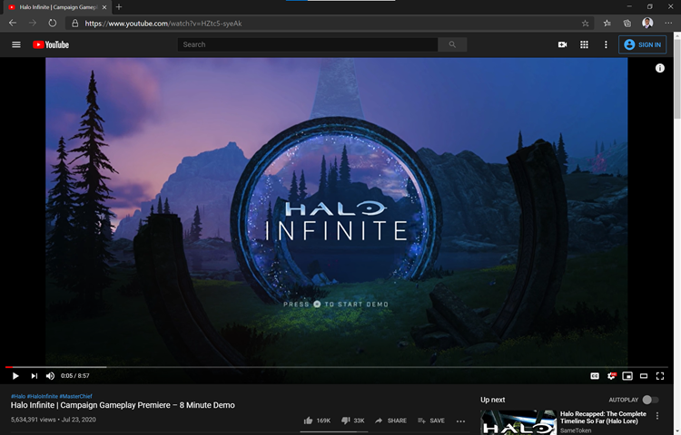

#### 1.5.1. Xbox Game Bar

[Xbox Game Bar](https://www.microsoft.com/en-us/p/xbox-game-bar/9nzkpstsnw4p?activetab=pivot:overviewtab) is a native Windows application that allows users to record their full screen by simply pressing the key binding: Win + Alt + R, for both starting and stopping the recording. A minimalistic recording widget is displayed while recording (Figure 1.5.2), yet removed from the final recording when played in the app’s gallery (Figure 1.5.3). Note that the gallery is accessed through the Xbox Game Bar menu (launched via Win + G), which includes a host of various options, settings, and metrics. To trim the recording, Xbox Game Bar’s interface has the user click through its gallery window, File Explorer, the Movies and TV app, and the Photos app before trimming functionality can be accessed (Figure 1.5.4).

###### *Figure 1.5.2 – Xbox Game Bar Recording Widget*

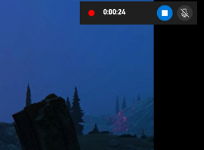

###### *Figure 1.5.3 – Gallery Window in Xbox Game Bar*

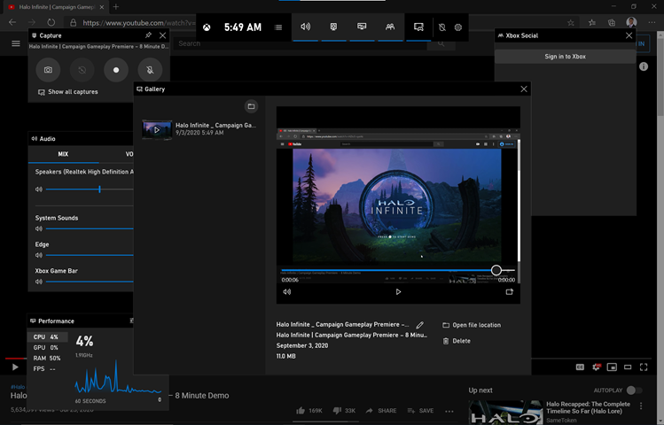

###### *Figure 1.5.4 – Trimming video via Xbox Game Bar. Note that the editing process takes the user through File Explorer, Movies & TV, and Photos before accessing the trimming functionality.*

#### 1.5.2. ScreenToGIF

[ScreenToGIF](https://www.screentogif.com/) is a free application that allows users to record a section of their screen. The launch menu (Figure 1.5.5) features a minimalistic set of options, and the recording interface (Figure 1.5.6) allows the user to drag and modify the bounding box around the desired content prior to recording. Note that there was a noticeable delay in the time from stopping the recording to opening the editing window as compared to other applications. Also note the verbose set of functionalities and editing options available in ScreenToGIF’s editing window (Figure 1.5.7).

###### *Figure 1.5.5 - ScreenToGIF Launch Menu*

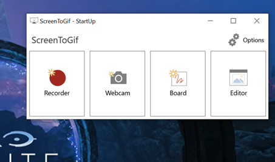

###### *Figure 1.5.6 - ScreenToGIF Recording Interface*

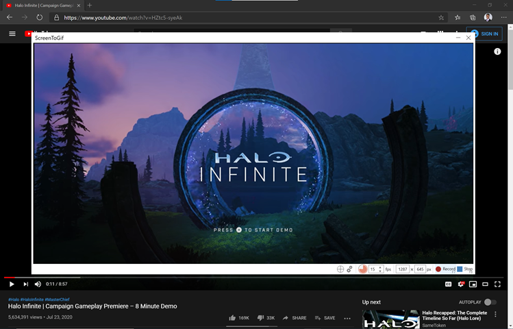

###### *Figure 1.5.7 - ScreenToGIF Editing Window*

#### 1.5.3. Camtasia

[Camtasia](https://filmora.wondershare.net/filmora-video-editor-bing.html?msclkid=98c2e7e5340f15bf2c9cb8853f3ed3af&utm_source=bing&utm_medium=cpc&utm_campaign=Filmora_SS_pid(1107)_US_Bing&utm_term=camtasia&utm_content=3.%20CP-Camtasia) is a paid software that provides users with an extensive set of high-end recording and editing features. The recording interface (Figure 1.5.8) offers a rich set of controls and settings that enable the user to capture a multitude of different media assets. The editing window (Figure 1.5.9) includes a verbose set options ranging from trimming capabilities to CGI and transition effects. Note the video export options (Figure 1.5.10) Camtasia supports offer popular MP4 formats and social media sharing options, in addition to GIF support under ‘Custom production settings’.

###### *Figure 1.5.8 - Camtasia's Recording Interface*

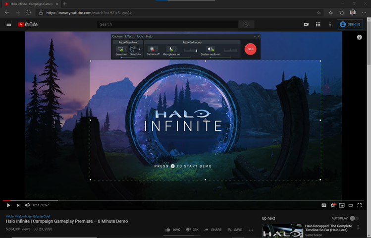

###### *Figure 1.5.9 - Camtasia's Editing Window*

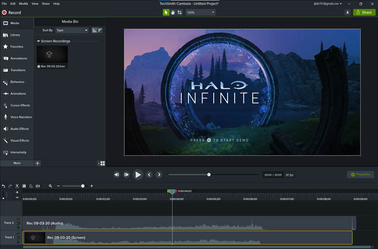

###### *Figure 1.5.10 - Camtasia's video export options*

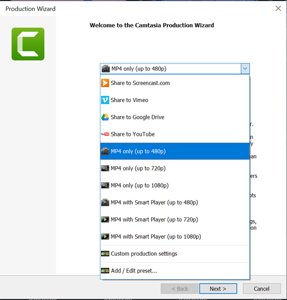

#### 1.5.4. Snip and Sketch

[Snip and Sketch](https://www.microsoft.com/en-us/p/snip-sketch/9mz95kl8mr0l?activetab=pivot:overviewtab) is a native Windows application that allows users to select sections of their screen to capture images of. While Snip and Sketch does not include recording functionality, we note this application because it captures the essence of simplicity and efficiency we hope to replicate in Video GIF Capture. Snip and Sketch’s intuitive interface (Figure 1.5.11) is quickly launched via the OS level key binding: Win + Shift + S. By selecting each option, the user easily becomes familiar with the range of applications. Once a section is captured, the image is immediately copied to the clipboard for usage in other applications. Snip and Sketch’s typical interaction time only takes a matter of seconds.

###### *Figure 1.5.11 - Snip and Sketch Selection Interface*

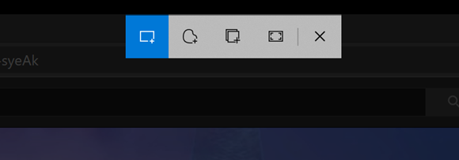

### 1.6. Opportunity for Impact

Given the software discussed in [**1.5 - Existing Landscape**](#15-Existing-Landscape), we aim to target Video GIF Capture as a lightweight, Windows native alternative to more verbose, feature-heavy applications like ScreenToGIF and Camtasia. Following Snip and Sketch’s intuitive and simple styling, Video GIF Capture should enable users to quickly ramp-up on its usage, and offer concise, efficient recording/editing options for common use cases as described in [**1.4 – Narrative / Scenarios**](#14-narrative--scenarios). By leveraging Windows native UI, we can create a familiar interaction experience that feels at home with similar Windows applications like Snip and Sketch, Xbox Game Bar, the Movies and TV app, and the Photos App. With an explicit focus on screen recording, we aim to streamline the user interface so that the overall time spent on the application can be comparable to Snip and Sketch’s fast interface, yet functionally equivalent to lightweight workloads on ScreenToGIF and Camtasia.

## 2. Definition of Success

### 2.1. Customers

Video GIF Capture is for power users and developers who are looking to tune and streamline their Windows experience for greater productivity and enhanced user experience.

### 2.2. Expected Impact: Customer, and Technology Outcomes

* **High Reliability:** Less than 0.1% crash rate.
* **High User Retention:** 25% or more of active PowerToys users who used VGC, use it again within 28 days.

## 3. Requirements

### 3.1. Functional Requirements

#### 3.1.1. Functional Requirements Overview

|No. | Requirement | Pri|
| - | - | - |
|1 | VGC launched via OS-Level key shortcut: Win + Shift + R.| P0 |
|2 | VGC launched alternatively through PowerToys settings menu launch button. | P2 |
|3 | On launch, overlay an intuitive action menu for region capture selection. | P0 |
|4 | Once a region is selected, transition the displayed action menu to populate with recording options. | P0 |
|5 | Once a recording is stopped, load the captured media in an editing window. | P0 |
|6 | Once editing is completed, save recording to desired format. | P0 |
|7 | At any point, the user should be able to close VGC, returning machine to original state. | P0 |

#### 3.1.2. Region Capture Dialog / Mode Selection

|No. | Requirement | Pri
| - | - | - |
|1 | On launch, display the region capture selection options listed below as described in the Selection Menu Mock-Up ([Figure 3.2.1](#figure-321---mock-up-of-video-gif-capture-selection-menu)): | P0 |
|2 | - Rectangular Selection | P0 | 
|3 | - Window Selection | P0 |
|4 | - Full Screen Selection | P0 |
|5 | - Exact Coordinates Selection | P2 |
|6 | - Cancel | P0 |
|7 | Dim the background so the screen capture menu is in focus. | P1 |
|8 | Default mode is Rectangular Selection. | P2 |
|9 | Transition to the other selection modes via clicking the option’s corresponding button in the menu. | P0 |
|10 | Alternatively transition to the other selection modes via the Tab key. | P2 |
|11 | Cancel selection mode and close the VGC app by selecting the 'Cancel' option. | P0 |
|12 | Alternatively cancel selection mode and close the VGC app by pressing the ESC key. | P1 |
|13 | Once a region has been selected. Transition the menu interface to populate with options for recording as illustrated in [Figure 3.2.3](#figure-323---mock-up-of-video-gif-capture-recording-interface-prior-to-recording). | P0 |

#### 3.1.3. Region Capture Type: Rectangular Selection

|No. | Requirement | Pri
| - | - | - |
|1 | In this mode, click and drag cursor over the desired region, displaying a highlighted border for visual confirmation like that shown in the UI mock-up depicted in [Figure 3.2.4](#figure-324---mock-up-of-video-gif-capture-bounding-box-region-prior-to-recording). | P0 |
|2 | Transition the selection menu to populate with recording options ([Figure 3.2.3](#figure-323---mock-up-of-video-gif-capture-recording-interface-prior-to-recording)). | P0 |

#### 3.1.4. Region Capture Type: Window/Application Selection

|No. | Requirement | Pri
| - | - | - |
|1 | In this mode, move the cursor across the screen, highlighting whatever window the cursor is currently hovering over. | P0 |
|2 | Clicking on desired window causes it to come in focus, displaying a highlighted border for visual confirmation like that shown in the UI mock-up depicted in [Figure 3.2.4](#figure-324---mock-up-of-video-gif-capture-bounding-box-region-prior-to-recording). | P0 |
|3 | After the window comes into focus, dont
|4 | Transition the selection menu to populate with recording options ([Figure 3.2.3](#figure-323---mock-up-of-video-gif-capture-recording-interface-prior-to-recording)). | P0 |

#### 3.1.5. Region Capture Type: Full Screen Selection

|No. | Requirement | Pri
| - | - | - |
|1 | In this mode, simply click the screen to confirm the recording selection. | P0 |
|2 | In the case of multi-monitor displays. The screen that the cursor is currently located when clicking will be captured, displaying visual confirmation around the perimeter of the screen like that shown in the UI mock-up depicted in [Figure 3.2.4](#figure-324---mock-up-of-video-gif-capture-bounding-box-region-prior-to-recording). | P1 |
|3 | Transition the selection menu to populate with recording options ([Figure 3.2.3](#figure-323---mock-up-of-video-gif-capture-recording-interface-prior-to-recording)). | P0 |

#### 3.1.6. Region Capture Type: Exact Coordinates Selection

|No. | Requirement | Pri
| - | - | - |
|1 | In this mode, an additional drop-down panel from the selection menu should appear that displays the inputs: X, Y, Height, Width, and Confirm ([Figure 3.2.2](#figure-322---mock-up-of-video-gif-capture-expanded-selection-menu-for-exact-coordinate-selection)). | P2 |
|2 | A highlighted rectangular border will be produced on the screen, of dimensions “Height” x “Width”, with the top-left corner of the border located at coordinate (X, Y) on the screen. Visualization equivalent to that shown the UI mock-up depicted in [Figure 3.2.4](#figure-324---mock-up-of-video-gif-capture-bounding-box-region-prior-to-recording). | P2 |
|3 | The inputs can be adjusted textually via their corresponding text fields in the drop-down. | P2 |
|4 | The inputs can also be adjusted manually via click-and-dragging the displayed tooltips along the highlighted border. | P2 |
|5 | Dragging the tooltips located on the border’s corners will preserve the region’s current aspect-ratio while adjusting its size. | P2 |
|6 | Selecting the ‘Confirm’ button from the drop-down menu causes the highlighted border to become locked in as the selection menu transitions to populate with recording options. | P2 |

#### 3.1.7. Recording

|No. | Requirement | Pri
| - | - | - |
|1 | Populate the selection menu with recording options: Record, Cancel ([Figure 3.2.3](#figure-323---mock-up-of-video-gif-capture-recording-interface-prior-to-recording)). | P0 |
|2 | Keep the highlighted border around the selected recording region but remove the overlay that was created when the selection tool was activated. | P0 |
|3 | Allow the user to interact with the system as needed to prepare for the initiation of the recording. | P0 |
|4 | Allow the user to manually modify the recording region prior to the initiation of recording via click-and-drag functionality on the highlighted border like that shown in the UI mock-up depicted in [Figure 3.2.4](#figure-324---mock-up-of-video-gif-capture-bounding-box-region-prior-to-recording). | P0 |
|5 | When ‘Record’ is selected, lock the highlighted border so that it can no longer be adjusted. | P0 |
|6 | When ‘Record’ is selected, initiate the recording. | P0 |
|7 | If the 'Pre-Recording Countdown' option in the settings menu ([figure 3.2.8](#figure-328---mock-up-of-video-gif-capture-powertoys-settings)) is non-zero, precede the recording with an overlay that decrements from the countdown option's value to zero. | P2 |
|8 | Alternatively start recording by pressing the OS level short-cut: Win + Shift + R. | P1 |
|9 | When recording begins, transition the recording menu to the active state as depicted in [Figure 3.2.5](#figure-325---mock-up-of-video-gif-capture-recording-interface-during-recording). | P0 |
|10 | While the recording is active, the user is free to interact with the system as desired. | P0 |
|11| When the user selects the ‘Stop’ button, the recording is ended and loaded into an editor window like that depicted in [Figure 3.2.6](#figure-326---mock-up-of-video-gif-capture-video-editing). | P0 |
|12| Alternatively stop the recording and load it into an editor window by pressing the OS level short-cut: Win + Shift + R at any time while recording. | P1 |

#### 3.1.8. Editing

|No. | Requirement | Pri
| - | - | - |
|1 | Load the recording from [section 3.1.7](#317-recording) in an editor window as described in [Figure 3.2.6](#figure-326---mock-up-of-video-gif-capture-video-editing). | P0 |
|2 | The loaded recording should add a solid border around the captured media (customizable from the settings menu) | P1 |
|2 | A scrub bar should sit below the loaded media to trim the recording as shown in [Figure 3.2.6](#figure-326---mock-up-of-video-gif-capture-video-editing). | P0 |
|3 | On the right-hand menu, display a selection menu for either Video or GIF. | P0 |
|4 | The settings icon should display the PowerToys settings menu for VGC when clicked ([Figure 3.2.8](#figure-328---mock-up-of-video-gif-capture-powertoys-settings)). | P0 |
|5 | Under the ‘Video’ menu ([Figure 3.2.6](#figure-326---mock-up-of-video-gif-capture-video-editing)), display options to: | P0 |
|6 | - Save the video | P0 |
|7 | - Adjust resolution quality | P1 |
|8 | - Enable/disable system audio | P2 |
|9 | Under the ‘GIF’ menu ([Figure 3.2.7](#figure-327---mock-up-of-video-gif-capture-gif-editing)), display options to: | P1 |
|10 | - Save the GIF | P1 |
|11 | - Adjust resolution quality | P2 |
|12 | - Set frames-per-second | P2 |
|13 | - Copy the GIF to the clipboard.| P3 |

#### 3.1.9. Settings Menu

|No. | Requirement | Pri
| - | - | - |
|1 | A section for the Video/GIF Capture PowerToy should be available in the PowerToys Settings Menu [Figure 3.2.8](#figure-328---mock-up-of-video-gif-capture-powertoys-settings) with the following options: | P0 |
|2 | - Enable/Disable Video/GIF Capture | P0 |
|3 | - Customize the hot keys to launch VGC | P1 |
|4 | - Select the default mode for recording region selection | P1 |
|5 | - Pre-recording countdown time | P1 |
|6 | - Customize the color/thickness of the border that surrounds the recording region | P1 |
|7 | - Enable/Disable the inclusion of a solid border around the recorded media | P1 |
|8 | - Launch VGC from the settings menu | P1 |
|9 | - Enable/Disable Click Capture | P2 |
|10 | - Enable/Disable Mouse Capture | P2 |
|11 | - Enable/Disable keystroke Capture | P3 |

### 3.2. Design Mock-Ups

###### *Figure 3.2.1 - Mock up of Video GIF Capture selection menu*

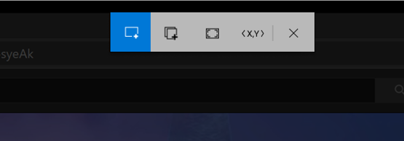

###### *Figure 3.2.2 - Mock up of Video GIF Capture expanded selection menu for exact coordinate selection*

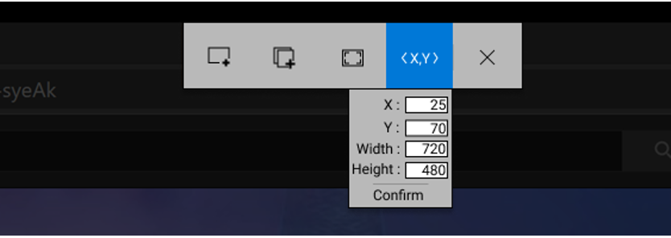

###### *Figure 3.2.3 - Mock up of Video GIF Capture recording UI prior to recording*

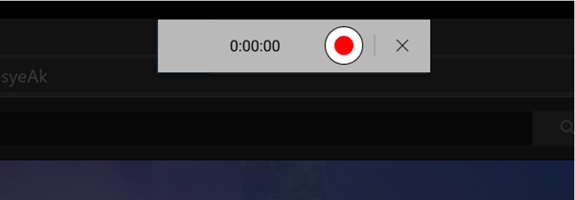

###### *Figure 3.2.4 - Mock up of Video GIF Capture bounding box region prior to recording*

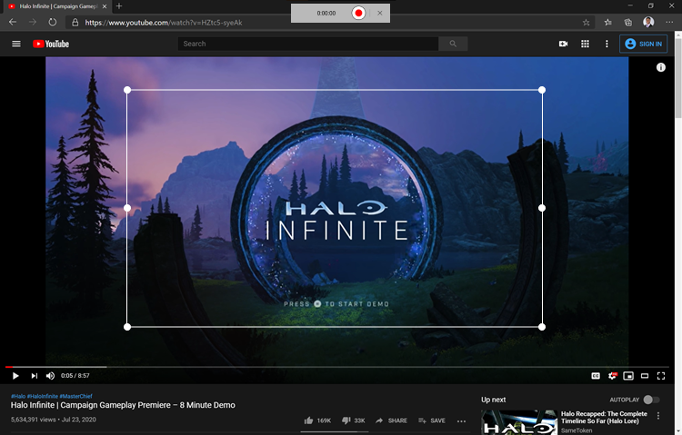

###### *Figure 3.2.5 - Mock up of Video GIF Capture recording interface during recording*

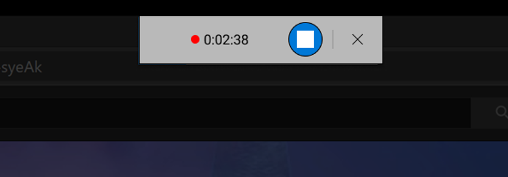

###### *Figure 3.2.6 - Mock up of Video GIF Capture video editing*

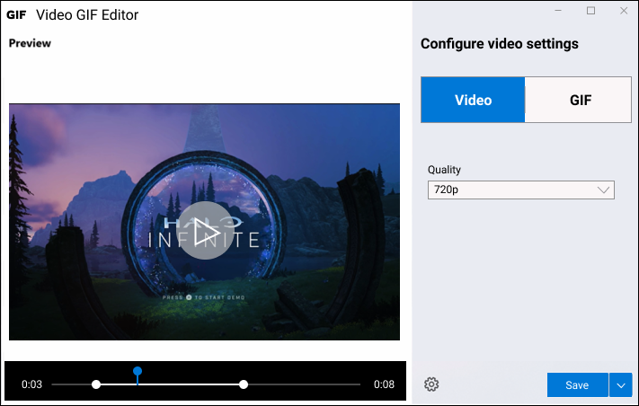

###### *Figure 3.2.7 - Mock up of Video GIF Capture GIF editing*

###### *Figure 3.2.8 - Mock up of Video GIF Capture PowerToys settings*

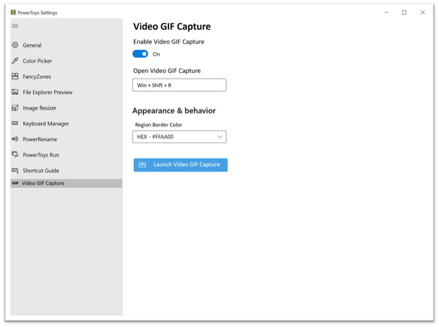

### 3.3. Open Considerations

* DRM considerations
* Memory considerations when recording
* File size considerations for exporting
* Animated GIF 'copy to clipboard' functionality: Windows currently doesn't support animated GIF copying, so only a static non-animated variant can be stored on the clipboard
* Text overlay functionality
* PowerToys Settings menu options (ex: default encoder, cursor capture, click/touch capture, key stroke capture, pre-recording countdown, etc.)
* Multi-monitor display behaviors and Multi-DPI compatibility
* OS level shortcuts & hot-keys. Ex: Play, Stop, Pause, Resume, Cancel
* Command line/API
* Discoverability of features and settings
* Touch & Pen interaction considerations and supporting UI
* Supported export formats

## 4. Measure Requirements

|No. | Requirement | Implication |Pri. |
| - | - | - | - |
|1 | Total time of recording | Insight into memory requirements for application | P1 |
|2 | # of recordings captured | Information on the frequency of application usage | P1 |
|3 | # of recordings trimmed | Insights into potential editing optimizations | P1 |
|4 | Type of recording zone used | Allows us to recommend defaults to Windows developers | P1 |
|5 | # of times VGC was canceled | Continuous cancellations may imply shortcomings in UX and general usability | P1 |
|6 | % of successful renders | Allows us to track application reliability | P1 |
|7 | Final recording form (GIF vs MP4) | Allows us to track popularity of encoding format to prioritize further improvements and optimizations | P1 |
|8 | Number of times in past 28 days user has engaged with recording tool | Information on whether VGC is being utilized by PowerToys users | P1 |
|9 | Changes to default encoding | Allows us to recommend defaults to Windows developers | P1 |
|10| Size of recording | Insight into memory requirements for application | P1 |

## 5. Dependencies

* Depending on implementation, Snip and Sketch base code for zone selection
* Depending on implementation, Photos app base code for editor trimming
* Depending on implementation, ScreenToGIF as possible OSS base partner
* WinUI 3

## 6. Release Milestones

We plan to develop Video/GIF Capture in phases, gradually adding to the functionality as we complete the feature set described in this spec with each release. Below we list our tentative expectations for each major release of VGC.

|Release No. | Expectations |
| - | - |
|1 | All P0 requirements discussed in [Section 3](#3-requirements). Note that for this initial release we don't include GIF capture functionality.|
|2 | P1 requirements for supporting GIF capture functionality in [Section 3.1.8](#318-editing). |
|3 | P1 requirements for region selection, recording and editing [Sections 3.1.2 - 3.1.8](#312-region-capture-dialog--mode-selection). |
|4 | P1 requirements for settings menu [Section 3.1.9](#319-settings-menu) |
|5 | P2 requirements for region selection, recording and editing [Sections 3.1.2 - 3.1.8](#312-region-capture-dialog--mode-selection). Note that this release primarily adds exact coordinate selection mode. |
|6 | P2 requirements for settings menu [Section 3.1.9](#319-settings-menu). |
|7 | All P3 requirements discussed in [Section 3](#3-requirements) along with any miscellaneous work items that arise. |