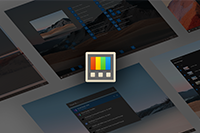

# **Preview pane - Adding previews with monaco**

- **What is it:** Implementing [#1527](https://github.com/microsoft/PowerToys/issues/1527)
- **Authors:** Aaron Junker ([@aaron-junker](https://github.com/aaron-junker)), Clint Rutkas ([@crutkas](https://github.com/crutkas))
- **Spec Status:** Waiting for review

# 1 Overview

Creating a new preview handler for all Developer files. For this we use [Microsoft Monaco editor](https://github.com/microsoft/monaco-editor). 

## 1.1 Technical implementation

A WebView2 window implements shows HTML file with Monaco integrated.

### 1.1.1 New dependencies

The installer needs to install [WebView2](https://developer.microsoft.com/en-us/microsoft-edge/webview2/)

### 1.1.2 Why WebView2

Experiments with a POC showed that only WebView2 is displaying Monaco the right way.

## 1.2 Why?

Many people asking us for supporting new file types in the preview panes. With implementing this we will support many developer files (for Example .py, .php,.cs, and many more).

### 1.2.1 Why Monaco?

* Monaco supports many different language styles. 
* It supports dark mode
* Clickable links
* Monaco has also the MIT-license

# 2 What does this implement

If we implement this we could close the issues:

* [#1527](https://github.com/microsoft/PowerToys/issues/1527)
* [#1841](https://github.com/microsoft/PowerToys/issues/1841)
 
# 3 Goals and non-goals
## 3.1 Goals
 
* Create working implementation of Monaco in the preview pane
* Support many languages
 
## 3.2 Non-goals

* Replacing existing previewpanes (like .txt)
* Publishing a crashing system

# 4 Priorities

|Name|Description|Priority|
|----|-----------|--------|
|Working Preview pane|It's simply working.|P0|
|Installer can install filetypes|When the user installs PowerToys the Installer registers the preview handlers.|P0|
|Style code|Monaco recognizes the File extensions and colors the code the right way.|P0|
|User can choose file previews|Users can attach costum filetypes to preview.|P2|
|OOBE|Description for the OOBE.|P1|
|On/Off in settings|The user can turn it on and off.|P0|
|Installer selection for file extensions|User can choose in the installer which File extensions should get registered.|P1|
