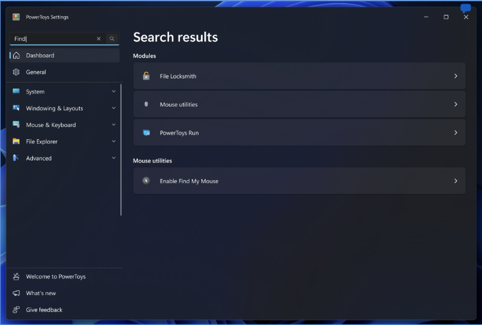

# PowerToys Settings – Search Index (Hard-sealed)

## 1. What to index

This section describes the current structure of the settings pages in PowerToys. All user-facing settings are contained in the content of <controls:SettingsPageControl>. The logical and visual structure of settings follows a nested layout as shown below:

```css
SettingsPageControl
 └─ SettingsGroup
     └─ [SettingsExpander]
         └─ SettingsCard
```
* Each SettingsGroup defines a functional section within a settings page.

* An optional SettingsExpander may be used to further organize related settings inside a group.

* Each actual setting is represented by a SettingsCard, which contains one user-tweakable control or a group of closely related controls.

>Note: Not all SettingsCard are necessarily wrapped in a SettingsExpander; they can exist directly under a SettingsGroup. 

> For indexing purposes, we are specifically targeting all SettingsCard elements. These are the smallest units of user interaction and correspond to individual configurable settings.

> There could be setting item in expander, so we also need to index expander items as well.

### Module
Module is a primary type that needs to be indexed, for modules, we need to index the 'ModuleTitle' and the 'ModuleDescription'. 
So these two should be passed in by x:Uid and binding with a key. 


### SettingsCard/SettingsExpander

Each SettingsCard/SettingsExpander should have an x:Uid for localization and indexing. The associated display strings are defined in the .resw files:

{x:Uid}.Header – The visible label/title of the setting.
{x:Uid}.Description – (optional) The tooltip or explanatory text.

The index should be built around these SettingsCard elements and their x:Uid-bound resources, as they represent the actual settings users will search for.

---

## 2. How to Navigate

### Entry
```csharp
enum EntryType
{
    SettingsPage,
    SettingsCard,
    SettingsExpander,
}

public class SearchableElementMetadata
{
    public string PageName { get; set; }    // Used to navigate to a specific page
    public EntryType Type { get; set; }     // Used to know how should we navigate(As a page, a settingscard or an expander?)
    public string ParentElementName { get; set; }
    public string ElementName { get; set; }
    public string ElementUid { get; set; }
    public string Icon { get; set; }
}
```

### Navigation
The steps for navigate to an item:
* Navigate among pages
* [optional] Expand the expander if setting entry is inside an expander
* [optional] Navigate within page

> Use page name for navigation:
```csharp
Type GetPageTypeFromPageName(string PageName)
{
    var assembly = typeof(GeneralPage).Assembly;
    return assembly.GetType($"Microsoft.PowerToys.Settings.UI.Views.{PageName}");
}

NavigationService.Navigate(PageType, ElementName，ParentElementName);
```

> Use ElementName and ParentElementName for in page navigation:
```csharp
Page.OnNavigateTo(ElementName， ParentElementName){
    var element = this.FindName(name) as FrameworkElement;
    var parentElement = this.FindName(ParentElementName) as FrameworkElement;

    if(parentElement) {
        expander = (Expander)parentElement;
        if(expander){
            expander.Expand();
        }

        // https://learn.microsoft.com/en-us/uwp/api/windows.ui.xaml.uielement.startbringintoview?view=winrt-26100        
        element.StartBringIntoView();
    }
}
```

## 3. Runtime Search
When user start typing for an entry, e.g. shortcut or 快捷键(cn version of shortcut),
we need to go through all the entries to see if an entry matches the search text.

A naive approach will be try to match all the localized text one by one and see if they match.
Total entry is within thousand(To fill in an exact number), performance is acceptable now.
```csharp
// Match
query = UserInput();
matched = {};

indexes = BuildIndex();

foreach(var entry in indexes) {
    if(entry.Match(query)) {
        matched.Add(entry);
    }
}
```

And we don't intend to introduce complexity on the match algorithm discussion, so let's use powertoys FuzzMatch impl for now.
```csharp
MatchResult Match(this Entry entry, string query) {
    return FuzzMatch(entry.DisplayedText, query);
}

struct MatchResult{
    int Score;
    bool Result;
}
```

## 4. Search Result Page

After we got matched items, map these items to a search result page according to spec.
```c#
ObservableCollection<SettingEntry> ModuleResult;
ObservableCollection<SettingsGroup> GroupedSettingsResults;

public class SettingsGroup : INotifyPropertyChanged
{
    private string _groupName;
    private ObservableCollection<SettingEntry> _settings;
    public string GroupName
    {
        get => _groupName;
        set
        {
            _groupName = value;
            OnPropertyChanged();
        }
    }
    public ObservableCollection<SettingEntry> Settings
    {
        get => _settings;
        set
        {
            _settings = value;
            OnPropertyChanged();
        }
    }
    public event PropertyChangedEventHandler PropertyChanged;
    protected virtual void OnPropertyChanged([CallerMemberName] string propertyName = null)
    {
        PropertyChanged?.Invoke(this, new PropertyChangedEventArgs(propertyName));
    }
}
```

## 5. How to do Index
### Runtime index or build time index?
Now We need to build all the entries in our settings.

Most of the entry properties are static, and in runtime, the `SettingsCard` is compiled into native winUI3 controls <small>(I suppose, please correct here if it's wrong)</small>, it's hard to locate all the `SettingsCard`, and performance is terrible if we do search for all the pages' elements.

### Build time indexing
We can rely on xaml file parsing to get all the SettingsCard Entries. 
And we don't want xaml file to be brought into production bundle.
Use a project for parsing and bring that index file into production bundle is a solution.
```csproj
  <Target Name="GenerateSearchIndex" BeforeTargets="BeforeBuild">
    <PropertyGroup>
      <BuilderExe>$(MSBuildProjectDirectory)\..\Settings.UI.XamlIndexBuilder\bin\$(Configuration)\net8.0\XamlIndexBuilder.exe</BuilderExe>
      <XamlDir>$(MSBuildProjectDirectory)\Views</XamlDir>
      <GeneratedJson>$(MSBuildProjectDirectory)\Services\searchable_elements.json</GeneratedJson>
    </PropertyGroup>
    <Exec Command="&quot;$(BuilderExe)&quot; &quot;$(XamlDir)&quot; &quot;$(GeneratedJson)&quot;" />
  </Target>
```
```csharp
for(xamlFile in xamlFiles){
    var doc = Load(xamlFile);
    var elements = doc.Descendants();

    foreach(var element in elements){
        if(element.Name == "SettingsCard") {
            var entry = new Entry{
                ElementName = element.Attribute["Name"],
                PageName = FileName,
                Type = "SettingsCard",
                ElementUid = element.Attribute["Uid"],
                DisplayedText = "",
            }

            var parent = element.GetParent();
            if(parent.Name == "SettingsExpander"){
                entry.ParentElementName = parent.Attribute["Name"];
            }
        }
    }
}
```
Runtime index loading:
```
var entries = LoadEntriesFromFile();
foreach(var entry in entries){
    entry.DisplayedText = ResourceLoader.GetString(entry.Uid);
}
```
So now we have all the entries and entry properties.

## Overall flow:


## 6. Corner cases - that have not addressed yet

1. CmdPal page is not in scope of this effort, that needs additional effort&design to launch and search within cmdpal settings page.

2. Go back button

3. Dynamic constructed settings page
 - Shortcut guide,  with visibility converter
 - advanced paste dynamically configured setting items
 - powertoys run's extensions