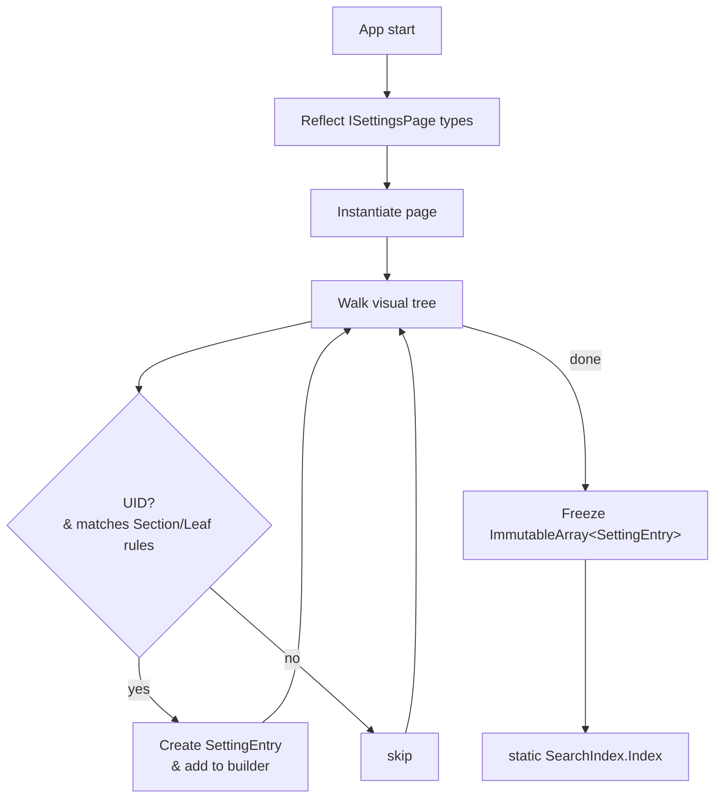
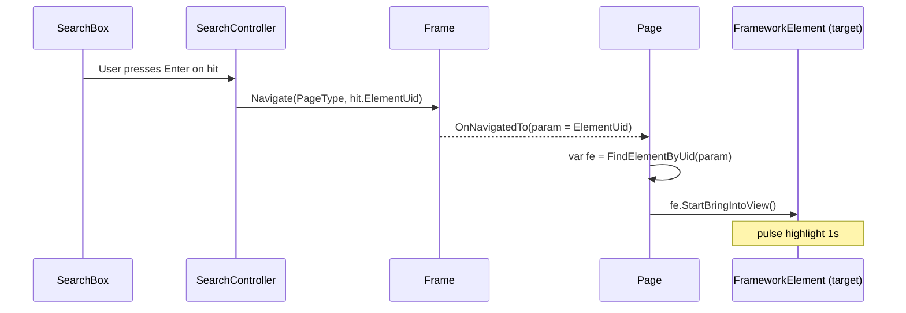

# PowerToys Settings – Search Index (Hard-sealed)

> **Scope**  
> *This document covers only the data we index, where we pull it from in XAML,  
>  how we build & store the index, and how a query runs against it.*  
> Out-of-scope: UI rendering, telemetry, semantic search
---

## 1 · Indexable elements

| Kind&nbsp;(`EntryKind`) | XAML selector | Must have | Why it's indexed | Extracted fields | Sources & Examples |
|-------------------------|---------------|-----------|------------------|------------------|-------------------|
| **`Section`** | `tkcontrols:SettingsGroup` (or any `SettingsGroup`) | `x:Uid` | Gives users a named navigation landmark ("Clipboard sharing") | *caption* ← `{Uid}/Text`<br>*description* ← `{Uid}/Description` (optional) | All settings pages<br>e.g. `x:Uid="ColorPicker_GroupSettings"` |
| **`Leaf`** | Any **user-interactive setting control** whose type derives from:<br>`ToggleSwitch`, `CheckBox`, `ComboBox`, `Slider`, `Button`, `TextBox`, `tkcontrols:SettingsCard`, `tkcontrols:SettingsExpander`, `RadioButton`| `x:Uid` | Represents a tweakable knob users will search for | *caption* ← `{Uid}/Text`<br>*description* ← `{Uid}/Description` **or** control `ToolTip` | **ToggleSwitch**: FancyZones/`x:Uid="ToggleSwitch"`<br>**SettingsCard**: General/`x:Uid="General_RunAtStartUp"`<br>**SettingsExpander**: General/`x:Uid="General_SettingsBackupAndRestore"`<br>**ComboBox**: PowerRename/`x:Uid="PowerRename_Toggle_StandardContextMenu"`<br>**Button**: ColorPicker/`x:Uid="ColorPickerAddNewFormat"` |
| **Ignored** | Everything else (layout panels, `TextBlock`, `InfoBar`, `HyperlinkButton`, etc.) | — | No user interaction or settings value | — | Non-interactive display elements |

All strings are taken from the **localized** RESW resources.

**Note**: `Settings.IsSearchable="True"` is a custom attached property that would need to be implemented if used. Currently not found in existing codebase.

---

## 2 · `SettingEntry` struct

```csharp
internal readonly struct SettingEntry
{
    public readonly EntryKind Kind;           // Section | Leaf
    public readonly string    Module;         // e.g. "Mouse Without Borders, General"
    public readonly string    Value;          // Displayed text
    public readonly string    PageTypeName;   // page for navigate to
    public readonly string    ElementUid;     // FrameworkElement to navigate to
}
```


## 3 · One-shot index build 


* Runs once per process.
* Any locale switch requires a full app restart; no incremental rebuild.

Visual-tree walk
```csharp
/// <summary>
/// Scans <paramref name="root"/> for any FrameworkElement that
///   • has a non-empty x:Uid
///   • is either a SettingsGroup  (⇒ Section)
///     or passes IsLeafSetting() (⇒ Leaf)
/// and emits a SettingEntry into <paramref name="builder"/>.
/// </summary>
void CollectEntries(
    FrameworkElement root,
    string module,                              // e.g. "Mouse Without Borders"
    string pageType,                            // fully-qualified type name
    ImmutableArray<SettingEntry>.Builder builder)
{
    foreach (var fe in root.GetVisualDescendants().OfType<FrameworkElement>())
    {
        if (!HasUid(fe))
            continue;                                   // want Uid-only

        EntryKind kind =
            fe is SettingsGroup          ? EntryKind.Section :
            IsLeafSetting(fe)            ? EntryKind.Leaf    :
                                             (EntryKind)(-1); // ignore

        if (kind == (EntryKind)(-1))
            continue;                                   // not a group, not a leaf

        string value = GetLocalizedString(fe.Uid);      // Header→Value→Content→Text
        if (string.IsNullOrWhiteSpace(value))
            continue;                                   // nothing to show

        builder.Add(new SettingEntry(
            kind,
            module,            // no section breadcrumb — exactly what you asked for
            value,
            pageType,
            fe.Uid));
    }
}

static bool HasUid(FrameworkElement fe) => !string.IsNullOrWhiteSpace(fe.Uid);

static string GetLocalizedString(string uid) =>
    Res.FirstNonEmpty(uid, "Header", "Value", "Content", "Text") ?? string.Empty;

static bool IsLeafSetting(FrameworkElement fe) =>
    fe is ToggleSwitch  or CheckBox   or ComboBox  or Slider
    or Button           or TextBox    or NumberBox or PasswordBox
    or ColorPicker      or HotkeyControl
    || Settings.GetIsSearchable(fe);

```

## 4 · Query algorithm
Normalize the query string Entrys, e.g. MouseWithoutBorders Security Key

Iterate SearchIndex.Index; compute fuzzy subsequence score on normalized string.

Maintain a binary heap of the top N results (default 20).

Return list of SearchHit (Search Entry).


## 5 · End-to-end flow when user selects a hit


## 5 · Unit tests

## 6 · Performance targets [TBD]
| Metric        | Target                                        |
| ------------- | --------------------------------------------- |
| Build time    | ≤ 100 ms total for all modules on surface laptop 7th edition |
| Memory        | ≤ 150 kB for 1 000 entries                    |
| Query latency | ≤ 1 ms 95-pctl per keystroke (ARM64)          |