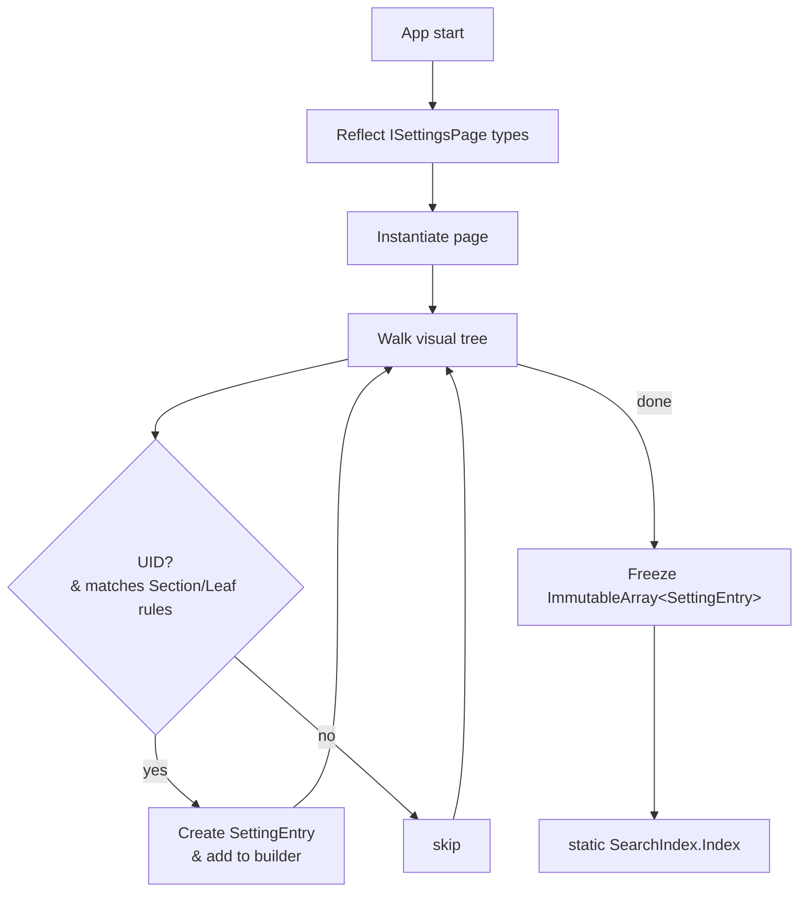
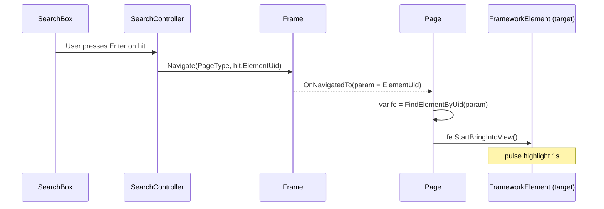

# PowerToys Settings – Search Index (Hard-sealed)

> **Scope**  
> *This document covers only the data we index, where we pull it from in XAML,  
>  how we build & store the index, and how a query runs against it.*  
> Out-of-scope: UI rendering, telemetry, semantic search
---

## 1 · Indexable elements

| Kind&nbsp;(`EntryKind`) | XAML selector | Must have | Why it's indexed | Extracted fields | Sources & Examples |
|-------------------------|---------------|-----------|------------------|------------------|-------------------|
| **`Section`** | `tkcontrols:SettingsGroup` (or any `SettingsGroup`) | `x:Uid` | Gives users a named navigation landmark ("Clipboard sharing") | *caption* ← `{Uid}/Text`<br>*description* ← `{Uid}/Description` (optional) | All settings pages<br>e.g. `x:Uid="ColorPicker_GroupSettings"` |
| **`Leaf`** | Any **user-interactive setting control** whose type derives from:<br>`ToggleSwitch`, `CheckBox`, `ComboBox`, `Slider`, `Button`, `TextBox`, `tkcontrols:SettingsCard`, `tkcontrols:SettingsExpander`, `RadioButton`| `x:Uid` | Represents a tweakable knob users will search for | *caption* ← `{Uid}/Text`<br>*description* ← `{Uid}/Description` **or** control `ToolTip` | **ToggleSwitch**: FancyZones/`x:Uid="ToggleSwitch"`<br>**SettingsCard**: General/`x:Uid="General_RunAtStartUp"`<br>**SettingsExpander**: General/`x:Uid="General_SettingsBackupAndRestore"`<br>**ComboBox**: PowerRename/`x:Uid="PowerRename_Toggle_StandardContextMenu"`<br>**Button**: ColorPicker/`x:Uid="ColorPickerAddNewFormat"` |
| **Ignored** | Everything else (layout panels, `TextBlock`, `InfoBar`, `HyperlinkButton`, etc.) | — | No user interaction or settings value | — | Non-interactive display elements |

All strings are taken from the **localized** RESW resources.

**Note**: `Settings.IsSearchable="True"` is a custom attached property that would need to be implemented if used. Currently not found in existing codebase.

---

## 2 · `SettingEntry` struct

```csharp
internal readonly struct SettingEntry
{
    public readonly EntryKind Kind;           // SettingsCard | SettingsExpandar
    public readonly string    Module;         // e.g. "Mouse Without Borders, General"
    public readonly string    DisplayedText;          // Displayed text
    public readonly string    PageTypeName;   // page for navigate to
    public readonly string    ElementUid;     // FrameworkElement to navigate to
    public readonly string    Name;           // Used to reflection and navigate to
}
```


## 3 · One-shot index build 


* Runs once per process.
* Any locale switch requires a full app restart; no incremental rebuild.

Visual-tree walk
```csharp
/// <summary>
/// Scans <paramref name="root"/> for any FrameworkElement that
///   • has a non-empty x:Uid
///   • is either a SettingsGroup  (⇒ Section)
///     or passes IsLeafSetting() (⇒ Leaf)
/// and emits a SettingEntry into <paramref name="builder"/>.
/// </summary>
void CollectEntries(
    FrameworkElement root,
    string module,                              // e.g. "Mouse Without Borders"
    string pageType,                            // fully-qualified type name
    ImmutableArray<SettingEntry>.Builder builder)
{
    foreach (var fe in root.GetVisualDescendants().OfType<FrameworkElement>())
    {
        if (!HasUid(fe))
            continue;                                   // want Uid-only

        EntryKind kind =
            fe is SettingsGroup          ? EntryKind.Section :
            IsLeafSetting(fe)            ? EntryKind.Leaf    :
                                             (EntryKind)(-1); // ignore

        if (kind == (EntryKind)(-1))
            continue;                                   // not a group, not a leaf

        string value = GetLocalizedString(fe.Uid);      // Header→Value→Content→Text
        if (string.IsNullOrWhiteSpace(value))
            continue;                                   // nothing to show

        builder.Add(new SettingEntry(
            kind,
            module,            // no section breadcrumb — exactly what you asked for
            value,
            pageType,
            fe.Uid));
    }
}

static bool HasUid(FrameworkElement fe) => !string.IsNullOrWhiteSpace(fe.Uid);

static string GetLocalizedString(string uid) =>
    Res.FirstNonEmpty(uid, "Header", "Value", "Content", "Text") ?? string.Empty;

static bool IsLeafSetting(FrameworkElement fe) =>
    fe is ToggleSwitch  or CheckBox   or ComboBox  or Slider
    or Button           or TextBox    or NumberBox or PasswordBox
    or ColorPicker      or HotkeyControl
    || Settings.GetIsSearchable(fe);

```

## 4 · Query algorithm
Normalize the query string Entrys, e.g. MouseWithoutBorders Security Key

Iterate SearchIndex.Index; compute fuzzy subsequence score on normalized string.

Maintain a binary heap of the top N results (default 20).

Return list of SearchHit (Search Entry).


## 5 · End-to-end flow when user selects a hit


## 5 · Unit tests

## 6 · Performance targets [TBD]
| Metric        | Target                                        |
| ------------- | --------------------------------------------- |
| Build time    | ≤ 100 ms total for all modules on surface laptop 7th edition |
| Memory        | ≤ 150 kB for 1 000 entries                    |
| Query latency | ≤ 1 ms 95-pctl per keystroke (ARM64)          |


> appendix
Why we build index in such a way

## 1  Business requirement
> **Goal:** Build (and later refresh) a `SettingEntry` index so users can **search** every heading and control in the Settings UI – in any language that the app supports at run-time.

* Must work **in debug builds and in the shipped MSIX**.
* Must honour the user’s **current language** (they can switch at run-time).
* **No brittle path logic**; reflection is preferred.
* **Minimal perf / size impact** on the production package.

---

## 2  Constraints discovered

| Fact                                                                                                        | Impact                                                                    |
| ----------------------------------------------------------------------------------------------------------- | ------------------------------------------------------------------------- |
| WinUI 3 strips `x:Uid` during XAML compilation → run-time `FrameworkElement` no longer exposes `Uid`.       | Reflection cannot read that value back unless we store it somewhere else. |
| We still need the **same string** (`uid`) to build “`uid/Value`” resource keys.                             | Whatever property we store must carry *that* exact text.                  |
| Localisation is **dynamic** – resources are loaded through `ResourceLoader` each time the index is rebuilt. | We **cannot** pre-compute a final text table at build time.               |

---

## 3  Design options evaluated

| Option                                                      | Keeps uid at run-time? | Repo / package impact                                     | Notes                                                                        |
| ----------------------------------------------------------- | ---------------------- | --------------------------------------------------------- | ---------------------------------------------------------------------------- |
| **A. Ship raw *.xaml***<br>`Content CopyToOutputDirectory`  | ✔︎                     | Package grows (loose XAML); still need directory probing. | Works but messy; performance fine (one-off disk read) yet feels like a hack. |
| **B. Source-generator** produces a static `SettingEntry[]`. | ✘ (text frozen)        | No package impact, fastest start-up.                      | **Rejected** – localisation is dynamic, so we cannot hard-code captions.     |
| **C-1. Add a *custom* attached DP** (`local:RuntimeUid`)    | ✔︎                     | One new helper class; XAML bulk-edit.                     | Clean, but new xmlns & property everywhere.                                  |
| **C-2. Re-use an *existing* property that survives**        | ✔︎                     | Only XAML edit, no new API surface.                       | Candidate props: **AutomationId**, Name, Tag, x\:NameScope etc.              |

---

## 4  Why **AutomationId** beats **Name**

| Criterion                                                             | `AutomationProperties.AutomationId`                | `FrameworkElement.Name`                                                                                                      |
| --------------------------------------------------------------------- | -------------------------------------------------- | ---------------------------------------------------------------------------------------------------------------------------- |
| **Guaranteed to exist at run-time** on every FrameworkElement         | ✅ DependencyProperty, always available             | ✅ DependencyProperty                                                                                                         |
| **Already intended for “unique identifier for automation / testing”** | ✅ (official guidance)                              | ⚠️ Primary purpose is XAML namescope + code-behind field binding                                                             |
| **Does not collide** with XAML designer-generated fields              | ✅ No code-behind field is created                  | ⚠️ `x:Name` generates a backing field – adding hundreds of names bloats generated code and can trigger duplicate-name errors |
| **Rarely used elsewhere in PowerToys Settings** (low conflict risk)   | ✅ (nearly all controls have no AutomationId today) | ❌ many controls already have `Name` for layout, tests or bindings                                                            |
| **Semantics match `uid`** (“language-independent logical id”)         | ✅ Exactly                                          | ⚠️ Often treated as developer-only label; maintainers might rename casually                                                  |
| **Accessible-tech / UI-Automation benefits**                          | ✅ Adds clarity for Narrator & UI tests             | Neutral                                                                                                                      |
| **One-line XAML edit (regex) without new xmlns**                      | ✅ `AutomationProperties.AutomationId="Foo"`        | ✅/⚠️ but risk of name collisions                                                                                             |

**Conclusion:** `AutomationId` is the safest, least intrusive place to mirror `x:Uid`.

---

## 5  Implementation plan

### 5.1  Bulk-apply the mirror attribute

*Regex* (run once across `SettingsXAML\Views`):

| find              | replace                                             |
| ----------------- | --------------------------------------------------- |
| `x:Uid="([^"]+)"` | `x:Uid="$1" AutomationProperties.AutomationId="$1"` |

(Review existing controls that already set AutomationId to avoid double definitions.)

### 5.2  Update the reflection indexer

```csharp
using Microsoft.UI.Xaml.Automation;

// …

private static bool TryGetUid(FrameworkElement fe, out string uid)
{
    uid = AutomationProperties.GetAutomationId(fe);
    return !string.IsNullOrWhiteSpace(uid);
}

// Everywhere the old code expected fe.Uid:
if (TryGetUid(node, out var uid))
{
    // use uid exactly as before (resourceLoader $"{uid}/Value")
}
```

> No other logic changes – section/leaf detection, caption lookup, module-name switch all stay exactly the same.

### 5.3  Reload index on language change

If the app offers an in-app “Choose language” menu, call:

```csharp
SettingEntryIndex = SettingsIndexer.BuildIndex();
SearchViewModel.Refresh(SettingEntryIndex);
```

whenever the `ResourceContext` language list changes, to display captions in the new locale.

---

## 6  Outcome

* **Reflection-based index**: works in debug and packaged builds, no file-system probing.
* **Package footprint**: unchanged (no extra XAML or code-gen fields).
* **Accessibility**: gains well-structured AutomationIds “for free”.
* **Maintenance**: uid-to-text resource link remains intact; developers can still rely on Name for their own code-behind without collision risk.

This satisfies all functional, localisation, and engineering constraints with the smallest long-term maintenance cost.
