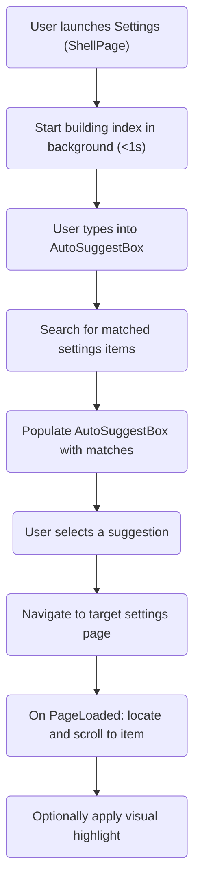

# PowerToys Settings – Search Index (Hard-sealed)

## 1. What to index

This section describes the current structure of the settings pages in PowerToys. All user-facing settings are contained in the content of <controls:SettingsPageControl>. The logical and visual structure of settings follows a nested layout as shown below:

```css
SettingsPageControl
 └─ SettingsGroup
     └─ [SettingsExpander]
         └─ SettingsCard
```
* Each SettingsGroup defines a functional section within a settings page.

* An optional SettingsExpander may be used to further organize related settings inside a group.

* Each actual setting is represented by a SettingsCard, which contains one user-tweakable control or a group of closely related controls.

>Note: Not all SettingsCard are necessarily wrapped in a SettingsExpander; they can exist directly under a SettingsGroup. 

> For indexing purposes, we are specifically targeting all SettingsCard elements. These are the smallest units of user interaction and correspond to individual configurable settings.

### Module
Module is a primary type that needs to be indexed, for modules, we need to index the 'ModuleTitle' and the 'ModuleDescription'. 
So these two should be passed in by x:Uid and binding with a key. 


### SettingsCard

Each SettingsCard should have an x:Uid for localization and indexing. The associated display strings are defined in the .resw files:

{x:Uid}.Header – The visible label/title of the setting.

{x:Uid}.Description – (optional) The tooltip or explanatory text.

The index should be built around these SettingsCard elements and their x:Uid-bound resources, as they represent the actual settings users will search for.

---

## 2. How to Navigate

### Entry
```csharp
enum EntryType
{
    SettingsCard,
    SettingsExpandar
}
struct SettingEntry
{
    string    PageName;         // Navigation among pages
    
    EntryType Type;             // Whether I need to expand my parent Expander
    string    ParentElementName // Empty if 
    string    ElementName;             // ElementName

    string    ElementUid;       // UID 
    string    DisplayedText;    // Localized Text For Setting Entry
}
```

### Navigation
We need to do two phase navigation to locate the setting entry
* Navigate among pages
* Navigate within page

> Use page name for navigation:
```csharp
Type GetPageTypeFromPageName(string PageName)
{
    var assembly = typeof(GeneralPage).Assembly;
    return assembly.GetType($"Microsoft.PowerToys.Settings.UI.Views.{PageName}");
}

NavigationService.Navigate(PageType, ElementName，ParentElementName);
```

> Use ElementName and ParentElementName for in page navigation:
```csharp
Page.OnNavigateTo(ElementName， ParentElementName){
    UIElement element = Reflection.GetType(Name);
    UIElement parentElement = Reflection.GetType(ParentElementName);

    if(parentElement) {
        expander = (Expander)parentElement;
        if(expander){
            expander.Expand();
        }

        // https://learn.microsoft.com/en-us/uwp/api/windows.ui.xaml.uielement.startbringintoview?view=winrt-26100        
        element.StartBringIntoView();
    }
}
```

## 3. Search
When user start typing for an entry, e.g. shortcut or 快捷键(cn version of shortcut),
we need to go through all the entries to see if an entry matches the search text.

A naive approach will be try to match all the localized text one by one and see if they match.
Total entry is within thousand(To fill in an exact number), performance is acceptable now.
```csharp
// Match
query = UerInput();
matched = {};

indexes = BuildIndex();

foreach(var entry in indexes) {
    if(entry.Match(query)) {
        matched.Add(entry);
    }
}
```

And we don't intend to introduce complexity on the match algorithm discussion, so let's use powertoys FuzzMatch impl for now.
```csharp
MatchResult Match(this Entry entry, string query) {
    return FuzzMatch(entry.DisplayedText, query);
}

struct MatchResult{
    int Score;
    bool Result;
}
```


## 4. Index 
So, the entry is good enough for search&navigation, now We need to build all the entries in our settings.

Most of the entry properties are static, and in runtime, the `SettingsCard` is compied into native winUI3 controls <small>(I suppose, please correct here if it's wrong)</small>, it's hard to locate all the `SettingsCard`, and performance is terrible if we do dfs for all the pages' elements.

## 4.1 Future settings
To be able to be auto indexed and searchable, you need to wrap the setting in SettingsCard, and give it a name, UID,
then it can be automatically picked up.

### Build time indexing
We can rely on xmal file parsing to get all the SettingsCard Entries. 
And we don't want xaml file to be brought into production bundle.
Use a project for parsing and bring that index file into production bundle is a solution.
```csproj
  <Target Name="GenerateSearchIndex" BeforeTargets="BeforeBuild">
    <PropertyGroup>
      <BuilderExe>$(MSBuildProjectDirectory)\..\Settings.UI.XamlIndexBuilder\bin\$(Configuration)\net8.0\XamlIndexBuilder.exe</BuilderExe>
      <XamlDir>$(MSBuildProjectDirectory)\Views</XamlDir>
      <GeneratedJson>$(MSBuildProjectDirectory)\Services\searchable_elements.json</GeneratedJson>
    </PropertyGroup>
    <Exec Command="&quot;$(BuilderExe)&quot; &quot;$(XamlDir)&quot; &quot;$(GeneratedJson)&quot;" />
  </Target>
```
```csharp
for(xamlFile in xamlFiles){
    var doc = Load(xamlFile);
    var elements = doc.Descendants();

    foreach(var element in elements){
        if(element.Name == "SettingsCard") {
            var entry = new Entry{
                ElementName = element.Attribute["Name"],
                PageName = FileName,
                Type = "SettingsCard",
                ElementUid = element.Attribute["Uid"],
                DisplayedText = "",
            }

            var parent = element.GetParent();
            if(parent.Name == "SettingsExpander"){
                entry.ParentElementName = parent.Attribute["Name"];
            }
        }
    }
}
```
Runtime index loading:
```
var entries = LoadEntriesFromFile();
foreach(var entry in entries){
    entry.DisplayedText = ResourceLoader.GetString(entry.Uid);
}
```
So now we have all the entries and entry properties.

## Overrall flow:
Runtime:



## 5. Tests


## 6. Performance targets [TBD]
| Metric        | Target                                        |
| ------------- | --------------------------------------------- |
| Memory        | ≤ 150 kB for 1 000 entries                    |
| Query latency | ≤ 20 ms 95-pctl per keystroke                 |


## 7.  Design options evaluated


## 8. Corner cases we can't perform a search
1. Some SettingsCard does not x:Uid binded, so no text is shown.
```
// e.g. Mouse Utils:
<tkcontrols:SettingsCard ContentAlignment="Left">
    <CheckBox x:Uid="MouseUtils_MousePointerCrosshairs_CrosshairsAutoHide" IsChecked="{x:Bind ViewModel.MousePointerCrosshairsAutoHide, Mode=TwoWay}" />
</tkcontrols:SettingsCard>
```

2. CmdPal page is not in scope of this effort, that needs additional effort&design to launch and search within cmdpal settings page.

3. 