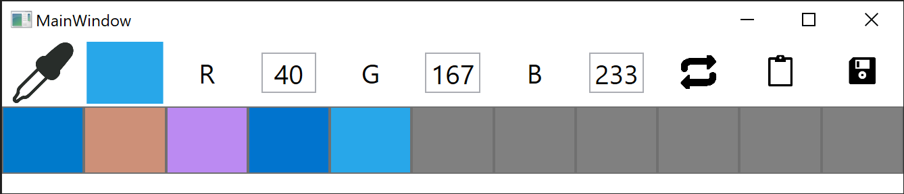

<h1> Project Color Picker Alpha </h1>

by Samantha Difeo, Tyrone Wong and Mathuran Sadagopan

<h2>Overview</h2> 

Have you ever struggled to sample the color of a picture or app on Windows? Then project Color Picker Alpha is the solution for you! This app allows you to extract the color on any monitor. Click once on the screen to have the color selected and automatically copied to your clipboard. When in RGB mode, the color is displayed and copied to clipboard in RGB. By selecting the toggle button, the view switches to HEX. Create a color history palette by simply saving the colors you have selected. Afterwards, selecting the color on the palette brings the color back into focus and immediately copied back to your clipboard.

<h2>Developer Guide</h2>

This project was developed as a WPF application. 

 To run the project perform the following steps

1. Download the repo.
2. Open the solutions file for ColorPickerAlpha found in the directory [PowerToys\proofOfConcept\ColorPickerAlpha] in Visual Studio.
3. Build the project.
4. Run the executable in [PowerToys\proofOfConcept\ColorPickerAlpha\ColorPickerAlpha\bin\Debug].

<h2>Current Issues / Future Goals</h2>

* polishing UI
* adding hot keys for improved accessibility and speed
* adding magnification and a color picker wheel
