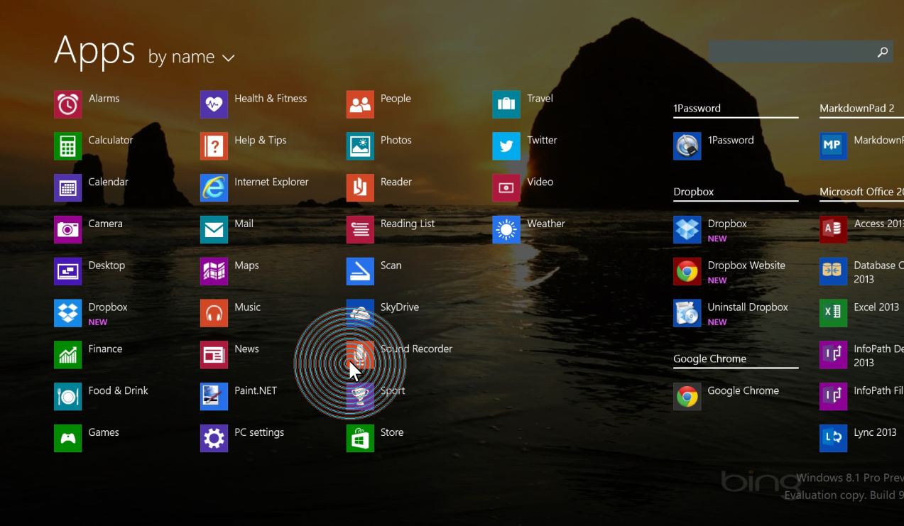

# Find Cursor Overview

Find Cursor is intended to be a utility within Microsoft PowerToys to enhance the user ability to locate the cursor on demand. Improving upon the default cursor locator within Windows OS, this reboot provides power users with a more distinct and identifiable animation to locate the cursor more effectively and improve the overall user experience. 

## Functionality 

Cursor Locator: Users can activate the cursor animation by holding the CTRL key

Center Cursor Position: Users may center the position of the cursor on the respective screen by holding CTRL + LWIN(Left Windows) key

## Features

Unlike the default plain cursor locator, the powertoys find cursor utility provides maximal contrast between the background and the cursor. This is done by dynamically retrieving the colour of the background behind the cursor and inversing the RGB values of the radial animation displayed to the user. Additionally the animation now consists of an array of continuous circles radiating outwards rather than one after recieving user feedback to make the display more apparent and obvious. The utility has incorporated a shortcut to center the position of the cursor, a quick and effective solution to skip the troubles of locating and dragging the cursor.

Colour adaptation of animation can be seen above. 

## Shortcut Keys

| Shortcut      | Action |
| ----------- | ----------- |
| CTRL | Launches location animation |
| CTRL + LWindow | Centeres location of cursor |

## Releases

#### Version 1.0

** Limitations and Bugs: **

- 
- 
- 
- 