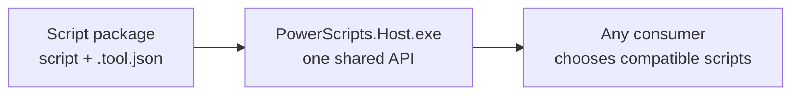
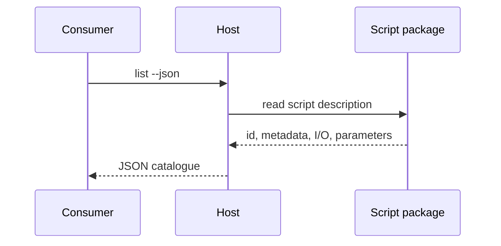
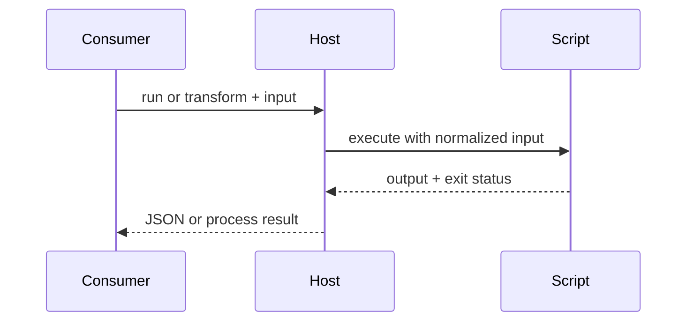
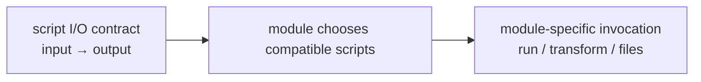
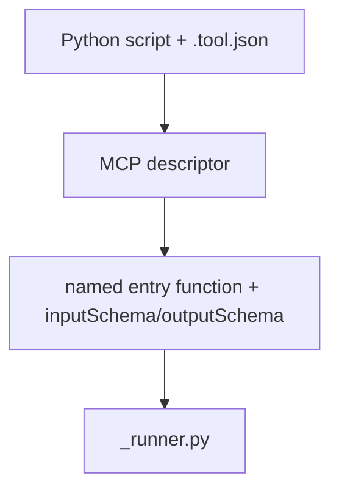

# PowerScripts — Design Spec

> **Status:** prototype, worktree `muyuanli/powerscripts`.
>
> This document describes the current API and metadata design. Security proposals are in the
> separate [`SECURITY-DESIGN.md`](./SECURITY-DESIGN.md).

## 1. Purpose and principles

PowerScripts lets users add PowerShell or Python scripts without an SDK, PowerToys rebuild, or
PowerToys-specific protocol. Scripts are discovered once and can be consumed by multiple modules.

| Principle | Design |
| --- | --- |
| Declare I/O, not consumers | A script declares its input and output. Modules filter by I/O. |
| Reuse existing standards | `.tool.json` follows the MCP `Tool` shape: `name`, `description`, and JSON Schema. |
| One integration boundary | Consumers call `PowerScripts.Host.exe`; they do not reference the engine. |
| Language-neutral adoption | The public API is process invocation plus JSON. |
| Explicit contracts | Python scripts use an MCP-style `.tool.json` descriptor for entry and I/O. |

## 2. Architecture: write once, use from many modules

The simplest mental model is:

1. A script author provides a script and its MCP-style description.
2. The shared Host discovers the description and runs the script.
3. Any module uses the same Host API; modules do not need to understand the script runtime.



### What each part owns

| Part | Owns |
| --- | --- |
| Script package | Script behavior and its declared identity, I/O, parameters, and entry function. |
| Host | Discovery, validation, I/O normalization, and execution through one API. |
| Consumer module | Choosing when a script is useful, selecting compatible scripts, and presenting results. |

The internal parser, registry, and runtime classes are implementation details behind the Host. They
can evolve without changing how module owners integrate.

### Two simple request flows

**Discovery**



**Execution**



The important boundary is the Host CLI and JSON contract—not which internal class parses a
descriptor or starts a particular runtime.

## 3. Script API and metadata standard

### 3.1 I/O contract

```text
PowerScriptDataFormat =
    none | text | html | image | audio | video | files
```

`ScriptIo.Resolve()` uses this precedence:

1. `inputSchema` and `outputSchema` from the MCP-style descriptor.
2. File details such as `contentMediaType` and `extensions` refine the schema-derived file contract.
3. If a schema is omitted, the Host uses the descriptor's execution defaults.

The schemas are the canonical contract. PowerScripts may derive a coarse compatibility category
(`none`, `text`, `html`, `image`, `audio`, `video`, or `files`) from those schemas for discovery
filters. There is no `system`/`file` kind.



Examples only: a module may select scripts with a particular input shape, output shape, file
contract, parameter schema, or combination. The API does not assign a fixed I/O type to any module.

### 3.2 MCP-style `.tool.json`

The minimum useful descriptor is `name`, `description`, and `inputSchema`. `outputSchema` should be
provided whenever the tool produces structured output. PowerScripts-specific fields are isolated
under `x-powerscript`; launch details can use `x-execute`.

```jsonc
{
  "name": "md2html",                    // stable PowerScript id
  "title": "Markdown → HTML",           // optional display title
  "description": "Convert Markdown to HTML.",
  "inputSchema": {                      // JSON Schema for parameters / file paths
    "type": "object",
    "properties": {
      "theme": { "type": "string", "enum": ["light", "dark"] },
      "file": { "type": "string", "contentMediaType": "text/markdown" }
    },
    "required": ["file"]
  },
  "outputSchema": {                     // JSON Schema for the result
    "type": "object",
    "properties": {
      "html": { "type": "string", "contentMediaType": "text/html" }
    }
  },
  "x-execute": {
    "command": ["python3", "md2html.py"],
    "argMap": { "theme": "--theme" },
    "stdin": "json"
  },
  "x-powerscript": {
    "function": "convert",
    "extensions": [".md"]
  }
}
```

Important fields:

| Field | Purpose |
| --- | --- |
| `name` | Stable script id. |
| `description`, `title` | Human-facing discovery text. |
| `inputSchema`, `outputSchema` | Canonical MCP JSON Schemas for inputs and outputs. |
| `x-powerscript.function` | Python entry function; removes the naming restriction. |
| `x-powerscript.extensions` | File filters that refine a schema-defined file input. |
| `x-execute` | Optional interpreter/argument/stdin recipe. |

### 3.3 Python entry model — MCP descriptor only



- A Python script is paired with an MCP-style `.tool.json` descriptor.
- The descriptor declares `x-powerscript.function` plus the MCP `inputSchema` and `outputSchema`.
- The entry function may use any valid Python name; no naming convention is required.
- Python dependencies can be packaged with the script when a self-contained distribution is needed.

## 4. Host API for module owners

The public integration contract is process invocation and JSON. Consumers may use
`PowerScripts.Client` or invoke the executable directly.

```text
Host.exe list [--json] [--input <shape>] [--output <shape>] [--no-input] [--root <dir>]
Host.exe run <id> [--files ...] [--set name=value ...] [--root <dir>]
Host.exe transform <id> [--root <dir>]       # JSON stdin → JSON stdout
```

### Discovery response

```json
[
  {
    "id": "md2html",
    "name": "Markdown → HTML",
    "runtime": "PowerShell",
    "io": { "input": "files", "output": "html" },
    "input": { "extensions": [".md"] },
    "parameters": []
  }
]
```

Consumers can filter with `--input`, `--output`, and `--no-input`, or filter the `io` object after
discovery. The `io` object is the source of truth for module compatibility.

### Verb usage

| Verb | Use |
| --- | --- |
| `list` | Discover scripts and their I/O. |
| `run` | Execute an action or file script. |
| `transform` | Send structured data in and receive structured data out. |

### Example consumer patterns

| Consumer pattern | Language | Possible use |
| --- | --- | --- |
| Trigger or command surface | C# | Discover with `list`, then invoke a compatible script with `run`. |
| Data-processing surface | C# | Filter by `io`, then use `transform` for structured input/output. |
| File-oriented surface | C++ or C# | Select schema-derived `files` input, use extension metadata, and invoke `run --files`. |
| Configuration UI | C# | Use `list --json` to display names, descriptions, parameters, and I/O. |
| Future protocol adapter | Any | Translate the same discovery and invocation contract into another API. |

## 5. Security

Security is intentionally specified separately from the API and metadata design. See
[`SECURITY-DESIGN.md`](./SECURITY-DESIGN.md) for the accepted MXC-backed execution model and
[`SECURITY-PROPOSAL-A.md`](./SECURITY-PROPOSAL-A.md) /
[`SECURITY-PROPOSAL-B.md`](./SECURITY-PROPOSAL-B.md) for the retained review history.

## 6. Current status and next design decisions

Implemented and tested:

- I/O-based discovery with no `system`/`file` kind.
- MCP-style descriptor authoring.
- Explicit Python entry functions declared by MCP-style descriptors.
- Host CLI plus C# client wrapper.
- `list`, `run`, and `transform` as module-neutral integration primitives.
- Integrations for Settings, Explorer, Keyboard Manager, LightSwitch, Command Palette, and Advanced Paste.
- MXC isolation with an immutable script package and consumer-owned typed/file parameter UX.
- Automated Core/Host and Settings coverage, including real Host CLI tests.

Open decisions:

- Version the CLI and JSON response contract.
- Decide whether `x-execute` remains the long-term launch extension.
- Define the packaged Python dependency format.
