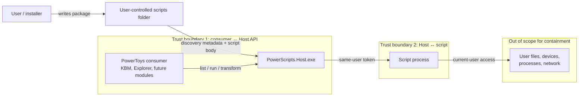
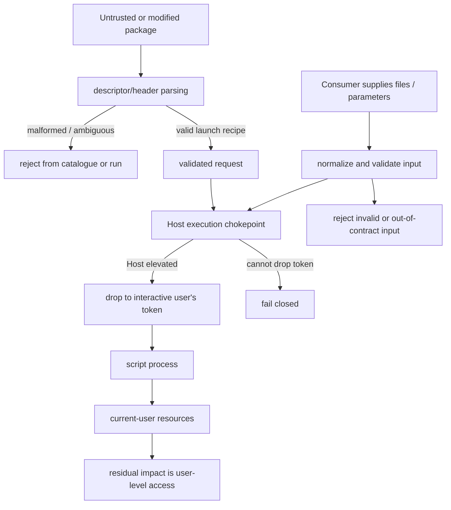

# PowerScripts Security Proposal A

## Same-user execution

> **Review outcome:** This proposal is retained as review history. The accepted design keeps its
> user-selected script folder but replaces direct same-user execution with default MXC isolation.
> See [`SECURITY-DESIGN.md`](./SECURITY-DESIGN.md).

> **Position:** Review this proposal first. If it is accepted, Proposal B does not need to be
> presented or implemented.

## 1. Summary

Scripts are installed in a folder chosen by the user and always run with the current interactive
user's non-elevated token. PowerScripts does not add a second confirmation step when a script is
executed and provides no UAC elevation path for scripts.

The user's choice to place a script in the managed scripts folder is the installation decision. A
separate run-time prompt does not add meaningful protection because the script already
runs with the user's own access rights.

## 2. Security boundary

```text
PowerToys module → PowerScripts.Host.exe → current interactive user's non-elevated token → script
```

- A script always runs with the current interactive user's non-elevated token.
- This remains true when the current user belongs to Administrators or the requesting PowerToys
  consumer is elevated; the script must not receive an administrator or elevated token.
- PowerScripts provides no UAC elevation path for scripts and must fail closed when it cannot
  create the non-elevated execution context.
- The script may access resources that the current interactive user can access without elevation.

This proposal is a privilege-boundary design, not a sandbox. It does not attempt to limit ordinary
user-level file, process, device, or network access.

## 3. Threat model

### 3.1 Scope, assets, and trust boundaries

The threat model assumes that the user can deliberately install or remove a script package. It
protects the privilege boundary between PowerToys and the script, but it does not protect the user
from a script that the user has chosen to install and run.



**Security objectives**

- Prevent a script from inheriting an elevated PowerToys token or receiving an elevated token by
  any other PowerScripts execution path.
- Ensure that discovery metadata cannot silently select an invalid or unintended launch recipe.
- Keep input and output handling explicit at the Host boundary.
- Make the residual risk clear: a successfully launched script can perform any action available to
  the interactive user.

**Out of scope**

- Sandboxing a user-installed script.
- Preventing a script from reading user files that the current user can read.
- Preventing network access, child processes, or user-level changes.
- Treating a package as trustworthy merely because it has been discovered.

### 3.2 Threat paths and mitigations



| Threat | Security property at risk | Mitigation in Proposal A | Residual risk / review question |
| --- | --- | --- | --- |
| Malicious package is installed | User data and user-level actions | Make installation user-controlled; show package identity and launch metadata | The user may intentionally or accidentally install a harmful script. Is this accepted for v1? |
| PowerToys is elevated and launches a script | Privilege boundary | Always launch with the current interactive user's non-elevated token; fail closed if that launch cannot be created | Scripts do not receive administrator access, even for a user who belongs to Administrators. |
| Descriptor or header changes the launch recipe | Execution integrity | Re-discover and validate on every load; expose launch metadata | Integrity checks are diagnostic only and do not establish trust. |
| Consumer passes unexpected paths or parameters | Input integrity and data disclosure | Normalize and validate inputs at Host; enforce declared I/O | A valid path may still identify sensitive user data that the user can access. |
| Script abuses output handling | Data integrity or unintended writes | Return only declared/validated results through the Host contract | The script can still write directly to any user-writable location. |
| Script hangs or floods output | Availability | Apply execution timeout and output-size limits where supported | A process launched with user rights can still consume user resources unless limits are enforced. |
| Consumer invokes the wrong script identity | Confused-deputy behavior | Stable IDs, catalogue validation, and one Host execution chokepoint | Consumers must not construct arbitrary executable commands outside the Host contract. |

### 3.3 Security decision requested

Reviewers should explicitly decide whether the following residual-risk statement is acceptable:

> After the Host has enforced same-user execution, PowerScripts provides no containment from the
> interactive user's own permissions. The principal security guarantee is that PowerToys does not
> accidentally grant a script more privilege than the user already has.

## 4. Installation and execution flow

```mermaid
sequenceDiagram
    participant U as User
    participant F as User-chosen scripts folder
    participant H as Host.exe
    participant P as Process launcher
    U->>F: place or remove script package
    H->>F: discover MCP descriptor
    H-->>U: list script metadata and I/O
    U->>H: run or transform
    H->>P: launch with current interactive user's non-elevated token; no UAC
    P-->>H: output and exit status
    H-->>U: result
```

## 5. Installation model

- The user selects or controls the scripts folder.
- Installing a script means adding its script package and MCP descriptor to that folder.
- Removing a script means removing that package from the folder.
- Discovery should reject malformed or incomplete packages, but it should not create a separate
  execution-confirmation state.
- A module may provide an install/remove UI, but execution itself does not prompt.

## 6. Host launch requirements

- Use the current interactive user's non-elevated token.
- Do not inherit a more privileged PowerToys token when PowerToys is elevated.
- Do not silently elevate a script or offer a UAC elevation path.
- Do not fall back to an elevated launch if the non-elevated launch cannot be created.
- Preserve the existing process/JSON API for PowerShell, Python, and descriptor-based scripts.

## 7. Integrity and change handling

Integrity checks may still be used for diagnostics, cache invalidation, or detecting that a package
changed. They do not block execution.

When a package changes, the Host should rediscover and validate it again. A changed script is
therefore treated as a changed installed package and rediscovered normally.

## 8. API impact

No additional run-time confirmation API is required:

```text
list [--json]
run <id>
transform <id>
```

Any install/remove operation belongs to the package-management or module UI layer rather than the
script execution path.

## 9. Advantages

- Simple and predictable user experience.
- No redundant prompt for scripts already placed by the user.
- Low startup cost and no confirmation database.
- Works with existing PowerShell, Python, and `x-execute` execution paths.
- Keeps the public Host API small.

## 10. Risks and mitigations

| Risk | Mitigation |
| --- | --- |
| User installs a malicious script | Make the script location and package contents visible; treat installation as the user's decision. |
| Current user is an administrator | Always launch the script with the current interactive user's non-elevated token; do not add a UAC elevation path or fall back to an elevated token. |
| Script package changes | Rediscover and validate package contents on each load; use integrity checks for diagnostics. |
| Script accesses user data | Document clearly that this proposal is not a sandbox. |
| A descriptor changes its launch recipe | Validate the descriptor and expose launch metadata in the package UI. |

## 11. Review decision

Select this proposal if non-elevated execution with the current interactive user's token and
user-controlled installation is sufficient for the PowerScripts threat model. Proposal B can
remain an unpresented fallback.
