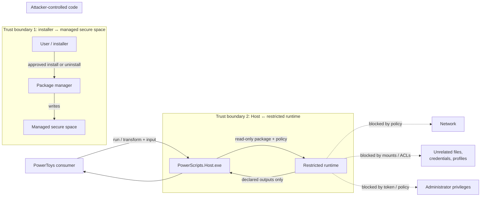
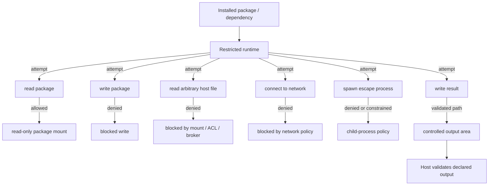
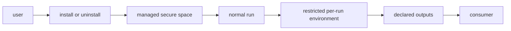
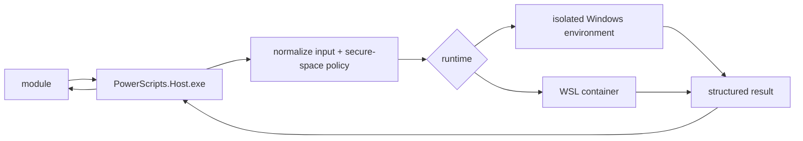
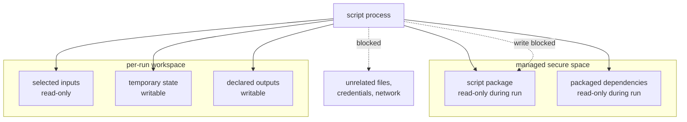
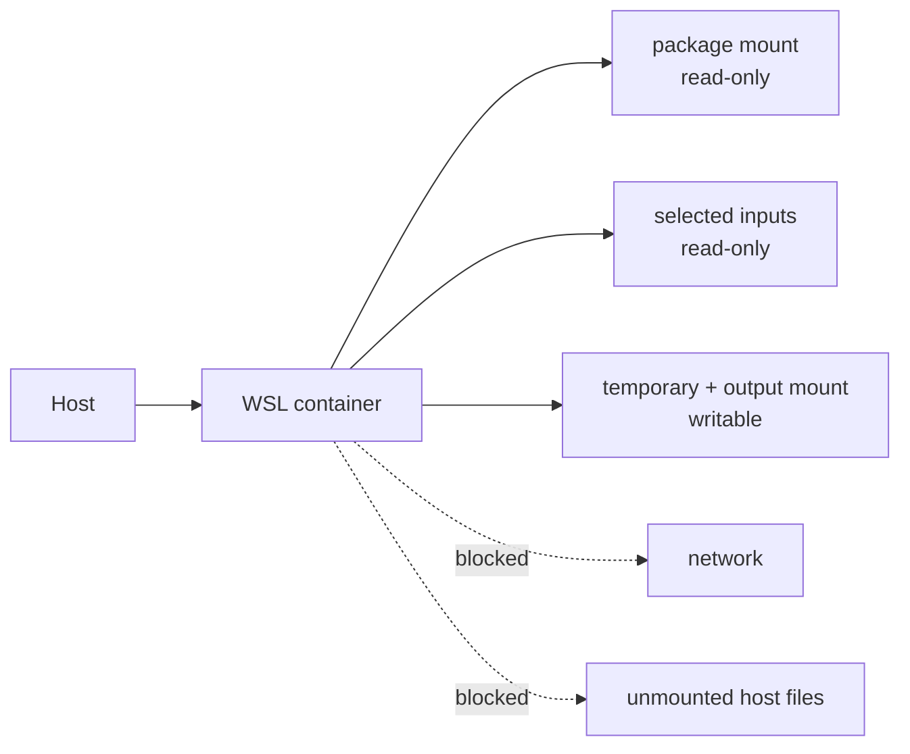
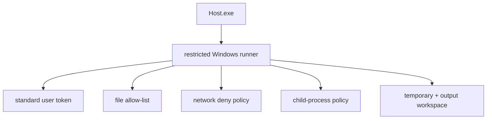
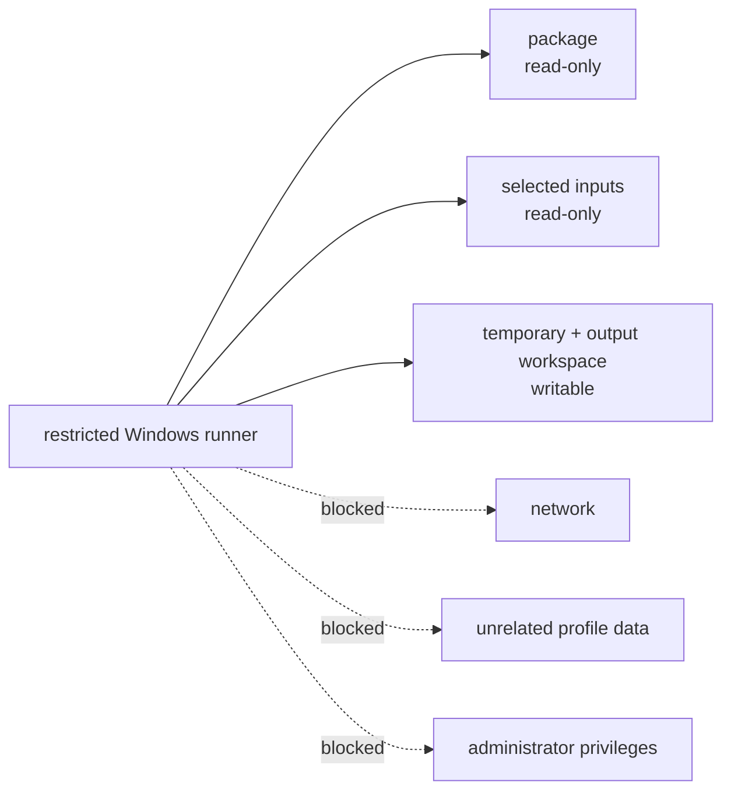
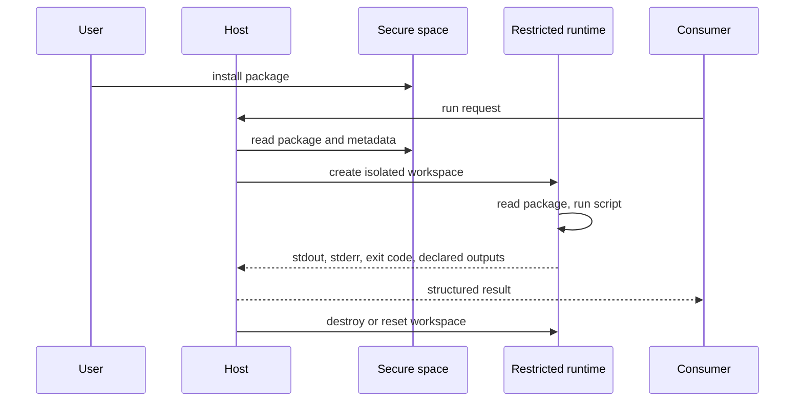

# PowerScripts Security Proposal B

## Isolated execution: WSL containers and restricted Windows environments

> **Review outcome:** This proposal is retained as review history. The accepted design adopts
> default MXC isolation while keeping a user-selected script folder rather than a managed secure
> package store. See [`SECURITY-DESIGN.md`](./SECURITY-DESIGN.md).

> **Position:** This is an independent stricter alternative. It only needs to be presented or
> implemented if Proposal A is not sufficient after security review.

## 1. Summary

Every installed script package is stored in a managed secure space. Python scripts configured for
WSL run inside a WSL container. Windows runtimes use a restricted environment intended to simulate a
sandbox: no administrator privileges, no outgoing network access by default, and access only to
explicitly allowed files and directories.

The Host CLI and module-facing JSON contract remain unchanged. Only the execution backend and
packaging requirements become stricter.

## 2. Threat model

### 2.1 Scope, assets, actors, and trust boundaries

The primary attacker is an installed script or dependency attempting to escape its execution
environment, access data outside the declared inputs, call the network, modify its package, or
influence a later run. Installation and uninstallation are intentionally separate from normal
execution: they are the only operations that modify the managed secure space.



**Assets to protect**

- The managed script package and packaged dependencies.
- Explicitly selected input files and the caller's returned outputs.
- User credentials, unrelated profile data, and host configuration.
- Runtime isolation state, including container or per-run workspace state.
- Availability of PowerToys and the Host API.

**Security objectives**

- Keep the installed package immutable during a normal run.
- Expose only selected inputs and approved runtime files.
- Deny network access and administrator privileges by default.
- Prevent state from one script or run from leaking into another.
- Copy out only declared and validated outputs.

### 2.2 Attack paths and controls



| Threat | Security property at risk | Mitigation in Proposal B | Residual risk / review question |
| --- | --- | --- | --- |
| Malicious package or dependency | Confidentiality and integrity | Store in managed secure space; read-only package/dependency mounts | Installation supply-chain trust and package review still need an owner and policy. |
| Package tampering during execution | Integrity and repeatability | Package is immutable/read-only during normal runs; writes happen only through install/uninstall | The implementation must prove that all writable aliases and mount paths are closed. |
| Read outside selected inputs | Confidentiality | Explicit mounts/allow-list, restricted token, or brokered access | Windows enforcement mechanism is still open engineering work. |
| Network exfiltration or remote code retrieval | Confidentiality and code integrity | Network denied by default; no runtime dependency installation | Host/container escape or policy misconfiguration could weaken this control. |
| Administrator or token escape | Privilege boundary | Standard token, process mitigation, child-process policy, WSL isolation | Windows sandbox strength must be demonstrated with a concrete mechanism, not only configuration. |
| Cross-run or cross-script contamination | Confidentiality and integrity | Fresh/reset workspace; immutable package; cleanup after execution | Reuse must be proven not to retain processes, mounts, caches, or environment state. |
| Malicious output path or output content | Caller data and filesystem integrity | Declared output contract, output-area restriction, validation before copy-out | Large files, links, reparse points, and ambiguous paths need explicit handling. |
| Resource exhaustion | Availability | Timeout, memory/process/output limits, container lifecycle controls | Limits and failure behavior need defined values and tests. |
| Host/consumer confused deputy | Authorization | Host remains the single policy enforcement point; consumers cannot choose weaker policy | Every caller path must use the same Host policy and avoid alternate launchers. |

### 2.3 Security decisions and evidence requested

The review should confirm:

1. Which concrete Windows mechanism enforces the file, token, child-process, and network controls.
2. Which WSL container technology and lifecycle provide isolation and cleanup.
3. How installation/uninstallation authorization is enforced and audited.
4. How output validation handles links, path traversal, and files that change during collection.
5. Which tests demonstrate blocked access, clean per-run state, and fail-closed behavior.

## 3. Security goals

- Limit the filesystem visible to a script.
- Deny outgoing network access by default.
- Prevent administrator privileges.
- Allow reading and execution during normal runs, but do not allow the script to modify its managed
  installation.
- Require explicit user approval when installing or uninstalling an extension package. This
  approval is a user authorization decision; it does not by itself require administrator
  privileges. Any administrator requirement for the package location or deployment mechanism
  remains an implementation decision and must be documented separately.
- Isolate temporary files and generated outputs.
- Make the runtime environment reproducible.
- Support Python dependencies packaged with the script.
- Keep discovery and invocation compatible with Proposal A.

## 4. Common execution contract

Proposal B has two separate paths:

- **Installation path:** the user explicitly chooses when an extension is added to or removed from
  the managed secure space.
- **Execution path:** once installed, a normal run does not modify the installed package. The Host
  creates a restricted per-run environment, executes the script, and returns only the declared
  result.

> **Privilege clarification:** Proposal B requires explicit user approval for install/uninstall, but
> this proposal does not currently require those operations to run as administrator. Installation
> should use the least privilege permitted by the managed secure-space design. If the chosen
> storage or deployment mechanism requires elevation, that is a separate privilege boundary that
> must be modeled and justified; script execution must still not inherit administrator privilege.



The important boundary is between the managed secure space and the per-run environment:
installation changes the managed space; normal execution only reads from it.



The Host prepares or enters a managed secure space containing only:

- the script package;
- explicitly selected input files;
- a temporary directory and controlled output area;
- the minimum runtime configuration.



The script can read the installed package and execute its entry point. It can write temporary
state and declared outputs, but it cannot write back into the managed package during a normal run.
The host copies only declared outputs to the caller.

## 5. WSL container path

### Environment

- Create or reuse a WSL container environment for the script package.
- Keep the base environment immutable or reconstructable.
- Mount the script package read-only where possible.
- Mount selected input files read-only.
- Mount a separate controlled output directory for generated files.

### Python packaging

Python scripts should preferably be self-contained:

```text
script package/
  tool.py
  .tool.json
  python/
  dependencies/
```

The package may contain a virtual environment, wheels, or another approved dependency layout.
Runtime installation from the network should not be required during execution.

### WSL policy

- No network access by default.
- No access to the user's broad Windows filesystem except explicitly mounted paths.
- No access to host credentials, SSH agents, browser profiles, or unrelated WSL distributions.
- Keep the script package and installed dependencies read-only during execution.
- Limit writes to temporary state and controlled output locations.
- Destroy or reset the container workspace after execution according to retention policy.



## 6. Restricted Windows path

Windows scripts need a constrained runner that approximates the same policy even though they are not
inside WSL.

### Required restrictions

- Launch with a standard non-admin token.
- Block outgoing network connections by default.
- Allow reads only from the script package, explicitly selected inputs, and approved runtime files.
- Keep the script package and installed dependencies read-only.
- Allow writes only to a temporary workspace and controlled output locations.
- Restrict environment variables and inherited handles.
- Apply a child-process policy; either deny child processes or allow only approved interpreters.
- Prevent access to unrelated user profile data, credentials, and system configuration.



The Windows runner must enforce the same logical policy as the WSL path:



### Implementation direction

The exact Windows mechanism still needs investigation. Candidate building blocks may include a
restricted token, process mitigation policies, filesystem virtualization or brokered access,
firewall/network policy, job objects, and a dedicated broker process. These should be combined only
where they provide enforceable boundaries; configuration that merely hides paths is not sufficient.

## 7. Policy and metadata

The script API should not change, but the runtime may need policy metadata such as:

```jsonc
{
  "x-powerscript": {
    "runtime": "python"
  }
}
```

Security policy should preferably be selected by the host or administrator rather than allowing a
script to request weaker restrictions. If additional metadata is required, it should describe
requirements (for example, writable output or a specific interpreter), not grant permissions.

## 8. Execution lifecycle

1. User explicitly approves installation or uninstallation of the extension package (without
   assuming administrator privilege).
2. Store the package in the managed secure space.
3. Resolve and validate the script.
4. Resolve the input/output contract.
5. Create a per-run workspace.
6. Start the WSL container or restricted Windows environment with the package read-only.
7. Execute with network and filesystem policy applied.
8. Collect stdout, stderr, files, and exit code.
9. Copy only declared outputs back to the caller.
10. Destroy or reset temporary state.

The lifecycle can be summarized as:



## 9. Dependency and performance considerations

- Container startup may be expensive; reuse must not leak state between scripts or users.
- Self-contained Python packages increase distribution size but avoid network installation.
- Windows runtimes may require compatibility work for PowerShell modules and native child tools.
- File copying and output validation add overhead for large files.
- Timeouts, memory limits, process limits, and output-size limits should be defined.

## 10. Advantages

- Stronger containment for scripts from unknown or external sources.
- Consistent network and filesystem policy.
- Better separation between the script and the user's desktop environment.
- A clear path to reproducible Python execution.

## 11. Risks and open engineering work

| Area | Question |
| --- | --- |
| WSL | Which container feature and lifecycle API should be standardized? |
| Windows | Which mechanism provides enforceable filesystem and network restrictions? |
| Compatibility | Which PowerShell modules and native tools remain usable? |
| Packaging | What is the supported self-contained Python package format? |
| Performance | How are containers reused without retaining mutable script state? |
| Outputs | How are generated files validated before leaving the workspace? |
| Policy | Which limits are fixed defaults and which are administrator-configurable? |

## 12. Review decision

Use this proposal if security review requires a managed secure space rather than same-user
execution. The public API can remain stable while the execution backend evolves toward this model.
