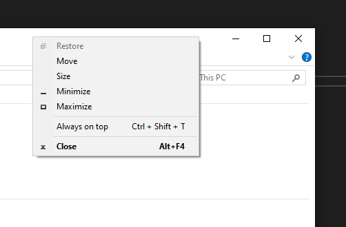
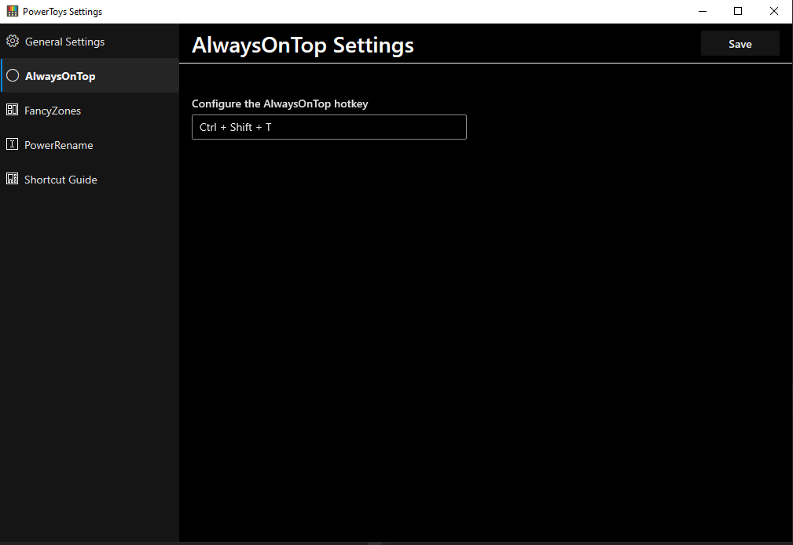

### Always On Top

With Always On Top you can make a window stay on top of all other windows. This can
be achieved either by opening the window system menu (right mouse click on the window
title bar) and selecting `Always On Top` menu item, or through a hotkey, which can be
configured in the general settings for the `Always On Top` module.

To turn off the Always On Top status for a window, you can do it through the title
bar context menu command or using the hotkey (regardless which method you used to turn it on).

You can have only one Always On Top window at the time. If Always On Top is active on a
window and you turn it on for another window, it will automatically turn it off for the
window were it was on.

Currently, Always On Top treats a multi monitor setup as one desktop, so it doesn't
allow one Always On Top window per monitor.

Example of customized system menu with `Always On Top` menu item. The currently configured hotkey
is displayed on the right.

Settings for `Always On Top` module inside `PowerToy General Settings`:

