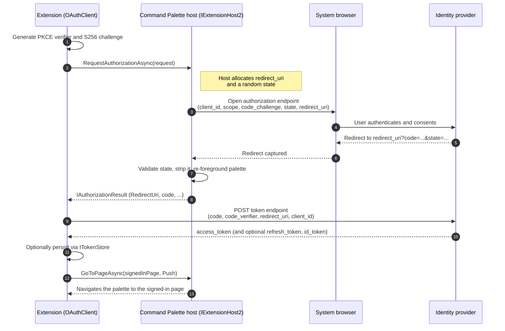

# Command Palette authentication

Command Palette can broker interactive OAuth sign-in for extensions. The host owns
the risky, shared parts of the redirect (opening the browser, allocating and
hosting the `redirect_uri`, generating and validating `state`, capturing the
redirect, and re-foregrounding the palette). The extension owns the parts that
must stay private to it (PKCE, the token exchange, and any token storage). Command
Palette never sees or stores third-party tokens.

This document describes what shipped across the built-in auth work: the host
broker, the SDK contract, and the `Microsoft.CommandPalette.Extensions.Toolkit`
helpers that most extensions should use.

## Overview and motivation

Extensions frequently need to call an authenticated API. Before this feature each
extension had to stand up its own loopback listener or register a custom URI
scheme, handle `state`, and re-focus the palette after the browser round trip.
That is easy to get subtly wrong in ways that are security relevant.

The built-in flow gives every extension a single, hardened redirect broker:

- The host opens the system browser, allocates the `redirect_uri`, injects a
  cryptographically random `state`, captures the redirect, validates `state`, and
  returns the captured query parameters to the extension that started the flow.
- The extension keeps the PKCE verifier and performs the token exchange in its own
  process. The host only ever handles the front-channel redirect, never the tokens.

## Architecture

There are two cooperating pieces.

1. Host broker (`IExtensionHost2.RequestAuthorizationAsync`). Runs inside Command
   Palette. It opens the browser, hosts the `redirect_uri`, routes `state`,
   captures the redirect, and re-foregrounds the palette. It hands back an
   `IAuthorizationResult` with the exact `redirect_uri` it used and the captured
   response parameters (with `state` already validated and stripped).
2. Toolkit `OAuthClient`. Runs inside the extension process. It generates the PKCE
   verifier and challenge, builds the authorization parameters, calls the host
   broker, and then exchanges the returned code at the provider token endpoint. It
   returns an `OAuthToken`.



## SDK contract

The contract lives in `Microsoft.CommandPalette.Extensions.idl` and is surfaced to
extensions through the Toolkit.

### `IExtensionHost2`

`IExtensionHost2` extends `IExtensionHost`. A host that implements it supports both
authorization and host-driven navigation.

- `IAsyncOperation<IAuthorizationResult> RequestAuthorizationAsync(IAuthorizationRequest request)`
  runs the interactive flow. The returned operation is cancelable.
- `IAsyncAction GoToPageAsync(ICommand page, NavigationMode navigationMode)`
  navigates the palette to one of the extension's live page objects. This is how a
  sign-in command sends the user to a signed-in landing page.

### `IAuthorizationRequest`

What the extension supplies to start a flow:

- `DisplayName`: friendly name shown in the "waiting to sign in" status.
- `AuthorizationEndpoint`: the provider authorize URL.
- `Parameters`: query parameters appended to the authorize URL. Do not include
  `redirect_uri` or `state`; the host injects both.
- `RedirectKind`: `AuthorizationRedirectKind.Loopback` or `CustomScheme`.
- `TimeoutSeconds`: how long to wait for the redirect. `0` means the host default
  (60 seconds). The host caps this at 300 seconds.

### `IAuthorizationResult`

What the host hands back:

- `IsSuccessful`: whether the redirect was captured.
- `RedirectUri`: the exact `redirect_uri` the host used. RFC 6749 requires this to
  be sent to the token endpoint during code exchange, so `OAuthClient` forwards it.
- `ResponseParameters`: the captured query parameters (for example `code`). The
  host has already validated and removed `state`.
- `Error`: populated when `IsSuccessful` is false (provider error, timeout, user
  cancellation, or a broker failure).

### `AuthorizationRedirectKind`

- `Loopback` (`0`): `http://127.0.0.1:{ephemeral-port}/`, RFC 8252 loopback
  redirection. This has the broadest provider support and is the default.
- `CustomScheme` (`1`): `x-cmdpal://auth/callback`, using Command Palette's
  registered protocol. It auto-foregrounds the palette, but only works with
  providers that allow custom-scheme redirect URIs.

### `NavigationMode`

Used by `GoToPageAsync`:

- `Push`: push the target page onto the navigation stack (the default).
- `GoBack`: go back one page, then navigate to the target page.
- `GoHome`: go back to the home page, then navigate to the target page.

## Capability detection

Not every installed Command Palette is new enough to broker auth. The Toolkit
exposes two static flags on `ExtensionHost`:

- `ExtensionHost.SupportsAuthorization`
- `ExtensionHost.SupportsNavigation`

Both are true only when the connected host implements `IExtensionHost2`. Check the
relevant flag before offering a sign-in action. If you call
`ExtensionHost.RequestAuthorizationAsync` or `ExtensionHost.GoToPageAsync` against
an older host, the Toolkit throws `NotSupportedException`. Prefer the capability
check so you can show a graceful message instead of surfacing an exception.

```csharp
if (!ExtensionHost.SupportsAuthorization)
{
    // Show a "sign-in is not available, please update" message.
    return;
}
```

## Security model

The broker is designed so that a mistake in an extension cannot leak tokens through
the host, and so that the front-channel redirect is hard to spoof.

- PKCE is required. `OAuthClient` always sends `code_challenge` with
  `code_challenge_method=S256`. The verifier never leaves the extension process.
- Public clients only. The sample and the recommended pattern use no client secret.
  Do not ship a secret in an extension; treat every extension as a public client.
- `state` is host-owned, random, and single use. The host generates it, matches it
  on the redirect, and strips it before returning, so extensions never handle it.
- `redirect_uri` binding. The host returns the exact `redirect_uri` it used and the
  extension must send that same value to the token endpoint (RFC 6749). `OAuthClient`
  does this for you.
- Loopback is bound to `127.0.0.1` only. The host listens on the loopback interface
  with an ephemeral port, per RFC 8252.
- No token storage in the host. Command Palette only brokers the front-channel
  redirect. Tokens are exchanged and, if desired, stored entirely inside the
  extension process.
- Timeout caps. `TimeoutSeconds` defaults to 60 seconds and the host caps it at 300
  seconds, so a stuck flow cannot wait forever.

Do not log or display the authorization code, the access or refresh token, or the
PKCE verifier. Surface only generic status on failure.

## Token storage guidance

Persisting tokens is optional and always happens inside the extension process. The
Toolkit provides:

- `ITokenStore`: a small `Retrieve` / `Save` / `Remove` abstraction keyed by a
  string.
- `CredentialManagerTokenStore`: an `ITokenStore` backed by the Windows Credential
  Manager (`PasswordVault`). Tokens are encrypted at rest per user and require the
  extension to run as a packaged app, which Command Palette extensions do. Use a
  distinct namespace per provider or account so keys do not collide.

Caveat: `PasswordVault` limits the size of a stored secret to a few kilobytes. That
is fine for typical access and refresh tokens, but very large JWTs can exceed it, so
guard `Save` in a try/catch and treat storage as best effort.

`OAuthToken.IsExpired(skew)` helps you decide when to refresh. Use
`OAuthClient.RefreshAsync(refreshToken)` when the provider issued a refresh token
(request the `offline_access` scope if the provider needs it).

## Bring your own provider

The sample defaults to the Duende IdentityServer public demo because it is a
secretless, PKCE-friendly test provider. To target your own provider, register a
public (native or desktop) OAuth client and swap the endpoints, client id, and
scopes.

### GitHub example

GitHub supports the Authorization Code flow and works well with the loopback
redirect.

1. Create an OAuth app at GitHub Developer settings. GitHub requires a registered
   callback URL and does not support custom-scheme redirect URIs, so use
   `AuthorizationRedirectKind.Loopback`. Register a loopback callback such as
   `http://127.0.0.1/` (GitHub matches on the host and path, and the broker uses an
   ephemeral port).
2. Configure the client:

   ```csharp
   var github = new OAuthClient
   {
       ClientId = "<your Client ID>",
       AuthorizationEndpoint = "https://github.com/login/oauth/authorize",
       TokenEndpoint = "https://github.com/login/oauth/access_token",
       Scopes = ["read:user"],
       RedirectKind = AuthorizationRedirectKind.Loopback,
       DisplayName = "My extension",
   };

   var token = await github.AuthorizeAsync();
   ```

GitHub's token endpoint defaults to a form-encoded response; `OAuthClient` sends
`Accept: application/json` so it receives JSON. Note that GitHub personal OAuth apps
do not issue refresh tokens by default. If you need refresh tokens, use a GitHub App
with expiring user tokens, which follows the same Authorization Code shape.

Confirm your provider's exact endpoints, supported redirect types, and scope names
from its own documentation before shipping.

## Try the sample

`SamplePagesExtension` includes a runnable illustration under
`Samples` -> `Sample: OAuth sign-in`. It:

1. Checks `ExtensionHost.SupportsAuthorization` and shows a graceful message on
   older hosts.
2. Runs `OAuthClient.AuthorizeAsync` against the Duende public demo.
3. Optionally persists the token with `CredentialManagerTokenStore`.
4. Calls `ExtensionHost.GoToPageAsync` to navigate to a signed-in landing page that
   shows non-sensitive session facts only.

The sample is illustrative. Running it opens a real browser and needs an
interactive sign-in against a real identity provider, so it cannot be exercised
headlessly.
