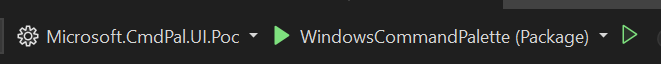
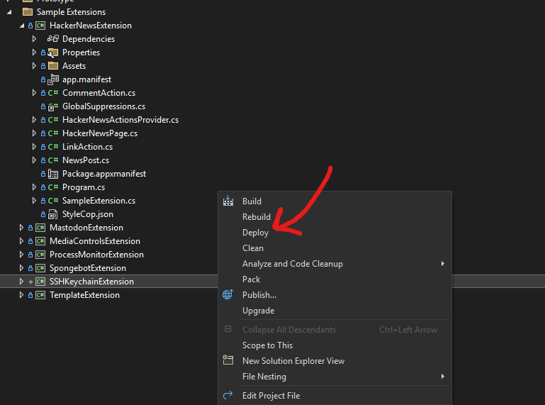

# Windows Command Palette Anatomy & Extension Development Guide

## Root View 

Let's start with the root view of the Command Palette. The root view is the view that is displayed when the Command Palette is first opened. It is the first thing the user sees: 


The root view is a special kind of [ListPage](#listpage). It's special because it displays all of the top level commands: [built-in commands](INSERT SECTION SOMEWHERE) and [commands provided by installed extensions](#icommandprovider).


In this context, commands are just [ListItems](#listitem) that are displayed in the root view of Command Palette. In other words, all of the ListItems in the root view are known as commands.

Users can search/filter for specific commands by typing in the [FilterBox](#filterbox). 


The filter box will filter the commands displayed in the root view based on the user's input:


When a user clicks on a command, the [default command](#default-command-this-is-probably-not-the-right-spot-for-this) is executed. Alternatively, the user can press the `Enter` key to execute the default command associated with the selected command.

## Nested Views (Pages)

When a command is executed, it can open a new "nested" view inside of the Command Palette. These views are known as pages.

### ListPage

A list page is a page inside of command palette that displays a list of items. It has the following interface:

```csharp
interface IListPage requires IPage {
    String SearchText { get; };
    String PlaceholderText { get; };
    Boolean ShowDetails{ get; };
    IFilters Filters { get; };
    IGridProperties GridProperties { get; };

    ISection[] GetItems(); // DevPal will be responsible for filtering the list of items
}
```

#### ISection

#### GridProperties

#### ShowDetails

#### PlaceholderText

#### SearchText

### MarkdownPage

A markdown page is a page inside of command palette that displays markdown content. It has the following interface:

```csharp
 interface IMarkdownPage requires IPage {
     String[] Bodies(); // TODO! should this be an IBody, so we can make it observable?
     IDetails Details();
     IContextItem[] Commands { get; };
 }
 ```

### FormPage

A form page is a page inside of command palette that displays a form. It has the following interface:

```csharp
 interface IFormPage requires IPage {
     IForm[] Forms();
 }
 ```

 ### Dynamic List Page

 A dynamic list page is similar to a list page, but it gives the developer control over how the list is filtered. It has the following interface:

 ```csharp
 interface IDynamicListPage requires IListPage {
    ISection[] GetItems(String query); // DevPal will do no filtering of these items
}
```

## Additional Components 


### ListItem

List items are items that are displayed on a [ListPage](#listpage). They can be clicked on to execute a command.

#### Tags

### FilterBox

## Anatomy of an Extension

#### ICommandProvider

This is the interface that an extension implements to provide top level commands to the Command Palette.

**This is the entry point for all extensions into Command Palette.**

```csharp
public interface ICommandProvider
{
    IEnumerable<ICommand> GetCommands();
}
```

#### ICommand

This is the backbone of the Command Palette. It represents a unit of work that can be executed by the Command Palette.

ListItems and ContextItems leverage the ICommand interface to execute commands. 

```csharp
public interface ICommand
{
    string Name { get; }
    void Execute();
}
```

#### Default Command (this is probably not the right spot for this)

### Building an Extension Example - SSH Keychain

So you want to build an extension for the Command Palette? Let's walk through an example.

#### Overview

First, let's define the requirements for the SSH Keychain extension:

1. The extension should provide a top level command in the Command Palette: "Search SSH Keys".
2. When the "Search SSH Keys" command is executed, a new page should be displayed in the Command Palette that lists all of the SSH hosts on the user's machine.
3. The user should be able to click on an SSH host or press `Enter` as the default command to launch Windows Terminal with an SSH session to the selected host. 

When we're done building the extension, the Command Palette should look something like this:


#### Getting Started 

We've made it easy to build a new extension. Just follow these steps:

1. Navigate to the src\modules\cmdpal folder
2. Run the following PowerShell script, replacing "MastodonExtension" with the `Name` of your extension and "Mastodon extension for cmdpal" with the `DisplayName` of the [command that will show up in the root view](#root-view) of the Command Palette:
    
```powershell
.\Exts\NewExtension.ps1 -name MastodonExtension -DisplayName "Mastodon extension for cmdpal"
```

3. Open the solution in Visual Studio.
4. Right click on the directory titled 'SampleExtensions' and select 'Add' -> 'Existing Project'.


5. Navigate to the '\Exts folder, and find the *.csproj file that was created by the PowerShell script. It will be in a folder with the same name as the extension you provided in the PowerShell script.
6. Right click on the new project you've just created and select 'Deploy'.
7. Build the project by clicking the play button in Visual Studio.



At this point you should have your command that you created show up in the root view of the Command Palette! If you've set up everything correctly, it should look something like this (note - your example won't have icons yet): 


#### Step 1: Provide a Top Level Command

In order for users to interact with your extension in the Command Palette, **you need to provide at least one top level command**. To do this, implement the `ICommandProvider` interface located in the `*CommandsProvider.cs` file created by the extension template. This interface has a single method, `TopLevelCommands()`, that returns a list of commands that will be displayed in the root view of the Command Palette. Remember, each top level command that a user sees is represented by a [ListItem](#listitem). In other words, the `TopLevelCommands()` method will return a list of `ListItems`, where each `ListItem` represents a command that will be displayed in the [root view](#root-view) of the Command Palette.

```csharp
public class SSHKeychainCommandsProvider : CommandProvider
{
    public SSHKeychainCommandsProvider()
    {
        DisplayName = "SSH Keychain Commands";
    }

    private readonly ICommandItem[] _commands = [
       new CommandItem(new NoOpCommand())
        {
            Title = "Search SSH Keys",
            Subtitle = "Quickly find and launch into hosts from your SSH config file",
        },
    ];

    public override ICommandItem[] TopLevelCommands()
    {
        return _commands;
    }
}
```

We recommend that you follow the template guidelines and put your implementation for the ICommandProvider inside of its own file . In this case, we have created an `SSHKeychainCommandProvider` class that will provide the required "Search SSH Keys" command inside of `SSHKeychainCommandProvider.cs`.

Let's see what this currently looks like in the Command Palette. First, deploy your extension in Visual Studio by right-clicking on the project and selecting "Deploy":



Then, open the Command Palette by pressing `Win+Ctl+.` and search for "Search SSH Keys". You should see the command displayed in the root view of the Command Palette like this: 


And there you have it. We've successfully provided a top level command in the Command Palette! Go ahead and try to change the title and subtitle of the ListItem to see how it affects the display in the Command Palette! **You'll have to rebuild your project and deploy it again to see the changes.**

#### Step 2: Implement the Command Execution

In Step 1 we provided a top level command in the Command Palette, but it doesn't currently do anything. That's because the ListItem we've provided didn't provide any associated commands that could be executed!

```csharp
private readonly IListItem[] _commands = [
       new ListItem(new NoOpCommand())
        {
            Title = "Search SSH Keys",
            Subtitle = "Quickly find and launch into hosts from your SSH config file",
        },
    ];
```
Notice how in the snippet above, we've provided a `NoOpCommand()` value for the `Command` property of the `ListItem`. This is why the command doesn't currently do anything.

 So, we now need to implement the command execution logic. When the user clicks on the "Search SSH Keys" command, we want to display a new [page](#nested-views-pages) in the Command Palette that lists all of the SSH hosts on the user's machine. 

 Let's start by providing a new [ListPage](#listpage) command that will be executed by default when a user either clicks on the "Search SSH Keys" ListItem or has the ListItem selected and presses `Enter`. For now, let's just display a simple message to the user in the new page when the command is executed.

 Following the template guidelines, we will create a new file inside of the 'Pages' folder. All of the [pages](#nested-views-pages) your extension uses should be located in the pages folder. In this case, we will create a new class called `SSHHostsListPage` because we will be displaying a list of SSH hosts on this page. 

 ```csharp
 internal sealed class SSHHostsListPage : ListPage
{
    public SSHHostsListPage()
    {
        Icon = new(string.Empty);
        Name = "SSH Keychain";
    }

    public override ISection[] GetItems()
    {
        return [
            new ListSection()
            {
                Title = "SSH Hosts",
                Items = [
                    new ListItem(new NoOpCommand()) { Title = "TODO: Implement your extension here" }
                ],
            }
        ];
    }
}
 ```

A list page expects an array of [`ISection`](#isection) objects to be returned from the `GetItems()` method. Take a look at the HackerNewsPage as an example of what a ListPage with a section might look like: 


In the HackerNews example, we return one section with a bunch of list items. However, in our example code above, we are returning a single `ListSection` with a single `ListItem` that has a `NoOpCommand` associated with it. The `NoOpCommand` is a simple action that does nothing when executed. Here is a reminder of the ListSection we are returning: 

```csharp
new ListSection()
            {
                Title = "SSH Hosts",
                Items = [
                    new ListItem(new NoOpCommand()) { Title = "TODO: Implement your extension here" }
                ],
            }
```

 In order for our root command, "Search SSH Hosts" to execute the command to our new page, we need to update the `SSHKeychainCommandsProvider` class from [step 1](#step-1-provide-a-top-level-command) to provide the `SSHHostsListPage` command when the "Search SSH Keys" list item has its default command executed. Specifically, we need to update the `Command` property of the `ListItem` to be the `SSHHostsListPage` class we just created. Inside of SSHKeychainCommandsProvider.cs, the code should look like this:

 ```csharp
// Code in Provider before we update the Command property of the ListItem. There is no default command associated with the ListItem.

private readonly IListItem[] _commands = [
       new ListItem(new NoOpCommand())
        {
            Title = "Search SSH Keys",
            Subtitle = "Quickly find and launch into hosts from your SSH config file",
        },
    ];

// Code in Provider after we update the Command property of the ListItem. We are updating the default command.

private readonly IListItem[] _commands = [
       new ListItem(new SSHHostsListPage())
        {
            Title = "Search SSH Keys",
            Subtitle = "Quickly find and launch into hosts from your SSH config file",
        },
    ];
```

Let's rebuild our project and see how the changes appear in Command Palette.

You should see the `Search SSH Keys` Command  in the root view of the palette like this:

 

Now when you [invoke the default command](#default-command-this-is-probably-not-the-right-spot-for-this) to be executed for the `Search SSH Keys` command in the root view, you should see a new page displayed in the Command Palette with the message "TODO: Implement your extension here":


- When the "Search SSH Keys" command is executed, a new page should be displayed in the Command Palette ✅
- TODO: Implement the logic that will parse the SSH config file to actually display the available SSH hosts on the machine in the Command Palette.

Before we get to implementing the logic to display the SSH hosts, let's take this example one step farther by providing a few list items that will be displayed in the `SSHHostsListPage`. 

```csharp
internal sealed class SSHHostsListPage : ListPage
{
    public SSHHostsListPage()
    {
        Icon = new(string.Empty);
        Name = "SSH Keychain";
    }

    public override ISection[] GetItems()
    {
        return [
            new ListSection()
            {
                Title = "SSH Hosts",
                Items = [
                    new ListItem(new NoOpCommand()) { Title = "TODO: Implement your extension here" },
                    new ListItem(new NoOpCommand()) { Title = "Another list item", Subtitle = "this one has a subtitle" },
                    new ListItem(new NoOpCommand())
                    {
                        Title = "A list item with a tag",
                        Subtitle = "this one with tags",
                        Tags = [new Tag()
                               {
                                   Text = "Example Tag",
                               }
                               ],
                    }
                ],
            }
        ];
    }
}
```

In the snippet above, we've added two additional `ListItem` objects to the `Items` array of the `ListSection`. Now the second `ListItem` has a `Subtitle` property set, and the third `ListItem` has both a subtitle set and a [`Tag`](#tags) associated with it.

Let's take a look at how this change looks in the Command Palette:


Following the documentation above, we're at the point where we can: 

- Add a top level command to the Command Palette ✅
- Display a new `ListPage` in the Command Palette when the command is executed ✅
- Display a list of items in the new page ✅

For the SSH Keychain extension, we want to display a list of SSH hosts on the user's machine. We'll then replace these example `ListItem` objects with the actual SSH hosts that we parse from the SSH config file.

First, let's add a file to the 'Data' folder called `SSHKeychainItem.cs`. This file will contain a class that represents the information that we need to display for each SSH host.

```csharp
internal class SSHKeychainItem
{
    internal string Host { get; init; }

    internal string EscapedHost => JsonEncodedText.Encode(Host).ToString();
}
```

We recommend that you add any data classes that you need to the 'Data' folder of your extension. This will help keep your project organized.

Next, we need to update the `SSHHostsListPage` class to display the actual SSH hosts that we parse from the SSH config file rather than the sample list items we've shown before. We'll need to update the `GetItems()` method to return a list of `ListItem` objects that represent the actual SSH hosts. The entire `SSHHostsListPage` class should look like this:

```csharp
internal sealed partial class SSHHostsListPage : ListPage
{
    private static readonly string _defaultConfigFile = Environment.GetFolderPath(Environment.SpecialFolder.UserProfile) + "\\.ssh\\config";

    private static readonly Regex _hostRegex = new(@"^Host\s+(?:(\S*) ?)*?\s*$", RegexOptions.Compiled | RegexOptions.IgnoreCase | RegexOptions.Multiline);

    public SSHHostsListPage()
    {
        Icon = new(string.Empty);
        Name = "SSH Keychain";
    }

    private static async Task<List<SSHKeychainItem>> GetSSHHosts()
    {
        var hosts = new List<SSHKeychainItem>();
        var configFile = _defaultConfigFile;

        if (!File.Exists(configFile))
        {
            return hosts;
        }

        var options = new FileStreamOptions()
        {
            Access = FileAccess.Read,
        };

        using var reader = new StreamReader(configFile, options);
        var fileContent = await reader.ReadToEndAsync();

        if (!string.IsNullOrEmpty(fileContent))
        {
            var matches = _hostRegex.Matches(fileContent);
            hosts = matches.Select(match => new SSHKeychainItem { HostName = match.Groups[1].Value }).ToList();
        }

        return hosts;
    }

    public override ISection[] GetItems()
    {
        var t = DoGetItems();
        t.ConfigureAwait(false);
        return t.Result;
    }

    private async Task<ISection[]> DoGetItems()
    {
        List<SSHKeychainItem> items = await GetSSHHosts();
        var s = new ListSection()
        {
            Title = "SSH Hosts",
            Items = items.Select((host) => new ListItem(new NoOpCommand())
            {
                Title = host.HostName,
                Subtitle = host.EscapedHost,
            }).ToArray(),
        };
        return [s];
    }
}
```

Let's break down what's happening in the `SSHHostsListPage` class:

1. We've added a `GetSSHHosts()` method that reads the SSH config file and parses out the host names. This method returns a list of `SSHKeychainItem` objects that represent the SSH hosts on the user's machine. **Notice how this is an async operation!**

2. GetItems() now calls DoGetItems() which is an async method that gets the SSH hosts and creates a `ListSection` object with a list of `ListItem` objects that represent the SSH hosts. **If you're planning on doing any async operations in your `GetItems()` method, you should follow this pattern**

3. Inside of DoGetItems(), we call GetSSHHosts() to get the SSH hosts and then create a `ListSection` object with a list of `ListItem` objects that represent the SSH hosts. We are able to then create the proper title and subtitle for each `ListItem` object.

Now that we've updated the `SSHHostsListPage` class to display the actual SSH hosts on the user's machine, let's rebuild our project and see how the changes appear in the Command Palette. **NOTE: You will need to have an SSH config file on your machine for this to work.**


Awesome! We've successfully displayed a list of SSH hosts on the user's machine in the Command Palette! We can even search for specific hosts by typing in the filter box:


Filtering the list of SSH hosts is a built-in feature of the Command Palette. You don't have to do anything special to enable this functionality. The Command Palette will automatically filter the list of items displayed in the Command Palette based on the user's input in the filter box using a fuzzy search. However, if you'd like to handle the filtering yourself, you can create a [Dynamic List Page](#dynamic-list-page) instead of a [List Page](#listpage).

#### Step 3: Implement Command for SSH Hosts

Now that we have a list of SSH hosts displayed in the Command Palette, we want to be able to launch Windows Terminal with an SSH session to the selected host when the user clicks on a host or presses `Enter` as the default command.

To do this, we need to update the `ListItem` objects in the `SSHHostsListPage` class to have a command associated with them that will launch Windows Terminal with an SSH session to the selected host. We'll create a new class called `LaunchSSHSessionCommand` that will be responsible for launching Windows Terminal with an SSH session to the selected host.

Following the template guidelines, we will create a new file inside of the 'Commands' folder. In this case, we will create a new class called `LaunchSSHSessionCommand` that will be responsible for launching Windows Terminal with an SSH session to the selected host:

```csharp
internal sealed partial class LaunchSSHHostCommand : InvokableCommand
{
    private readonly SSHKeychainItem _host;

    internal LaunchSSHHostCommand(SSHKeychainItem host)
    {
        this._host = host;
        this.Name = "Connect";
        this.Icon = new("\uE8A7");
    }

    public override CommandResult Invoke()
    {
        try
        {
            Process.Start("cmd.exe", $"/k ssh {_host.HostName}");
        }
        catch
        {
            Process.Start(new ProcessStartInfo("cmd.exe", $"/k ssh {_host.HostName}") { UseShellExecute = true });
        }

        return CommandResult.KeepOpen();
    }
}
```

That's it! We've successfully implemented the command that will launch Windows Terminal with an SSH session to the selected host. Now we need to update the `ListItem` objects in the `SSHHostsListPage` class to have the `LaunchSSHSessionCommand` associated with them. Specifically, we need to update the `Command` property of the `ListItem` objects to be the `LaunchSSHSessionCommand` class we just created. Inside of `SSHHostsListPage.cs`, the code should look like this:

```csharp
    private async Task<ISection[]> DoGetItems()
    {
        List<SSHKeychainItem> items = await GetSSHHosts();
        var s = new ListSection()
        {
            Title = "SSH Hosts",
            Items = items.Select((host) => new ListItem(new LaunchSSHHostCommand(host))
            {
                Title = host.HostName,
                Subtitle = host.EscapedHost,
            }).ToArray(),
        };
        return [s];
    }
```

All we had to change was the `NoOpCommand` to the `LaunchSSHHostCommand` in the `ListItem` object. Now when the user clicks on a host or presses `Enter` as the default command, Windows Terminal will launch with an SSH session to the selected host! Take a look at how this looks in the Command Palette:

