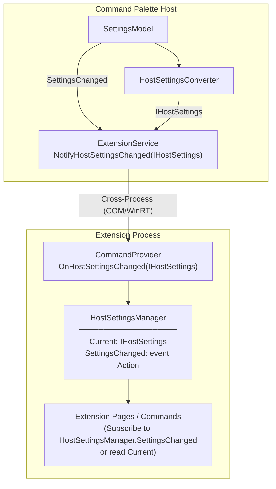
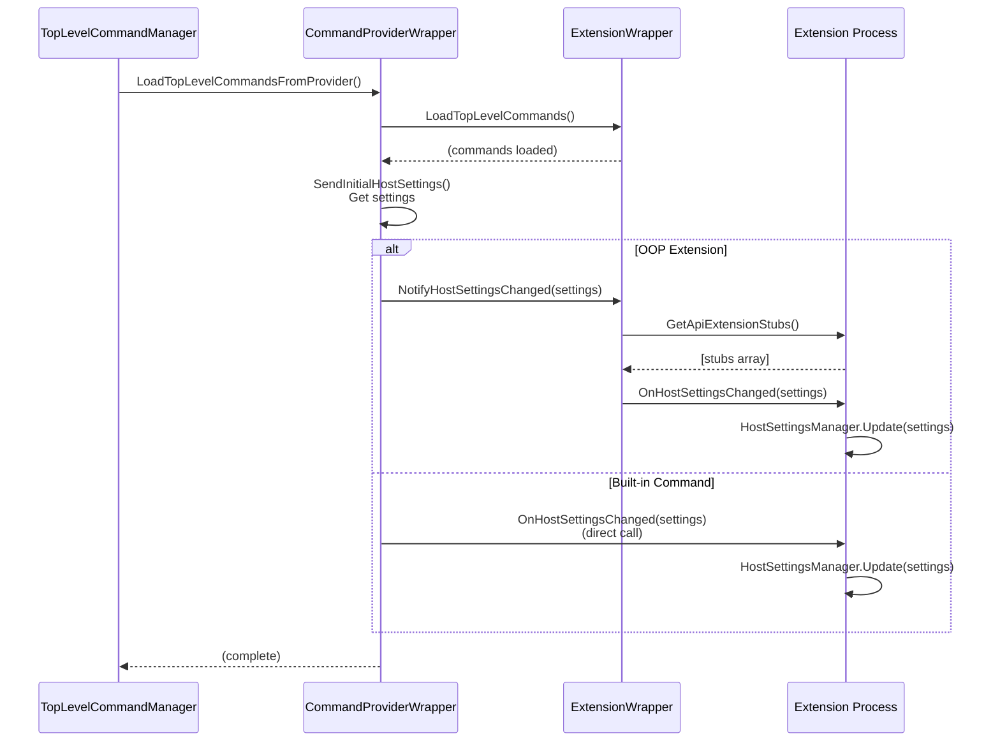
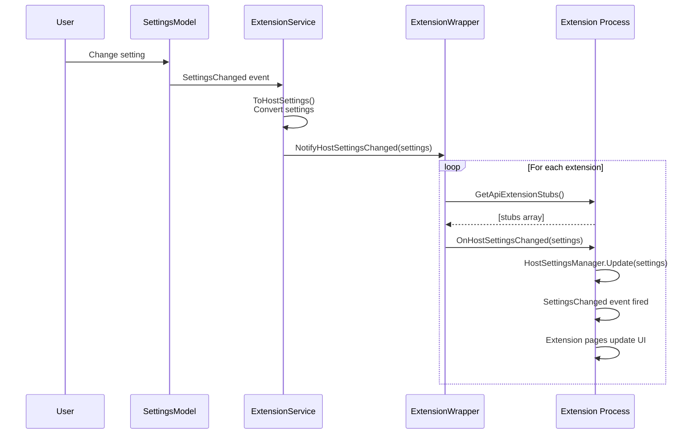

# Host Settings Awareness for Command Palette Extensions

## Abstract

This document describes the design and implementation of the Host Settings Awareness feature for Command Palette extensions. This feature enables extensions to access and respond to changes in the Command Palette's global configuration settings, allowing them to adapt their behavior based on user preferences.

## Table of Contents

- [Host Settings Awareness for Command Palette Extensions](#host-settings-awareness-for-command-palette-extensions)
  - [Abstract](#abstract)
  - [Table of Contents](#table-of-contents)
  - [Background](#background)
    - [Problem Statement](#problem-statement)
    - [Goals](#goals)
    - [Non-Goals](#non-goals)
  - [High-Level Design](#high-level-design)
    - [Architecture Overview](#architecture-overview)
    - [Key Components](#key-components)
    - [Data Flow](#data-flow)
  - [Low-Level Details](#low-level-details)
    - [IDL Interface Definitions](#idl-interface-definitions)
      - [SummonTarget Enum](#summontarget-enum)
      - [IHostSettings Interface](#ihostsettings-interface)
      - [IHostSettingsChanged Interface](#ihostsettingschanged-interface)
    - [Toolkit Implementation](#toolkit-implementation)
      - [HostSettings Class](#hostsettings-class)
      - [HostSettingsManager Static Class](#hostsettingsmanager-static-class)
      - [CommandProvider Integration](#commandprovider-integration)
    - [Host-Side Implementation](#host-side-implementation)
      - [Settings Conversion](#settings-conversion)
      - [Extension Notification Flow](#extension-notification-flow)
      - [Cross-Process Communication](#cross-process-communication)
    - [Initial Settings Delivery](#initial-settings-delivery)
  - [Sequence Diagrams](#sequence-diagrams)
    - [Initial Settings After Provider Initialization](#initial-settings-after-provider-initialization)
    - [Settings Change Notification](#settings-change-notification)
  - [Example Usage](#example-usage)
    - [Reading Current Settings via `HostSettingsManager.Current`](#reading-current-settings-via-hostsettingsmanagercurrent)
    - [Using Settings in a Page](#using-settings-in-a-page)
    - [Checking Availability (Backwards Compatibility)](#checking-availability-backwards-compatibility)
    - [Responding to Settings Changes (Optional)](#responding-to-settings-changes-optional)
    - [Complete Example: HostSettingsPage](#complete-example-hostsettingspage)
  - [API Reference](#api-reference)
    - [IHostSettings Properties](#ihostsettings-properties)
    - [HostSettingsManager Members](#hostsettingsmanager-members)
  - [Backwards Compatibility](#backwards-compatibility)
  - [Future Considerations](#future-considerations)

## Background

### Problem Statement

Command Palette extensions run in separate processes from the main Command Palette host application. While this out-of-process model provides stability and security benefits, it also creates a communication barrier. Extensions have no built-in way to:

1. Know the current Command Palette configuration settings
2. Adapt their behavior based on user preferences (e.g., animation settings, click behavior)
3. Respond dynamically when the user changes settings

Some extensions may want to provide experiences that align with the host's configuration. For example:
- An extension displaying animations may want to respect the user's "Disable Animations" preference
- An extension showing keyboard shortcuts may want to display the current global hotkey
- An extension could adapt its UI based on whether single-click or double-click activation is enabled

### Goals

1. **Provide read-only access to host settings**: Extensions can read current Command Palette configuration values
2. **Enable real-time updates**: Extensions receive notifications when settings change
3. **Cross-process compatibility**: The solution works reliably across process boundaries using WinRT
4. **Backwards compatibility**: Existing extensions continue to work without modification
5. **Simple API surface**: The Toolkit provides easy-to-use helpers for common scenarios

### Non-Goals

1. **Allow extensions to modify host settings**: Extensions can only read, not write, host settings
2. **Expose internal/private settings**: Only user-facing configuration is exposed
3. **Provide setting persistence for extensions**: This feature is about host settings, not extension-specific settings (use `SettingsHelpers` for that)

## High-Level Design

### Architecture Overview



### Key Components

| Component | Location | Responsibility |
|-----------|----------|----------------|
| `IHostSettings` | Extensions IDL | WinRT interface defining available settings |
| `IHostSettingsChanged` | Extensions IDL | WinRT interface for receiving change notifications |
| `HostSettings` | Toolkit | Concrete implementation of `IHostSettings` |
| `HostSettingsManager` | Toolkit | Static cache and event source for current settings |
| `CommandProvider` | Toolkit | Base class that implements `IHostSettingsChanged` |
| `HostSettingsConverter` | UI.ViewModels | Converts `SettingsModel` to `IHostSettings` |
| `ExtensionService` | UI.ViewModels | Broadcasts settings changes to all extensions |
| `ExtensionWrapper` | UI.ViewModels | Delivers settings to individual extension process |

### Data Flow

1. **User changes a setting** in Command Palette settings UI
2. **SettingsModel** fires `SettingsChanged` event
3. **App.xaml.cs** handler converts settings and calls `ExtensionService.NotifyHostSettingsChanged()`
4. **ExtensionService** iterates through all installed extensions
5. **ExtensionWrapper** retrieves `IHostSettingsChanged` handler via `GetApiExtensionStubs()` pattern
6. **IHostSettingsChanged.OnHostSettingsChanged()** is called across process boundary
7. **CommandProvider** receives the call and updates `HostSettingsManager`
8. **HostSettingsManager** caches new settings and fires `SettingsChanged` event
9. **Extension pages/commands** respond to the event and update their UI

## Low-Level Details

### IDL Interface Definitions

#### SummonTarget Enum

Represents the monitor/position behavior when summoning Command Palette:

```idl
[contract(Microsoft.CommandPalette.Extensions.ExtensionsContract, 1)]
enum SummonTarget
{
    ToMouse = 0,         // Appear at mouse cursor position
    ToPrimary = 1,       // Appear on primary monitor
    ToFocusedWindow = 2, // Appear on monitor with focused window
    InPlace = 3,         // Stay in current position
    ToLast = 4,          // Appear on last used monitor
};
```

#### IHostSettings Interface

Read-only interface exposing Command Palette configuration:

```idl
[contract(Microsoft.CommandPalette.Extensions.ExtensionsContract, 1)]
interface IHostSettings
{
    String Hotkey { get; };                      // Global summon hotkey (e.g., "Win+Alt+Space")
    Boolean ShowAppDetails { get; };             // Show app details in UI
    Boolean HotkeyGoesHome { get; };             // Pressing hotkey returns to home page
    Boolean BackspaceGoesBack { get; };          // Backspace navigates back
    Boolean SingleClickActivates { get; };       // Single vs double-click activation
    Boolean HighlightSearchOnActivate { get; };  // Highlight search box on activate
    Boolean ShowSystemTrayIcon { get; };         // Show system tray icon
    Boolean IgnoreShortcutWhenFullscreen { get; }; // Ignore hotkey in fullscreen apps
    Boolean DisableAnimations { get; };          // Disable UI animations
    SummonTarget SummonOn { get; };              // Monitor positioning behavior
}
```

#### IHostSettingsChanged Interface

Callback interface for settings change notifications:

```idl
[contract(Microsoft.CommandPalette.Extensions.ExtensionsContract, 1)]
interface IHostSettingsChanged
{
    void OnHostSettingsChanged(IHostSettings settings);
}
```

### Toolkit Implementation

#### HostSettings Class

Concrete implementation that can be instantiated and passed across process boundaries:

```csharp
public partial class HostSettings : IHostSettings
{
    public string Hotkey { get; set; } = string.Empty;
    public bool ShowAppDetails { get; set; }
    public bool HotkeyGoesHome { get; set; }
    public bool BackspaceGoesBack { get; set; }
    public bool SingleClickActivates { get; set; }
    public bool HighlightSearchOnActivate { get; set; }
    public bool ShowSystemTrayIcon { get; set; }
    public bool IgnoreShortcutWhenFullscreen { get; set; }
    public bool DisableAnimations { get; set; }
    public SummonTarget SummonOn { get; set; }
}
```

#### HostSettingsManager Static Class

Provides static access to current settings and change notifications:

```csharp
public static class HostSettingsManager
{
    private static IHostSettings? _current;

    /// <summary>
    /// Occurs when host settings have changed.
    /// </summary>
    public static event Action? SettingsChanged;

    /// <summary>
    /// Gets the current host settings, or null if not yet initialized.
    /// </summary>
    public static IHostSettings? Current => _current;

    /// <summary>
    /// Gets whether host settings are available.
    /// </summary>
    public static bool IsAvailable => _current != null;

    /// <summary>
    /// Updates the cached host settings. Called internally when settings change.
    /// </summary>
    internal static void Update(IHostSettings settings)
    {
        _current = settings;
        SettingsChanged?.Invoke();
    }
}
```

#### CommandProvider Integration

The base `CommandProvider` class implements `IHostSettingsChanged`:

```csharp
public abstract partial class CommandProvider : ICommandProvider, ICommandProvider2, IHostSettingsChanged
{
    /// <summary>
    /// Called when host settings change. Override to respond to settings changes.
    /// </summary>
    public virtual void OnHostSettingsChanged(IHostSettings settings)
    {
        HostSettingsManager.Update(settings);
    }

    /// <summary>
    /// Returns API extension stubs for cross-process marshalling.
    /// </summary>
    public object[] GetApiExtensionStubs()
    {
        return [new SupportCommandsWithProperties(), new HostSettingsChangedHandler(this)];
    }

    private sealed partial class HostSettingsChangedHandler : IHostSettingsChanged
    {
        private readonly CommandProvider _provider;

        public HostSettingsChangedHandler(CommandProvider provider) => _provider = provider;

        public void OnHostSettingsChanged(IHostSettings settings) =>
            _provider.OnHostSettingsChanged(settings);
    }
}
```

### Host-Side Implementation

#### Settings Conversion

`HostSettingsConverter` transforms internal `SettingsModel` to `IHostSettings`:

```csharp
public static class HostSettingsConverter
{
    public static IHostSettings ToHostSettings(this SettingsModel settings)
    {
        return new HostSettings
        {
            Hotkey = settings.Hotkey?.ToString() ?? string.Empty,
            ShowAppDetails = settings.ShowAppDetails,
            HotkeyGoesHome = settings.HotkeyGoesHome,
            BackspaceGoesBack = settings.BackspaceGoesBack,
            SingleClickActivates = settings.SingleClickActivates,
            HighlightSearchOnActivate = settings.HighlightSearchOnActivate,
            ShowSystemTrayIcon = settings.ShowSystemTrayIcon,
            IgnoreShortcutWhenFullscreen = settings.IgnoreShortcutWhenFullscreen,
            DisableAnimations = settings.DisableAnimations,
            SummonOn = ConvertSummonTarget(settings.SummonOn),
        };
    }

    private static SummonTarget ConvertSummonTarget(MonitorBehavior behavior)
    {
        return behavior switch
        {
            MonitorBehavior.ToMouse => SummonTarget.ToMouse,
            MonitorBehavior.ToPrimary => SummonTarget.ToPrimary,
            MonitorBehavior.ToFocusedWindow => SummonTarget.ToFocusedWindow,
            MonitorBehavior.InPlace => SummonTarget.InPlace,
            MonitorBehavior.ToLast => SummonTarget.ToLast,
            _ => SummonTarget.ToMouse,
        };
    }
}
```

#### Extension Notification Flow

In `App.xaml.cs`, settings changes are wired to extension notifications:

```csharp
// Set up host settings for extensions
AppExtensionHost.GetHostSettingsFunc = () => sm.ToHostSettings();

// Subscribe to settings changes and notify extensions
sm.SettingsChanged += (sender, _) =>
{
    if (sender is SettingsModel settings)
    {
        extensionService.NotifyHostSettingsChanged(settings.ToHostSettings());
    }
};
```

#### Cross-Process Communication

The `ExtensionWrapper.NotifyHostSettingsChanged` method uses the `GetApiExtensionStubs()` pattern for reliable cross-process communication:

```csharp
public void NotifyHostSettingsChanged(IHostSettings settings)
{
    try
    {
        var provider = GetExtensionObject()?.GetProvider(ProviderType.Commands);
        if (provider is not ICommandProvider2 provider2)
        {
            return;
        }

        // Get IHostSettingsChanged handler from GetApiExtensionStubs().
        // This pattern works reliably in OOP scenarios because the stub objects
        // are properly marshalled across the process boundary.
        var apiExtensions = provider2.GetApiExtensionStubs();
        foreach (var stub in apiExtensions)
        {
            if (stub is IHostSettingsChanged handler)
            {
                handler.OnHostSettingsChanged(settings);
                return;
            }
        }
    }
    catch (Exception e)
    {
        Logger.LogDebug($"Failed to notify {ExtensionDisplayName} of settings change: {e.Message}");
    }
}
```

### Initial Settings Delivery

When an extension first loads, it receives initial settings after the command provider is fully initialized. This is handled by `CommandProviderWrapper.SendInitialHostSettings()`, which is called from `TopLevelCommandManager.LoadTopLevelCommandsFromProvider()`:

```csharp
// In TopLevelCommandManager.LoadTopLevelCommandsFromProvider
await commandProvider.LoadTopLevelCommands(_serviceProvider, weakSelf);

// Send initial host settings after the provider is fully initialized
commandProvider.SendInitialHostSettings();
```

The `SendInitialHostSettings()` method handles both OOP extensions and built-in commands:

```csharp
// In CommandProviderWrapper
public void SendInitialHostSettings()
{
    var settings = AppExtensionHost.GetHostSettingsFunc?.Invoke();
    if (settings == null)
    {
        return;
    }

    try
    {
        if (Extension != null)
        {
            // OOP extension: send through ExtensionWrapper (cross-process)
            Extension.NotifyHostSettingsChanged(settings);
        }
        else
        {
            // Built-in command: call directly (in-proc)
            if (_commandProvider.Unsafe is IHostSettingsChanged handler)
            {
                handler.OnHostSettingsChanged(settings);
            }
        }
    }
    catch (Exception e)
    {
        Logger.LogDebug($"Failed to send initial settings to {ProviderId}: {e.Message}");
    }
}
```

This design ensures:
1. **Unified entry point**: Both extensions and built-in commands use the same `SendInitialHostSettings()` method
2. **Consistent path**: Extensions use the same `ExtensionWrapper.NotifyHostSettingsChanged()` path for both initial settings and settings changes
3. **Proper timing**: Settings are sent after `LoadTopLevelCommands()` completes, ensuring the provider is fully initialized

## Sequence Diagrams

### Initial Settings After Provider Initialization

This diagram shows how initial host settings are delivered to extensions when they first load:



### Settings Change Notification

This diagram shows how settings changes are propagated to all extensions:



## Example Usage

### Reading Current Settings via `HostSettingsManager.Current`

The primary way to access host configuration is through `HostSettingsManager.Current`.
This property returns the current `IHostSettings` object containing all configuration values:

```csharp
using Microsoft.CommandPalette.Extensions.Toolkit;

// Get the current host settings
var settings = HostSettingsManager.Current;

// Access individual configuration values
var hotkey = settings.Hotkey;                      // e.g., "Win+Alt+Space"
var disableAnimations = settings.DisableAnimations; // true/false
var singleClick = settings.SingleClickActivates;   // true/false
var summonTarget = settings.SummonOn;              // ToMouse, ToPrimary, etc.
```

### Using Settings in a Page

```csharp
using Microsoft.CommandPalette.Extensions.Toolkit;

public class MyPage : ListPage
{
    public override IListItem[] GetItems()
    {
        // Get current settings - the core API for reading host configuration
        var settings = HostSettingsManager.Current;

        // Use settings values to customize your extension's behavior
        return [
            new ListItem(new MyCommand())
            {
                Title = $"Current Hotkey: {settings.Hotkey}",
                Subtitle = settings.SingleClickActivates
                    ? "Single-click to activate"
                    : "Double-click to activate"
            }
        ];
    }
}
```

### Checking Availability (Backwards Compatibility)

For extensions that need to support older Command Palette versions:

```csharp
// Check if host settings are available
if (HostSettingsManager.IsAvailable)
{
    var settings = HostSettingsManager.Current;
    // Use settings...
}
else
{
    // Fallback behavior for older hosts
}
```

### Responding to Settings Changes (Optional)

If your extension needs to update its UI when settings change, subscribe to the
`SettingsChanged` event:

```csharp
using Microsoft.CommandPalette.Extensions.Toolkit;

public class MyDynamicPage : ListPage
{
    public MyDynamicPage()
    {
        // Optional: Subscribe to settings changes
        HostSettingsManager.SettingsChanged += OnSettingsChanged;
    }

    private void OnSettingsChanged()
    {
        // Re-read settings via HostSettingsManager.Current and update UI
        RaiseItemsChanged();
    }

    public override IListItem[] GetItems()
    {
        var settings = HostSettingsManager.Current;
        // ... build items based on current settings
    }
}
```

### Complete Example: HostSettingsPage

This sample page displays all current host settings:

```csharp
using Microsoft.CommandPalette.Extensions;
using Microsoft.CommandPalette.Extensions.Toolkit;

internal sealed partial class HostSettingsPage : ListPage
{
    public HostSettingsPage()
    {
        Icon = new IconInfo("\uE713");
        Name = "Host Settings";
        Title = "Current Host Settings";

        // Subscribe to settings changes to refresh the page
        HostSettingsManager.SettingsChanged += OnSettingsChanged;
    }

    private void OnSettingsChanged()
    {
        // Notify the UI to refresh the items list
        RaiseItemsChanged();
    }

    public override IListItem[] GetItems()
    {
        var settings = HostSettingsManager.Current;

        if (settings == null)
        {
            return [
                new ListItem(new NoOpCommand())
                {
                    Title = "Host Settings not available",
                    Subtitle = "Settings have not been received from the host yet",
                    Icon = new IconInfo("\uE7BA"),
                },
            ];
        }

        return [
            CreateSettingItem("Hotkey", settings.Hotkey, "\uE765"),
            CreateSettingItem("Show App Details", settings.ShowAppDetails, "\uE946"),
            CreateSettingItem("Hotkey Goes Home", settings.HotkeyGoesHome, "\uE80F"),
            CreateSettingItem("Backspace Goes Back", settings.BackspaceGoesBack, "\uE72B"),
            CreateSettingItem("Single Click Activates", settings.SingleClickActivates, "\uE8B0"),
            CreateSettingItem("Highlight Search On Activate", settings.HighlightSearchOnActivate, "\uE8D6"),
            CreateSettingItem("Show System Tray Icon", settings.ShowSystemTrayIcon, "\uE8A5"),
            CreateSettingItem("Ignore Shortcut When Fullscreen", settings.IgnoreShortcutWhenFullscreen, "\uE740"),
            CreateSettingItem("Disable Animations", settings.DisableAnimations, "\uE916"),
            CreateSettingItem("Summon On", settings.SummonOn.ToString(), "\uE7C4"),
        ];
    }

    private static ListItem CreateSettingItem(string name, object value, string iconGlyph)
    {
        var displayValue = value switch
        {
            bool b => b ? "Enabled" : "Disabled",
            string s when string.IsNullOrEmpty(s) => "(not set)",
            _ => value?.ToString() ?? "null",
        };

        return new ListItem(new NoOpCommand())
        {
            Title = name,
            Subtitle = displayValue,
            Icon = new IconInfo(iconGlyph),
        };
    }
}
```

## API Reference

### IHostSettings Properties

| Property | Type | Description |
|----------|------|-------------|
| `Hotkey` | `string` | The global keyboard shortcut to summon Command Palette |
| `ShowAppDetails` | `bool` | Whether to show detailed app information in the UI |
| `HotkeyGoesHome` | `bool` | Whether pressing the hotkey returns to the home page |
| `BackspaceGoesBack` | `bool` | Whether backspace key navigates back |
| `SingleClickActivates` | `bool` | Whether single-click activates items (vs double-click) |
| `HighlightSearchOnActivate` | `bool` | Whether to highlight the search box when activated |
| `ShowSystemTrayIcon` | `bool` | Whether to show the system tray icon |
| `IgnoreShortcutWhenFullscreen` | `bool` | Whether to ignore the hotkey when a fullscreen app is active |
| `DisableAnimations` | `bool` | Whether UI animations are disabled |
| `SummonOn` | `SummonTarget` | Which monitor to summon the palette on |

### HostSettingsManager Members

| Member | Type | Description |
|--------|------|-------------|
| `Current` | `IHostSettings?` | The current host settings, or null if not initialized |
| `IsAvailable` | `bool` | Whether host settings are available |
| `SettingsChanged` | `event Action` | Fired when host settings change |

## Backwards Compatibility

This feature is designed to be fully backwards compatible:

1. **Existing extensions continue to work**: Extensions that don't implement `IHostSettingsChanged` are simply not notified of settings changes
2. **Older hosts are handled gracefully**: `HostSettingsManager.IsAvailable` returns `false` if running with an older host, and `Current` will be `null`
3. **No breaking API changes**: All new types are additive to the existing contract

Extensions should always check `HostSettingsManager.IsAvailable` or handle `Current == null` gracefully to support running with older Command Palette versions.

## Future Considerations

1. **Additional settings**: As Command Palette adds new user-configurable options, they can be exposed through `IHostSettings`
2. **Per-extension settings access**: Extensions may want read-only access to their own extension-specific settings stored by the host
3. **Capability-based settings**: Future versions could expose different settings based on declared extension capabilities
4. **Settings change granularity**: Currently all settings are sent on any change; future versions could provide fine-grained change notifications
