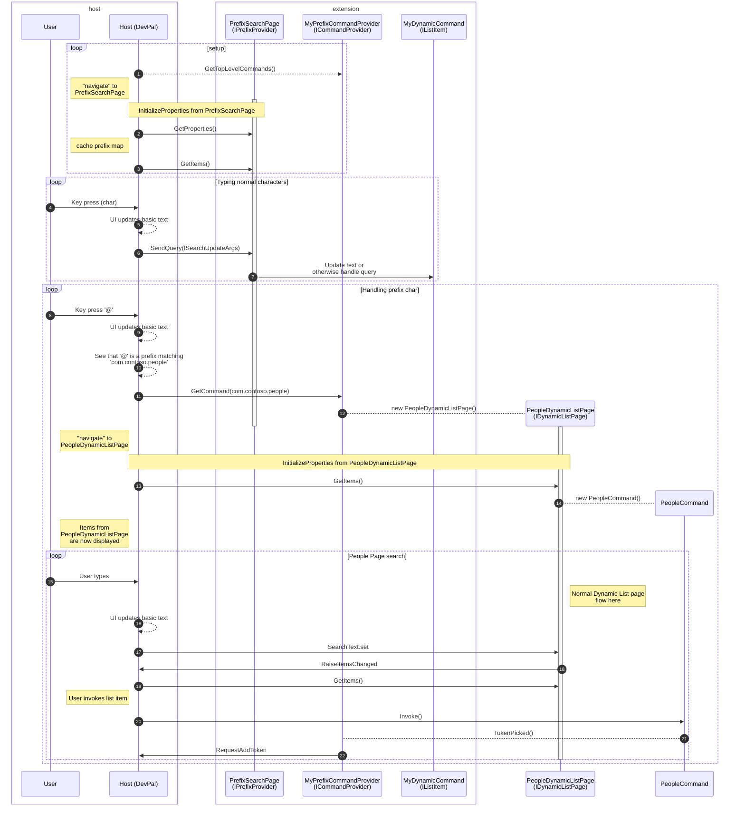

## Addenda II-A: Prefix Search 


> [!INFO] 
> 
> This is a draft `.idl` spec. Details are still subject to change. Overall
> concepts however will likely remain similar

```c# prefix search

interface ISearchUpdateArgs requires IExtendedAttributesProvider
{
    String NewSearchText { get; } // The text that the user has typed into the search box.
}

interface IToken
{
    Object Value { get; };
    String DisplayText { get; };
    String Id { get; }; // GUID?
}

interface IAddTokenArgs
{
    IToken Value { get; };
    Int64 Position { get; }; // default -1 for "end"
}

interface IPrefixProvider requires IListPage // this definitely needs at least IPage
{
    IDictionary<String, String> PrefixCommands { get; }
    // event Windows.Foundation.TypedEventHandler<Object, IAddTokenArgs> RequestAddToken;
    void UpdateSearch(ISearchUpdateArgs args);
}

```


Instead, here's the `IPrefixProvider` implemented on one page, separate from the command provider. 

```cs
class MyPrefixCommandProvider : ICommandProvider
{
    private PeopleDynamicListPage _peopleCommand; // com.contoso.people
    private CommandsListPage _commandsCommand; // com.contoso.commands
    private AddFileCommand _addFileCommand; // com.contoso.addFile

    private PrefixSearchPage _prefixSearchPage;

    public MyPrefixCommandProvider()
    {
        _prefixSearchPage = new PrefixSearchPage();
    }

    public ICommandItem[] GetTopLevelCommands()
    {
        return new ICommandItem[] { _prefixSearchPage };
    }

    public ICommand GetCommand(String id)
    {
        if (id == "com.contoso.people")
        {
            return _peopleCommand;
        }
        else if (id == "com.contoso.commands")
        {
            return _commandsCommand;
        }
        else if (id == "com.contoso.addFile")
        {
            return _addFileCommand;
        }
        return null;
    }
}

class PrefixSearchPage : ListPage, IPrefixProvider
{
    public IDictionary<String, String> PrefixCommands => new Dictionary<String, String>
    {
        { "@", "com.contoso.people" },
        { "/", "com.contoso.commands" },
        { "+", "com.contoso.addFile" },
    };

    public event Windows.Foundation.TypedEventHandler<Object, ITokenPickedEventArgs> TokenAdded;

    public PrefixSearchPage()
    {
        // Initialize the page...
    }

    public void OnTokenPicked(ITokenPickedEventArgs args)
    {
        // Raise the event to notify CmdPal of the picked token
        TokenAdded?.Invoke(this, args);
    }

    public void SendQuery(ISearchUpdateArgs args)
    {
        // Handle the search update, possibly updating the list of items based on the new search text
        var searchText = args.NewSearchText;
        var properties = args.GetProperties();
        var tokens = properties.TryLookup<object>("tokens") as ITokenPositions[];

        // Here you could use these tokens to update the commands in our own search results
        // Or just save them, and plumb them into the InvokableCommand the user eventually picks
    }

    // Other ListPage members...
}
```


--------------------


### flow diagram


* If a user repositions the caret to be before the current prefix, we need to dismiss the "pushed" page
* Everything that the user types after the prefix is sent to the pushed page instead of the original page
* If the user deletes the prefix, we need to dismiss the pushed page and return to the original page

### Thought experiment: Should page be responsible for adding tokens?

Should we be having the `PrefixSearchPage` handle telling us what the current tokens are? Or should CmdPal be tracking that itself?
Like, when the token is picked, should the API be `AddToken` or `SearchTextChanged` with the new text and the list of tokens?

I guess the second form makes it easier for an extension to determine what the contents of the search box are. So they'd raise a 

```cs

interface ITokenPostitions
{
    IToken Token { get; };
    Int64 Position { get; }; // default -1 for "end"
}

interface ISearchTextChangedArgs
{
    String NewSearchText { get; } // The text that the user has typed into the search box.
    ITokenPostitions[] CurrentTokens { get; } // The tokens that are currently in the search box.
}
```

But, that's not really what we want either. How would we know where tokens are within the NewSearchText? The extension could set NewSearchText to just garbage that isn't related to the tokens at all.

`ITextRange` is in `Microsoft.UI.Text`. Don't want to have to rely on and WASDK types. 

So that kinda necessitates that we have 
```cs

interface ISearchRun
{
}
interface IInputTextRun : ISearchRun
{
    String Text { get; };
}
interface ITokenRun : ISearchRun
{
    IToken Token { get; };
}
interface IReadOnlyTextRun : ISearchRun
{
    String Text { get; };
}
interface ISearchTextChangedArgs
{
    ISearchRun[] SearchRuns { get; } 
}

interface IPrefixProvider requires IListPage // this definitely needs at least IPage
{
    IDictionary<String, String> PrefixCommands { get; }
    void UpdateSearch(ISearchTextChangedArgs args);
}
// And just use a PropChanged(Page.SearchRuns) to notify of changes -> host
```

Then, when the user picks a suggestion, the page itself would have to:


```cs
public ISearchRun[] SearchRuns => _currentRuns.ToArray();
private IList<ISearchRun> _currentRuns = new List<ISearchRun>();

private void OnTokenPicked(MyTokenPickedEventArgs args)
{
    var token = args.Value;

    _currentRuns.Add(new TokenRun { Token = token });
    _currentRuns.Add(new TextRun(" ")); // add a space after the token

    // Raise the event to notify CmdPal of the picked token
    RaisePropertyChanged(nameof(SearchRuns));
}
```

This is just carcinisation. It's the token search spec again.

TODO! 
this current designe requires that the picked suggestion raise an event up through the page hosting the suggestion, into the prefix page. That necessitates a _lot_ of plumbing. Because the prefix page _doesn't actually have a reference to the suggestion pages_. So we can't wire the events from 
command -> suggestion page -> prefix page.

we need to wire

command -> suggestion page -> command provider -> prefix page

which is gross.

How could we make that easier? So that the things that are suggestions can just raise an event straight to the prefix page?

We could just have the prefix page own the suggestion pages, and have the command provider expose the other commands in GetCommand as members of the prefix page. 

```cs
public class MyPrefixCommandProvider : ICommandProvider
{
    private PrefixSearchPage _prefixSearchPage;
    public MyPrefixCommandProvider()
    {
        _prefixSearchPage = new PrefixSearchPage();
    }
    public ICommandItem[] GetTopLevelCommands()
    {
        return new ICommandItem[] { _prefixSearchPage };
    }
    public ICommand GetCommand(String id)
    {
        return _prefixSearchPage.GetCommand(id);
    }
}
public class PrefixSearchPage : ListPage, IPrefixProvider
{
    private PeopleDynamicListPage _peopleCommand; // com.contoso.people
    private CommandsListPage _commandsCommand; // com.contoso.commands
    private AddFileCommand _addFileCommand; // com.contoso.addFile

    public IDictionary<String, String> PrefixCommands => new Dictionary<String, String>
    {
        { "@", _peopleCommand.Id },
        { "/", _commandsCommand.Id },
        { "+", _addFileCommand.Id },
    };

    public event Windows.Foundation.TypedEventHandler<Object, ITokenPickedEventArgs> TokenAdded;

    public ISearchRun[] SearchRuns => _currentRuns.ToArray();
    private IList<ISearchRun> _currentRuns = new List<ISearchRun>();

    public PrefixSearchPage()
    {
        _peopleCommand = new PeopleDynamicListPage(HandleTokenPicked);
        _commandsCommand = new CommandsListPage(HandleTokenPicked);
        _addFileCommand = new AddFileCommand(HandleTokenPicked);
        // Initialize the page...
    }

    public ICommand GetCommand(String id)
    {
        if (id == _peopleCommand.Id) // com.contoso.people
        {
            return _peopleCommand;
        }
        else if (id == _commandsCommand.Id) // com.contoso.commands
        {
            return _commandsCommand;
        }
        else if (id == _addFileCommand.Id) // com.contoso.addFile
        {
            return _addFileCommand;
        }
        return null;
    }

    public void HandleTokenPicked(ITokenPickedEventArgs args)
    {
        var token = args.Token;

        _currentRuns.Add(new TokenRun { Token = token });
        _currentRuns.Add(new TextRun(" ")); // add a space after the token

        // Raise the event to notify CmdPal of the picked token
        RaisePropertyChanged(nameof(SearchRuns));

    }

    public void UpdateSearch(ISearchTextChangedArgs args)
    {
        var searchTokens = args.CurrentTokens;
        _currentRuns = searchTokens.ToList();

        // For example: you could grab all the text from the runs like this
        var newText = "";
        foreach (var run in args.SearchRuns)
        {
            if (run is IInputTextRun inputRun)
            {
                newText += inputRun.Text;
            }
            else if (run is ITokenRun tokenRun)
            {
                newText += tokenRun.Token.DisplayText;
            }
            else if (run is IReadOnlyTextRun readOnlyRun)
            {
                newText += readOnlyRun.Text;
            }
        }
        
    }

    // Other ListPage members...
}

```

Then the prefix page can own the suggestion pages, and wire their events directly to itself. 

Does this mean that the `ISearchTextChangedArgs` coming into the extension are something instantiated by the host? yea. That would force the extension to safely deal with the args. Unless we definitely had OSS MBV, we can't be sure that what the extension sees is safe to handle. 

It would be a weird mismash where the set of tokens is half owned by the extension (tokens) and half owned by the host (text). And I don't know how having a token roundtrip across the ABI both ways would translate. Probably fine. 

```cs
page.UpdateSearch(new SearchTextChangedArgs(){SearchRuns=[new InputTextRun("h")]});
page.UpdateSearch(new SearchTextChangedArgs(){SearchRuns=[new InputTextRun("he")]});
page.UpdateSearch(new SearchTextChangedArgs(){SearchRuns=[new InputTextRun("hel")]});
page.UpdateSearch(new SearchTextChangedArgs(){SearchRuns=[new InputTextRun("hell")]});
page.UpdateSearch(new SearchTextChangedArgs(){SearchRuns=[new InputTextRun("hello")]});
page.UpdateSearch(new SearchTextChangedArgs(){SearchRuns=[new InputTextRun("hello ")]});
// user types '@'
// user picks "Alice" from people page
// page itself raises a PropChanged(SearchRuns)
page.UpdateSearch(new SearchTextChangedArgs(){SearchRuns=[
    new InputTextRun("hello "), // created by host
    new TokenRun(Alice), // created by page
    new InputTextRun(" "), // created by page
]});
```


-----------------------


### On the command palette side

```cs
var args = new CmdPalSearchUpdateArgs();
// assume that our CmdPal-side implementation has a SetProperty(string, object) to add an extended attribute
args.SetProperty("tokens", new TokenPositions[]{ new(pos: 0, token: t.Value), ... });
args.SetProperty("correlation", myWhateverValue);
prefixProvider.SendQuery(args);
```


### rejected garbage


This is what it looks like if we have the IPrefixProvider implemented in our command provider. 
```cs
class MyPrefixCommandProvider : ICommandProvider, IPrefixProvider
{
    private PeopleDynamicListPage _peopleCommand;
    private CommandsListPage _commandsCommand;
    private AddFileCommand _addFileCommand;

    public IDictionary<String, String> PrefixCommands => new Dictionary<String, String>
    {
        { "@", "com.contoso.people" },
        { "/", "com.contoso.commands" },
        { "+", "com.contoso.addFile" },
    };

    public MyPrefixCommandProvider()
    {
        _peopleCommand = new PeopleDynamicListPage() { TokenPicked = OnTokenPicked };
        _commandsCommand = new CommandsListPage() { TokenPicked = OnTokenPicked };
        _addFileCommand = new AddFileCommand() { TokenPicked = OnTokenPicked };
    }

    public event Windows.Foundation.TypedEventHandler<Object, ITokenPickedEventArgs> TokenAdded;

    public void OnTokenPicked(ITokenPickedEventArgs args)
    {
        // Raise the event to notify CmdPal of the picked token
        TokenAdded?.Invoke(this, args);
    }

    // Other ICommandProvider members...

    public ICommand GetCommand(String id)
    {
        if (id == "com.contoso.people")
        {
            return _peopleCommand;
        }
        else if (id == "com.contoso.commands")
        {
            return _commandsCommand;
        }
        else if (id == "com.contoso.addFile")
        {
            return _addFileCommand;
        }
        return null;
    }
}
```

This is a little gross in my opinion. The `GetCommand` implementation is close to the list of prefixes, which is nice. But picking the tokens doesn't make sense on the command provider. It should be on the Page. 

 
~~I don't know if this compiles:~~ This DOESN'T compile, a struct field can't be a pointer type.

```cs
struct TokenRun
{
    String Text;
    Boolean IsReadOnly;
    Object Value;
}
```
~~That boxes us into those three properties and never more, but would ensure that we'd always cleanly transit the ABI~~