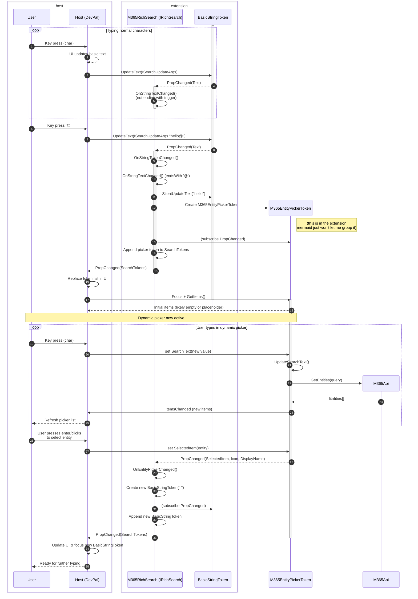

## Addenda II-A: Rich Search Box

_What if the search box wasn't just a text box, but was an actually rich search
surface?_

This is an idea born by a collection of requests. Essentially, we want to create
a richer input box that can also accept entities inline with text.

What are things we actually want users to be able to do with this?
* Type just plain text. 
* Type a string that has a special meaning, like `@` or `#`, and trigger some
  suggestions (as provided by the extension)
  * `#` might bring up a special kind of string input (which is treated visibly
    differently, like a tag)
  * `/` might bring up a static list of commands that the user can invoke 
  * `@` might bring up a dynamic list of users to filter (and those are
    dynamically generated as the user types, so we don't return 40000 users)
* There may be a button or other UI element **that the extension controls**
  which _also_ allows the user to trigger a picker (e.g. if the extension wants
  to manually add a token to the search box)
* If the user backspaces a token, it removes the whole token (except for the
  last basic string token, which is just a text box)

Essentially, we want a text box that lets an extension create a richer set of
inputs than just "a string of text". Very much of this _could_ be achieved with
an Adaptive Card, but RichSearch enables this experience to be inline with what
the user is typing. This enables a more natural "conversational" or even
"command-line-like" experience.

What follows is a basic outline for a Rich Search API. This API doesn't
prescribe a UI presentation or framework (similar to the rest of the Command
Palette API). And other than `INotifyPropChanged` and `INotifyItemsChanged`, it
doesn't rely on any other bits of the Command Palette API.

> [!INFO] 
> 
> This is a draft `.idl` spec. Details are still subject to change. Overall
> concepts however will likely remain similar

```c# rich search
[uuid("a578ed30-1374-4601-97ba-8bd36a0097cd")]
interface IToken requires INotifyPropChanged {};

interface ISearchUpdateArgs requires IExtendedAttributesProvider
{
    String NewSearchText { get; } // The text that the user has typed into the search box.
}
// Basic types of tokens: 
// * IBasicStringToken: This is your standard text box input token. The text is 
//   not stylized at all. Essentially, it just represents a run of text in the 
//   text box, between other tokens.
// * ILabelToken: This is just a static run of text, with no user interaction. 
//   This isn't an input field - it's just static text between other tokens.
interface IBasicStringToken requires IToken
{
    String Text { get; }
    void UpdateText(ISearchUpdateArgs newText); // This is the setter for the text, which will be used by the host to update the text in the search box.
}
interface ILabelToken requires IToken
{
    // This is just a static run of text, with no user interaction. It can't accept "focus"
    String Text { get; }; 
}

// The following are all tokens of richer input. They can each have their own 
// behaviors for picking a value. The common interface for these tokens is 
// ICommandArgument. ICommandArgument provides a common set of properties for 
// expressing the appearance of the token (icon and display name) and a stored
// value (whatever that value might be).
interface ICommandArgument requires IToken 
{
    IIconInfo Icon { get; };
    String DisplayName { get; };

    Object Value { get; }; // No setter. Each individual token type will have its own setter.
}
// * IStringInputToken: A separate text input field. Hosts should give this a
//   different UX treatment, as if to indicate it is separate input from the 
//   rest of the search text. 
interface IStringInputToken requires ICommandArgument
{
    String Text { get; set; } // This is basically just the `.Value`, but with a setter
}
// * ICustomHwndPickerToken: A token that allows the extension to display its 
//   own picker UI. The extension can use the hostHwnd to show the picker 
//   relative to the host window. The extension is responsible for storing its own .Value.
interface ICustomHwndPickerToken requires ICommandArgument
{
    void ShowPicker(UInt64 hostHwnd); // extension is responsible for setting your own .Value
}
// * IPickerToken: A single value in a picker (below)
interface IPickerToken requires ICommandArgument
{
    String Title { get; } 
    String Subtitle { get; } 
}
// * IStaticPickerToken: A token that displays a static list of options for the 
//   user to choose from. If you squint, this is just like a IListPage.
interface IStaticPickerToken requires ICommandArgument, INotifyItemsChanged
{
    IPickerToken[] GetItems();
    IPickerToken SelectedItem { get; set; } 
    // .Value should effectively be SelectedItem?.Value
    
    // TODO: Loading, HasMore, LoadMore?
}
// * IDynamicPickerToken: A token that displays a list of options which can be
//   dynamically updated as the user types into the token. Especially good for 
//   lists where the entire set of possible values cannot be reasonably 
//   enumerated
interface IDynamicPickerToken requires IStaticPickerToken
{
    String SearchText { get; set; } 
}

interface IRichSearch requires INotifyPropChanged
{
    IToken[] SearchTokens{ get; };  
    void RemoveToken(IToken token);
}
```

### Examples

Below we have a simple sample for how someone might implement a rich search
experience using the interfaces defined above.

In this example, we'll create a simple implementation of `IRichSearch` that
allows the user to type `@` to trigger a picker. That picker is then displayed
to the user, allowing them to select an entity. As the user types in that
picker, the extension will be told, and we'll be able to update the contents of
the picker to match.

<table>

<tr>

<td>

Some standard base classes for `INotifyPropChanged` and `INotifyItemsChanged`,
to make it easier for developers to implement these interfaces.

```cs
public partial class BaseObservable : INotifyPropChanged
{
    public event TypedEventHandler<object, IPropChangedEventArgs>? PropChanged;
    protected void OnPropertyChanged(string propertyName) => 
        try { PropChanged?.Invoke(this, new PropChangedEventArgs(propertyName)); } catch { }
}
public partial class BaseObservableList : BaseObservable, INotifyItemsChanged
{
    public event TypedEventHandler<object, IItemsChangedEventArgs>? ItemsChanged;
    protected void OnItemsChanged(IItemsChangedEventArgs args) =>
        try { ItemsChanged?.Invoke(this, args); } catch { }
}
```

`M365RichSearch` is our sample Rich Search implementation. It starts with a
single basic string token. When the user types, we immediately begin by sending
input to that first `BasicStringToken`. 

As the user types, we look to see if they if they typed a special character
(like `@`). If they do, we add a new token to the list. When we return the new
token back to the host, the host will "move focus" into the new token.  When the
user selects an item from the picker, we add another basic string token after
it.

```cs
class M365RichSearch : BaseObservable, IRichSearch
{
    public IToken[] SearchTokens {
        get => _searchTokens;
        set {
            if (_searchTokens != value) {
                UpdateSearchTokens(_searchTokens, value);
                OnPropertyChanged(nameof(SearchTokens));
            }
        }
    }

    public M365RichSearch() {
        // Initialize with a default token, e.g. a text input token
        var baseStringInput = new BasicStringToken();
        baseStringInput.PropChanged += OnStringTokenChanged;
        SearchTokens = [baseStringInput];
    }

    private IToken[] _searchTokens = [];

    private void UpdateSearchTokens(IToken[] oldTokens, IToken[] newTokens) {
        // probably need to add/remove event handlers on the tokens
        _searchTokens = newTokens;
    }

    private void OnStringTokenChanged(object sender, PropChangedEventArgs args) {
        if (args.PropertyName == nameof(BasicStringToken.Text)) {
            OnStringTextChanged(sender, ((BasicStringToken)sender).Text);
        }
    }

    private void OnStringTextChanged(object sender, string newText) {
        if (sender != SearchTokens.Last()) {
            // User typed in a non-last token, ignore it.
            return;
        }
        var searchToken = ((BasicStringToken)sender);
        if (newText.Length > 0 && newText.EndsWith('@')) {
            // User typed '@', let's add a M365EntityPickerToken
            
            // Create the new picker token
            var entityPickerToken = new M365EntityPickerToken();
            entityPickerToken.PropChanged += OnEntityPickerChanged;
            SearchTokens = SearchTokens.Append(entityPickerToken).ToArray();
            
            // The new token "owns" the '@', so we need to remove it from the basic string
            searchToken.SilentUpdateText(newText.TrimEnd('@'));

            OnPropertyChanged(nameof(SearchTokens));
        } 
        else if (newText.Length > 0 && newText.EndsWith('#')) { /* etc, etc */}
        else if (newText.Length > 0 && newText.EndsWith('/')) { /* etc, etc */}
    }

    private void OnEntityPickerChanged(object sender, PropChangedEventArgs args) {
        if (args.PropertyName == nameof(M365EntityPickerToken.SelectedItem)) {
            // User selected an entity, we now want to add another BasicStringToken after it
            var baseStringInput = new BasicStringToken(" ");
            baseStringInput.PropChanged += OnStringTokenChanged;
            SearchTokens = SearchTokens.Append(baseStringInput).ToArray();
            OnPropertyChanged(nameof(SearchTokens));
        }
    }
}
```

</td>
<td>

Below, `BasicStringToken` is a toolkit class for just the basic string token.
The basic string token just represents text in the search box, with no special
meaning. You can imagine that a basic page essentially just has one long
`BasicStringToken` for it's search text. 

```cs
class BasicStringToken : BaseObservable, IBasicStringToken {
    public string Text {
        get => _text;
        set {
            if (_text != value) {
                var oldValue = _text;
                _text = value;
                OnPropertyChanged(nameof(Text));
            }
        }
    }
    private string _text;

    public BasicStringToken(string initialText = "") {
        _text = initialText;
    }

    public void UpdateText(ISearchUpdateArgs newText) {
        Text = newText.Text;
        // newText may have other properties too, like a correlation vector, 
        // but that's not demoed here.
    }

    // helper for setting the text without raising a property changed event
    public void SilentUpdateText(string newText) {
        _text = newText;
    }
}
```

This is a more complex example: a dynamic picker token. When this is added to
the list of tokens, the host will "move focus" to that token. The host will
immediately call `GetItems()` on the token, which will return a list of items to
show the user. 

As the user types, the host will call `SearchText.set` on the token. In our
sample here, we use that to query the backend (in `UpdateSearchText`), then call
`RaisePropertyChanged` on `SearchText` to notify the host that the search text
has changed.

When the user selects an item, the host will set the `SelectedItem` property on
the token.

If the user backspaces the last character in the token (s.t. `SearchText` is
empty), the host will tell the `IRichSearch` to remove the token from the list
of tokens. 

```cs
class M365EntityPickerToken : BaseObservable, IDynamicPickerToken {
    public IIconInfo? Icon => _selected?.Icon;
    public string? DisplayName => _selected?.DisplayName;
    public object? Value => _selected?.Value;

    public string SearchText {
        get => _searchText;
        set {
            if (_searchText != value) {
                var oldValue = _searchText;
                _searchText = value;
                UpdateSearchText(oldValue, value);
                OnPropertyChanged(nameof(SearchText));
            }
        }
    }; 
    public IPickerToken? SelectedItem {
        get => _selected;
        set {
            if (_selected != value) {
                _selected = value;
                OnPropertyChanged(nameof(SelectedItem));
                OnPropertyChanged(nameof(Icon));
                OnPropertyChanged(nameof(DisplayName));
            }
        }
    }

    public M365EntityPickerToken() {
        UpdateSearchText(null, string.Empty);
    }

    public IPickerToken[] GetItems() {
        // return a list of M365 entities based on the search text
        return _items;
    }
    
    private string _searchText = "@";
    private IPickerToken[] _items = [];
    private IPickerToken? _selected = null;

    private void UpdateSearchText(string? oldValue, string newValue) {
        // Call out to M365 APIs to get the entities based on the search text
        // and update the list of items.
        _items = M365Api.GetEntities(newValue); // Pretend this is it.
        RaiseItemsChanged();
    }
}
```

(omitted from this sample: cancellation tokens to only have one query at a time, loading states, error states, etc.)

</td>
</tr>
</table>




### Commands with parameters

We've also long experimented with the idea of commands having parameters that
can be filled in by the user. These would be commands that take a couple
lightweight inputs, so that the use can input them more natively than an
adaptive card. 

Previous drafts included a new type of `ICommand` ala
`IInvokableWithParameters`. However, these ran into edge cases:
* Where are the parameters displayed? In the search box? On the item?
* What happens if a context menu command needs parameters? 
* Does the _page_ have parameters?

none of which were trivially solvable by having the parameters on the command.

Instead, we can leverage the concept of a "rich search" experience to provide
that lightweight parameter input method.

We'll add a new type of page, called a `RichSearchPage`. It's a list page, but
with a rich search box at the top.

```c#
interface IRichSearchPage requires IListPage {
    IRichSearch Search { get; };
};
```

This lets the user activate the command that needs parameters, and go straight
into the rich input page. That page will act like it's _just_ the command the
user "invoked", and will let us display additional inputs to the user. 

#### Parameters Example

Now, lets say you had a command like "Create a note \${title} in \${folder}".
`title` is a string input, and `folder` is a static list of folders. 

The extension author can then define a `RichSearchPage` with a `IRichSearch`
that has four tokens in it:
* A `ILabelToken` for "Create a note"
* A `IStringInputToken` for the `title`
* A `ILabelToken` for "in"
* A `IStaticListToken` for the `folder`, where the items are possible folders

Then, when the user hits <kbd>↲</kbd>, we gather up all the tokens, and we can
reference them in the command. As an example, here's the `CreateNoteCommand`,
which implements the `IRichSearchPage` interface:

The list page can always change it's results based on the user's input. In our
case, we'll listen for the value of the last token to be set. When it is, we can
then display the final list item with our fully formed command for the user to
invoke. 

```csharp
class CreateNoteCommand : IRichSearchPage {
    public string Name => "Create a note";
    public string Id => "create_note";
    public IIconInfo Icon => null;

    public IRichSearch Search { get; } 
    private StringInputToken _titleToken;
    private NotesFolderToken _folderToken;

    private IListItem? _createNoteItem;

    public CreateNoteCommand() {
        Search = new RichSearch();

        _titleToken = new StringInputToken("title", "Title of the note");
        _folderToken = new NotesFolderToken("folder", "Select a folder");

        Search.SearchTokens = [
            new LabelToken("Create a note"),
            _titleToken,
            new LabelToken("in"),
            _folderToken
        ];

        _folderToken.OnSelectedItemChanged += (sender, e) => {
            // Update the command with the selected folder
            UpdateCommand();
        };
    }

    private void UpdateCommand() {
        _createNoteItem = new ListItem() {
            Title = _titleToken.Value,
            Subtitle = _folderToken.SelectedItem?.Title,
            Command = new CreateNoteCommand(title: _titleToken.Value, folder: _folderToken.SelectedItem.Value)
        };
    }
}
```

### Miscellaneous notes

We shouldn't put a `set`ter on IRichSearch::SearchTokens. That would allow the
host to instantiate ITokens and give them to the extension. The extension
shouldn't have to lifetime manage the host's objects. 

It would be really great if we could have the setting of the value of the last
token "commit" the whole command, and let the user invoke the command
immediately when picking a value. Not sure if that's reasonable though. 

`IRichSearchPage` probably needs a way to go back, that's not driven by user input. Or not driven by backspacing tokens. For example, in our previous `CreateNoteCommand` example, if the user backspaces from:
* The filled `folder` param: the extension will get a `RemoveToken` call for the
  `folder` token, which we'll use to clear it's value, and trigger focus to move
  back into it.
* The empty `folder` param: we'll move focus back to the `title` token.
* the filled `title` param: we'll backspace a character.
* the empty `title` param: **TODO! WHAT DO WE DO HERE?**
