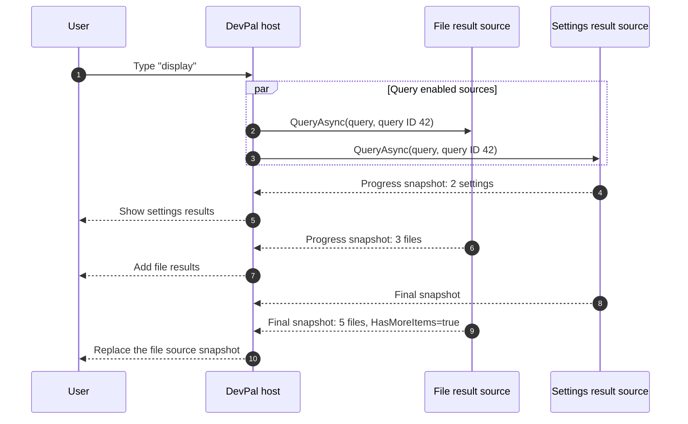

## Addenda V: Fallbacks v2

The original DevPal design required each fallback to return exactly one result.
File search therefore used a nested page. User feedback shows that users want
files, settings, and open windows in the top-level search results.

The word "fallback" describes three scenarios:

1. A **passive command** which can handle arbitrary text, like "Search the web
   for {query}". The host can format and display this without calling the
   extension on every keypress.
2. An **active command** which needs to react to every query, like a command
   line parser that changes its title, icon, or command as the user types. This
   is the behavior of the original `IFallbackHandler`.
3. A **result source** which searches in response to the top-level query and
   returns zero or more items. File search is the obvious example.

Trying to represent all three with `IFallbackHandler.UpdateQuery` has two bad
outcomes. Simple commands pay for an out-of-process call on every keypress, and
search providers are forced to hide all their results behind one command and a
nested page.

This addendum separates those behaviors. It is intended to address the user
feedback in [#38683], [#39010], [#38877], and [#44989].

[#38683]: https://github.com/microsoft/PowerToys/issues/38683
[#39010]: https://github.com/microsoft/PowerToys/issues/39010
[#38877]: https://github.com/microsoft/PowerToys/issues/38877
[#44989]: https://github.com/microsoft/PowerToys/issues/44989

### Goals

* Let an extension return multiple results directly to the top-level search.
* Keep simple fallbacks out of the cross-process query path.
* Preserve the original query when a result is invoked or opens a page.
* Support slow and remote sources without blocking faster sources.
* Support incremental results and paging.
* Let the host cancel old asynchronous work and reliably reject stale results.
* Preserve source attribution and the order chosen by the extension.
* Keep the WinRT interface inheritance linear for metadata-based marshalling.
* Remain compatible with existing `IFallbackCommandItem` and
  `IFallbackHandler` implementations.

This does not define a common relevance score between extensions. Different
sources have different ideas of what a score means, and mixing those values
would produce unpredictable ordering. A future API could define a common score
contract.

### Overview

Each v2 fallback declares one `FallbackCommandMode`:

| Mode | Host behavior | Typical examples |
|---|---|---|
| `Passive` | Format and match locally. Do not call the extension while the user types. | Web search, ask an assistant, open a URL |
| `Active` | Call the existing `IFallbackHandler.UpdateQuery` for each accepted query. | Run a command line, calculator input with a live title |
| `Results` | Call the asynchronous v2 handler and display all returned items. | Files, settings, open windows, remote search |

A provider can return more than one fallback, and each fallback can use a
different mode. For example, a single provider might expose one passive "Search
the web" command and one result source for browser history.

### API

> [!INFO]
>
> This is a draft `.idl` spec. Names and details are still subject to change.
> The behavior described here is the important part.

```csharp
enum FallbackCommandMode
{
	// The host calls IFallbackHandler.UpdateQuery. This is the original
	// fallback behavior.
	Active = 0,

	// The host formats and matches the item without calling the extension.
	Passive,

	// The host calls IFallbackHandler2.QueryAsync and displays its items.
	Results,
};

enum HostMatchKind
{
	// No additional match filtering. Normal host fallback policy applies.
	None = 0,

	// Host determines visibility by evaluating the MatchValue regex
	Regex,
};

struct OptionalUInt32
{
	Boolean HasValue;
	UInt32 Value;
};

// The host creates one of these for each accepted top-level query.
interface IFallbackQueryArgs requires IExtendedAttributesProvider
{
	String Query { get; };
	String QueryId { get; };
	UInt32 RequestedItemCount { get; };
	String[] LanguageTags { get; };
};

// Passed back when a command is created for a particular query. This derives
// from IFallbackQueryArgs so future query context can be added in one place.
interface IFallbackCommandInvocationArgs requires IFallbackQueryArgs
{
};

// One complete snapshot from a result source. Progress values and the final
// return value use the same shape. The final result also owns its continuation.
interface IFallbackCommandResult
{
	String Query { get; };
	String QueryId { get; };
	IListItem[] Items { get; };
	Boolean HasMoreItems { get; };

	Windows.Foundation.IAsyncOperationWithProgress<
		IFallbackCommandResult,
		IFallbackCommandResult> LoadMoreItemsAsync(UInt32 requestedItemCount);
};

// This remains in a linear chain with IFallbackHandler. UpdateQuery is not
// called when the owning fallback is in Results mode.
interface IFallbackHandler2 requires IFallbackHandler
{
	Windows.Foundation.IAsyncOperationWithProgress<
		IFallbackCommandResult,
		IFallbackCommandResult> QueryAsync(IFallbackQueryArgs args);
};

// Keep all new fallback metadata on one linear interface. In particular, do
// not split formatting, matching, and defaults into sibling interfaces.
interface IFallbackCommandItem3 requires IFallbackCommandItem2
{
	FallbackCommandMode Mode { get; };

	// The host will use this for the action label before that command has been
	// created.
	String Name { get; };

	// Used by Passive mode. The host replaces the literal token "{query}".
	// An empty template means to use the corresponding ICommandItem property.
	String TitleTemplate { get; };
	String SubtitleTemplate { get; };

	HostMatchKind MatchKind { get; };
	String MatchValue { get; };

	// These are suggestions, not requirements. The user and host remain in
	// control of query scheduling policy.
	OptionalUInt32 SuggestedQueryDelayMilliseconds { get; };
	OptionalUInt32 SuggestedMinQueryLength { get; };

	// Required for Results mode. It may be null for Passive and Active modes.
	IFallbackHandler2 QueryHandler { get; };

	// Called only after the user activates this fallback. This supports both
	// invokable commands and pages without adding sibling interfaces to the
	// ICommand/IPage/IInvokableCommand inheritance trees.
	ICommand CreateCommand(IFallbackCommandInvocationArgs args);
};
```

`ICommandProvider.FallbackCommands()` continues to return
`IFallbackCommandItem[]`. For each returned object, a v2 host checks whether it
also implements `IFallbackCommandItem3`. This is the same pattern the host
already uses to discover `IFallbackCommandItem2`. It works because
`IFallbackCommandItem3` extends the existing fallback interface in one linear
chain; it does not introduce a sibling interface.

`IFallbackQueryArgs.GetProperties()` is reserved for optional host context that
does not justify a new contract version. Extensions must ignore properties they
do not understand. The initial host does not require any extended properties.

`QueryId` is an opaque ID created by the host. It is unique within the host
session and compared using ordinal string equality. An extension may use it as
a key for query state, but must not parse it or assume that IDs sort in
creation order.

`RequestedItemCount` is a budget, not a requirement to return exactly that many
items. For `QueryAsync`, it is the requested size of the initial snapshot. For
`LoadMoreItemsAsync`, the corresponding argument is the number of additional
items requested. A source may return fewer items, including none. The host must
ignore items beyond the requested budget and may apply a lower display limit.

`LanguageTags` contains the user's preferred display languages in priority
order. A source can use these tags to select the language for results. The
source does not have to use the current culture of the host process.

`Name` is required for `Passive` and `Active` fallbacks. It is the name the host
shows for the default action before `CreateCommand` runs. The command returned
by `CreateCommand` should expose the same `ICommand.Name`. `Name` is not used
for a `Results` fallback, because each returned `IListItem` already supplies its
own command. This is an action label, not the fallback row's
`ICommandItem.Title` or its settings and source-attribution `DisplayTitle`.

### Why `CreateCommand`

An earlier prototype added an `IInvokableCommand2.InvokeWithArgs` method. That
works for invokable commands, but it does not solve the equivalent page
scenario. Consider a passive WinGet fallback: selecting "Search WinGet for
foo" should open its list page with `foo` already in the page's search box.
Pages are navigated to; they do not have an invocation method where the host can
pass additional arguments.

`CreateCommand` handles both cases. It runs only after activation, and it can
return either:

* an `IInvokableCommand` which has captured the query, or
* an `IPage` initialized with the query.

An extension which does not need the query may return the same object as
`ICommandItem.Command`. A `Results` fallback normally returns query-specific
commands in its `IListItem`s, so the host does not call the fallback item's
`CreateCommand` for those results.

Both passive and v2 active fallbacks are activated through `CreateCommand`.
Legacy `IFallbackCommandItem` objects continue to use `ICommandItem.Command`.
The host keeps the provider ID, fallback ID, exact query, and query ID with each
displayed fallback or result item. This provenance is host state; the host does
not change the extension's item to store it.

This also avoids adding another interface branch to `ICommand`. Out-of-process
metadata-based marshalling behaves best when interfaces form a linear chain.
The same is why formatting, host matching, and suggested defaults are all on
`IFallbackCommandItem3`, rather than separate
`IFormattedFallbackCommandItem`, `IHostMatchedFallbackCommandItem`, and
`IFallbackCommandItemDefaults` interfaces.

### Passive fallbacks

The host must not call either `IFallbackHandler.UpdateQuery` or
`IFallbackHandler2.QueryAsync` for a passive fallback.

For each query, the host creates the display title and subtitle by replacing
every literal `{query}` token in `TitleTemplate` and `SubtitleTemplate`. The
query is inserted as plain text. It is not interpreted as a format string,
regular expression, URI, or markup.

If a template is null or empty, the host uses the corresponding `Title` or
`Subtitle` from the fallback item. While the provider is live, the item remains
observable, so an extension can independently change static state such as "Now
playing". Those independent property changes are not query updates. A cached
passive descriptor is a snapshot and does not receive later property changes.

If `MatchKind` is `Regex`, the host performs a full-string match of `Query`
against `MatchValue`. The initial host limits patterns to 4,096 characters and
uses a timeout no longer than 50 milliseconds. An invalid expression, a
timeout, or a non-match hides the fallback for that query. A host may disable a
pattern which repeatedly fails or times out. Regex matching is performed in the
host process and does not require an extension call.

If `MatchKind` is `None`, there is no additional match filtering. The host's
normal fallback visibility and user settings decide whether to show the item.

The host associates each displayed passive item with the query and internal
query generation that produced it. If the user activates an item after the
top-level query has changed, the host ignores that activation and refreshes the
list. This check is entirely host-side; it does not call the passive fallback
or read query state from it.

Only after that check succeeds does the host call `CreateCommand`, passing the
exact query that produced the displayed item, and invoke or navigate to the
returned command. This is the first time the passive fallback receives that
query. Although `IFallbackCommandInvocationArgs` includes the host's opaque
`QueryId`, the passive fallback receives it only with this activation-time call,
never while the user types.

### Active fallbacks

Active fallbacks preserve the v1 behavior. The host calls
`IFallbackHandler.UpdateQuery` on a worker thread, and the fallback may update
its title, subtitle, icon, or command before the host displays it.

Active fallbacks should be uncommon. They put an out-of-process call on the
typing path and are the easiest kind of fallback to make slow. An extension
should use a passive fallback when it only needs to include the query in a title
or pass the query to a command at activation time.

The host may apply `SuggestedQueryDelayMilliseconds`,
`SuggestedMinQueryLength`, and user overrides before calling `UpdateQuery`.
Only the newest pending query needs to run. Calls are serialized for each
fallback. The host publishes an active fallback's updated properties only when
the call returns and the query is still current.

`UpdateQuery` cannot be cancelled and has no query ID. An active fallback must
finish its query-dependent changes before returning. It must not start
background work which later mutates query-dependent properties. The strict
cancellation and stale-snapshot rules below apply to `Results` mode, not to
legacy active implementations.

When a v2 active fallback is activated, the host calls `CreateCommand` with the
query whose completed update produced the displayed item.

Existing `IFallbackCommandItem` implementations are treated as active
fallbacks. Their behavior does not change.

### Result sources

A result source searches its domain. The host sends it the whole
top-level query and displays the returned `IListItem`s directly on the main
page. The extension does not need to create a nested page merely to expose its
search results.

For example, a file source can return five file items, a settings source can
return two settings items, and an open-window source can return one window. All
eight items can be visible on the top level at the same time.

The host calls result sources concurrently. A slow source must not block a fast
source, and a failure in one source must not remove results from another.



#### Snapshots and progress

Every progress value is a complete snapshot for that source and query, not a
delta. The host replaces the previous snapshot from that source. The final
return value is also a complete snapshot.

Snapshots make cross-process recovery straightforward. If a progress event is
lost or coalesced, the next snapshot still describes the complete visible
state. Extensions should return items in their desired order.

When a source publishes a snapshot, the initial host rebuilds the combined
fallback-result list. It does not wait for the other sources to finish.

Extensions should give result commands stable, non-empty IDs when possible.
The host may use those IDs to preserve selection and reuse view models between
snapshots. An item without a stable ID remains valid, but the host may need to
replace it wholesale.

The host keeps `(provider ID, fallback ID, query ID, query)` provenance with
every displayed result. Result commands and pages are created by the source for
that query and must retain any query context they need when invoked. The host
checks the provenance before invoking or navigating to the item.

#### Cancellation and stale results

When the user changes the query, the host cancels the old
`IAsyncOperationWithProgress`. A separate `CancelQuery` API is intentionally
not included. The extension should observe cancellation on the async operation
and stop expensive work as soon as practical.

Cancellation does not guarantee that the operation stops immediately. An
out-of-process source can still report progress or complete after cancellation.
Therefore, every snapshot carries both `Query` and `QueryId`. The host must
reject a snapshot unless both values match the active request for that source.

The same rule applies at activation time. If an old item is invoked after the
query changed, the host ignores the invocation and refreshes the list. It must
not execute an action using a stale query.

The extension must not reuse a result object from one query ID for another
query ID. It may reuse the underlying domain objects and commands.

#### Paging

When a completed query or load-more operation returns `HasMoreItems = true`,
the host may offer or automatically request more items. It calls
`LoadMoreItemsAsync` on that final result object. The host must not load from a
progress snapshot or overlap a query and load-more operation.

The result object stores the continuation state. Progress and the final value
from `LoadMoreItemsAsync` are again complete snapshots, including the
previously returned items. The returned final result owns the next
continuation. At most one query or load-more operation may be active for a
source and query ID at a time.

The host retains the result object on which it called `LoadMoreItemsAsync`
until that operation completes or is cancelled. A progress snapshot may replace
the visible snapshot, but it does not replace the in-flight operation owner.
When the operation completes, continuation ownership transfers to its final
result.

Starting a new top-level query cancels both the original query operation and
any load-more operation. A result keeps its continuation until
`HasMoreItems = false`, cancellation, provider closure, or the host releases
the result. A source may also expire an inactive continuation, in which case a
load-more request returns the current complete snapshot with
`HasMoreItems = false`.

### Rendering and ranking

Result sources are authoritative for matching within their own domain. The host
must not fuzzy-filter their returned items. A semantic or structured result can
be valid even when its title does not contain the query text.

The initial host groups each source's results under an attributed section and
preserves the source's item order. By default, source sections appear after
directly matched top-level commands and applications, and before single-command
fallbacks.

Within a provider, the order returned from `FallbackCommands()` is the default
source order. Across providers, the host uses its normal deterministic provider
order. A user's persisted fallback order overrides both defaults.

The user can configure each fallback independently:

* enabled or disabled,
* placement in the main results or in a dedicated section,
* order relative to other fallback sources,
* minimum query length,
* delay before querying, and
* maximum item count for each request.

The extension's delay and minimum-length values are suggestions used to
initialize settings. Explicit user values win. The host may clamp unreasonable
values and may apply its own safety budgets.

Putting a source "in the main results" does not make its private relevance
scores comparable with host results. Until a common scoring contract exists,
the host treats each source as an ordered block and applies host policy to the
block as a whole.

The host displays the provider's `DisplayName` or the fallback's `DisplayTitle`
as source attribution. It must not overwrite an item's subtitle to add that
attribution; the subtitle belongs to the extension.

Items with empty titles are not displayed. A source returns an empty array to
indicate that it has no results. A null item, duplicate stable ID, mismatched
query or query ID, unsupported command, or exception is rejected for that
source without affecting any other source. A null `Items` value is treated as
an empty array. A null or unsupported value from `CreateCommand` is not
executed. Query failures are logged and isolated by source; the host does not
synthesize an error result on the main page.

### Scheduling and performance

The host applies these steps for each accepted input change:

1. Create a new query ID and cancel the prior generation.
2. Evaluate passive templates and host matches locally.
3. Apply each active or result source's effective minimum query length.
4. Schedule immediate sources and debounce delayed sources.
5. Run sources independently, with a host concurrency limit.
6. Publish current snapshots as they arrive.
7. Drop progress and final results from stale query IDs.

The initial host does not query active or result fallbacks when the query is
empty or contains only whitespace. This behavior applies when the effective
minimum query length is zero.

An extension must not block the UI thread in `QueryAsync`, progress handlers,
or `LoadMoreItemsAsync`. It should return progress in useful batches rather
than one cross-process update per item.

The host should retain only the current result snapshot, the owner of an
in-flight load-more operation, and any snapshot still needed by an in-progress
invocation. When a snapshot is released, it must also release its items and
revoke any property-change handlers attached to them.

### Privacy and trust

Active and result fallbacks receive text from the top-level search box. This is
a broader trust boundary than opening an extension's page and searching there.
The host must expose a separate enable setting for every fallback before it
sends queries to that fallback.

A source which may send query text over the network must disclose that behavior
in its settings metadata. The host must require explicit user enablement before
sending top-level queries to a network-backed source. Private browsing or other
host privacy modes may disable active and result fallbacks regardless of their
saved setting.

The host and toolkit must not log query text, result contents, or language tags
by default. Diagnostics may record timings, counts, source IDs, cancellation,
and error categories. Future values in `IFallbackQueryArgs.GetProperties()`
which contain user or application context require their own documented policy;
adding a property to the bag does not grant a source access to sensitive host
state.

### Provider and host compatibility

A host which supports `IFallbackCommandItem3` continues to call
`ICommandProvider.FallbackCommands()`. It treats an item as v2 when it can query
the returned object for `IFallbackCommandItem3`; otherwise, it treats the item
as a legacy active fallback.

Every `IFallbackCommandItem3.Id` must be non-empty, stable across package
updates, and unique within its provider. The host uses the pair of provider ID
and fallback ID for settings, cached descriptors, ordering, and activation.

An older host sees v2 objects only as `IFallbackCommandItem`s and treats them as
active fallbacks. For that reason, the toolkit's passive and result-source base
classes should provide a safe no-op implementation of `UpdateQuery`. Extension
authors should also provide a sensible static `Title` and `Command` when an
acceptable degraded experience is possible.

Providers with active or result fallbacks are always treated as fresh, because
the host needs a live object to query. A provider containing only passive
fallbacks does not need to remain running for query updates. The host may cache
only scalar display and matching metadata for a passive fallback, not interface
objects. On activation, it rehydrates the provider, calls
`FallbackCommands()`, finds the fallback by ID, queries it for
`IFallbackCommandItem3`, and calls `CreateCommand` on
that live object. A passive fallback which independently updates observable
properties must remain live to provide those updates.

The host keeps a provider alive while it holds any visible result, active
query, continuation, invocation, or page returned by that provider. It may
release the provider after all of those objects have been released.

### Toolkit helpers

The toolkit should provide default implementations for:

* `FallbackCommandItem3`, with `Active` as its compatibility default,
* `PassiveFallbackCommandItem`,
* `FallbackResultSource`,
* `FallbackQueryResult`, which owns an optional paging callback, and
* `OptionalUInt32` conversions from nullable `uint` values.

The passive helper should implement `UpdateQuery` as a no-op. Only the host
should replace `{query}`. `FallbackResultSource` implements `UpdateQuery` as a
no-op and sets `QueryHandler` to itself. It adapts a cancellable C# `Task`
method to the WinRT asynchronous operation. `FallbackQueryResult` permits one
load-more callback. It removes the callback when the call starts. A later or
concurrent call returns the current snapshot with `HasMoreItems = false`.

### Examples

#### Passive web search

This fallback does no work while the user types. Only after the user activates
it does the extension create a command containing the query.

```cs
internal sealed partial class WebSearchFallback : PassiveFallbackCommandItem
{
	public WebSearchFallback()
		: base("Search the web", "com.contoso.web.search")
	{
		Name = "Search the web";
		Title = "Search the web"; // Degraded title for older hosts
		TitleTemplate = "Search the web for \"{query}\"";
		SubtitleTemplate = "Open results in the default browser";
		Icon = new IconInfo("\uE721");
	}

	public override ICommand CreateCommand(IFallbackCommandInvocationArgs args)
	{
		var escapedQuery = Uri.EscapeDataString(args.Query);
		return new OpenUrlCommand($"https://www.example.com/search?q={escapedQuery}")
		{
			Name = "Search the web",
		};
	}
}
```

A command-line fallback can use host-side matching to avoid waking its
extension for queries that cannot be command lines:

```cs
internal sealed partial class ShellFallback : PassiveFallbackCommandItem
{
	public ShellFallback()
		: base("Run command", "com.contoso.shell.run")
	{
		Name = "Run command";
		TitleTemplate = "Run \"{query}\"";
		MatchKind = HostMatchKind.Regex;
		MatchValue = @"[^\r\n]+";
	}

	public override ICommand CreateCommand(IFallbackCommandInvocationArgs args)
		=> new RunShellCommand(args.Query);
}
```

The host performs the regex match. The extension is not called until
`CreateCommand`.

#### Opening a page with the query

The same API works for pages. This fallback opens a dynamic WinGet page with
the top-level query already applied:

```cs
internal sealed partial class WinGetFallback : PassiveFallbackCommandItem
{
	public WinGetFallback()
		: base("Search WinGet", "com.contoso.winget.search")
	{
		Name = "Search WinGet";
		TitleTemplate = "Search WinGet for \"{query}\"";
		Icon = new IconInfo("\uE719");
	}

	public override ICommand CreateCommand(IFallbackCommandInvocationArgs args)
		=> new WinGetSearchPage()
		{
			SearchText = args.Query,
		};
}
```

No special page interface is needed. The extension creates an ordinary page in
the right initial state.

#### File results on the top level

This simplified sample reports file results in batches. The exact toolkit
helpers may differ, but the important parts are cancellation, complete
snapshots, stable commands, and preservation of the query ID.

```cs
internal sealed partial class FileSearchFallback : FallbackResultSource
{
	private readonly FileIndex _index;

	public FileSearchFallback(FileIndex index)
		: base("Files", "com.contoso.files.search")
	{
		_index = index;
		SuggestedQueryDelayMilliseconds = 100;
		SuggestedMinQueryLength = 2;
		Icon = new IconInfo("\uE8B7");
	}

	public override IAsyncOperationWithProgress<
		IFallbackCommandResult,
		IFallbackCommandResult> QueryAsync(IFallbackQueryArgs args)
	{
		return AsyncInfo.Run<IFallbackCommandResult, IFallbackCommandResult>(
			async (cancellation, progress) =>
			{
				var cursor = _index.Search(args.Query);
				var items = new List<IListItem>();
				while (items.Count < args.RequestedItemCount &&
					   await cursor.MoveNextAsync(cancellation))
				{
					items.Add(CreateFileItem(cursor.Current));

					if (items.Count % 5 == 0)
					{
						progress.Report(new FallbackQueryResult(
							args.Query,
							args.QueryId,
							items.ToArray(),
							cursor.HasMoreItems));
					}
				}

				return new FallbackQueryResult(
					args.Query,
					args.QueryId,
					items.ToArray(),
					cursor.HasMoreItems,
					(requestedItemCount, loadMoreCancellation, loadMoreProgress) =>
						LoadMoreFromCursorAsync(
							args,
							cursor,
							items,
							requestedItemCount,
							loadMoreCancellation,
							loadMoreProgress));
			});
	}

	private static IListItem CreateFileItem(FileHit hit)
	{
		return new ListItem(new OpenFileCommand(hit.Path)
		{
			Id = $"com.contoso.files.open:{hit.StableId}",
		})
		{
			Title = hit.Name,
			Subtitle = hit.Path,
			Icon = new IconInfo(hit.Path),
		};
	}
}
```

The source does not need to update one fallback item's title. It returns the
actual file items that the user can invoke from the top level. In this sample,
`FallbackQueryResult` owns the callback and captured cursor until paging is
exhausted or the result is released. `LoadMoreFromCursorAsync` returns another
complete `FallbackQueryResult`, including the previously loaded items and the
next paging callback when more items remain.

#### Registering all three modes

An extension can mix fallback modes in one provider:

```cs
internal sealed partial class ContosoCommandProvider : CommandProvider
{
	private readonly WebSearchFallback _webSearch = new();
	private readonly WinGetFallback _winGet = new();
	private readonly FileSearchFallback _files = new(FileIndex.Default);

	public override IFallbackCommandItem[] FallbackCommands()
		=> [_webSearch, _winGet, _files];
}
```

The host evaluates `_webSearch` and `_winGet` locally. It queries `_files`
asynchronously and can show each file as soon as a progress snapshot arrives.